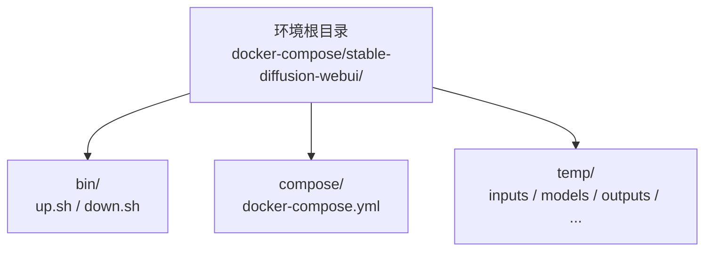
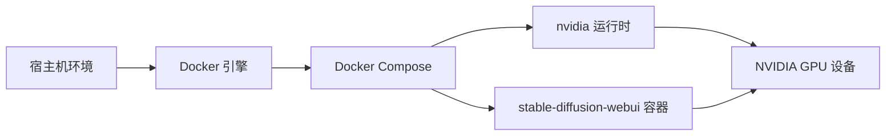

# AI/机器学习

<cite>
**本文引用的文件**
- [docker-compose.yml](file://docker-compose/stable-diffusion-webui/compose/docker-compose.yml)
- [up.sh](file://docker-compose/stable-diffusion-webui/bin/up.sh)
- [down.sh](file://docker-compose/stable-diffusion-webui/bin/down.sh)
- [README.md](file://docker-compose/stable-diffusion-webui/README.md)
- [docs/README.md](file://docs/README.md)
- [containers.md](file://docs/overview/containers.md)
- [containers.zh-CN.md](file://docs/overview/containers.zh-CN.md)
</cite>

## 目录
1. [简介](#简介)
2. [项目结构](#项目结构)
3. [核心组件](#核心组件)
4. [架构总览](#架构总览)
5. [详细组件分析](#详细组件分析)
6. [依赖关系分析](#依赖关系分析)
7. [性能考虑](#性能考虑)
8. [故障排查指南](#故障排查指南)
9. [结论](#结论)
10. [附录](#附录)

## 简介
本文件面向希望快速搭建并使用 Stable Diffusion WebUI 的开发者与运维人员，聚焦于该容器化环境的部署、配置与使用。内容涵盖：
- Web 界面访问与基本配置
- 模型与资源目录管理
- GPU 加速与资源分配策略
- 图像生成流程、提示词使用与输出管理
- 硬件要求、内存优化与并发处理最佳实践

Stable Diffusion WebUI 在本仓库中以单节点容器形式提供，使用 NVIDIA GPU 运行时，并通过 Docker Compose 编排，便于快速启动与停止。

## 项目结构
Stable Diffusion WebUI 的容器化环境遵循统一的目录布局，每个环境目录包含：
- bin/：启动与停止脚本
- compose/：Docker Compose 配置文件
- temp/：持久化数据目录（运行时创建）



图表来源
- [docker-compose.yml:1-34](file://docker-compose/stable-diffusion-webui/compose/docker-compose.yml#L1-L34)
- [up.sh:1-50](file://docker-compose/stable-diffusion-webui/bin/up.sh#L1-L50)
- [down.sh:1-26](file://docker-compose/stable-diffusion-webui/bin/down.sh#L1-L26)

章节来源
- [docs/README.md:71-83](file://docs/README.md#L71-L83)
- [containers.md:80-91](file://docs/overview/containers.md#L80-L91)
- [containers.zh-CN.md:80-91](file://docs/overview/containers.zh-CN.md#L80-L91)

## 核心组件
- 容器服务定义：稳定扩散 WebUI 单节点服务，绑定 8080 端口，使用 NVIDIA 运行时进行 GPU 加速。
- 数据卷挂载：将输入、模型、嵌入、扩展、本地化与输出等目录映射到容器内对应路径，确保持久化与易管理。
- 安全与权限：丢弃全部 Linux 能力，仅添加必要的网络绑定能力，降低攻击面。
- 资源约束：通过设备预留声明 GPU 能力，结合重启策略保证服务可用性。

章节来源
- [docker-compose.yml:1-34](file://docker-compose/stable-diffusion-webui/compose/docker-compose.yml#L1-L34)

## 架构总览
下图展示了 Stable Diffusion WebUI 的容器化部署架构与数据流：

```mermaid
graph TB
subgraph "宿主机"
U["用户浏览器<br/>http://localhost:8080"]
T["本地数据卷<br/>temp/inputs, temp/models, temp/outputs 等"]
end
subgraph "容器"
S["stable-diffusion-webui 容器<br/>端口 8080 映射"]
V["挂载卷<br/>inputs / models / embeddings / extensions / localizations / outputs"]
end
subgraph "GPU"
G["NVIDIA GPU 设备<br/>nvidia 运行时"]
end
U --> |HTTP/WebUI| S
T <- --> |读写| V
S --> |使用| G
```

图表来源
- [docker-compose.yml:8-17](file://docker-compose/stable-diffusion-webui/compose/docker-compose.yml#L8-L17)
- [docker-compose.yml:3-6](file://docker-compose/stable-diffusion-webui/compose/docker-compose.yml#L3-L6)
- [docker-compose.yml:29-33](file://docker-compose/stable-diffusion-webui/compose/docker-compose.yml#L29-L33)

## 详细组件分析

### Web 界面与访问
- 访问地址：http://localhost:8080
- 通过 Docker 端口映射将容器内部 8080 端口暴露至宿主机。
- 使用浏览器打开即可进入 WebUI 主界面进行图像生成与参数调整。

章节来源
- [up.sh:34-36](file://docker-compose/stable-diffusion-webui/bin/up.sh#L34-L36)
- [docker-compose.yml:8-9](file://docker-compose/stable-diffusion-webui/compose/docker-compose.yml#L8-L9)

### 模型与资源管理
- 模型目录：挂载至容器内的 models，用于存放各类模型文件（如 SD 模型、VAE、LoRA 等）。
- 输入与输出：inputs 用于上传或放置提示词/种子等输入；outputs 保存生成结果。
- 扩展与嵌入：extensions 与 embeddings 支持插件与文本嵌入的动态扩展。
- 本地化：localizations 用于多语言资源的本地化支持。
- 生命周期：容器停止后数据卷保留，便于后续继续使用或迁移。

章节来源
- [docker-compose.yml:10-17](file://docker-compose/stable-diffusion-webui/compose/docker-compose.yml#L10-L17)
- [down.sh:18-25](file://docker-compose/stable-diffusion-webui/bin/down.sh#L18-L25)
- [containers.md:76-91](file://docs/overview/containers.md#L76-L91)
- [containers.zh-CN.md:76-91](file://docs/overview/containers.zh-CN.md#L76-L91)

### GPU 加速与运行时
- 运行时：使用 nvidia 运行时以启用容器对 NVIDIA GPU 的访问。
- 设备能力：通过设备预留声明 GPU 能力，确保调度到具备 GPU 的节点。
- 命令行参数：以非半精度与非半精度 VAE 的方式运行，提升精度与稳定性。
- 提示：若未安装或未正确配置 NVIDIA Docker 运行时，GPU 加速可能无法正常工作。

章节来源
- [docker-compose.yml:3-6](file://docker-compose/stable-diffusion-webui/compose/docker-compose.yml#L3-L6)
- [docker-compose.yml:29-33](file://docker-compose/stable-diffusion-webui/compose/docker-compose.yml#L29-L33)
- [up.sh:23-27](file://docker-compose/stable-diffusion-webui/bin/up.sh#L23-L27)

### 启停脚本与状态检查
- 启动：创建必要的本地目录，检查 NVIDIA 运行时，然后以分离模式启动 Compose 项目。
- 停止：停止服务并提示数据卷保留情况，建议在删除前备份大体积模型文件。
- 状态与日志：提供检查容器状态与实时查看日志的命令示例。

章节来源
- [up.sh:1-50](file://docker-compose/stable-diffusion-webui/bin/up.sh#L1-L50)
- [down.sh:1-26](file://docker-compose/stable-diffusion-webui/bin/down.sh#L1-L26)

### 参数与命令行选项
- 关键参数：禁用半精度与半精度 VAE，使用 full 精度以获得更稳定的生成质量。
- 平台：指定 linux/amd64 平台，确保兼容性。

章节来源
- [docker-compose.yml:3-5](file://docker-compose/stable-diffusion-webui/compose/docker-compose.yml#L3-L5)

### 权限与安全
- 能力控制：丢弃全部 Linux 能力，仅添加必要的网络绑定能力，降低容器权限风险。
- 重启策略：unless-stopped，避免意外退出导致服务中断。

章节来源
- [docker-compose.yml:18-22](file://docker-compose/stable-diffusion-webui/compose/docker-compose.yml#L18-L22)
- [docker-compose.yml](file://docker-compose/stable-diffusion-webui/compose/docker-compose.yml#L7)

### 调度与部署策略
- 模式：global，确保服务在满足条件的节点上全局运行。
- 约束：通过节点标签过滤，避免调度到特定外部接口节点。
- 重启策略：与 deploy.restart_policy 一致，保证稳定性。

章节来源
- [docker-compose.yml:22-28](file://docker-compose/stable-diffusion-webui/compose/docker-compose.yml#L22-L28)
- [docker-compose.yml:24-26](file://docker-compose/stable-diffusion-webui/compose/docker-compose.yml#L24-L26)

## 依赖关系分析
Stable Diffusion WebUI 的依赖主要体现在运行时与宿主机环境：
- Docker 引擎与 Compose 插件
- NVIDIA Docker 运行时与驱动
- NVIDIA GPU 设备（CUDA 支持）



图表来源
- [up.sh:23-27](file://docker-compose/stable-diffusion-webui/bin/up.sh#L23-L27)
- [docker-compose.yml:3-6](file://docker-compose/stable-diffusion-webui/compose/docker-compose.yml#L3-L6)
- [docker-compose.yml:29-33](file://docker-compose/stable-diffusion-webui/compose/docker-compose.yml#L29-L33)

章节来源
- [up.sh:44-47](file://docker-compose/stable-diffusion-webui/bin/up.sh#L44-L47)
- [docs/README.md:176-180](file://docs/README.md#L176-L180)

## 性能考虑
- 精度与速度权衡：使用 full 精度可提升稳定性，但可能增加显存占用与生成时间；半精度可加速但需注意数值稳定性。
- 显存与批大小：根据显存容量调整批大小与分辨率，避免 OOM。
- 模型选择：优先使用与任务匹配的模型与 VAE，减少不必要的转换开销。
- 并发与队列：在高并发场景下，合理排队与限流，避免 GPU 抖动。
- I/O 优化：将模型与输出置于高性能磁盘，减少读写瓶颈。
- 日志与监控：通过 Compose 日志与系统监控工具观察资源使用趋势，及时调整参数。

## 故障排查指南
- 无法访问 Web 界面
  - 检查端口是否被占用，确认 8080 已映射且防火墙放行。
  - 使用状态命令检查容器是否运行。
- GPU 加速无效
  - 确认已安装并启用 NVIDIA Docker 运行时与驱动。
  - 检查容器是否具备 GPU 能力与调度到有 GPU 的节点。
- 模型加载失败
  - 确认模型文件位于挂载的 models 目录，路径与权限正确。
  - 检查模型格式与版本兼容性。
- 显存不足
  - 降低分辨率、批大小或关闭不必要的扩展。
  - 清理临时输出，释放磁盘空间。
- 数据丢失或清理
  - 停止服务不会删除数据卷，如需清理请手动删除 temp 目录（注意模型文件较大，建议先备份）。

章节来源
- [up.sh:44-50](file://docker-compose/stable-diffusion-webui/bin/up.sh#L44-L50)
- [down.sh:18-26](file://docker-compose/stable-diffusion-webui/bin/down.sh#L18-L26)
- [docker-compose.yml:29-33](file://docker-compose/stable-diffusion-webui/compose/docker-compose.yml#L29-L33)

## 结论
本仓库为 Stable Diffusion WebUI 提供了即开即用的容器化解决方案，通过标准化的目录结构、明确的数据卷约定与 GPU 资源声明，能够帮助用户快速完成部署与日常使用。配合合理的参数调优与资源规划，可在保证质量的前提下提升生成效率与稳定性。

## 附录

### 快速开始步骤
- 进入环境目录并执行启动脚本，等待服务就绪。
- 在浏览器中访问 Web 界面，准备输入提示词与参数。
- 将模型与扩展放入对应挂载目录，即可开始生成。

章节来源
- [docs/README.md:5-14](file://docs/README.md#L5-L14)
- [containers.md:158-174](file://docs/overview/containers.md#L158-L174)

### 环境目录与约定
- 目录结构：每个环境均采用相同的 bin/compose/temp 布局。
- 数据卷：除配置文件外，持久化数据均存放于 temp/ 下。
- 凭证：通用默认凭证为 hz_9/123456（部分服务另有说明）。

章节来源
- [docs/README.md:71-91](file://docs/README.md#L71-L91)
- [containers.md:80-104](file://docs/overview/containers.md#L80-L104)
- [containers.zh-CN.md:80-104](file://docs/overview/containers.zh-CN.md#L80-L104)