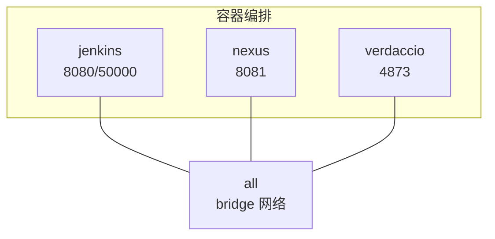
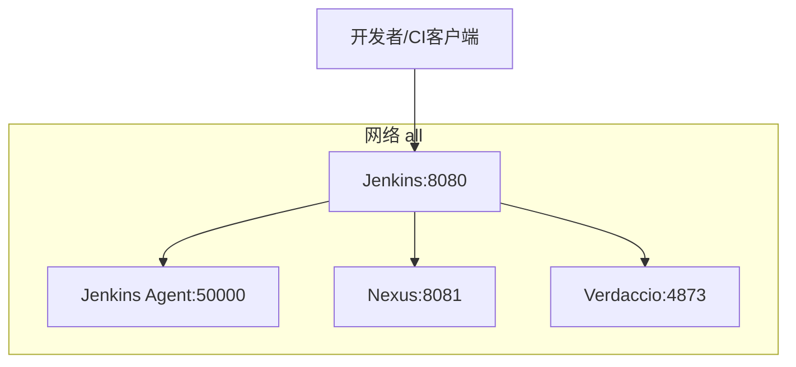
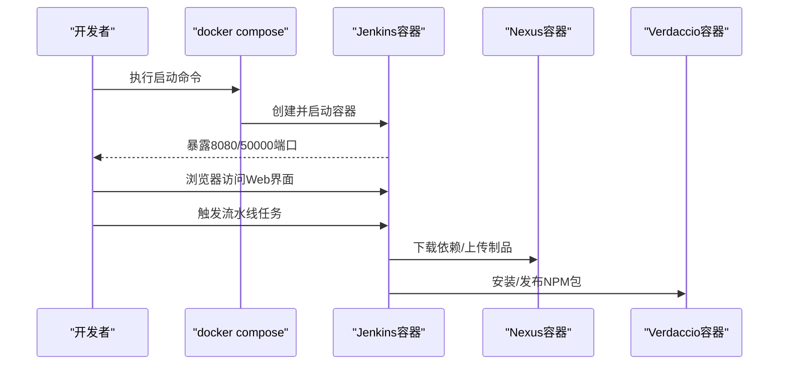
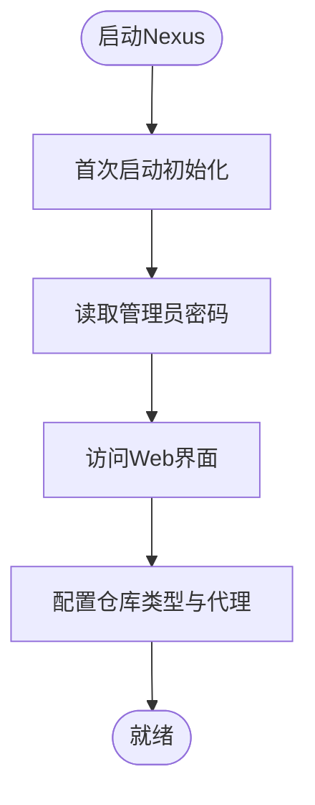
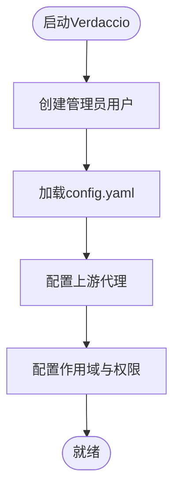
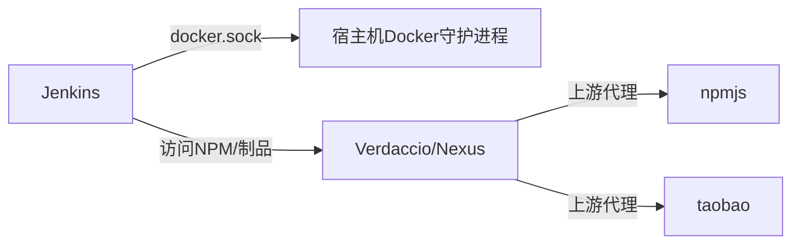

# CI/CD与仓库管理

<cite>
**本文引用的文件**
- [docker-compose.yml（Jenkins）](file://docker-compose/jenkins-single/compose/docker-compose.yml)
- [up.sh（Jenkins）](file://docker-compose/jenkins-single/bin/up.sh)
- [down.sh（Jenkins）](file://docker-compose/jenkins-single/bin/down.sh)
- [README（Jenkins）](file://docker-compose/jenkins-single/README.md)
- [docker-compose.yml（Nexus）](file://docker-compose/nexus-single/compose/docker-compose.yml)
- [up.sh（Nexus）](file://docker-compose/nexus-single/bin/up.sh)
- [down.sh（Nexus）](file://docker-compose/nexus-single/bin/down.sh)
- [README（Nexus）](file://docker-compose/nexus-single/README.md)
- [docker-compose.yml（Verdaccio）](file://docker-compose/verdaccio-single/compose/docker-compose.yml)
- [config.yaml（Verdaccio）](file://docker-compose/verdaccio-single/config/config.yaml)
- [up.sh（Verdaccio）](file://docker-compose/verdaccio-single/bin/up.sh)
- [down.sh（Verdaccio）](file://docker-compose/verdaccio-single/bin/down.sh)
- [README（Verdaccio）](file://docker-compose/verdaccio-single/README.md)
- [README（根目录）](file://README.md)
- [package.json](file://package.json)
</cite>

## 目录
1. [简介](#简介)
2. [项目结构](#项目结构)
3. [核心组件](#核心组件)
4. [架构总览](#架构总览)
5. [详细组件分析](#详细组件分析)
6. [依赖关系分析](#依赖关系分析)
7. [性能考虑](#性能考虑)
8. [故障排查指南](#故障排查指南)
9. [结论](#结论)
10. [附录](#附录)

## 简介
本文件面向CI/CD与仓库管理的容器化环境，系统性梳理三类核心服务：Jenkins（持续集成）、Nexus（多格式制品仓库）与Verdaccio（NPM私有注册表）。内容覆盖容器编排、网络与数据持久化、初始配置、访问方式、推荐插件与使用场景，并给出部署与运维建议。为便于读者快速上手，所有操作均以docker compose与配套脚本为主。

## 项目结构
该仓库采用按功能模块分层的目录组织方式，每个服务独立子目录包含：
- compose/docker-compose.yml：容器编排定义
- bin/up.sh、bin/down.sh：启动/停止脚本
- README.md：服务说明、端口映射、初始设置与使用指引
- 部分服务包含配置目录（如Verdaccio的config）

下图展示三个服务在统一网络中的位置与交互关系：

图表来源
- [docker-compose.yml（Jenkins）:1-22](file://docker-compose/jenkins-single/compose/docker-compose.yml#L1-L22)
- [docker-compose.yml（Nexus）:1-19](file://docker-compose/nexus-single/compose/docker-compose.yml#L1-L19)
- [docker-compose.yml（Verdaccio）:1-21](file://docker-compose/verdaccio-single/compose/docker-compose.yml#L1-L21)

章节来源
- [README（根目录）:1-6](file://README.md#L1-L6)
- [package.json:1-3](file://package.json#L1-L3)

## 核心组件
- Jenkins（CI/CD）
  - 容器镜像：jenkinsci/blueocean
  - 端口映射：8080（Web）、50000（节点通信）
  - 数据卷：Jenkins主目录、Docker Socket、SSH密钥
  - 网络：加入名为“all”的桥接网络，支持内部别名访问
  - 初始密码获取与推荐插件（见Jenkins README）
- Nexus（多格式制品仓库）
  - 容器镜像：sonatype/nexus3
  - 端口映射：8081（Web）
  - 数据卷：/nexus-data
  - 支持仓库类型：Maven、NPM、Docker、PyPI、NuGet等
  - 初次启动需等待初始化，管理员密码位于容器内文件
- Verdaccio（NPM私有注册表）
  - 容器镜像：verdaccio/verdaccio
  - 端口映射：4873（HTTP）
  - 数据卷：storage（包存储）、plugins（插件）、config（配置）
  - 默认启用Web界面与审计中间件；支持npmjs与淘宝镜像代理
  - 包权限：作用域包与通配符规则组合，认证用户可发布

章节来源
- [docker-compose.yml（Jenkins）:1-22](file://docker-compose/jenkins-single/compose/docker-compose.yml#L1-L22)
- [README（Jenkins）:1-119](file://docker-compose/jenkins-single/README.md#L1-L119)
- [docker-compose.yml（Nexus）:1-19](file://docker-compose/nexus-single/compose/docker-compose.yml#L1-L19)
- [README（Nexus）:1-132](file://docker-compose/nexus-single/README.md#L1-L132)
- [docker-compose.yml（Verdaccio）:1-21](file://docker-compose/verdaccio-single/compose/docker-compose.yml#L1-L21)
- [config.yaml（Verdaccio）:1-85](file://docker-compose/verdaccio-single/config/config.yaml#L1-L85)
- [README（Verdaccio）:1-167](file://docker-compose/verdaccio-single/README.md#L1-L167)

## 架构总览
下图展示容器间网络与典型交互路径（以容器名称与端口呈现）：

图表来源
- [docker-compose.yml（Jenkins）:8-18](file://docker-compose/jenkins-single/compose/docker-compose.yml#L8-L18)
- [docker-compose.yml（Nexus）:8-15](file://docker-compose/nexus-single/compose/docker-compose.yml#L8-L15)
- [docker-compose.yml（Verdaccio）:7-16](file://docker-compose/verdaccio-single/compose/docker-compose.yml#L7-L16)

## 详细组件分析

### Jenkins 组件分析
- 启停流程
  - 启动：通过bin/up.sh或docker compose直接启动，暴露Web与Agent端口
  - 停止：通过bin/down.sh或docker compose停止，保留数据卷
- 初始设置
  - 获取初始管理员密码后完成Web向导
  - 推荐安装Git、Docker Pipeline、Blue Ocean、Build Timeout、Timestamper等插件
- 数据持久化
  - Jenkins Home、Docker Socket、SSH Key挂载至宿主机temp目录
- 网络与内部访问
  - 通过all.jenkins别名在容器内访问Jenkins服务

图表来源
- [up.sh（Jenkins）:14-27](file://docker-compose/jenkins-single/bin/up.sh#L14-L27)
- [docker-compose.yml（Jenkins）:1-22](file://docker-compose/jenkins-single/compose/docker-compose.yml#L1-L22)
- [README（Jenkins）:84-119](file://docker-compose/jenkins-single/README.md#L84-L119)

章节来源
- [up.sh（Jenkins）:1-28](file://docker-compose/jenkins-single/bin/up.sh#L1-L28)
- [down.sh（Jenkins）:1-20](file://docker-compose/jenkins-single/bin/down.sh#L1-L20)
- [README（Jenkins）:1-119](file://docker-compose/jenkins-single/README.md#L1-L119)
- [docker-compose.yml（Jenkins）:1-22](file://docker-compose/jenkins-single/compose/docker-compose.yml#L1-L22)

### Nexus 组件分析
- 启停流程
  - 启动：通过bin/up.sh或docker compose启动，映射8081端口
  - 停止：通过bin/down.sh或docker compose停止，保留数据卷
- 初始设置
  - 首次登录凭据来自容器内admin.password文件
  - 建议后续修改默认密码并开启HTTPS
- 仓库类型
  - 支持Maven、NPM、Docker、PyPI、NuGet等
  - 可配置远程代理（如maven-central、npm-proxy）
- 数据持久化
  - /nexus-data目录映射到宿主机temp/data

图表来源
- [up.sh（Nexus）:22-28](file://docker-compose/nexus-single/bin/up.sh#L22-L28)
- [README（Nexus）:81-94](file://docker-compose/nexus-single/README.md#L81-L94)

章节来源
- [up.sh（Nexus）:1-29](file://docker-compose/nexus-single/bin/up.sh#L1-L29)
- [down.sh（Nexus）:1-20](file://docker-compose/nexus-single/bin/down.sh#L1-L20)
- [README（Nexus）:1-132](file://docker-compose/nexus-single/README.md#L1-L132)
- [docker-compose.yml（Nexus）:1-19](file://docker-compose/nexus-single/compose/docker-compose.yml#L1-L19)

### Verdaccio 组件分析
- 启停流程
  - 启动：通过bin/up.sh或docker compose启动，映射4873端口
  - 停止：通过bin/down.sh或docker compose停止，保留storage与plugins
- 初始设置
  - 首次启动需要创建管理员用户
  - 配置文件变更后需重启服务生效
- 权限与代理
  - 支持基于作用域的包（如@hz-9/*）与通配符规则
  - 默认代理npmjs与淘宝镜像，提升下载速度
- 数据持久化
  - storage、plugins、config分别映射到宿主机temp目录

图表来源
- [up.sh（Verdaccio）:29-33](file://docker-compose/verdaccio-single/bin/up.sh#L29-L33)
- [config.yaml（Verdaccio）:38-68](file://docker-compose/verdaccio-single/config/config.yaml#L38-L68)

章节来源
- [up.sh（Verdaccio）:1-34](file://docker-compose/verdaccio-single/bin/up.sh#L1-L34)
- [down.sh（Verdaccio）:1-23](file://docker-compose/verdaccio-single/bin/down.sh#L1-L23)
- [README（Verdaccio）:1-167](file://docker-compose/verdaccio-single/README.md#L1-L167)
- [docker-compose.yml（Verdaccio）:1-21](file://docker-compose/verdaccio-single/compose/docker-compose.yml#L1-L21)
- [config.yaml（Verdaccio）:1-85](file://docker-compose/verdaccio-single/config/config.yaml#L1-L85)

## 依赖关系分析
- 网络依赖
  - 三个服务均加入名为“all”的桥接网络，支持容器间通过别名访问
- 外部依赖
  - Jenkins在执行Docker相关任务时会使用宿主机docker.sock
  - Verdaccio默认代理npmjs与淘宝镜像
- 数据依赖
  - Jenkins：Jenkins Home、Docker Socket、SSH Key
  - Nexus：/nexus-data
  - Verdaccio：storage、plugins、config

图表来源
- [docker-compose.yml（Jenkins）:12-15](file://docker-compose/jenkins-single/compose/docker-compose.yml#L12-L15)
- [docker-compose.yml（Verdaccio）:11-14](file://docker-compose/verdaccio-single/compose/docker-compose.yml#L11-L14)
- [config.yaml（Verdaccio）:32-36](file://docker-compose/verdaccio-single/config/config.yaml#L32-L36)

章节来源
- [docker-compose.yml（Jenkins）:1-22](file://docker-compose/jenkins-single/compose/docker-compose.yml#L1-L22)
- [docker-compose.yml（Verdaccio）:1-21](file://docker-compose/verdaccio-single/compose/docker-compose.yml#L1-L21)
- [config.yaml（Verdaccio）:32-36](file://docker-compose/verdaccio-single/config/config.yaml#L32-L36)

## 性能考虑
- 端口占用与资源预留
  - 确保8080（Jenkins Web）、50000（Agent）、8081（Nexus）、4873（Verdaccio）未被占用
  - Nexus与Jenkins运行于root用户以支持Docker操作，注意安全边界
- 存储与缓存
  - Jenkins构建缓存、Nexus制品与Verdaccio包缓存均需充足磁盘空间
  - 建议定期备份Jenkins Home与Nexus数据目录
- 网络与代理
  - Verdaccio默认代理npmjs与淘宝镜像，可显著降低外网依赖带来的延迟
- HTTPS与权限
  - 生产环境建议为Nexus与Verdaccio配置HTTPS
  - Jenkins建议在Web界面中启用安全策略与用户权限控制

## 故障排查指南
- Jenkins
  - 初始密码：查看容器日志或执行容器内文件读取命令
  - 插件缺失：在Web界面安装Git、Docker Pipeline、Blue Ocean等
  - 端口冲突：确认8080与50000未被占用
- Nexus
  - 首次启动慢：等待初始化完成
  - 登录失败：使用容器内生成的admin密码
  - HTTPS：在Web界面中启用并配置证书
- Verdaccio
  - 首次启动需创建管理员用户
  - 配置变更后需重启容器生效
  - 存储空间不足：清理旧包或扩容磁盘

章节来源
- [README（Jenkins）:84-119](file://docker-compose/jenkins-single/README.md#L84-L119)
- [up.sh（Jenkins）:22-27](file://docker-compose/jenkins-single/bin/up.sh#L22-L27)
- [README（Nexus）:81-94](file://docker-compose/nexus-single/README.md#L81-L94)
- [up.sh（Nexus）:22-28](file://docker-compose/nexus-single/bin/up.sh#L22-L28)
- [README（Verdaccio）:159-167](file://docker-compose/verdaccio-single/README.md#L159-L167)
- [up.sh（Verdaccio）:29-33](file://docker-compose/verdaccio-single/bin/up.sh#L29-L33)

## 结论
本仓库提供了Jenkins、Nexus与Verdaccio的开箱即用容器化部署方案，具备清晰的网络拓扑、明确的数据持久化策略与完善的启停脚本。结合各组件的初始设置与生产建议，可在本地或开发环境中快速搭建一体化的CI/CD与包管理基础设施。建议在生产环境中进一步强化安全（HTTPS、权限控制）与可观测性（日志、监控），并制定定期备份与容量规划策略。

## 附录
- 快速操作清单
  - 启动：进入对应服务目录执行bin/up.sh或docker compose命令
  - 停止：进入对应服务目录执行bin/down.sh或docker compose命令
  - 查看状态：docker compose ps
- 访问入口
  - Jenkins：http://127.0.0.1:8080
  - Nexus：http://127.0.0.1:8081
  - Verdaccio：http://localhost:4873