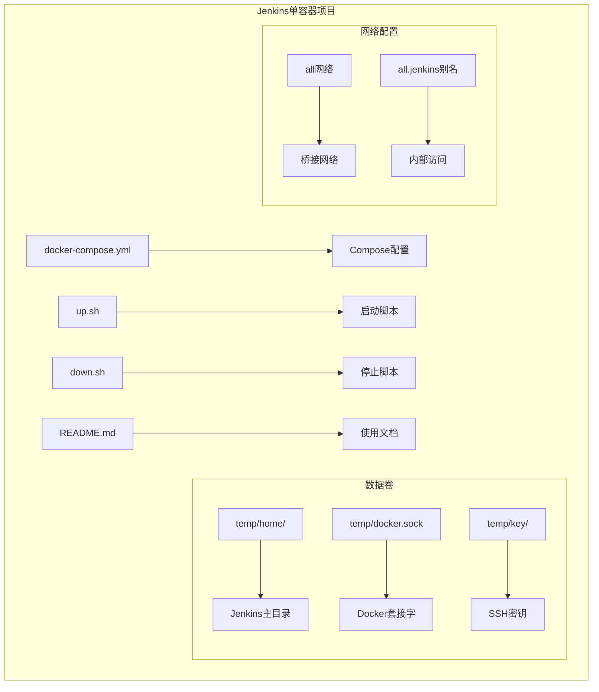
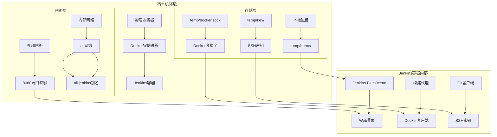
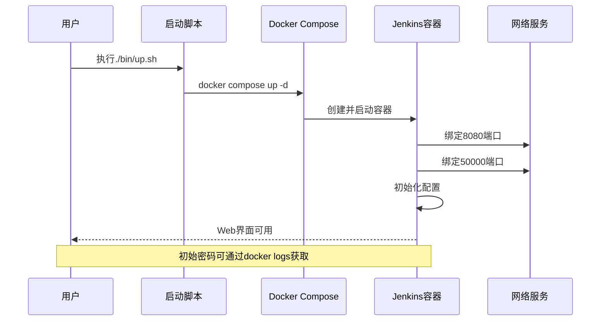
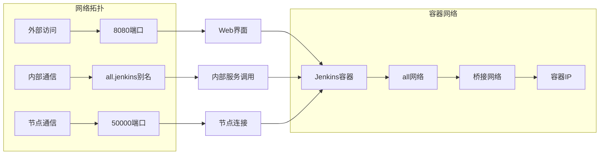
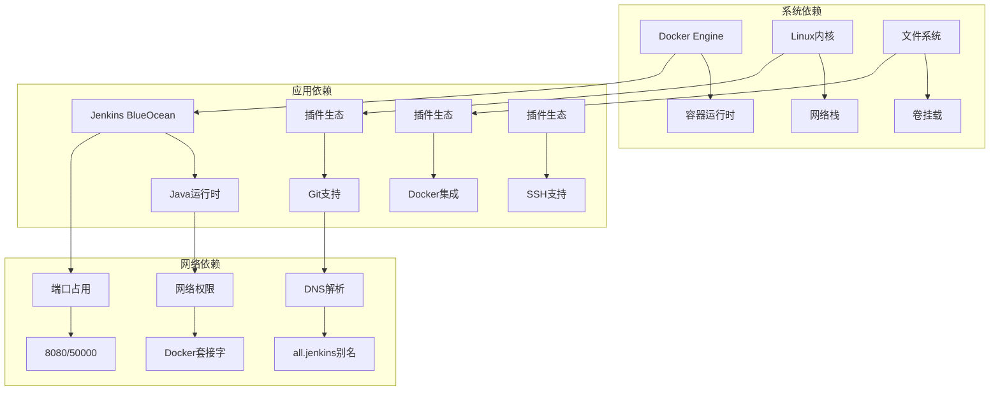
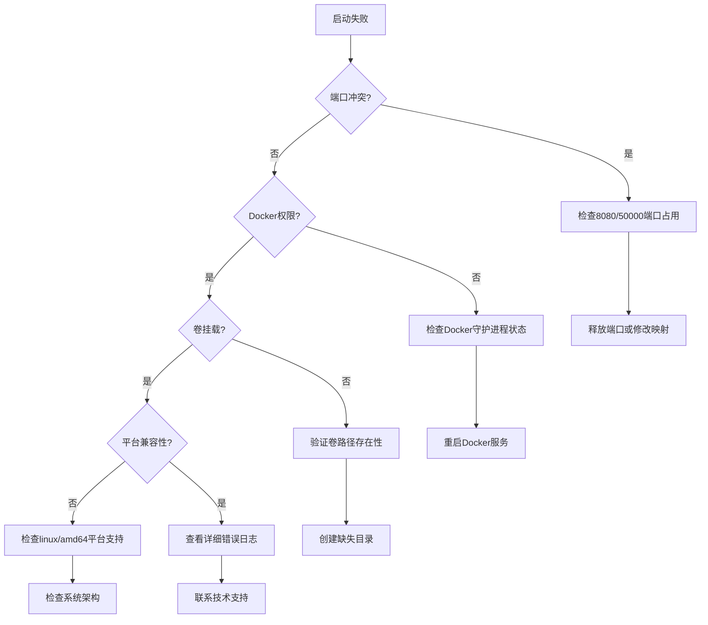

# Jenkins持续集成

<cite>
**本文档引用的文件**
- [docker-compose.yml](file://docker-compose/jenkins-single/compose/docker-compose.yml)
- [up.sh](file://docker-compose/jenkins-single/bin/up.sh)
- [down.sh](file://docker-compose/jenkins-single/bin/down.sh)
- [README.md](file://docker-compose/jenkins-single/README.md)
</cite>

## 目录
1. [简介](#简介)
2. [项目结构](#项目结构)
3. [核心组件](#核心组件)
4. [架构概览](#架构概览)
5. [详细组件分析](#详细组件分析)
6. [依赖关系分析](#依赖关系分析)
7. [性能考虑](#性能考虑)
8. [故障排除指南](#故障排除指南)
9. [结论](#结论)

## 简介

本项目提供了一个完整的Jenkins BlueOcean容器化部署解决方案，专为持续集成和持续部署(CI/CD)场景设计。该配置使用Docker Compose将Jenkins BlueOcean作为单容器服务运行，支持容器内构建、SSH密钥管理和网络通信功能。

Jenkins BlueOcean是Jenkins的现代化用户界面，提供了更直观的流水线可视化和构建体验。通过Docker容器化部署，可以快速启动和管理Jenkins实例，同时保持配置的可移植性和一致性。

## 项目结构

Jenkins单容器部署采用标准的Docker Compose项目结构，主要包含以下组件：



**图表来源**
- [docker-compose.yml:1-22](file://docker-compose/jenkins-single/compose/docker-compose.yml#L1-L22)
- [up.sh:1-28](file://docker-compose/jenkins-single/bin/up.sh#L1-L28)
- [down.sh:1-20](file://docker-compose/jenkins-single/bin/down.sh#L1-L20)

**章节来源**
- [docker-compose.yml:1-22](file://docker-compose/jenkins-single/compose/docker-compose.yml#L1-L22)
- [README.md:1-119](file://docker-compose/jenkins-single/README.md#L1-L119)

## 核心组件

### Docker Compose配置

Jenkins服务的核心配置定义在Compose文件中，包含了完整的容器化部署参数：

- **镜像配置**: 使用jenkinsci/blueocean:1.25.7官方镜像
- **平台兼容性**: 指定linux/amd64平台以确保跨平台兼容性
- **用户权限**: 以root用户运行以支持Docker操作
- **重启策略**: 始终自动重启，确保服务可用性

### 卷挂载策略

系统采用了三层数据持久化策略：

1. **Jenkins主目录**: `/var/jenkins_home` → `../temp/home`
   - 存储Jenkins配置、插件、构建历史等核心数据
   - 支持配置迁移和备份

2. **Docker套接字**: `/var/run/docker.sock` → `../temp/docker.sock`
   - 允许Jenkins容器内执行Docker命令
   - 实现容器化的构建和部署流程

3. **SSH密钥**: `/root/.ssh` → `../temp/key`
   - 提供Git仓库访问所需的认证凭据
   - 支持私有仓库的自动化访问

### 端口映射配置

系统配置了两个关键端口：
- **8080端口**: Web管理界面，用于访问Jenkins BlueOcean界面
- **50000端口**: 节点通信端口，用于Jenkins主从节点通信

**章节来源**
- [docker-compose.yml:1-22](file://docker-compose/jenkins-single/compose/docker-compose.yml#L1-L22)
- [README.md:68-83](file://docker-compose/jenkins-single/README.md#L68-L83)

## 架构概览

Jenkins BlueOcean容器化架构采用单容器部署模式，简化了基础设施复杂度：



**图表来源**
- [docker-compose.yml:1-22](file://docker-compose/jenkins-single/compose/docker-compose.yml#L1-L22)
- [up.sh:19-25](file://docker-compose/jenkins-single/bin/up.sh#L19-L25)

### 容器生命周期管理

系统提供了完整的容器生命周期管理脚本：



**图表来源**
- [up.sh:14-25](file://docker-compose/jenkins-single/bin/up.sh#L14-L25)
- [docker-compose.yml:16-18](file://docker-compose/jenkins-single/compose/docker-compose.yml#L16-L18)

**章节来源**
- [up.sh:1-28](file://docker-compose/jenkins-single/bin/up.sh#L1-L28)
- [down.sh:1-20](file://docker-compose/jenkins-single/bin/down.sh#L1-L20)

## 详细组件分析

### Jenkins BlueOcean配置

Jenkins BlueOcean是现代Jenkins的增强版本，提供了改进的用户体验和功能：

#### 配置特性
- **现代化界面**: 基于Blue Ocean的设计理念
- **流水线可视化**: 直观的管道状态显示
- **构建历史**: 清晰的构建结果展示
- **并行执行**: 支持多阶段并行构建

#### 版本信息
- **镜像版本**: jenkinsci/blueocean:1.25.7
- **平台支持**: linux/amd64
- **用户权限**: root用户运行

### 网络配置分析

系统采用自定义网络配置以支持容器间通信：



**图表来源**
- [docker-compose.yml:8-11](file://docker-compose/jenkins-single/compose/docker-compose.yml#L8-L11)
- [README.md:22-27](file://docker-compose/jenkins-single/README.md#L22-L27)

#### 网络优势
- **隔离性**: 容器间网络隔离，提高安全性
- **可扩展性**: 支持添加更多服务到同一网络
- **内部解析**: 通过别名进行服务发现

### 数据持久化策略

系统实现了三层数据持久化机制：

#### 主目录持久化
- **路径映射**: `../temp/home` → `/var/jenkins_home`
- **数据内容**: 配置文件、插件、构建历史、用户数据
- **备份策略**: 支持完整目录备份

#### Docker套接字挂载
- **路径映射**: `../temp/docker.sock` → `/var/run/docker.sock`
- **功能作用**: 允许容器内执行Docker命令
- **安全考虑**: 需要root权限运行

#### SSH密钥管理
- **路径映射**: `../temp/key` → `/root/.ssh`
- **用途**: Git仓库访问认证
- **最佳实践**: 密钥文件权限设置

**章节来源**
- [docker-compose.yml:12-15](file://docker-compose/jenkins-single/compose/docker-compose.yml#L12-L15)
- [README.md:57-66](file://docker-compose/jenkins-single/README.md#L57-L66)

## 依赖关系分析

Jenkins BlueOcean容器化部署涉及多个层面的依赖关系：



**图表来源**
- [docker-compose.yml:3-5](file://docker-compose/jenkins-single/compose/docker-compose.yml#L3-L5)
- [docker-compose.yml:16-18](file://docker-compose/jenkins-single/compose/docker-compose.yml#L16-L18)

### 外部依赖管理

系统对外部依赖的处理方式：

1. **Docker守护进程**: 通过套接字挂载实现
2. **网络服务**: 由Docker网络子系统提供
3. **存储服务**: 由宿主机文件系统提供

### 内部模块依赖

Jenkins各组件间的依赖关系：

- **Web界面** → **构建引擎**
- **构建引擎** → **Git客户端**
- **构建引擎** → **Docker客户端**
- **Docker客户端** → **Docker守护进程**

**章节来源**
- [docker-compose.yml:1-22](file://docker-compose/jenkins-single/compose/docker-compose.yml#L1-L22)
- [README.md:96-104](file://docker-compose/jenkins-single/README.md#L96-L104)

## 性能考虑

### 资源配置优化

针对Jenkins BlueOcean的性能优化建议：

#### 内存配置
- **最小内存**: 2GB RAM
- **推荐内存**: 4GB+ RAM
- **构建缓存**: 合理配置磁盘空间

#### 存储性能
- **SSD优先**: 使用固态硬盘存储Jenkins数据
- **磁盘空间**: 至少预留10GB可用空间
- **备份策略**: 定期备份重要数据

#### 网络优化
- **带宽保证**: 确保足够的网络带宽
- **DNS解析**: 优化DNS配置减少延迟
- **代理设置**: 如需代理，正确配置网络访问

### 安全配置

#### 权限管理
- **用户权限**: 运行在root用户下以支持Docker操作
- **文件权限**: 正确设置卷挂载的文件权限
- **网络安全**: 限制不必要的端口暴露

#### 最佳实践
- **定期更新**: 及时更新Jenkins和插件版本
- **访问控制**: 配置适当的用户权限和认证
- **日志监控**: 启用详细的日志记录和监控

## 故障排除指南

### 常见问题诊断

#### 启动失败问题



#### 端口问题排查

1. **端口占用检测**
   ```bash
   netstat -tulpn | grep -E '(8080|50000)'
   ```

2. **端口重新映射**
   - 修改docker-compose.yml中的端口映射
   - 确保新端口未被其他服务占用

#### Docker权限问题

1. **Docker套接字权限**
   ```bash
   ls -la /var/run/docker.sock
   sudo chmod 666 /var/run/docker.sock
   ```

2. **Docker守护进程状态**
   ```bash
   systemctl status docker
   sudo systemctl start docker
   ```

#### 卷挂载问题

1. **目录权限检查**
   ```bash
   ls -la temp/
   sudo chown -R 1000:1000 temp/
   ```

2. **磁盘空间检查**
   ```bash
   df -h temp/
   ```

### 插件安装问题

#### 推荐插件列表

根据项目文档，推荐安装以下插件：

1. **Git**: 版本控制集成
2. **Docker Pipeline**: 容器化流水线支持
3. **Blue Ocean**: 现代化界面
4. **Build Timeout**: 构建超时控制
5. **Timestamper**: 时间戳记录

#### 插件安装步骤

1. 访问Jenkins Web界面
2. 进入"Manage Jenkins" → "Manage Plugins"
3. 切换到"Available"标签页
4. 搜索并选择需要的插件
5. 点击"Install without restart"
6. 重启Jenkins服务

### 首次启动配置

#### 获取初始管理员密码

```bash
# 方法1: 查看容器日志
docker logs jenkins

# 方法2: 直接查看密码文件
docker exec jenkins cat /var/jenkins_home/secrets/initialAdminPassword
```

#### 初始设置流程

1. **等待Jenkins启动完成**
   - 首次启动可能需要几分钟时间
   - 等待插件下载和初始化

2. **输入初始密码**
   - 在Web界面输入获取的密码
   - 选择"Install suggested plugins"

3. **创建管理员账户**
   - 设置管理员用户名和密码
   - 配置管理员个人信息

4. **配置系统URL**
   - 设置Jenkins访问地址
   - 保存配置并继续

### 网络连接问题

#### 内部服务访问

```bash
# 通过网络别名访问
curl http://all.jenkins:8080

# 检查网络连接
docker exec jenkins ping all.jenkins
```

#### 端口连通性测试

```bash
# 测试8080端口
telnet localhost 8080

# 测试50000端口
telnet localhost 50000
```

**章节来源**
- [README.md:84-94](file://docker-compose/jenkins-single/README.md#L84-L94)
- [up.sh:22-25](file://docker-compose/jenkins-single/bin/up.sh#L22-L25)

## 结论

Jenkins BlueOcean容器化部署方案提供了一个完整、可靠的CI/CD基础设施解决方案。通过Docker Compose的标准化配置，实现了以下优势：

### 技术优势

1. **简化部署**: 单容器部署减少了基础设施复杂度
2. **可移植性强**: 标准化的配置文件便于环境迁移
3. **资源隔离**: 容器化提供良好的资源隔离和安全性
4. **易于维护**: 统一的管理接口简化了运维工作

### 功能特性

1. **现代化界面**: Blue Ocean提供直观的用户界面
2. **容器内构建**: 通过Docker套接字实现真正的容器化构建
3. **灵活配置**: 支持多种卷挂载和网络配置
4. **插件生态**: 丰富的插件支持满足不同需求

### 最佳实践建议

1. **生产环境部署**: 建议在专用服务器上部署生产环境
2. **定期备份**: 建立完善的数据备份和恢复机制
3. **监控告警**: 配置系统监控和异常告警
4. **安全加固**: 实施适当的安全措施和访问控制

该配置为团队提供了开箱即用的Jenkins CI/CD解决方案，适合从小型开发团队到中型企业规模的各类应用场景。