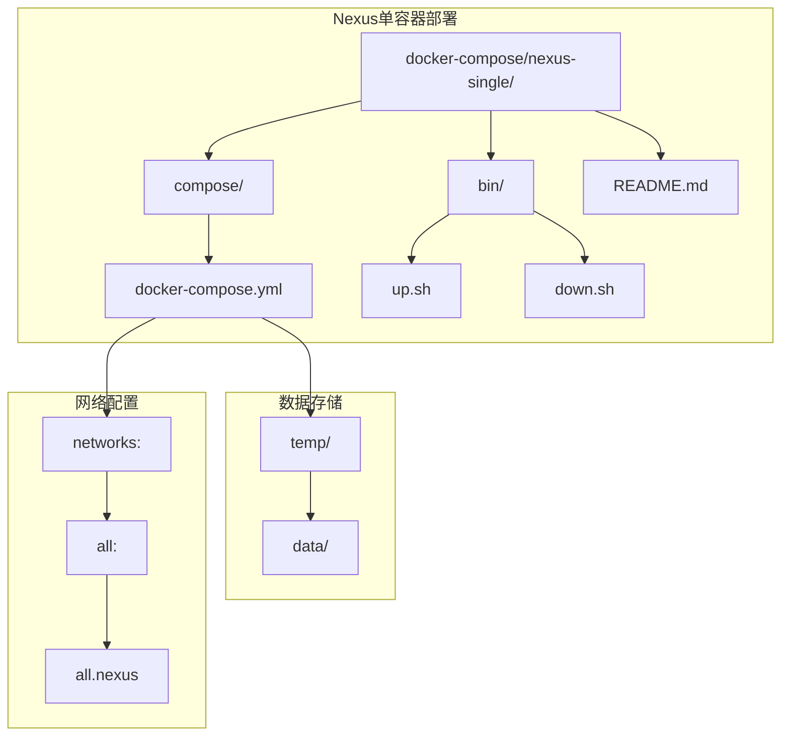
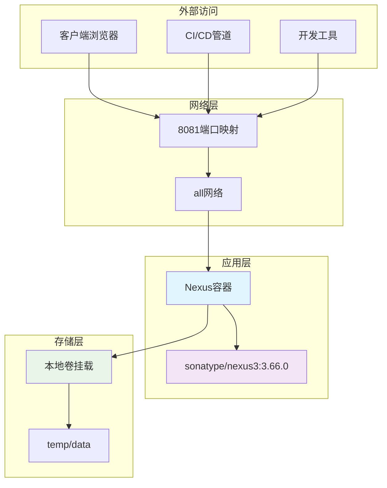
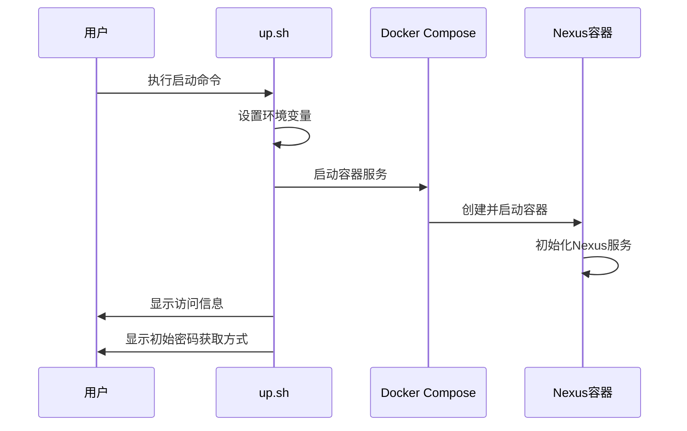
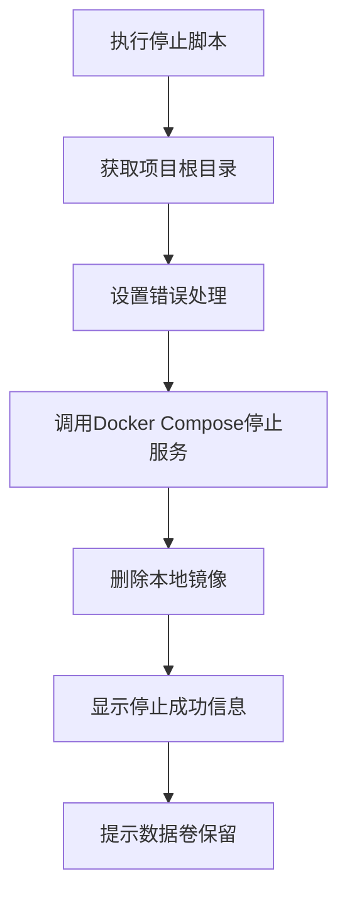
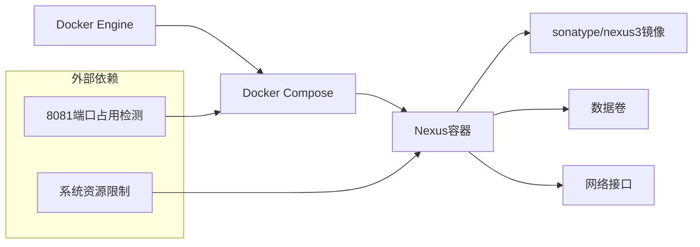

# Nexus私有仓库

<cite>
**本文档引用的文件**
- [docker-compose.yml](file://docker-compose/nexus-single/compose/docker-compose.yml)
- [up.sh](file://docker-compose/nexus-single/bin/up.sh)
- [down.sh](file://docker-compose/nexus-single/bin/down.sh)
- [README.md](file://docker-compose/nexus-single/README.md)
</cite>

## 目录
1. [简介](#简介)
2. [项目结构](#项目结构)
3. [核心组件](#核心组件)
4. [架构概览](#架构概览)
5. [详细组件分析](#详细组件分析)
6. [依赖关系分析](#依赖关系分析)
7. [性能考虑](#性能考虑)
8. [故障排除指南](#故障排除指南)
9. [结论](#结论)

## 简介

Nexus Repository Manager是一个企业级的软件包管理和制品仓库解决方案。本项目提供了Nexus Repository Manager的单容器部署方案，支持多种包格式（Maven、npm、Docker、PyPI、NuGet）的管理和代理功能。

该部署方案采用Docker Compose进行容器编排，实现了数据持久化、网络配置和端口映射的完整解决方案。通过简单的启动脚本，用户可以快速部署一个功能完整的私有仓库服务。

## 项目结构

Nexus单容器部署项目的文件组织结构清晰，采用模块化设计：

**图表来源**
- [docker-compose.yml:1-19](file://docker-compose/nexus-single/compose/docker-compose.yml#L1-L19)
- [README.md:1-132](file://docker-compose/nexus-single/README.md#L1-L132)

**章节来源**
- [docker-compose.yml:1-19](file://docker-compose/nexus-single/compose/docker-compose.yml#L1-L19)
- [README.md:1-132](file://docker-compose/nexus-single/README.md#L1-L132)

## 核心组件

### 容器配置

Nexus容器采用官方镜像进行部署，具有以下关键特性：

- **基础镜像**: sonatype/nexus3:3.66.0
- **运行用户**: root
- **平台兼容**: linux/amd64
- **重启策略**: 始终重启
- **容器名称**: nexus

### 数据持久化

系统通过卷挂载实现数据持久化，确保容器重启后数据不丢失：

- **主机路径**: `../temp/data`
- **容器路径**: `/nexus-data`
- **存储内容**: Nexus应用程序数据、配置文件、仓库数据

### 网络配置

采用自定义网络实现容器间通信和外部访问：

- **网络名称**: all
- **网络类型**: bridge
- **别名**: all.nexus
- **端口映射**: 8081:8081

**章节来源**
- [docker-compose.yml:5-15](file://docker-compose/nexus-single/compose/docker-compose.yml#L5-L15)
- [README.md:57-80](file://docker-compose/nexus-single/README.md#L57-L80)

## 架构概览

Nexus单容器部署采用简洁的一层架构设计：

**图表来源**
- [docker-compose.yml:8-15](file://docker-compose/nexus-single/compose/docker-compose.yml#L8-L15)
- [docker-compose.yml:12-13](file://docker-compose/nexus-single/compose/docker-compose.yml#L12-L13)

## 详细组件分析

### 启动脚本分析

启动脚本提供了便捷的服务管理功能：

**图表来源**
- [up.sh:15-26](file://docker-compose/nexus-single/bin/up.sh#L15-L26)

启动流程的关键步骤：
1. 设置错误处理模式
2. 获取项目根目录
3. 使用Docker Compose启动服务
4. 显示访问URL和初始设置指导
5. 提供状态检查命令

### 停止脚本分析

停止脚本负责安全地终止服务：

**图表来源**
- [down.sh:14-19](file://docker-compose/nexus-single/bin/down.sh#L14-L19)

**章节来源**
- [up.sh:1-29](file://docker-compose/nexus-single/bin/up.sh#L1-L29)
- [down.sh:1-20](file://docker-compose/nexus-single/bin/down.sh#L1-L20)

### 包格式支持配置

根据README文档，Nexus支持多种包格式的管理：

| 包格式 | 描述 | 典型用途 |
|--------|------|----------|
| Maven | Java项目依赖管理 | Java应用程序构建 |
| NPM | Node.js包管理 | JavaScript前端/后端项目 |
| Docker | Docker镜像仓库 | 容器化应用分发 |
| PyPI | Python包管理 | Python应用程序依赖 |
| NuGet | .NET包管理 | C#/.NET项目依赖 |

**章节来源**
- [README.md:97-104](file://docker-compose/nexus-single/README.md#L97-L104)

### 仓库配置示例

系统提供了常见的仓库配置模板：

#### Maven中央仓库代理
- **仓库名称**: maven-central
- **远程地址**: https://repo1.maven.org/maven2/

#### NPM代理仓库
- **仓库名称**: npm-proxy  
- **远程地址**: https://registry.npmjs.org

这些配置为用户提供了快速开始的参考模板。

**章节来源**
- [README.md:105-115](file://docker-compose/nexus-single/README.md#L105-L115)

## 依赖关系分析

Nexus单容器部署的依赖关系相对简单，主要涉及以下组件：

**图表来源**
- [docker-compose.yml:5-15](file://docker-compose/nexus-single/compose/docker-compose.yml#L5-L15)

**章节来源**
- [docker-compose.yml:1-19](file://docker-compose/nexus-single/compose/docker-compose.yml#L1-L19)

## 性能考虑

基于当前部署配置，以下是性能优化建议：

### 内存和CPU配置
- **默认限制**: 无显式资源限制
- **建议**: 在生产环境中添加内存和CPU限制
- **监控**: 使用Docker资源监控工具跟踪容器性能

### 存储性能
- **数据卷**: 使用高性能存储设备
- **磁盘空间**: 确保足够的磁盘空间用于仓库数据
- **备份策略**: 定期备份重要数据

### 网络优化
- **端口映射**: 仅暴露必要的端口
- **防火墙规则**: 配置适当的网络安全策略
- **负载均衡**: 生产环境可考虑多实例部署

## 故障排除指南

### 初始启动问题

**问题**: Nexus启动缓慢
- **原因**: 首次启动需要初始化数据库和配置
- **解决**: 等待几分钟让服务完全启动
- **检查**: 使用 `docker compose -p nexus-single ps` 查看容器状态

**问题**: 端口冲突
- **症状**: 容器无法启动，端口被占用
- **解决**: 检查8081端口是否被其他进程占用
- **替代**: 修改端口映射或释放占用端口

### 访问问题

**问题**: 无法访问Web界面
- **检查**: 确认容器状态为"Up"
- **验证**: 浏览器访问 `http://127.0.0.1:8081`
- **日志**: 查看容器日志以诊断问题

### 数据持久化问题

**问题**: 容器重启后数据丢失
- **检查**: 验证卷挂载路径是否正确
- **确认**: `temp/data` 目录存在且有写入权限
- **恢复**: 确保数据卷未被意外删除

**章节来源**
- [README.md:124-132](file://docker-compose/nexus-single/README.md#L124-L132)
- [up.sh:22-28](file://docker-compose/nexus-single/bin/up.sh#L22-L28)

## 结论

Nexus Repository Manager单容器部署方案提供了简单而有效的私有仓库解决方案。该方案的主要优势包括：

### 优点
- **部署简单**: 一键启动，配置最少
- **数据持久化**: 通过卷挂载确保数据安全
- **网络友好**: 支持容器间通信和外部访问
- **文档完善**: 提供详细的使用说明和故障排除指南

### 适用场景
- **开发测试环境**: 快速搭建私有仓库进行测试
- **小型团队**: 轻量级的企业内部制品管理
- **学习研究**: 了解Nexus功能和配置方法

### 扩展建议
对于生产环境，建议考虑以下改进：
- 添加HTTPS支持
- 实现高可用部署
- 配置完整的备份策略
- 设置监控和告警机制
- 实施用户认证和授权

该部署方案为用户提供了良好的起点，可以根据具体需求进行进一步的定制和优化。