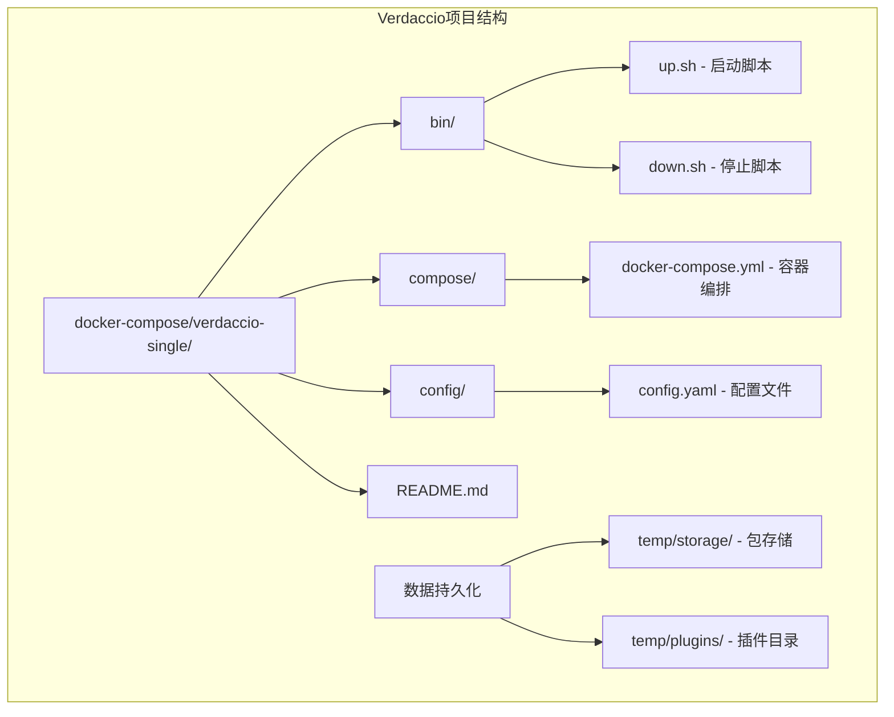
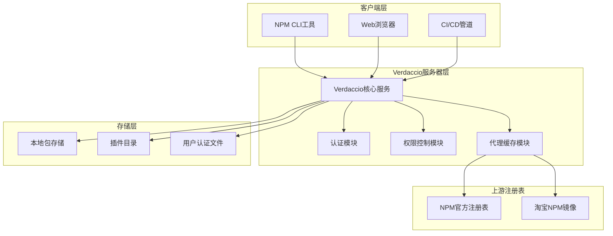
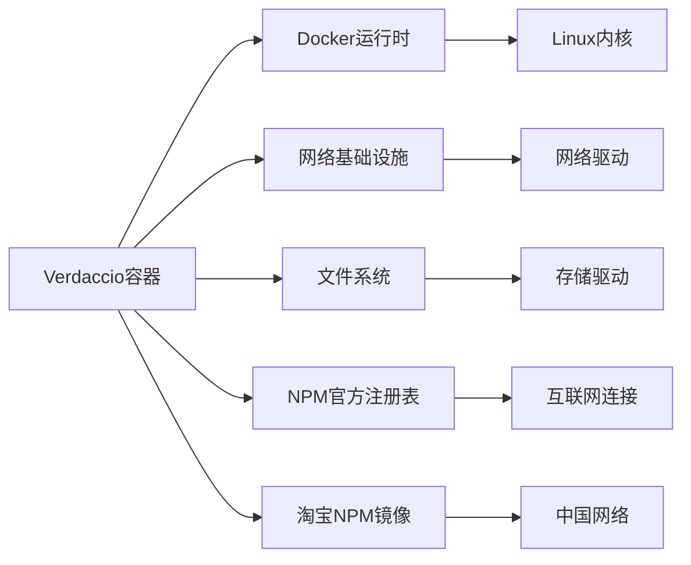
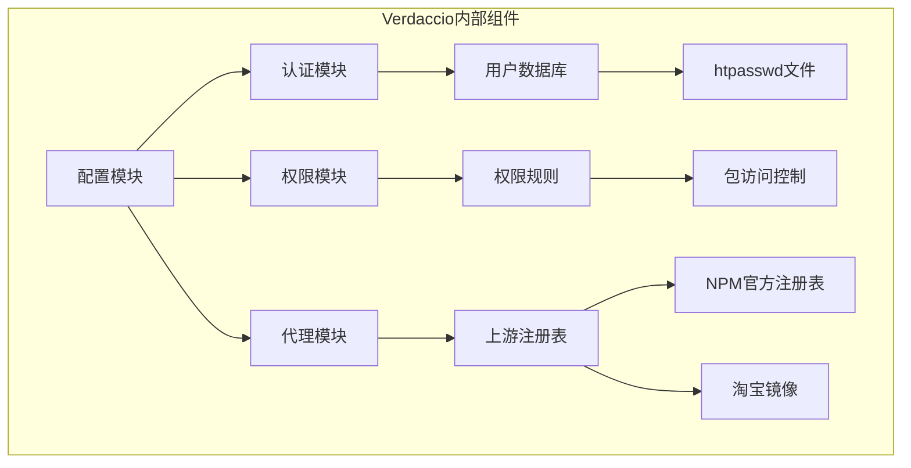

# Verdaccio NPM注册表

<cite>
**本文档引用的文件**
- [config.yaml](file://docker-compose/verdaccio-single/config/config.yaml)
- [docker-compose.yml](file://docker-compose/verdaccio-single/compose/docker-compose.yml)
- [up.sh](file://docker-compose/verdaccio-single/bin/up.sh)
- [down.sh](file://docker-compose/verdaccio-single/bin/down.sh)
- [README.md](file://docker-compose/verdaccio-single/README.md)
</cite>

## 目录
1. [简介](#简介)
2. [项目结构](#项目结构)
3. [核心组件](#核心组件)
4. [架构概览](#架构概览)
5. [详细组件分析](#详细组件分析)
6. [依赖关系分析](#依赖关系分析)
7. [性能考虑](#性能考虑)
8. [故障排除指南](#故障排除指南)
9. [结论](#结论)
10. [附录](#附录)

## 简介

Verdaccio是一个轻量级的NPM私有注册表解决方案，基于Docker容器化部署。该系统提供了企业级的NPM包管理服务，支持代理、缓存和私有包发布功能。通过容器化部署，Verdaccio能够快速启动和运行，同时保持良好的可维护性和扩展性。

本项目采用单容器部署模式，使用官方Verdaccio镜像版本6.1.5，提供完整的NPM私有注册表功能，包括用户认证、权限控制、包代理和缓存策略等核心特性。

## 项目结构

Verdaccio项目的目录结构采用模块化设计，主要包含以下关键组件：



**图表来源**
- [docker-compose.yml:1-21](file://docker-compose/verdaccio-single/compose/docker-compose.yml#L1-L21)
- [config.yaml:6-8](file://docker-compose/verdaccio-single/config/config.yaml#L6-L8)

**章节来源**
- [README.md:1-167](file://docker-compose/verdaccio-single/README.md#L1-L167)

## 核心组件

### 容器化部署组件

Verdaccio采用单容器部署架构，使用官方Verdaccio镜像进行容器化部署。容器配置具有以下特点：

- **镜像版本**: verdaccio/verdaccio:6.1.5
- **端口映射**: 4873:4873（HTTP服务）
- **网络配置**: 桥接网络all，支持容器间通信
- **数据持久化**: 挂载host目录到容器内存储路径

### 配置管理组件

配置文件采用YAML格式，包含以下核心配置区域：

- **存储配置**: 定义包存储路径和插件目录
- **认证配置**: 用户认证机制设置
- **安全配置**: JWT令牌和Web界面安全设置
- **上游代理**: NPM官方注册表和淘宝镜像代理
- **权限控制**: 包访问和发布的权限规则

**章节来源**
- [docker-compose.yml:1-21](file://docker-compose/verdaccio-single/compose/docker-compose.yml#L1-L21)
- [config.yaml:10-85](file://docker-compose/verdaccio-single/config/config.yaml#L10-L85)

## 架构概览

Verdaccio的整体架构采用客户端-服务器模式，结合了代理缓存机制：



**图表来源**
- [config.yaml:32-58](file://docker-compose/verdaccio-single/config/config.yaml#L32-L58)
- [docker-compose.yml:11-16](file://docker-compose/verdaccio-single/compose/docker-compose.yml#L11-L16)

## 详细组件分析

### 配置文件详解

#### 存储配置
Verdaccio使用容器内的存储路径来管理NPM包：
- **包存储路径**: `/verdaccio/storage`
- **插件目录**: `/verdaccio/plugins`

这些路径通过Docker卷挂载到主机的`temp`目录，实现数据持久化。

#### 认证机制
系统采用htpasswd认证方式，配置文件中包含：
- **认证文件位置**: `/verdaccio/conf/htpasswd`
- **最大用户数限制**: 可配置的用户注册上限
- **默认用户**: hz_9（用于演示环境）

#### 安全配置
安全设置包括JWT令牌和Web界面的安全参数：
- **API JWT令牌**: 60天有效期，立即可用
- **Web界面令牌**: 7天有效期
- **HTTPS建议**: 生产环境推荐使用HTTPS

#### 上游代理配置
系统配置了两个上游注册表以提高访问速度：
- **NPM官方注册表**: https://registry.npmjs.org/
- **淘宝NPM镜像**: https://registry.npmmirror.com/

#### 权限控制策略
权限控制采用基于作用域的包管理：
- **组织作用域包**: `@hz-9/*` 允许所有用户访问，仅认证用户可发布
- **通配符包**: 所有其他包允许匿名访问，但仅认证用户可发布
- **代理策略**: 当本地无包时自动代理到上游注册表

**章节来源**
- [config.yaml:6-8](file://docker-compose/verdaccio-single/config/config.yaml#L6-L8)
- [config.yaml:10-25](file://docker-compose/verdaccio-single/config/config.yaml#L10-L25)
- [config.yaml:32-58](file://docker-compose/verdaccio-single/config/config.yaml#L32-L58)

### 容器编排配置

#### 服务定义
Docker Compose配置定义了Verdaccio服务的基本属性：
- **镜像**: 使用官方Verdaccio 6.1.5版本
- **容器名称**: verdaccio-server
- **用户权限**: root用户运行
- **重启策略**: 始终重启

#### 网络配置
- **网络名称**: all（桥接网络）
- **网络别名**: all.verdaccio
- **容器间通信**: 支持通过网络别名访问

#### 数据卷挂载
- **存储卷**: `../temp/storage:/verdaccio/storage`
- **插件卷**: `../temp/plugins:/verdaccio/plugins`
- **配置卷**: `../config:/verdaccio/conf`

#### 端口映射
- **主机端口**: 4873
- **容器端口**: 4873
- **协议**: TCP

**章节来源**
- [docker-compose.yml:1-21](file://docker-compose/verdaccio-single/compose/docker-compose.yml#L1-L21)

### 启动和停止脚本

#### 启动脚本功能
启动脚本提供了便捷的服务管理功能：
- **自动检测项目根目录**
- **启动Docker Compose服务**
- **显示服务状态信息**
- **提供NPM配置指导**
- **显示数据目录位置**

#### 停止脚本功能
停止脚本确保服务正确关闭：
- **停止Docker Compose服务**
- **提示数据保留信息**
- **提供清理指导**

**章节来源**
- [up.sh:1-34](file://docker-compose/verdaccio-single/bin/up.sh#L1-L34)
- [down.sh:1-23](file://docker-compose/verdaccio-single/bin/down.sh#L1-L23)

## 依赖关系分析

### 外部依赖



**图表来源**
- [docker-compose.yml:3](file://docker-compose/verdaccio-single/compose/docker-compose.yml#L3)
- [config.yaml:32-36](file://docker-compose/verdaccio-single/config/config.yaml#L32-L36)

### 内部依赖关系



**图表来源**
- [config.yaml:10-15](file://docker-compose/verdaccio-single/config/config.yaml#L10-L15)
- [config.yaml:38-58](file://docker-compose/verdaccio-single/config/config.yaml#L38-L58)

**章节来源**
- [config.yaml:10-85](file://docker-compose/verdaccio-single/config/config.yaml#L10-L85)

## 性能考虑

### 缓存策略
Verdaccio实现了智能的缓存机制：
- **本地缓存**: 已下载的包存储在本地，避免重复下载
- **代理缓存**: 自动代理上游注册表的响应
- **内存优化**: 通过keep-alive超时减少连接开销

### 连接管理
- **keep-alive超时**: 设置为60秒，平衡资源使用和性能
- **并发处理**: 支持多用户同时访问
- **资源限制**: 通过容器化实现资源隔离

### 存储优化
- **数据分层**: 包存储和插件分离
- **磁盘空间**: 定期清理未使用的包
- **备份策略**: 支持离线备份

## 故障排除指南

### 常见问题诊断

#### 服务启动失败
**症状**: 容器无法启动或频繁重启
**可能原因**:
- 端口4873被占用
- 配置文件语法错误
- 权限不足访问存储目录

**解决方法**:
1. 检查端口占用情况
2. 验证配置文件格式
3. 确认目录权限设置

#### 用户认证问题
**症状**: 用户无法登录或注册
**可能原因**:
- htpasswd文件损坏
- 认证配置错误
- 密码不匹配

**解决方法**:
1. 检查认证文件完整性
2. 验证认证配置
3. 重新创建用户账户

#### 包访问问题
**症状**: 无法安装或发布包
**可能原因**:
- 权限配置错误
- 上游注册表不可用
- 网络连接问题

**解决方法**:
1. 检查包权限规则
2. 测试上游连接
3. 验证网络配置

### 监控和日志

#### 日志配置
系统配置了详细的日志记录：
- **输出格式**: 结构化日志
- **日志级别**: HTTP级别的详细信息
- **输出目标**: 标准输出

#### 性能监控
建议监控的关键指标：
- **CPU使用率**: 容器资源使用情况
- **内存使用**: 应用内存占用
- **磁盘空间**: 存储容量使用
- **网络流量**: 上下行数据量

**章节来源**
- [config.yaml:71](file://docker-compose/verdaccio-single/config/config.yaml#L71)
- [README.md:159-167](file://docker-compose/verdaccio-single/README.md#L159-L167)

## 结论

Verdaccio NPM私有注册表提供了一个完整的企业级解决方案，具有以下优势：

### 技术优势
- **轻量级部署**: 单容器架构简化了部署和维护
- **功能完整**: 支持认证、权限控制、代理缓存等核心功能
- **易于扩展**: 基于Docker的容器化设计便于水平扩展
- **成本效益**: 减少了硬件和运维成本

### 最佳实践建议
1. **生产环境安全**: 建议启用HTTPS和更强的认证机制
2. **定期备份**: 建立自动化备份策略保护数据
3. **监控告警**: 实施全面的监控和告警机制
4. **性能优化**: 根据实际使用情况调整缓存和资源配置

### 发展方向
- **高可用部署**: 考虑集群化部署提升可用性
- **增强安全**: 集成更高级的身份认证和授权机制
- **监控完善**: 添加更详细的性能指标和业务指标监控
- **自动化运维**: 开发更完善的CI/CD集成和自动化运维工具

## 附录

### 快速开始指南

#### 环境要求
- Docker Engine 20.10+
- Docker Compose 2.0+
- 至少2GB可用内存

#### 安装步骤
1. **克隆项目**: `git clone <repository>`
2. **进入目录**: `cd docker-compose/verdaccio-single`
3. **启动服务**: `./bin/up.sh`
4. **验证安装**: `docker compose -p verdaccio-single ps`

#### 基本配置
```bash
# 设置NPM注册表
npm config set registry http://localhost:4873

# 创建用户
npm adduser --registry http://localhost:4873
```

### 高级配置选项

#### 自定义认证
- **LDAP集成**: 支持企业LDAP身份认证
- **OAuth支持**: 集成第三方OAuth提供商
- **自定义插件**: 开发专用认证插件

#### 权限管理
- **团队角色**: 定义不同级别的用户权限
- **包级权限**: 细粒度的包访问控制
- **IP白名单**: 基于IP地址的访问控制

#### 监控和告警
- **健康检查**: 定期服务状态检查
- **性能指标**: CPU、内存、磁盘使用率监控
- **告警通知**: 邮件、Slack等通知渠道

**章节来源**
- [README.md:43-133](file://docker-compose/verdaccio-single/README.md#L43-L133)