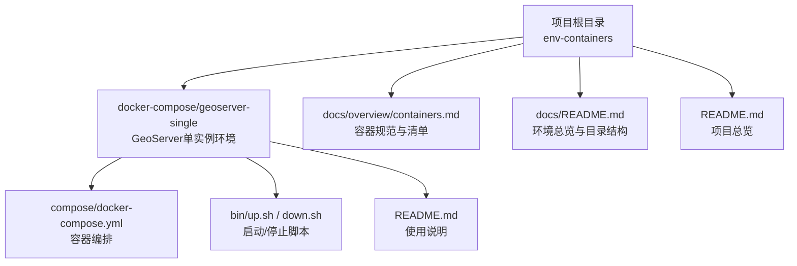
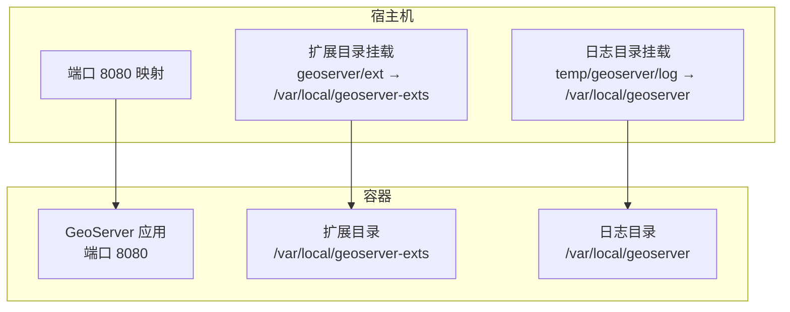
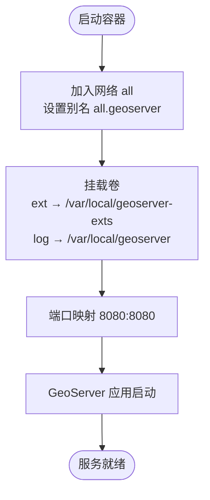
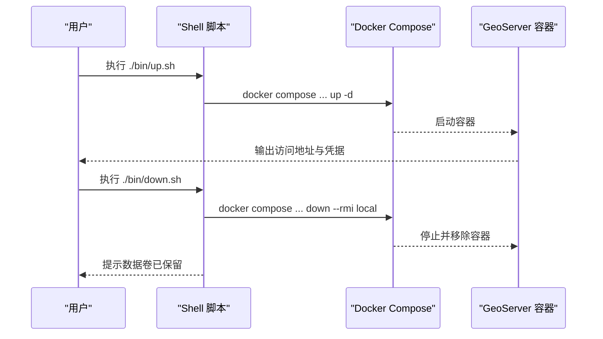
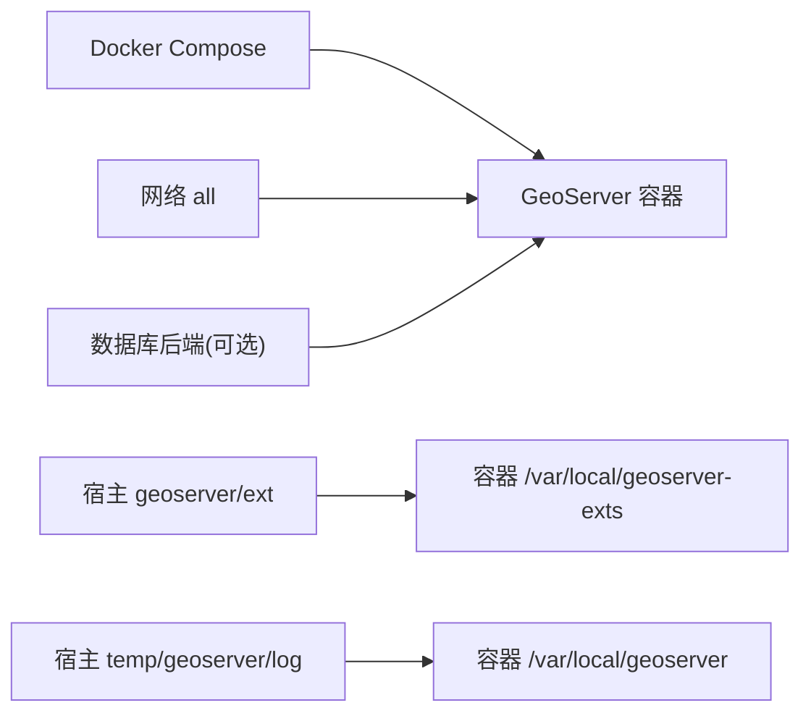

# 地理信息系统

<cite>
**本文引用的文件**
- [docker-compose.yml](file://docker-compose/geoserver-single/compose/docker-compose.yml)
- [README.md](file://docker-compose/geoserver-single/README.md)
- [up.sh](file://docker-compose/geoserver-single/bin/up.sh)
- [down.sh](file://docker-compose/geoserver-single/bin/down.sh)
- [containers.md](file://docs/overview/containers.md)
- [README.md](file://docs/README.md)
- [README.md](file://README.md)
</cite>

## 目录
1. [简介](#简介)
2. [项目结构](#项目结构)
3. [核心组件](#核心组件)
4. [架构总览](#架构总览)
5. [详细组件分析](#详细组件分析)
6. [依赖关系分析](#依赖关系分析)
7. [性能考虑](#性能考虑)
8. [故障排查指南](#故障排查指南)
9. [结论](#结论)
10. [附录](#附录)

## 简介
本文件面向地理信息系统环境，聚焦于GeoServer的容器化部署与Web地理信息服务配置。内容涵盖容器编排、服务访问、默认凭据、数据持久化、扩展模块以及与OGC标准（WMS/WFS/WCS/WPS）的关系说明。同时提供启动/停止流程、日志与扩展目录约定、常见问题排查建议，帮助用户快速搭建并稳定运行GeoServer。

## 项目结构
GeoServer单实例容器化解决方案位于独立目录中，采用统一的“环境目录”组织方式：
- 环境根目录：docker-compose/geoserver-single
  - compose/docker-compose.yml：容器编排定义
  - bin/up.sh、bin/down.sh：启动/停止脚本
  - README.md：环境说明与使用指南
- 文档目录：docs/overview/containers.md、docs/README.md 提供整体容器清单与规范
- 根目录README.md：项目概览与文档入口

**图表来源**
- [README.md:1-129](file://docker-compose/geoserver-single/README.md#L1-L129)
- [docker-compose.yml:1-18](file://docker-compose/geoserver-single/compose/docker-compose.yml#L1-L18)
- [containers.md:53-59](file://docs/overview/containers.md#L53-L59)
- [README.md:53-58](file://docs/README.md#L53-L58)
- [README.md:1-6](file://README.md#L1-L6)

**章节来源**
- [README.md:1-129](file://docker-compose/geoserver-single/README.md#L1-L129)
- [docker-compose.yml:1-18](file://docker-compose/geoserver-single/compose/docker-compose.yml#L1-L18)
- [containers.md:53-59](file://docs/overview/containers.md#L53-L59)
- [README.md:53-58](file://docs/README.md#L53-L58)
- [README.md:1-6](file://README.md#L1-L6)

## 核心组件
- 容器镜像与端口映射
  - 基础镜像：oscarfonts/geoserver:2.27.1
  - 内部端口：8080
  - 外部端口：8080
- 网络与别名
  - 网络名称：all
  - 容器网络别名：all.geoserver
  - 支持容器间通信
- 数据持久化
  - 扩展目录挂载：../geoserver/ext → /var/local/geoserver-exts
  - 日志目录挂载：../temp/geoserver/log → /var/local/geoserver
- 默认凭据
  - 用户名：admin
  - 密码：geoserver

**章节来源**
- [docker-compose.yml:1-18](file://docker-compose/geoserver-single/compose/docker-compose.yml#L1-L18)
- [README.md:73-88](file://docker-compose/geoserver-single/README.md#L73-L88)
- [README.md:83-89](file://docker-compose/geoserver-single/README.md#L83-L89)
- [containers.md:57-59](file://docs/overview/containers.md#L57-L59)

## 架构总览
GeoServer单实例容器通过Docker Compose编排，暴露Web管理界面与OGC服务接口。容器内运行GeoServer应用，外部通过8080端口访问；扩展模块与日志分别从宿主机挂载到容器内的固定路径，便于持久化与维护。

**图表来源**
- [docker-compose.yml:10-14](file://docker-compose/geoserver-single/compose/docker-compose.yml#L10-L14)
- [README.md:59-67](file://docker-compose/geoserver-single/README.md#L59-L67)

**章节来源**
- [docker-compose.yml:1-18](file://docker-compose/geoserver-single/compose/docker-compose.yml#L1-L18)
- [README.md:57-67](file://docker-compose/geoserver-single/README.md#L57-L67)

## 详细组件分析

### 容器编排与网络
- 服务定义
  - 镜像版本：oscarfonts/geoserver:2.27.1
  - 容器名：geoserver
  - 重启策略：always
- 网络
  - 加入自定义bridge网络all
  - 容器别名：all.geoserver
- 挂载卷
  - 扩展目录：宿主 geoserver/ext → 容器 /var/local/geoserver-exts
  - 日志目录：宿主 temp/geoserver/log → 容器 /var/local/geoserver
- 端口映射
  - 8080:8080

**图表来源**
- [docker-compose.yml:2-14](file://docker-compose/geoserver-single/compose/docker-compose.yml#L2-L14)

**章节来源**
- [docker-compose.yml:1-18](file://docker-compose/geoserver-single/compose/docker-compose.yml#L1-L18)

### 启动与停止脚本
- 启动脚本
  - 自动定位项目根目录
  - 使用 docker compose 在后台启动
  - 输出访问地址与默认凭据
- 停止脚本
  - 停止并移除服务（镜像保留）
  - 提示数据卷已保存在 temp/ 目录

**图表来源**
- [up.sh:14-26](file://docker-compose/geoserver-single/bin/up.sh#L14-L26)
- [down.sh:14-19](file://docker-compose/geoserver-single/bin/down.sh#L14-L19)

**章节来源**
- [up.sh:1-27](file://docker-compose/geoserver-single/bin/up.sh#L1-L27)
- [down.sh:1-20](file://docker-compose/geoserver-single/bin/down.sh#L1-L20)

### 访问与默认凭据
- Web界面访问
  - http://127.0.0.1:8080/geoserver
- 容器内互访
  - http://all.geoserver:8080/geoserver
- 默认管理员账户
  - 用户名：admin
  - 密码：geoserver

**章节来源**
- [README.md:15-27](file://docker-compose/geoserver-single/README.md#L15-L27)
- [README.md:83-89](file://docker-compose/geoserver-single/README.md#L83-L89)
- [containers.md:57-59](file://docs/overview/containers.md#L57-L59)

### 数据格式与服务类型
- 支持的数据格式
  - 矢量：Shapefile、GeoJSON、KML
  - 栅格：GeoTIFF、JPEG、PNG
  - 数据库：PostGIS、Oracle Spatial、MySQL
- 常见服务类型
  - WMS：Web Map Service
  - WFS：Web Feature Service
  - WCS：Web Coverage Service
  - WPS：Web Processing Service

**章节来源**
- [README.md:92-104](file://docker-compose/geoserver-single/README.md#L92-L104)

### 扩展模块
- 支持的扩展模块
  - Vector Tiles：矢量瓦片支持
  - Charting：图表支持
  - Control Flow：请求限流控制
  - CSS Styling：CSS样式支持

**章节来源**
- [README.md:105-113](file://docker-compose/geoserver-single/README.md#L105-L113)

## 依赖关系分析
- 组件耦合
  - GeoServer容器依赖Docker Compose进行编排
  - 通过网络别名 all.geoserver 实现容器内互访
  - 通过卷挂载实现扩展与日志的持久化
- 外部依赖
  - Docker Engine（含Compose插件）
  - 可选：数据库后端（如PostGIS）用于承载矢量/栅格数据

**图表来源**
- [docker-compose.yml:6-14](file://docker-compose/geoserver-single/compose/docker-compose.yml#L6-L14)

**章节来源**
- [docker-compose.yml:1-18](file://docker-compose/geoserver-single/compose/docker-compose.yml#L1-L18)

## 性能考虑
- 首次启动时间
  - 首次启动可能需要数分钟，请耐心等待
- 端口占用
  - 确保宿主机8080端口未被占用
- 存储空间
  - 为地理数据预留充足磁盘空间
- 生产建议
  - 更改默认管理员密码
  - 定期备份GeoServer配置与数据
  - 按需安装扩展模块以满足业务需求

**章节来源**
- [README.md:121-129](file://docker-compose/geoserver-single/README.md#L121-L129)

## 故障排查指南
- 无法访问Web界面
  - 检查端口8080是否被占用
  - 确认容器状态正常
- 容器启动失败
  - 查看容器日志（挂载的日志目录）
  - 检查卷挂载路径是否存在且权限正确
- 容器间通信异常
  - 确认网络 all 已创建
  - 使用别名 all.geoserver 进行访问
- 停止服务后数据丢失
  - 停止脚本会保留数据卷在 temp/ 目录下，请确认该目录存在

**章节来源**
- [README.md:121-129](file://docker-compose/geoserver-single/README.md#L121-L129)
- [down.sh:17-19](file://docker-compose/geoserver-single/bin/down.sh#L17-L19)

## 结论
本方案提供了GeoServer单实例的标准化容器化部署路径：清晰的编排定义、明确的网络与挂载约定、简化的启动/停止流程，以及对OGC服务类型的总体支持说明。结合默认凭据、扩展模块与生产建议，可在开发与测试环境中快速落地，并为进一步集成数据库后端与前端地图客户端奠定基础。

## 附录

### 快速开始与常用命令
- 启动服务
  - 使用脚本：./bin/up.sh
  - 或直接使用 docker compose：docker compose -p geoserver-single -f compose/docker-compose.yml up -d
- 停止服务
  - 使用脚本：./bin/down.sh
  - 或直接使用 docker compose：docker compose -p geoserver-single -f compose/docker-compose.yml down
- 查看状态
  - docker compose -p geoserver-single -f compose/docker-compose.yml ps

**章节来源**
- [README.md:29-55](file://docker-compose/geoserver-single/README.md#L29-L55)
- [up.sh:14-26](file://docker-compose/geoserver-single/bin/up.sh#L14-L26)
- [down.sh:14-19](file://docker-compose/geoserver-single/bin/down.sh#L14-L19)

### 数据导入导出与样式配置（实践指引）
- 数据导入
  - 通过Web界面或REST API发布数据存储（如PostGIS等）
  - 将矢量/栅格数据上传至对应工作区
- 数据导出
  - 使用WFS/WCS等服务导出所需数据格式
- 样式配置
  - 使用SLD/CSS样式为图层配置渲染效果
  - 扩展模块中的CSS Styling可增强样式能力
- 坐标系设置
  - 在图层元数据中配置坐标参考系统（CRS）
  - 确保数据与服务端CRS一致，避免显示偏移

[本节为通用实践指引，不直接分析具体源文件，故无“章节来源”]