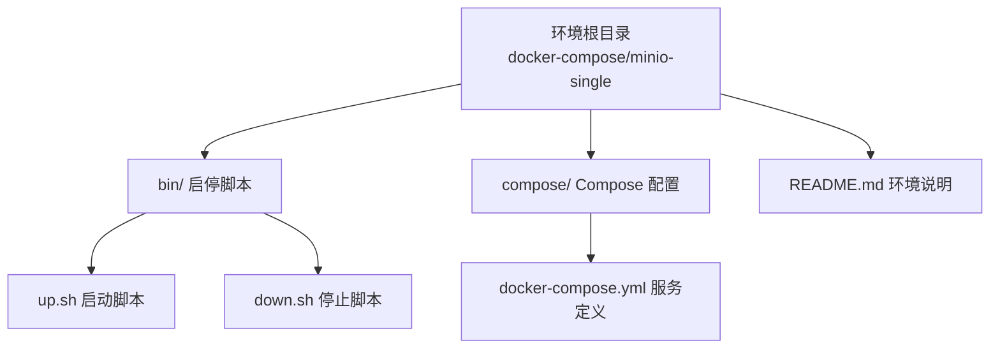
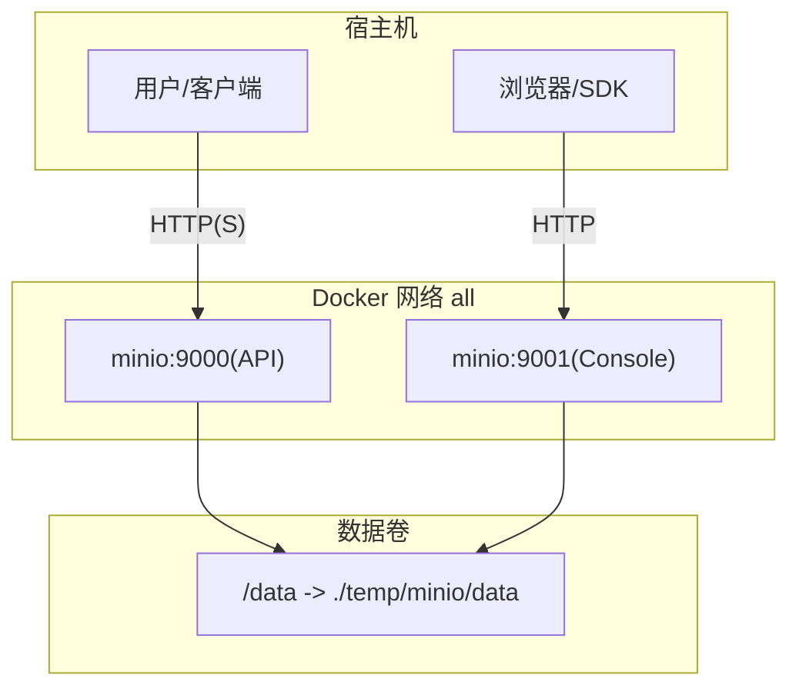
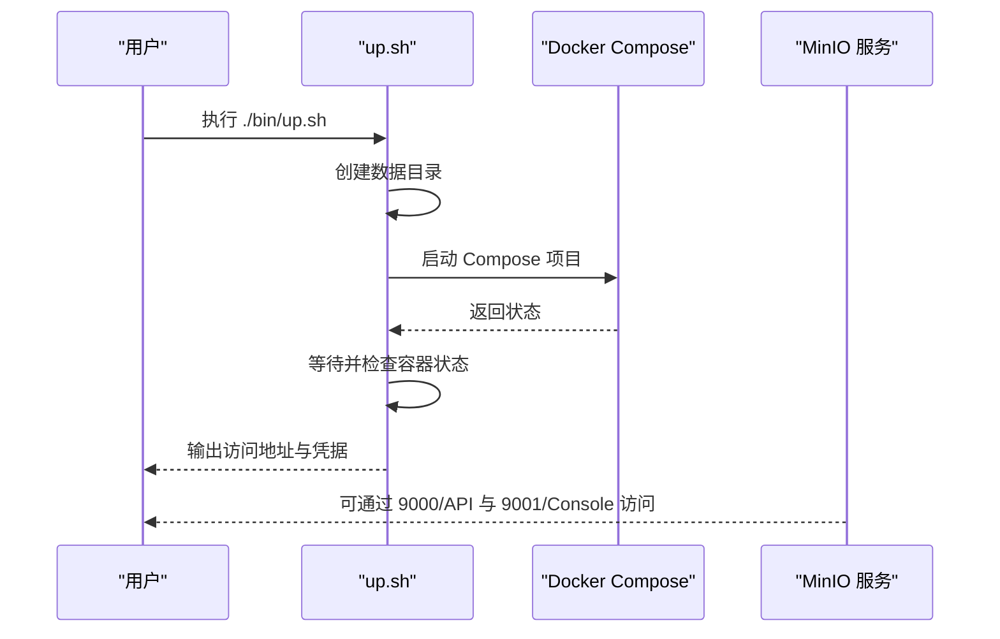
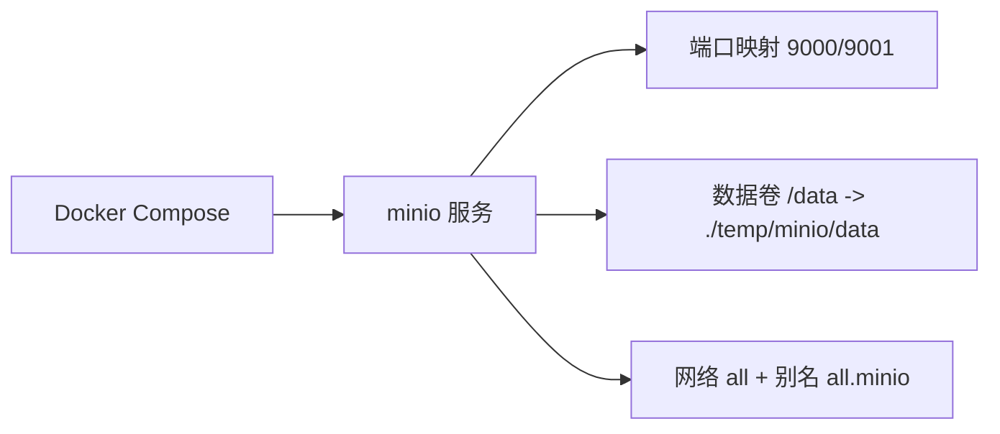

# 存储解决方案

<cite>
**本文引用的文件**
- [docker-compose.yml](file://docker-compose/minio-single/compose/docker-compose.yml)
- [README.md](file://docker-compose/minio-single/README.md)
- [up.sh](file://docker-compose/minio-single/bin/up.sh)
- [down.sh](file://docker-compose/minio-single/bin/down.sh)
- [docs-README.md](file://docs/README.md)
- [containers-zh-CN.md](file://docs/overview/containers.zh-CN.md)
- [containers.md](file://docs/overview/containers.md)
</cite>

## 目录
1. [简介](#简介)
2. [项目结构](#项目结构)
3. [核心组件](#核心组件)
4. [架构总览](#架构总览)
5. [详细组件分析](#详细组件分析)
6. [依赖关系分析](#依赖关系分析)
7. [性能考虑](#性能考虑)
8. [故障排查指南](#故障排查指南)
9. [结论](#结论)
10. [附录](#附录)

## 简介
本文件面向需要在开发与测试环境中快速搭建对象存储服务的用户，系统性介绍基于 MinIO 的单实例容器化部署方案。内容涵盖：
- MinIO 的容器化部署方式与端口映射
- 访问控制与默认凭据
- 与 AWS S3 的兼容性与迁移注意事项
- 数据生命周期管理与备份恢复建议
- 性能优化与最佳实践
- 常见操作流程（上传、下载、预签名 URL 生成）与 SDK 使用指引

本仓库提供标准化的 Docker Compose 配置与启动脚本，便于一键启动与停止 MinIO 服务，并通过浏览器控制台进行可视化管理。

## 项目结构
MinIO 单实例环境位于独立目录中，遵循统一的“环境”组织方式：
- 环境根目录包含：README 文档、启动/停止脚本、Compose 配置
- 默认持久化数据目录为环境根目录下的 temp/minio/data

图表来源
- [docker-compose.yml:1-25](file://docker-compose/minio-single/compose/docker-compose.yml#L1-L25)
- [up.sh:1-32](file://docker-compose/minio-single/bin/up.sh#L1-L32)
- [down.sh:1-16](file://docker-compose/minio-single/bin/down.sh#L1-L16)

章节来源
- [docs-README.md:146-174](file://docs/README.md#L146-L174)
- [docs-README.md:71-83](file://docs/README.md#L71-L83)

## 核心组件
- MinIO 服务容器
  - 镜像版本：minio/minio:RELEASE.2025-05-24T17-08-30Z
  - API 端口：9000（对外）
  - 控制台端口：9001（对外）
  - 默认管理员用户名与密码：hz_9 / 12345678
  - 数据卷挂载：../temp/minio/data:/data
  - 网络别名：all.minio（用于容器间通信）

- 启动/停止脚本
  - up.sh：创建数据目录、启动服务、打印访问信息、等待并检查状态
  - down.sh：停止并移除服务

- 文档与说明
  - 环境 README 提供访问地址、默认凭据、使用步骤
  - 顶层文档汇总了各环境的端口、镜像与类型

章节来源
- [docker-compose.yml:1-25](file://docker-compose/minio-single/compose/docker-compose.yml#L1-L25)
- [README.md:13-57](file://docker-compose/minio-single/README.md#L13-L57)
- [up.sh:14-31](file://docker-compose/minio-single/bin/up.sh#L14-L31)
- [down.sh:14-16](file://docker-compose/minio-single/bin/down.sh#L14-L16)
- [docs-README.md:39-43](file://docs/README.md#L39-L43)

## 架构总览
MinIO 在单容器内同时提供对象存储 API 与 Web 控制台，通过 Docker 网络别名实现跨容器访问。默认凭据用于首次登录控制台与 API 认证。

图表来源
- [docker-compose.yml:6-21](file://docker-compose/minio-single/compose/docker-compose.yml#L6-L21)
- [README.md:15-31](file://docker-compose/minio-single/README.md#L15-L31)

## 详细组件分析

### MinIO 服务配置
- 端口映射
  - 9000:9000（API）
  - 9001:9001（控制台）
- 环境变量
  - MINIO_ROOT_USER / MINIO_ROOT_PASSWORD：管理员凭据
  - MINIO_CONSOLE_ADDRESS：控制台监听地址
- 命令参数
  - server /data --console-address ":9001"
- 网络与别名
  - 加入网络 all，并设置 all.minio 别名，便于容器间访问

章节来源
- [docker-compose.yml:6-21](file://docker-compose/minio-single/compose/docker-compose.yml#L6-L21)

### 启动与停止流程
- 启动
  - 创建数据目录 temp/minio/data
  - 以分离模式启动 Compose 项目
  - 打印访问地址与默认凭据
  - 等待服务就绪后列出容器状态
- 停止
  - 停止并移除 Compose 项目中的服务

图表来源
- [up.sh:14-31](file://docker-compose/minio-single/bin/up.sh#L14-L31)
- [docker-compose.yml:6-21](file://docker-compose/minio-single/compose/docker-compose.yml#L6-L21)

章节来源
- [up.sh:14-31](file://docker-compose/minio-single/bin/up.sh#L14-L31)
- [down.sh:14-16](file://docker-compose/minio-single/bin/down.sh#L14-L16)

### 访问控制与默认凭据
- 默认管理员账号：hz_9
- 默认密码：12345678
- 控制台访问：http://localhost:9001
- API 访问：http://localhost:9000
- 容器间访问：http://all.minio:9001 或 http://all.minio:9000

章节来源
- [README.md:15-37](file://docker-compose/minio-single/README.md#L15-L37)
- [containers.md:101](file://docs/overview/containers.md#L101)

### 与 AWS S3 的兼容性与迁移注意事项
- 兼容性
  - MinIO 提供与 AWS S3 API 兼容的对象存储接口，可直接使用 S3 兼容的 SDK 进行开发与测试
- 迁移注意事项
  - 端点与凭据：确保 SDK 配置为 MinIO 端点（http://localhost:9000），并使用管理员凭据
  - 区域与路径样式：根据 SDK 需求选择路径式或虚拟托管式访问风格
  - TLS：生产环境建议启用 HTTPS 并配置证书
  - 权限模型：MinIO 的策略与 IAM 机制与 S3 类似但不完全相同，需按需调整策略

章节来源
- [README.md:5](file://docker-compose/minio-single/README.md#L5)
- [containers.md:140](file://docs/overview/containers.md#L140)

### 数据生命周期管理与备份恢复
- 生命周期管理
  - 可通过控制台或 API 设置对象过期策略、版本保留等规则
- 备份与恢复
  - 建议定期备份数据卷目录 temp/minio/data
  - 可使用压缩归档或快照工具进行离线备份
  - 恢复时将备份数据还原到原路径，重启服务即可恢复

章节来源
- [README.md:48-50](file://docker-compose/minio-single/README.md#L48-L50)

### 性能优化与最佳实践
- 端口与网络
  - 将 API 与控制台端口映射到宿主，避免冲突
- 数据持久化
  - 使用宿主机目录挂载数据卷，确保数据持久化
- 安全加固
  - 更改默认管理员密码
  - 限制外网访问，必要时启用 TLS
- 资源规划
  - 根据业务规模评估磁盘空间与 CPU/内存资源

章节来源
- [docker-compose.yml:13-21](file://docker-compose/minio-single/compose/docker-compose.yml#L13-L21)
- [README.md:33-37](file://docker-compose/minio-single/README.md#L33-L37)

## 依赖关系分析
- 组件耦合
  - MinIO 服务依赖 Docker Compose 环境与宿主机数据卷
  - 控制台与 API 共用同一容器进程
- 外部依赖
  - Docker Engine 与 Docker Compose 插件
- 可能的循环依赖
  - 无直接循环依赖；容器间通过网络别名访问

图表来源
- [docker-compose.yml:6-21](file://docker-compose/minio-single/compose/docker-compose.yml#L6-L21)

章节来源
- [docker-compose.yml:1-25](file://docker-compose/minio-single/compose/docker-compose.yml#L1-L25)

## 性能考虑
- 端口与网络
  - 合理规划端口映射，避免与其他服务冲突
- 数据卷
  - 使用高性能磁盘与合适的文件系统挂载选项
- 安全与性能平衡
  - 在开发环境可使用明文 HTTP，生产环境务必启用 HTTPS
- 版本与镜像
  - 使用稳定版镜像，关注官方更新日志与性能改进

[本节为通用指导，无需特定文件引用]

## 故障排查指南
- 无法访问控制台或 API
  - 检查端口是否被占用
  - 确认容器已成功启动并处于运行状态
- 默认凭据无效
  - 首次登录后请立即修改默认密码
- 数据丢失
  - 检查数据卷挂载路径是否正确
  - 确保未误删 temp/minio/data 目录
- 容器间通信失败
  - 确认网络 all 已创建且别名为 all.minio

章节来源
- [up.sh:26-31](file://docker-compose/minio-single/bin/up.sh#L26-L31)
- [README.md:48-50](file://docker-compose/minio-single/README.md#L48-L50)

## 结论
本仓库提供了开箱即用的 MinIO 单实例容器化部署方案，具备以下优势：
- 快速启动与停止
- 标准化的目录结构与脚本
- 与 AWS S3 API 兼容，便于开发与测试
- 明确的默认凭据与访问地址，降低上手成本

建议在生产环境中进一步完善安全策略（如启用 HTTPS、最小权限原则）、监控与备份流程，并结合业务规模进行资源规划与性能调优。

[本节为总结性内容，无需特定文件引用]

## 附录

### 常用操作流程（概念性说明）
- 上传对象
  - 通过控制台或 SDK 选择目标桶与文件，执行上传请求
- 下载对象
  - 通过控制台或 SDK 获取对象并保存至本地
- 生成预签名 URL
  - 使用 SDK 的预签名功能生成带有效期的下载链接
- SDK 使用
  - 选择与 MinIO 兼容的 SDK（如官方 S3 SDK），配置端点、凭据与区域

[本节为概念性说明，无需特定文件引用]

### 环境概览与默认凭据
- MinIO 单实例
  - 端口：9000（API）、9001（控制台）
  - 默认凭据：hz_9 / 12345678

章节来源
- [docs-README.md:39-43](file://docs/README.md#L39-L43)
- [containers-zh-CN.md:37-41](file://docs/overview/containers.zh-CN.md#L37-L41)
- [containers.md:101](file://docs/overview/containers.md#L101)