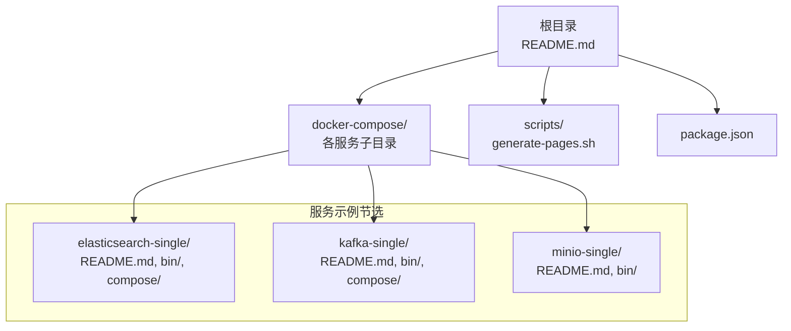
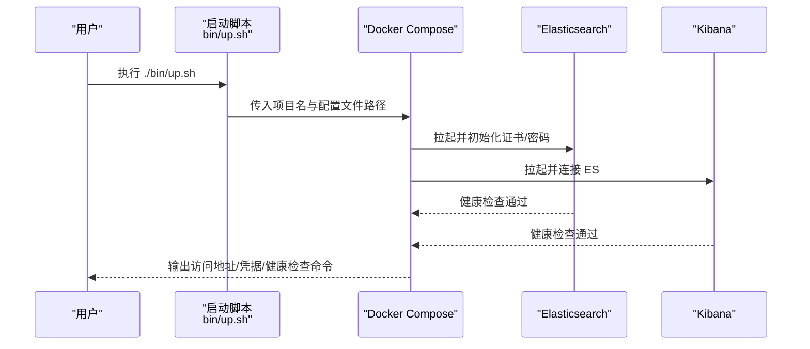
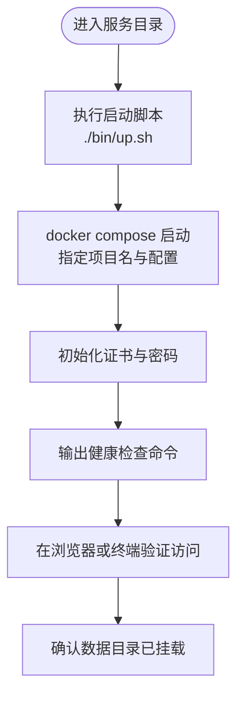
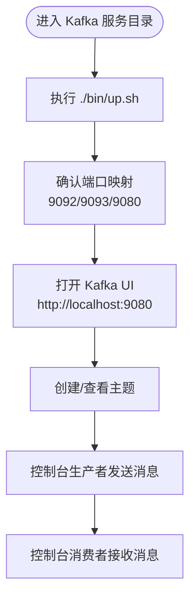
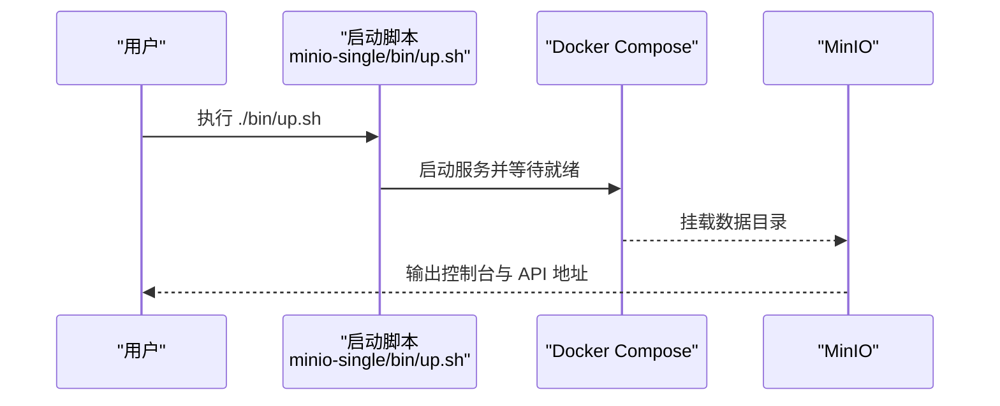
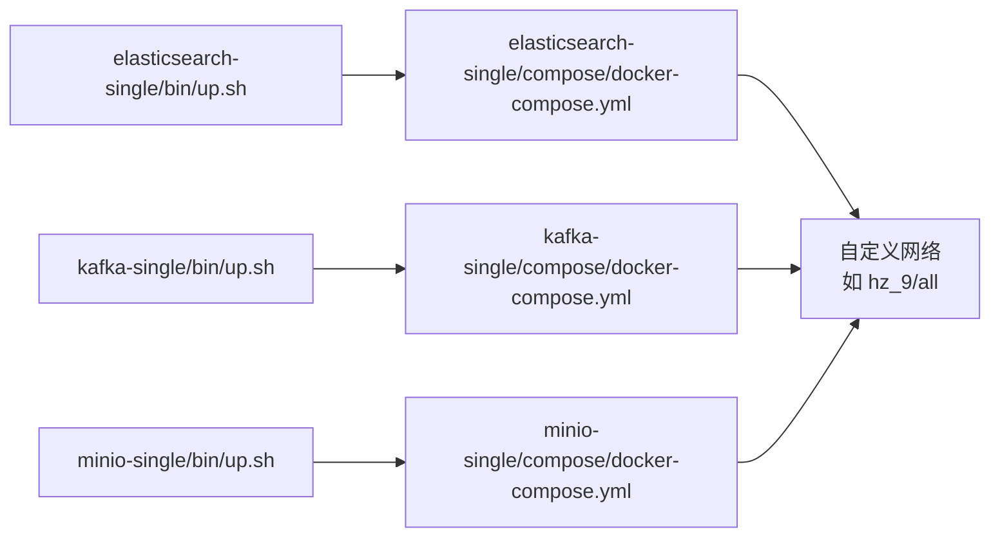

# 快速开始

<cite>
**本文引用的文件**
- [README.md](file://README.md)
- [elasticsearch-single/README.md](file://docker-compose/elasticsearch-single/README.md)
- [elasticsearch-single/bin/up.sh](file://docker-compose/elasticsearch-single/bin/up.sh)
- [elasticsearch-single/bin/down.sh](file://docker-compose/elasticsearch-single/bin/down.sh)
- [elasticsearch-single/compose/docker-compose.yml](file://docker-compose/elasticsearch-single/compose/docker-compose.yml)
- [elasticsearch-cluster/README.md](file://docker-compose/elasticsearch-cluster/README.md)
- [kafka-single/README.md](file://docker-compose/kafka-single/README.md)
- [kafka-single/bin/up.sh](file://docker-compose/kafka-single/bin/up.sh)
- [kafka-single/compose/docker-compose.yml](file://docker-compose/kafka-single/compose/docker-compose.yml)
- [minio-single/README.md](file://docker-compose/minio-single/README.md)
- [minio-single/bin/up.sh](file://docker-compose/minio-single/bin/up.sh)
- [scripts/generate-pages.sh](file://scripts/generate-pages.sh)
- [package.json](file://package.json)
</cite>

## 目录
1. [简介](#简介)
2. [项目结构](#项目结构)
3. [核心组件](#核心组件)
4. [架构总览](#架构总览)
5. [详细组件分析](#详细组件分析)
6. [依赖分析](#依赖分析)
7. [性能考虑](#性能考虑)
8. [故障排除指南](#故障排除指南)
9. [结论](#结论)
10. [附录](#附录)

## 简介
本指南面向首次接触容器化开发环境的用户，帮助你在本地快速启动并验证一个可用的容器化开发环境。你将学习到如何准备环境（Docker 与 Docker Compose 的安装）、如何使用提供的启动脚本与配置文件、如何进行基础验证以及常见的排障方法。项目中提供了多种常用中间件与工具的单实例/集群示例，你可以按需选择。

## 项目结构
仓库采用“按功能分目录”的组织方式，每个服务（如 Elasticsearch、Kafka、MinIO 等）都拥有独立的 docker-compose 配置、启动/停止脚本与使用说明文档。根目录包含整体介绍与文档生成脚本。

图表来源
- [README.md](file://README.md)
- [elasticsearch-single/README.md](file://docker-compose/elasticsearch-single/README.md)
- [kafka-single/README.md](file://docker-compose/kafka-single/README.md)
- [minio-single/README.md](file://docker-compose/minio-single/README.md)
- [scripts/generate-pages.sh](file://scripts/generate-pages.sh)
- [package.json](file://package.json)

章节来源
- [README.md](file://README.md)
- [package.json](file://package.json)

## 核心组件
- 启动脚本：每个服务目录下的 bin/up.sh 负责调用 docker compose 启动服务；部分脚本会自动打印访问信息、健康检查命令与数据目录位置。
- 停止脚本：bin/down.sh 负责优雅关闭服务，并提示数据卷保留情况。
- 编排配置：compose/docker-compose.yml 定义了服务镜像、端口映射、网络、环境变量与健康检查等。
- 使用说明：各服务目录下的 README.md 提供了快速开始、访问信息、常见操作与故障排除建议。

章节来源
- [elasticsearch-single/bin/up.sh](file://docker-compose/elasticsearch-single/bin/up.sh)
- [elasticsearch-single/bin/down.sh](file://docker-compose/elasticsearch-single/bin/down.sh)
- [elasticsearch-single/compose/docker-compose.yml](file://docker-compose/elasticsearch-single/compose/docker-compose.yml)
- [kafka-single/bin/up.sh](file://docker-compose/kafka-single/bin/up.sh)
- [kafka-single/compose/docker-compose.yml](file://docker-compose/kafka-single/compose/docker-compose.yml)
- [minio-single/bin/up.sh](file://docker-compose/minio-single/bin/up.sh)

## 架构总览
下图展示了“启动脚本 → docker compose → 服务容器 → 外部访问/内部通信”的典型流程。以 Elasticsearch 单节点为例，启动脚本通过 docker compose 指定项目名与配置文件，拉起 Elasticsearch 与 Kibana，并在启动后输出访问地址、凭据与健康检查命令。

图表来源
- [elasticsearch-single/bin/up.sh](file://docker-compose/elasticsearch-single/bin/up.sh)
- [elasticsearch-single/compose/docker-compose.yml](file://docker-compose/elasticsearch-single/compose/docker-compose.yml)

## 详细组件分析

### Elasticsearch 单节点（含 Kibana）
- 快速开始
  - 使用脚本启动：在服务目录执行启动脚本。
  - 直接使用 docker compose：指定项目名与配置文件路径。
- 访问信息
  - Elasticsearch API：本地端口映射为 9200。
  - Kibana Web 界面：本地端口映射为 5601。
- 数据持久化
  - 数据、日志与插件分别挂载到 temp/esdata01、temp/eslogs01、temp/esplugins01 等目录。
- 健康检查与验证
  - 启动脚本会输出健康检查命令，可直接在终端执行验证集群状态。
- 安全与证书
  - 首次启动会自动生成 CA 与服务证书，并设置内置账户密码。

图表来源
- [elasticsearch-single/bin/up.sh](file://docker-compose/elasticsearch-single/bin/up.sh)
- [elasticsearch-single/compose/docker-compose.yml](file://docker-compose/elasticsearch-single/compose/docker-compose.yml)

章节来源
- [elasticsearch-single/README.md](file://docker-compose/elasticsearch-single/README.md)
- [elasticsearch-single/bin/up.sh](file://docker-compose/elasticsearch-single/bin/up.sh)
- [elasticsearch-single/bin/down.sh](file://docker-compose/elasticsearch-single/bin/down.sh)
- [elasticsearch-single/compose/docker-compose.yml](file://docker-compose/elasticsearch-single/compose/docker-compose.yml)

### Kafka 单节点（KRaft 模式，无 ZooKeeper）
- 快速开始
  - 使用脚本启动：./bin/up.sh。
  - 直接使用 docker compose：指定项目名与配置文件路径。
- 访问信息
  - Kafka 连接串：localhost:9092。
  - Web 管理界面：http://localhost:9080。
- 数据持久化
  - 数据与日志分别挂载到 temp/kafka/data 与 temp/kafka/logs。
- 常见操作
  - 创建/列出/描述主题。
  - 控制台生产者/消费者演示消息收发。

图表来源
- [kafka-single/README.md](file://docker-compose/kafka-single/README.md)
- [kafka-single/bin/up.sh](file://docker-compose/kafka-single/bin/up.sh)
- [kafka-single/compose/docker-compose.yml](file://docker-compose/kafka-single/compose/docker-compose.yml)

章节来源
- [kafka-single/README.md](file://docker-compose/kafka-single/README.md)
- [kafka-single/bin/up.sh](file://docker-compose/kafka-single/bin/up.sh)
- [kafka-single/compose/docker-compose.yml](file://docker-compose/kafka-single/compose/docker-compose.yml)

### MinIO 单节点（S3 兼容对象存储）
- 快速开始
  - 使用脚本启动：./bin/up.sh。
  - 默认凭据与访问地址已在脚本中输出。
- 数据持久化
  - 数据目录挂载到 temp/minio/data。
- 使用说明
  - 登录控制台，创建桶并上传文件，支持 S3 兼容 API。

图表来源
- [minio-single/bin/up.sh](file://docker-compose/minio-single/bin/up.sh)
- [minio-single/README.md](file://docker-compose/minio-single/README.md)

章节来源
- [minio-single/README.md](file://docker-compose/minio-single/README.md)
- [minio-single/bin/up.sh](file://docker-compose/minio-single/bin/up.sh)

### 其他服务（概览）
- 集群版 Elasticsearch：提供多节点高可用部署方案，包含证书管理与内存限制配置。
- Kafka 集群：包含多节点与负载均衡配置，适合更复杂的测试场景。
- 其他服务：如 Jenkins、Nexus、PostGIS、RabbitMQ、Verdaccio、ZooKeeper 等，均提供对应的单实例/集群示例与使用说明。

章节来源
- [elasticsearch-cluster/README.md](file://docker-compose/elasticsearch-cluster/README.md)
- [kafka-single/README.md](file://docker-compose/kafka-single/README.md)

## 依赖分析
- 组件耦合
  - 启动脚本与 docker compose 配置强耦合，脚本负责定位项目根目录并传入配置文件路径。
  - 服务间通过自定义网络互通（例如 all 网络），便于容器内互访。
- 外部依赖
  - Docker 与 Docker Compose 是运行时必需。
  - 部分服务需要特定系统参数（如 Elasticsearch 的虚拟内存限制）。

图表来源
- [elasticsearch-single/bin/up.sh](file://docker-compose/elasticsearch-single/bin/up.sh)
- [elasticsearch-single/compose/docker-compose.yml](file://docker-compose/elasticsearch-single/compose/docker-compose.yml)
- [kafka-single/bin/up.sh](file://docker-compose/kafka-single/bin/up.sh)
- [kafka-single/compose/docker-compose.yml](file://docker-compose/kafka-single/compose/docker-compose.yml)
- [minio-single/bin/up.sh](file://docker-compose/minio-single/bin/up.sh)

章节来源
- [elasticsearch-single/compose/docker-compose.yml](file://docker-compose/elasticsearch-single/compose/docker-compose.yml)
- [kafka-single/compose/docker-compose.yml](file://docker-compose/kafka-single/compose/docker-compose.yml)

## 性能考虑
- 内存与磁盘
  - 为服务设置合理的内存上限，避免宿主机资源不足导致启动失败或频繁回收。
  - 确保数据目录所在磁盘空间充足，特别是消息队列与对象存储类服务。
- 系统参数
  - 对于需要大页内存的服务（如 Elasticsearch），建议调整系统参数以满足需求。
- 端口与网络
  - 启动前检查宿主机端口占用，避免冲突。
  - 使用自定义网络提升容器间通信效率与安全性。

## 故障排除指南
- 启动失败
  - 检查端口占用与内存资源是否充足。
  - 查看服务日志，定位具体错误原因。
- 证书相关问题（如 Elasticsearch）
  - 若出现证书错误，可删除对应证书目录后重启，让系统重新生成。
- 连接超时
  - 等待服务完全启动（通常 1-3 分钟），再尝试访问。
- 数据丢失风险
  - 注意数据卷挂载路径，避免误删临时目录。
- 常用验证命令
  - 使用启动脚本输出的健康检查命令验证服务状态。
  - 使用 docker compose ps 查看容器运行状态。

章节来源
- [elasticsearch-cluster/README.md](file://docker-compose/elasticsearch-cluster/README.md)
- [elasticsearch-single/bin/up.sh](file://docker-compose/elasticsearch-single/bin/up.sh)
- [elasticsearch-single/bin/down.sh](file://docker-compose/elasticsearch-single/bin/down.sh)

## 结论
通过本指南，你可以基于仓库中的脚本与配置，在本地快速启动多个常用的开发环境服务。建议从单节点示例开始，逐步熟悉启动/停止流程、访问方式与数据持久化策略，再根据实际需求扩展到集群版本或引入更多服务。

## 附录

### 环境准备要求
- 安装 Docker 与 Docker Compose（版本要求以各服务 README 中的说明为准）。
- 确认系统资源满足目标服务的内存与磁盘需求。
- 如需启用安全特性（如 Elasticsearch 的 TLS/认证），请提前准备并正确配置相关环境变量。

章节来源
- [elasticsearch-single/README.md](file://docker-compose/elasticsearch-single/README.md)
- [elasticsearch-cluster/README.md](file://docker-compose/elasticsearch-cluster/README.md)
- [kafka-single/README.md](file://docker-compose/kafka-single/README.md)
- [minio-single/README.md](file://docker-compose/minio-single/README.md)

### 基本使用步骤
- 选择一个服务目录，进入其 README 查看服务列表、访问信息与快速开始。
- 使用 ./bin/up.sh 启动，或直接使用 docker compose 指令。
- 在终端执行启动脚本输出的健康检查命令进行验证。
- 如需停止，使用 ./bin/down.sh 或 docker compose down。

章节来源
- [elasticsearch-single/README.md](file://docker-compose/elasticsearch-single/README.md)
- [kafka-single/README.md](file://docker-compose/kafka-single/README.md)
- [minio-single/README.md](file://docker-compose/minio-single/README.md)
- [elasticsearch-single/bin/up.sh](file://docker-compose/elasticsearch-single/bin/up.sh)
- [kafka-single/bin/up.sh](file://docker-compose/kafka-single/bin/up.sh)
- [minio-single/bin/up.sh](file://docker-compose/minio-single/bin/up.sh)

### 配置文件与环境变量
- 环境变量文件：部分服务通过 --env-file 指定 .env 文件加载变量（如 Elasticsearch 单节点示例）。
- 关键变量示例（以 Elasticsearch 为例）：用户名密码、版本号、端口、内存限制、许可证类型等。
- 修改建议：仅在开发环境调整默认凭据与端口；生产环境务必启用安全配置并妥善保管密钥。

章节来源
- [elasticsearch-single/compose/docker-compose.yml](file://docker-compose/elasticsearch-single/compose/docker-compose.yml)
- [elasticsearch-single/README.md](file://docker-compose/elasticsearch-single/README.md)

### 文档生成与构建
- 文档页面由专用脚本生成，使用项目中的构建配置进行页面生成。

章节来源
- [scripts/generate-pages.sh](file://scripts/generate-pages.sh)
- [package.json](file://package.json)