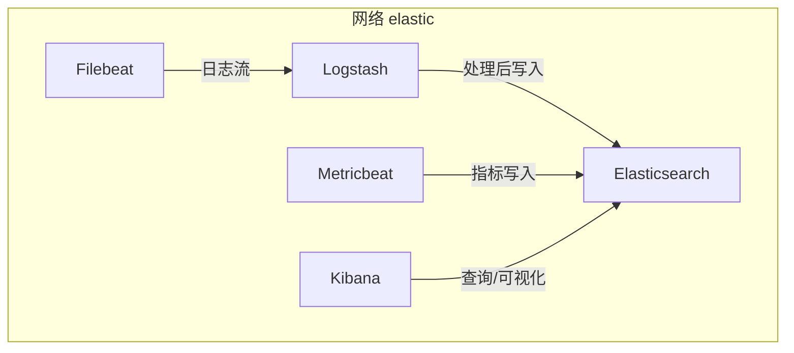
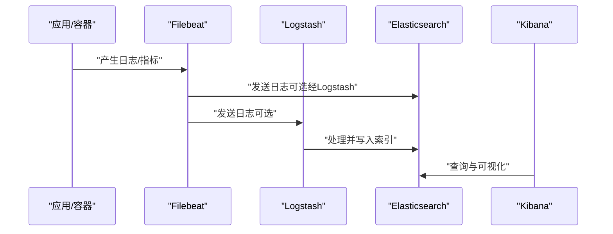
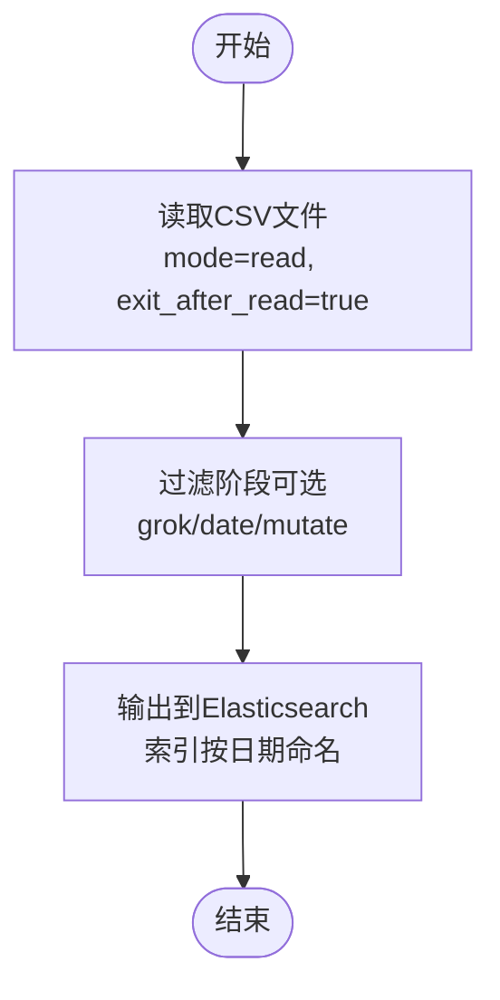
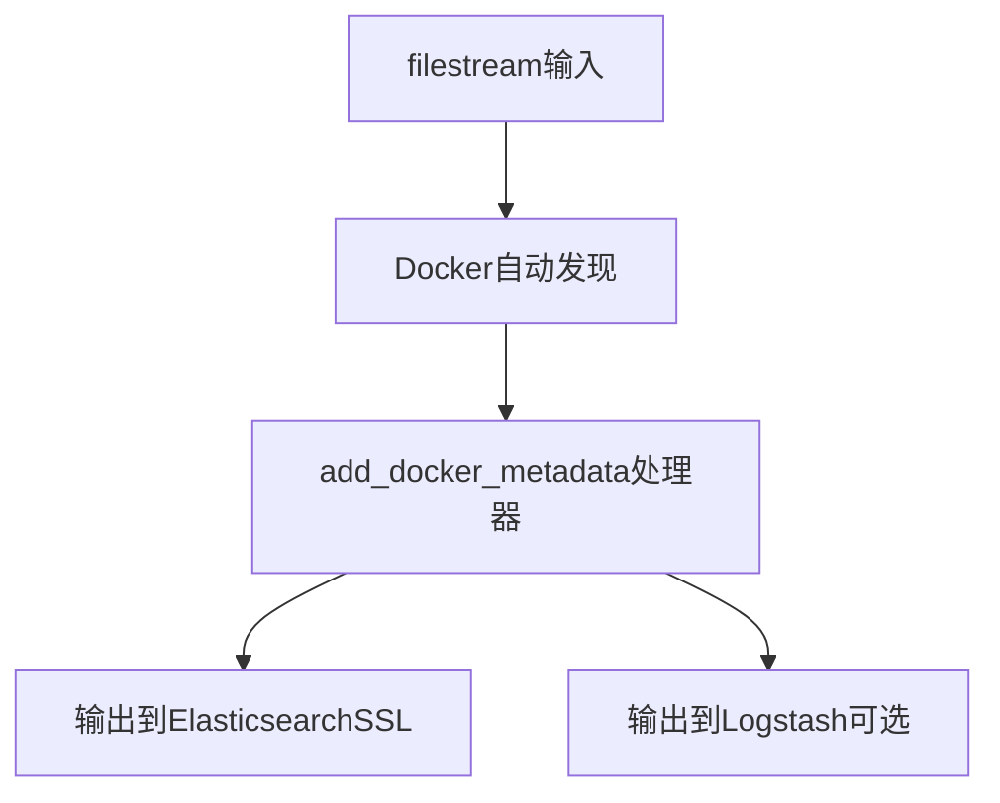
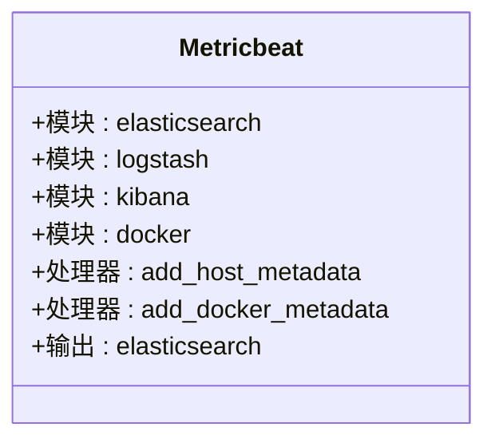
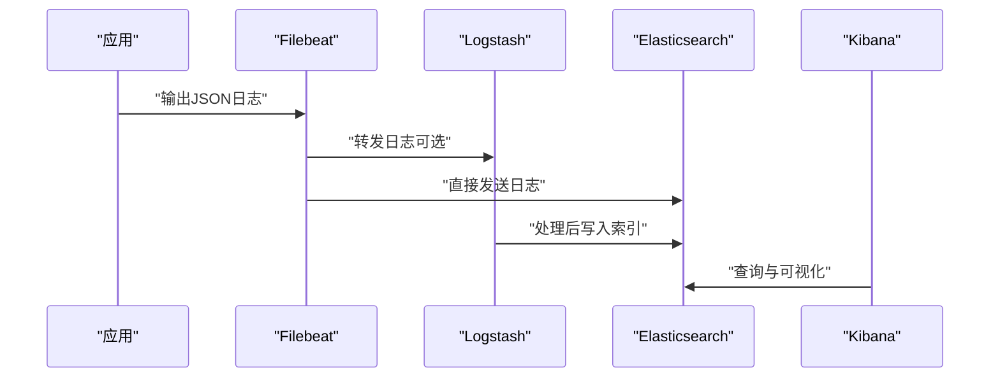
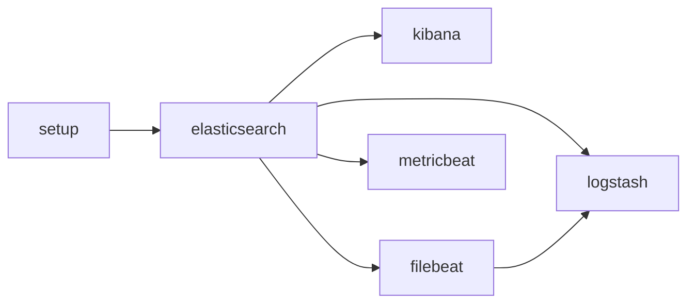

# ELK集群环境

<cite>
**本文引用的文件**
- [docker-compose.yml](file://docker-compose/elk-cluster/compose/docker-compose.yml)
- [logstash.conf](file://docker-compose/elk-cluster/logstash/logstash.conf)
- [filebeat.yml](file://docker-compose/elk-cluster/filebeat/filebeat.yml)
- [metricbeat.yml](file://docker-compose/elk-cluster/metricbeat/metricbeat.yml)
- [README.md](file://docker-compose/elk-cluster/README.md)
- [up.sh](file://docker-compose/elk-cluster/bin/up.sh)
- [down.sh](file://docker-compose/elk-cluster/bin/down.sh)
</cite>

## 目录
1. [简介](#简介)
2. [项目结构](#项目结构)
3. [核心组件](#核心组件)
4. [架构总览](#架构总览)
5. [详细组件分析](#详细组件分析)
6. [依赖关系分析](#依赖关系分析)
7. [性能考虑](#性能考虑)
8. [故障排查指南](#故障排查指南)
9. [结论](#结论)
10. [附录](#附录)

## 简介
本文件面向希望在容器环境中快速搭建并理解ELK（Elasticsearch、Logstash、Kibana）集群与Beats（Filebeat、Metricbeat）数据采集与监控体系的读者。文档基于仓库中的Compose编排与配置文件，系统阐述以下主题：
- Logstash日志处理管道：输入、过滤、输出配置要点，以及如何通过输入插件读取本地CSV文件并写入Elasticsearch索引。
- Filebeat日志采集器：filestream输入类型、Docker自动发现、元数据处理器及与Elasticsearch/Kibana的集成。
- Metricbeat指标监控器：模块化配置（Elasticsearch、Logstash、Kibana、Docker），指标收集与导出到Elasticsearch。
- 完整流水线示例：从应用日志生成、Filebeat采集、Logstash处理到Elasticsearch存储与可视化展示。
- 扩展性、性能优化与故障排查建议。

## 项目结构
该ELK集群采用Docker Compose进行编排，服务包括：
- setup：证书生成与初始化，完成CA与实例证书生成，并设置kibana_system用户密码。
- elasticsearch：单节点搜索与分析引擎，启用安全与SSL/TLS。
- kibana：可视化与管理界面，连接Elasticsearch。
- logstash：数据处理管道，读取本地CSV文件并写入Elasticsearch。
- filebeat：日志采集器，使用filestream输入与Docker自动发现，将日志发送至Elasticsearch或Logstash。
- metricbeat：指标采集器，通过模块采集系统与服务指标并发送至Elasticsearch。

图表来源
- [docker-compose.yml:1-202](file://docker-compose/elk-cluster/compose/docker-compose.yml#L1-L202)

章节来源
- [docker-compose.yml:1-202](file://docker-compose/elk-cluster/compose/docker-compose.yml#L1-L202)
- [README.md:1-352](file://docker-compose/elk-cluster/README.md#L1-L352)

## 核心组件
- Elasticsearch：提供分布式搜索与分析能力，启用安全认证与传输层加密，挂载证书、数据、日志与插件目录，健康检查确保可用性。
- Kibana：提供Web界面用于仪表盘、可视化与索引管理，连接Elasticsearch并启用加密密钥。
- Logstash：作为数据处理管道，读取本地CSV文件，按日期生成索引名称并写入Elasticsearch。
- Filebeat：使用filestream输入监听日志文件，结合Docker自动发现与元数据处理器，将日志转发至Elasticsearch或Logstash。
- Metricbeat：通过模块采集Elasticsearch、Logstash、Kibana与Docker指标，统一写入Elasticsearch。

章节来源
- [docker-compose.yml:56-128](file://docker-compose/elk-cluster/compose/docker-compose.yml#L56-L128)
- [logstash.conf:1-28](file://docker-compose/elk-cluster/logstash/logstash.conf#L1-L28)
- [filebeat.yml:1-26](file://docker-compose/elk-cluster/filebeat/filebeat.yml#L1-L26)
- [metricbeat.yml:1-61](file://docker-compose/elk-cluster/metricbeat/metricbeat.yml#L1-L61)

## 架构总览
下图展示了ELK与Beats在容器内的交互关系与数据流向：

图表来源
- [docker-compose.yml:130-196](file://docker-compose/elk-cluster/compose/docker-compose.yml#L130-L196)
- [filebeat.yml:1-26](file://docker-compose/elk-cluster/filebeat/filebeat.yml#L1-L26)
- [logstash.conf:1-28](file://docker-compose/elk-cluster/logstash/logstash.conf#L1-L28)

## 详细组件分析

### Logstash日志处理管道
- 输入插件：使用file输入插件读取指定目录下的CSV文件，设置mode为“read”，exit_after_read为true以支持一次性作业模式；文件完成后记录日志路径。
- 过滤阶段：当前配置中未定义过滤器，可扩展添加grok、date、mutate等过滤器实现结构化解析、时间戳规范化与字段映射。
- 输出插件：将处理结果写入Elasticsearch，索引名按日期动态生成，使用证书链进行TLS验证。

图表来源
- [logstash.conf:1-28](file://docker-compose/elk-cluster/logstash/logstash.conf#L1-L28)

章节来源
- [logstash.conf:1-28](file://docker-compose/elk-cluster/logstash/logstash.conf#L1-L28)

### Filebeat日志采集器
- 输入：filestream类型监听指定日志路径，支持多路径匹配；结合Docker自动发现（autodiscover）与hints.enabled启用容器元数据推断。
- 处理器：add_docker_metadata为事件注入Docker相关字段，便于后续过滤与可视化。
- 输出：可配置为直接发送至Elasticsearch（启用SSL与CA校验）或经由Logstash转发。

图表来源
- [filebeat.yml:1-26](file://docker-compose/elk-cluster/filebeat/filebeat.yml#L1-L26)

章节来源
- [filebeat.yml:1-26](file://docker-compose/elk-cluster/filebeat/filebeat.yml#L1-L26)

### Metricbeat指标监控器
- 模块配置：显式启用多个模块（elasticsearch、logstash、kibana、docker），设置周期、主机、认证与SSL参数。
- 处理器：add_host_metadata与add_docker_metadata增强事件上下文。
- 输出：将采集到的指标写入Elasticsearch，使用证书链进行TLS验证。

图表来源
- [metricbeat.yml:1-61](file://docker-compose/elk-cluster/metricbeat/metricbeat.yml#L1-L61)

章节来源
- [metricbeat.yml:1-61](file://docker-compose/elk-cluster/metricbeat/metricbeat.yml#L1-L61)

### 日志收集、处理、存储与可视化完整流水线
- 应用侧：通过标准输出或JSON格式日志输出，例如Python、Node.js、Java应用均可按示例方式输出结构化日志。
- Filebeat采集：filestream监听日志文件，自动发现容器元数据，发送至Elasticsearch或Logstash。
- Logstash处理：可选地对日志进行grok解析、日期标准化与字段映射，再写入Elasticsearch。
- 存储与可视化：Elasticsearch保存索引，Kibana进行查询、仪表盘与可视化。

图表来源
- [README.md:189-256](file://docker-compose/elk-cluster/README.md#L189-L256)
- [filebeat.yml:1-26](file://docker-compose/elk-cluster/filebeat/filebeat.yml#L1-L26)
- [logstash.conf:1-28](file://docker-compose/elk-cluster/logstash/logstash.conf#L1-L28)

章节来源
- [README.md:189-256](file://docker-compose/elk-cluster/README.md#L189-L256)

## 依赖关系分析
- 服务依赖：setup先于elasticsearch启动，elasticsearch与kibana先于logstash、filebeat、metricbeat启动，保证证书与安全配置就绪。
- 卷挂载：各服务均挂载证书、数据、日志与插件目录，确保持久化与跨主机访问（如/var/run/docker.sock）。
- 环境变量：通过环境变量传递用户名、密码、主机地址与端口，Logstash与Beats均使用证书链进行TLS验证。

图表来源
- [docker-compose.yml:56-196](file://docker-compose/elk-cluster/compose/docker-compose.yml#L56-L196)

章节来源
- [docker-compose.yml:56-196](file://docker-compose/elk-cluster/compose/docker-compose.yml#L56-L196)

## 性能考虑
- Elasticsearch优化：建议根据可用内存调整堆大小（不超过物理内存的一半且不超过最大限制），针对SSD优化存储类型，高吞吐场景下调大刷新间隔。
- Logstash调优：可通过增加pipeline.workers数量、增大batch.size与合理设置batch.delay提升吞吐。
- 资源限制：通过mem_limit控制容器内存上限，避免资源争用导致不稳定。
- 证书与网络：减少不必要的网络往返与证书校验开销，确保服务间通信稳定。

章节来源
- [README.md:314-337](file://docker-compose/elk-cluster/README.md#L314-L337)
- [docker-compose.yml:87-88](file://docker-compose/elk-cluster/compose/docker-compose.yml#L87-L88)

## 故障排查指南
- 常见问题：
  - 内存不足：适当提高ES/Kibana/Logstash的mem_limit。
  - SSL证书错误：确认setup服务已完成并生成证书，检查CA与实例证书路径。
  - 端口冲突：确保9200、5601、5044端口未被占用。
  - 权限问题：确认挂载卷权限正确，必要时修正属主与权限。
- 服务状态与日志：
  - 使用docker compose ps查看服务状态。
  - 使用docker compose logs <service>查看具体服务日志。
- 数据清理：
  - 停止服务并删除temp目录以重置数据（注意备份）。

章节来源
- [README.md:258-286](file://docker-compose/elk-cluster/README.md#L258-L286)
- [up.sh:1-32](file://docker-compose/elk-cluster/bin/up.sh#L1-L32)
- [down.sh:1-24](file://docker-compose/elk-cluster/bin/down.sh#L1-L24)

## 结论
本ELK集群通过Docker Compose实现了安全、可扩展的日志与指标采集、处理与可视化方案。Filebeat负责日志采集与元数据增强，Logstash提供灵活的数据处理能力，Metricbeat专注于系统与服务指标采集，Elasticsearch与Kibana构成强大的存储与可视化平台。结合合理的性能调优与完善的故障排查流程，可在生产环境中稳定运行并持续演进。

## 附录
- 快速启动与访问：
  - 启动：执行启动脚本，访问Kibana Web界面与Elasticsearch API。
  - 访问信息与凭据详见README中的服务列表与登录信息。
- 数据持久化：
  - 所有服务的数据目录位于temp/下对应子目录，便于备份与迁移。
- 自定义模板与仪表盘：
  - 可通过REST接口创建自定义索引模板，并在Kibana中导入/创建仪表盘。

章节来源
- [README.md:102-158](file://docker-compose/elk-cluster/README.md#L102-L158)
- [up.sh:19-31](file://docker-compose/elk-cluster/bin/up.sh#L19-L31)