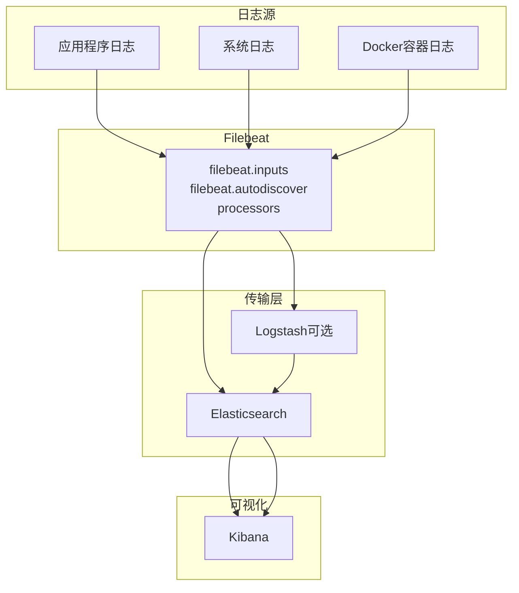
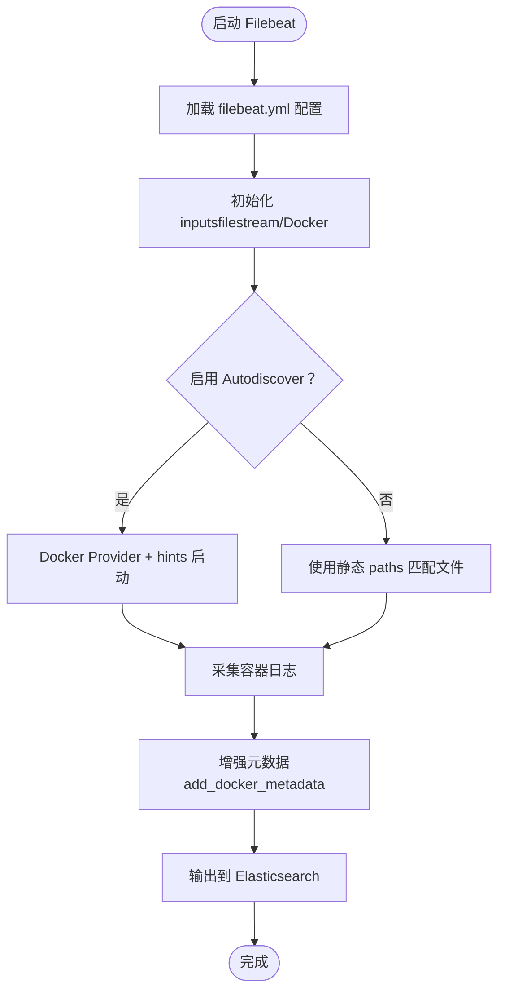
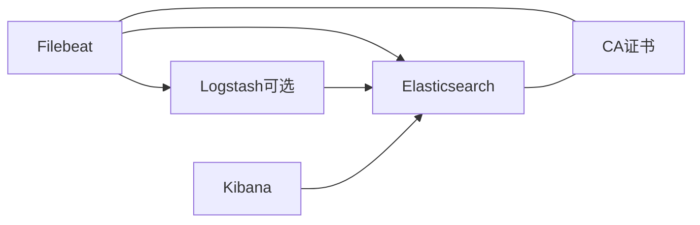

# Filebeat数据采集器

<cite>
**本文档引用的文件**
- [filebeat.yml](file://docker-compose/elk-cluster/filebeat/filebeat.yml)
- [docker-compose.yml](file://docker-compose/elk-cluster/compose/docker-compose.yml)
- [logstash.conf](file://docker-compose/elk-cluster/logstash/logstash.conf)
- [metricbeat.yml](file://docker-compose/elk-cluster/metricbeat/metricbeat.yml)
- [README.md](file://docker-compose/elk-cluster/README.md)
</cite>

## 目录
1. [简介](#简介)
2. [项目结构](#项目结构)
3. [核心组件](#核心组件)
4. [架构总览](#架构总览)
5. [详细组件分析](#详细组件分析)
6. [依赖关系分析](#依赖关系分析)
7. [性能考虑](#性能考虑)
8. [故障排查指南](#故障排查指南)
9. [结论](#结论)
10. [附录](#附录)

## 简介
本文件围绕仓库中基于ELK栈（Elasticsearch、Logstash、Kibana）的Filebeat数据采集器进行系统性说明，重点涵盖：
- Filebeat作为轻量级日志收集器的工作原理与架构设计
- filebeat.yml配置文件的结构与关键配置项（inputs、autodiscover、processors、output等）
- Filebeat支持的输入源（日志文件、Docker容器日志等）及其配置方法
- Filebeat的模块化能力（通过Autodiscover与Docker集成实现动态发现）
- Shipper模式与数据传输机制（与Elasticsearch的连接配置）
- 实际日志采集示例（Docker容器日志、应用程序日志、系统日志）
- 性能调优、故障排查与最佳实践建议

## 项目结构
该仓库提供了一个完整的ELK集群部署示例，其中Filebeat作为日志采集组件之一，配合Logstash、Elasticsearch、Kibana共同工作。Filebeat配置位于独立的compose目录下，并通过Docker卷挂载方式与宿主机共享数据目录。

```mermaid
graph TB
subgraph "Filebeat容器"
FB_CFG["filebeat.yml<br/>配置文件"]
FB_VOL["/usr/share/filebeat/ingest_data/<br/>采集数据目录"]
FB_CERT["/usr/share/filebeat/certs/<br/>证书目录"]
FB_DATA["/usr/share/filebeat/data/<br/>持久化数据目录"]
end
subgraph "Logstash容器"
LS_CONF["pipeline/logstash.conf<br/>管道配置"]
LS_INGEST["/usr/share/logstash/ingest_data/<br/>采集数据目录"]
LS_CERT["/usr/share/logstash/certs/<br/>证书目录"]
LS_DATA["/usr/share/logstash/data/<br/>持久化数据目录"]
end
subgraph "Elasticsearch容器"
ES_CERT["/usr/share/elasticsearch/config/certs/<br/>证书目录"]
ES_DATA["/usr/share/elasticsearch/data/<br/>数据目录"]
ES_LOGS["/usr/share/elasticsearch/logs/<br/>日志目录"]
ES_PLUGINS["/usr/share/elasticsearch/plugins/<br/>插件目录"]
end
subgraph "Kibana容器"
KB_CERT["/usr/share/kibana/config/certs/<br/>证书目录"]
KB_DATA["/usr/share/kibana/data/<br/>数据目录"]
end
subgraph "宿主机"
HOST_VOL["temp/filebeat/data/<br/>宿主机持久化目录"]
HOST_INGEST["filebeat/ingest-data/<br/>宿主机采集目录"]
HOST_CERT["temp/certs/<br/>宿主机证书目录"]
end
FB_CFG --> FB_VOL
FB_VOL --- HOST_INGEST
FB_VOL --- HOST_VOL
FB_CERT --- HOST_CERT
FB_DATA --- HOST_VOL
LS_CONF --> LS_INGEST
LS_INGEST --- HOST_INGEST
LS_CERT --- HOST_CERT
LS_DATA --- HOST_VOL
ES_CERT --- HOST_CERT
ES_DATA --- HOST_VOL
ES_LOGS --- HOST_VOL
ES_PLUGINS --- HOST_VOL
KB_CERT --- HOST_CERT
KB_DATA --- HOST_VOL
```

图表来源
- [docker-compose.yml:155-176](file://docker-compose/elk-cluster/compose/docker-compose.yml#L155-L176)
- [filebeat.yml:1-26](file://docker-compose/elk-cluster/filebeat/filebeat.yml#L1-L26)
- [logstash.conf:1-28](file://docker-compose/elk-cluster/logstash/logstash.conf#L1-L28)

章节来源
- [docker-compose.yml:155-176](file://docker-compose/elk-cluster/compose/docker-compose.yml#L155-L176)
- [README.md:82-101](file://docker-compose/elk-cluster/README.md#L82-L101)

## 核心组件
- Filebeat：轻量级日志采集器，负责从文件或Docker容器中收集日志，并转发到Elasticsearch或Logstash。
- Logstash：可选的数据处理管道，用于过滤、转换和丰富日志数据后写入Elasticsearch。
- Elasticsearch：分布式搜索与分析引擎，存储并索引日志数据。
- Kibana：可视化与管理界面，用于展示日志与指标。
- Metricbeat：系统与服务指标采集器（在本项目中用于监控），与Filebeat同属Beats家族。

章节来源
- [README.md:1-17](file://docker-compose/elk-cluster/README.md#L1-L17)
- [metricbeat.yml:1-61](file://docker-compose/elk-cluster/metricbeat/metricbeat.yml#L1-L61)

## 架构总览
Filebeat在本项目中的角色是“Shipper”，直接将采集到的日志发送至Elasticsearch；同时，Logstash作为可选的中间处理层，也可接收Filebeat或其它来源的日志数据。整体架构如下：

图表来源
- [filebeat.yml:1-26](file://docker-compose/elk-cluster/filebeat/filebeat.yml#L1-L26)
- [logstash.conf:1-28](file://docker-compose/elk-cluster/logstash/logstash.conf#L1-L28)
- [docker-compose.yml:155-176](file://docker-compose/elk-cluster/compose/docker-compose.yml#L155-L176)

## 详细组件分析

### Filebeat配置文件结构与作用
- inputs：定义采集输入源，如文件流（filestream）类型，指定日志路径。
- autodiscover：启用Docker Provider，结合hints自动发现容器日志并建立采集任务。
- processors：对采集到的事件进行增强，例如添加Docker元数据。
- setup.kibana：初始化Kibana索引模板（需Kibana可用时执行）。
- output.elasticsearch：配置输出目标为Elasticsearch，含认证与TLS证书设置。

章节来源
- [filebeat.yml:1-26](file://docker-compose/elk-cluster/filebeat/filebeat.yml#L1-L26)

### 输入源与采集策略
- 文件输入（filestream）：通过paths匹配日志文件，适用于静态文件采集场景。
- Docker自动发现：启用Docker Provider并开启hints，使Filebeat能够动态识别容器日志并建立采集任务。
- Docker元数据增强：通过add_docker_metadata处理器将容器信息注入事件字段。

章节来源
- [filebeat.yml:1-26](file://docker-compose/elk-cluster/filebeat/filebeat.yml#L1-L26)

### 数据传输机制与连接配置
- 输出到Elasticsearch：使用output.elasticsearch配置hosts、用户名密码及TLS证书链。
- TLS安全传输：通过ssl.enabled与ssl.certificate_authorities确保加密通信。
- 环境变量注入：通过Docker环境变量传递主机地址、用户凭据等敏感信息，避免硬编码。

章节来源
- [filebeat.yml:20-26](file://docker-compose/elk-cluster/filebeat/filebeat.yml#L20-L26)
- [docker-compose.yml:168-175](file://docker-compose/elk-cluster/compose/docker-compose.yml#L168-L175)

### 与Logstash的协作（可选）
- Logstash配置采用file输入插件，支持mode、exit_after_read、file_completed_*等参数，适合批处理或一次性读取场景。
- 输出到Elasticsearch：通过output.elasticsearch配置hosts、用户、密码与CA证书。

章节来源
- [logstash.conf:1-28](file://docker-compose/elk-cluster/logstash/logstash.conf#L1-L28)

### 模块化与动态发现
- Autodiscover：通过providers与hints实现容器日志的自动发现与采集，无需手动维护静态配置。
- Docker Provider：结合Docker Socket与容器标签，自动匹配日志路径并建立采集任务。
- 元数据增强：add_docker_metadata处理器将容器名称、镜像、网络等信息附加到事件中，便于后续查询与可视化。

章节来源
- [filebeat.yml:7-13](file://docker-compose/elk-cluster/filebeat/filebeat.yml#L7-L13)
- [docker-compose.yml:160-167](file://docker-compose/elk-cluster/compose/docker-compose.yml#L160-L167)

### 实际采集示例

#### Docker容器日志采集
- 配置要点：启用Docker Provider与hints，挂载/var/lib/docker/containers与/var/run/docker.sock，使Filebeat能读取容器日志并获取容器元数据。
- 数据流向：容器标准输出/错误日志经Filebeat采集后写入Elasticsearch。

章节来源
- [filebeat.yml:7-13](file://docker-compose/elk-cluster/filebeat/filebeat.yml#L7-L13)
- [docker-compose.yml:160-167](file://docker-compose/elk-cluster/compose/docker-compose.yml#L160-L167)

#### 应用程序日志采集
- 静态文件采集：通过filebeat.inputs配置filestream类型与paths，指向应用程序产生的日志文件。
- 动态容器采集：结合Autodiscover，无需修改配置即可覆盖新增容器的日志采集。

章节来源
- [filebeat.yml:1-6](file://docker-compose/elk-cluster/filebeat/filebeat.yml#L1-L6)
- [filebeat.yml:7-13](file://docker-compose/elk-cluster/filebeat/filebeat.yml#L7-L13)

#### 系统日志采集
- 建议：将系统日志目录映射到Filebeat容器内，或通过Autodiscover自动发现容器内的系统日志文件。
- 安全：确保Filebeat容器具备读取权限，并启用TLS与认证以保护传输安全。

章节来源
- [filebeat.yml:1-6](file://docker-compose/elk-cluster/filebeat/filebeat.yml#L1-L6)
- [filebeat.yml:20-26](file://docker-compose/elk-cluster/filebeat/filebeat.yml#L20-L26)

### 关键流程图：Filebeat采集与转发

图表来源
- [filebeat.yml:1-26](file://docker-compose/elk-cluster/filebeat/filebeat.yml#L1-L26)

## 依赖关系分析
- Filebeat依赖于Elasticsearch作为输出目标，且通过环境变量注入主机地址与凭据。
- Filebeat与Logstash之间存在可选的转发关系，取决于具体部署需求。
- Docker环境要求：需要挂载/var/lib/docker/containers与/var/run/docker.sock，以便读取容器日志与元数据。
- 证书与安全：Elasticsearch与Kibana均启用了SSL/TLS，Filebeat通过CA证书验证与TLS加密传输。

图表来源
- [docker-compose.yml:155-176](file://docker-compose/elk-cluster/compose/docker-compose.yml#L155-L176)
- [filebeat.yml:20-26](file://docker-compose/elk-cluster/filebeat/filebeat.yml#L20-L26)

章节来源
- [docker-compose.yml:155-176](file://docker-compose/elk-cluster/compose/docker-compose.yml#L155-L176)
- [filebeat.yml:20-26](file://docker-compose/elk-cluster/filebeat/filebeat.yml#L20-L26)

## 性能考虑
- 资源限制：通过mem_limit与ulimits控制容器内存与锁页，避免交换导致性能下降。
- TLS开销：启用SSL/TLS会增加CPU消耗，建议在高吞吐场景下优化证书链与连接复用。
- 批处理与缓冲：合理设置批量大小与延迟，平衡延迟与吞吐。
- 存储与IO：将数据目录挂载到高性能磁盘，减少IO瓶颈。
- 并发与线程：根据CPU核数调整worker数量，提升并发处理能力。

章节来源
- [docker-compose.yml:87-92](file://docker-compose/elk-cluster/compose/docker-compose.yml#L87-L92)
- [README.md:314-336](file://docker-compose/elk-cluster/README.md#L314-L336)

## 故障排查指南
- 服务状态检查：使用docker-compose ps查看各服务健康状态，使用docker-compose logs定位异常。
- 权限问题：确认挂载卷权限正确，特别是/var/run/docker.sock与/var/lib/docker/containers。
- 端口冲突：确保宿主机端口未被占用（如9200、5601、5044）。
- SSL证书：若出现证书相关错误，确认CA证书路径与内容正确，且Filebeat与Elasticsearch/Kibana的证书一致。
- 认证失败：核对用户名与密码是否与Elasticsearch/Kibana配置一致。
- 数据持久化：若重启后数据丢失，检查挂载的temp目录是否存在与权限是否正确。

章节来源
- [README.md:258-286](file://docker-compose/elk-cluster/README.md#L258-L286)

## 结论
本仓库提供了基于Docker Compose的完整ELK集群部署方案，其中Filebeat作为轻量级日志采集器，通过Autodiscover与Docker集成实现了容器日志的自动化采集，并通过Elasticsearch完成统一存储与检索。结合Logstash可实现更灵活的数据处理与转换。通过合理的资源配置、安全与性能优化，可在生产环境中稳定运行。

## 附录

### 配置项速查表
- inputs.filestream.paths：指定要采集的日志文件路径模式
- autodiscover.providers：启用Docker Provider并开启hints
- processors.add_docker_metadata：为事件添加Docker元数据
- output.elasticsearch.hosts：Elasticsearch主机列表
- output.elasticsearch.username/password：认证凭据
- output.elasticsearch.ssl.enabled：启用TLS
- output.elasticsearch.ssl.certificate_authorities：CA证书路径

章节来源
- [filebeat.yml:1-26](file://docker-compose/elk-cluster/filebeat/filebeat.yml#L1-L26)

### 环境变量一览
- ELASTIC_USER/ELASTIC_PASSWORD：Elasticsearch访问凭据
- ELASTIC_HOSTS：Elasticsearch主机地址
- KIBANA_HOSTS：Kibana主机地址
- LOGSTASH_HOSTS：Logstash主机地址

章节来源
- [docker-compose.yml:168-175](file://docker-compose/elk-cluster/compose/docker-compose.yml#L168-L175)