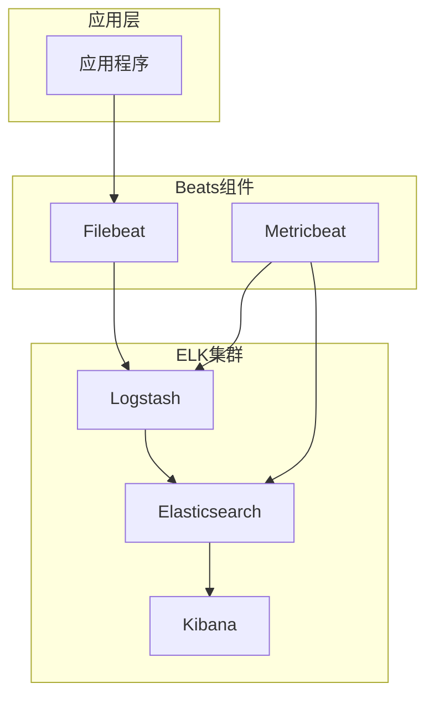
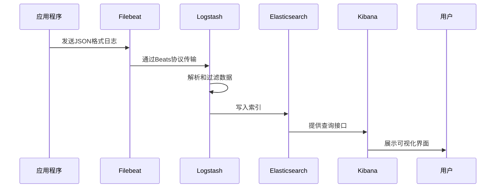
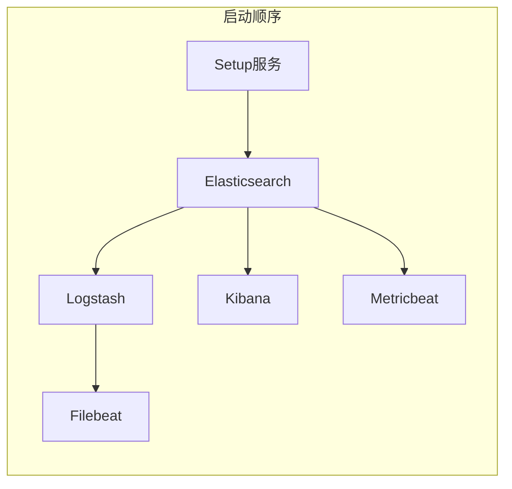
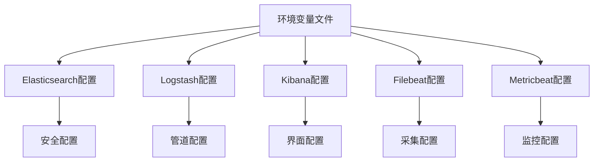
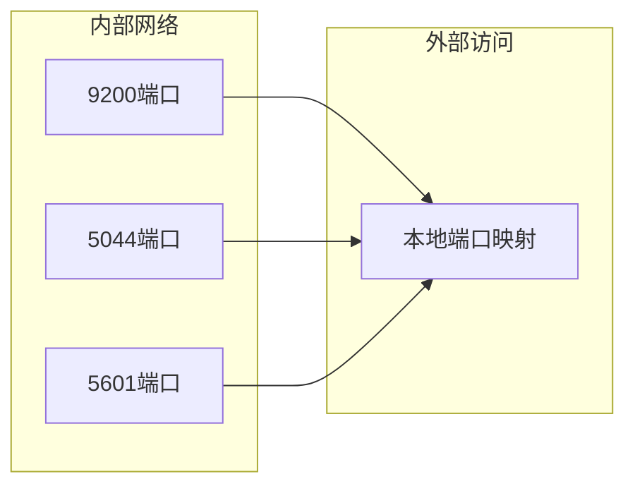
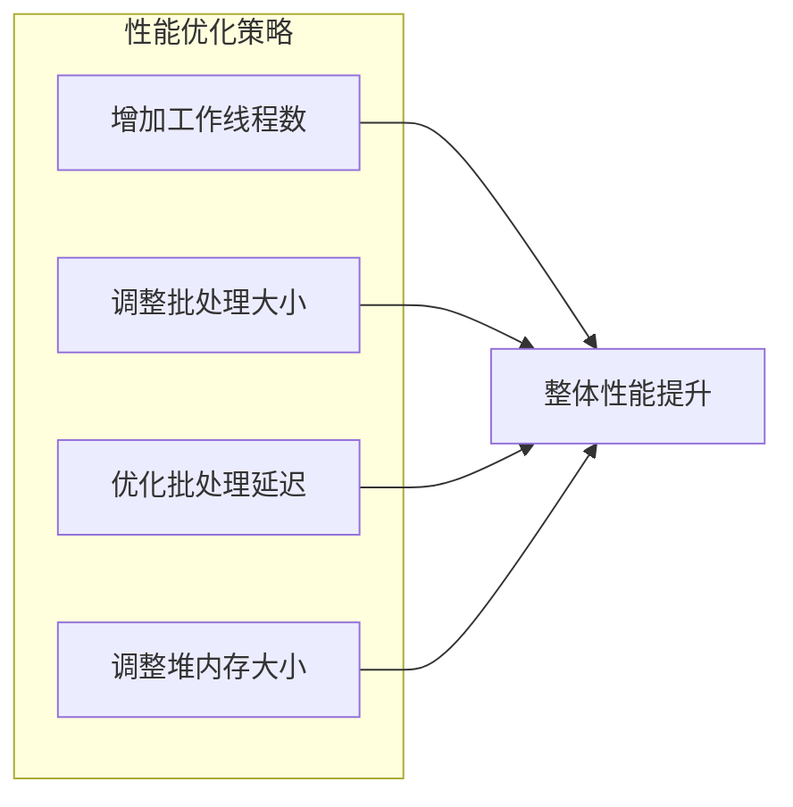
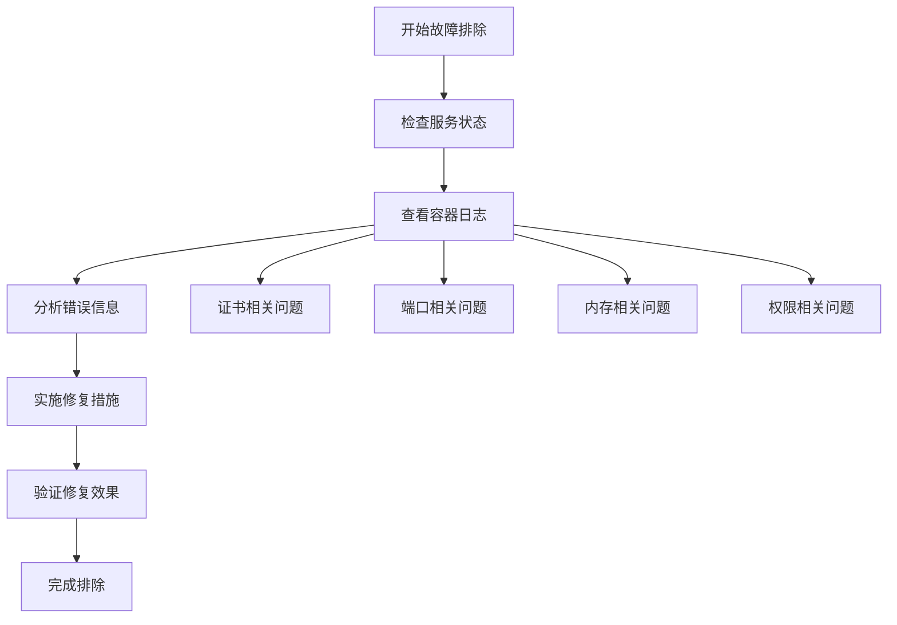

# Logstash日志处理管道

<cite>
**本文档引用的文件**
- [logstash.conf](file://docker-compose/elk-cluster/logstash/logstash.conf)
- [README.md](file://docker-compose/elk-cluster/README.md)
- [filebeat.yml](file://docker-compose/elk-cluster/filebeat/filebeat.yml)
- [docker-compose.yml](file://docker-compose/elk-cluster/compose/docker-compose.yml)
</cite>

## 目录
1. [简介](#简介)
2. [项目结构](#项目结构)
3. [核心组件](#核心组件)
4. [架构概览](#架构概览)
5. [详细组件分析](#详细组件分析)
6. [依赖关系分析](#依赖关系分析)
7. [性能考虑](#性能考虑)
8. [故障排除指南](#故障排除指南)
9. [结论](#结论)

## 简介

本项目提供了一个完整的ELK（Elasticsearch、Logstash、Kibana）日志处理管道解决方案，专注于容器化部署和生产环境优化。该系统实现了从日志收集、处理到存储的完整流水线，支持多种输入源和输出目标，具备高可用性和安全性特性。

ELK Stack集群部署包含了安全功能，提供全面的日志聚合、搜索和可视化能力。系统集成了Beats组件用于数据收集和监控，支持实时日志处理和数据转换增强。

## 项目结构

该项目采用Docker Compose进行多服务编排，主要包含以下核心组件：



**图表来源**
- [docker-compose.yml:177-196](file://docker-compose/elk-cluster/compose/docker-compose.yml#L177-L196)

**章节来源**
- [docker-compose.yml:1-202](file://docker-compose/elk-cluster/compose/docker-compose.yml#L1-202)
- [README.md:1-352](file://docker-compose/elk-cluster/README.md#L1-L352)

## 核心组件

### Logstash配置文件结构

Logstash配置文件采用Ruby风格语法，主要包含三个核心部分：

#### 输入(input)部分
负责从各种数据源接收日志数据：
- 支持文件输入、网络输入等多种数据源
- 配置文件监控模式和完成动作
- 自动备份和日志记录机制

#### 过滤(filter)部分  
负责对原始数据进行转换和增强：
- 字段提取和解析
- 数据类型转换
- 地理位置信息解析
- 时间戳处理

#### 输出(output)部分
负责将处理后的数据发送到目标存储：
- Elasticsearch集成
- 安全认证配置
- SSL证书验证

**章节来源**
- [logstash.conf:1-27](file://docker-compose/elk-cluster/logstash/logstash.conf#L1-L27)

### Beats组件集成

系统集成了多个Beats组件以实现全面的数据收集：

#### Filebeat配置
- 文件流式监控和Docker自动发现
- 动态元数据添加
- 安全连接配置

#### Metricbeat配置
- 系统指标收集
- Docker容器监控
- Elasticsearch集群状态监控

**章节来源**
- [filebeat.yml:1-26](file://docker-compose/elk-cluster/filebeat/filebeat.yml#L1-L26)

## 架构概览

整个日志处理管道采用分层架构设计，确保了系统的可扩展性和可靠性：



**图表来源**
- [docker-compose.yml:155-175](file://docker-compose/elk-cluster/compose/docker-compose.yml#L155-L175)
- [README.md:131-139](file://docker-compose/elk-cluster/README.md#L131-L139)

### 服务依赖关系



**图表来源**
- [docker-compose.yml:2-50](file://docker-compose/elk-cluster/compose/docker-compose.yml#L2-L50)

## 详细组件分析

### Logstash输入插件分析

当前配置使用文件输入插件作为主要数据源：

#### 文件输入配置特点
- **读取模式**: 使用"read"模式处理已完成文件
- **路径监控**: 监控CSV文件格式
- **自动退出**: 处理完成后自动退出
- **完成动作**: 记录处理完成的日志

#### 配置参数详解

| 参数名称 | 默认值 | 作用描述 |
|---------|--------|----------|
| mode | tail | 文件监控模式，支持tail和read |
| path | - | 要监控的文件路径模式 |
| exit_after_read | false | 读取完成后是否退出 |
| file_completed_action | - | 文件处理完成时的动作 |
| file_completed_log_path | - | 完成日志的输出路径 |

**章节来源**
- [logstash.conf:1-14](file://docker-compose/elk-cluster/logstash/logstash.conf#L1-L14)

### 过滤器插件配置

虽然当前配置中过滤器部分为空，但系统为后续扩展预留了完整的配置框架：

#### 常用过滤器插件推荐

##### Grok过滤器
用于解析非结构化日志数据为结构化字段：

```ruby
filter {
  grok {
    match => { "message" => "%{TIMESTAMP_ISO8601:timestamp} %{LOGLEVEL:level} %{GREEDYDATA:message}" }
  }
}
```

##### Date过滤器  
处理时间戳字段转换：

```ruby
filter {
  date {
    match => [ "timestamp", "yyyy-MM-dd HH:mm:ss.SSS" ]
    target => "@timestamp"
  }
}
```

##### Mutate过滤器
执行字段操作和数据转换：

```ruby
filter {
  mutate {
    convert => { "field_name" => "integer" }
    rename => { "old_name" => "new_name" }
    add_field => { "field_name" => "value" }
  }
}
```

##### GeoIP过滤器
解析IP地址为地理位置信息：

```ruby
filter {
  geoip {
    source => "client_ip"
    target => "geoip"
    database => "/usr/share/GeoIP/GeoLite2-City.mmdb"
  }
}
```

### 输出插件配置

Elasticsearch输出插件提供了完整的配置选项：

#### 安全连接配置
- **主机配置**: 支持多个Elasticsearch节点
- **认证机制**: 用户名密码认证
- **SSL加密**: 完整的TLS证书验证
- **证书管理**: 自动化的CA证书配置

#### 索引管理
- **动态索引**: 基于日期的索引命名
- **自动创建**: 索引模板自动创建
- **生命周期**: 支持索引生命周期管理

**章节来源**
- [logstash.conf:19-27](file://docker-compose/elk-cluster/logstash/logstash.conf#L19-L27)

## 依赖关系分析

### 环境变量管理

系统通过环境变量实现配置的集中管理：



**图表来源**
- [docker-compose.yml:50-86](file://docker-compose/elk-cluster/compose/docker-compose.yml#L50-L86)

### 服务间通信



**图表来源**
- [docker-compose.yml:68-113](file://docker-compose/elk-cluster/compose/docker-compose.yml#L68-L113)

**章节来源**
- [docker-compose.yml:50-128](file://docker-compose/elk-cluster/compose/docker-compose.yml#L50-L128)

## 性能考虑

### 内存配置优化

系统为各组件设置了合理的内存限制：

| 组件 | 内存限制 | 建议用途 |
|------|----------|----------|
| Elasticsearch | 1GB | 搜索和分析引擎 |
| Kibana | 1GB | 可视化界面 |
| Logstash | 1GB | 日志处理管道 |

### 管道性能调优



**章节来源**
- [README.md:329-336](file://docker-compose/elk-cluster/README.md#L329-L336)

### 存储和持久化

系统实现了完整的数据持久化策略：

- **证书存储**: SSL证书的安全管理
- **索引数据**: Elasticsearch集群数据持久化
- **日志文件**: 各组件运行日志保存
- **插件目录**: Elasticsearch插件持久化

**章节来源**
- [README.md:139-158](file://docker-compose/elk-cluster/README.md#L139-L158)

## 故障排除指南

### 常见问题诊断

#### SSL证书问题
- 确保Setup服务成功完成
- 检查证书文件权限
- 验证证书有效期

#### 端口冲突
- 检查9200、5601、5044端口占用情况
- 修改环境变量中的端口号
- 清理相关进程

#### 权限问题
- 确保挂载卷的正确权限
- 检查用户ID映射
- 验证SELinux设置

### 日志收集和分析



**章节来源**
- [README.md:258-286](file://docker-compose/elk-cluster/README.md#L258-L286)

### 数据重置流程

当需要完全重置环境时，可以按照以下步骤操作：

1. 停止所有服务
2. 删除持久化数据目录
3. 重新启动服务
4. 等待初始化完成

**章节来源**
- [README.md:279-286](file://docker-compose/elk-cluster/README.md#L279-L286)

## 结论

本ELK日志处理管道提供了一个完整、安全且可扩展的日志管理解决方案。通过容器化部署，系统具备了良好的可移植性和一致性。主要优势包括：

- **安全性**: 完整的SSL/TLS加密和用户认证
- **可扩展性**: 支持水平扩展和负载均衡
- **易用性**: 简化的配置管理和自动化部署
- **可观测性**: 全面的监控和日志记录

对于生产环境部署，建议根据实际需求调整内存配置、优化管道性能，并建立完善的数据备份和恢复策略。同时，定期更新安全证书和监控系统健康状况，确保日志处理管道的稳定运行。