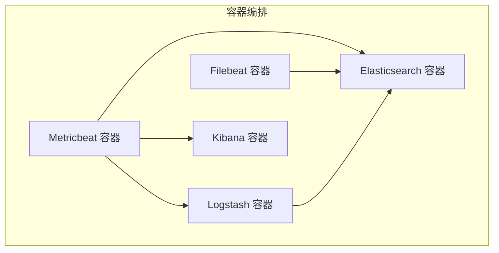
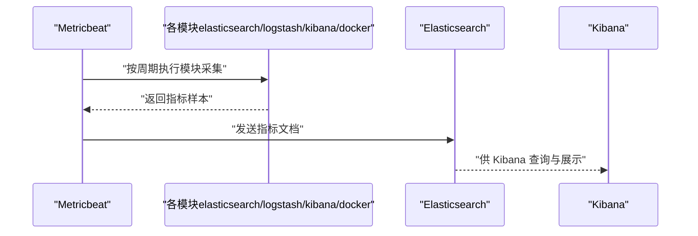
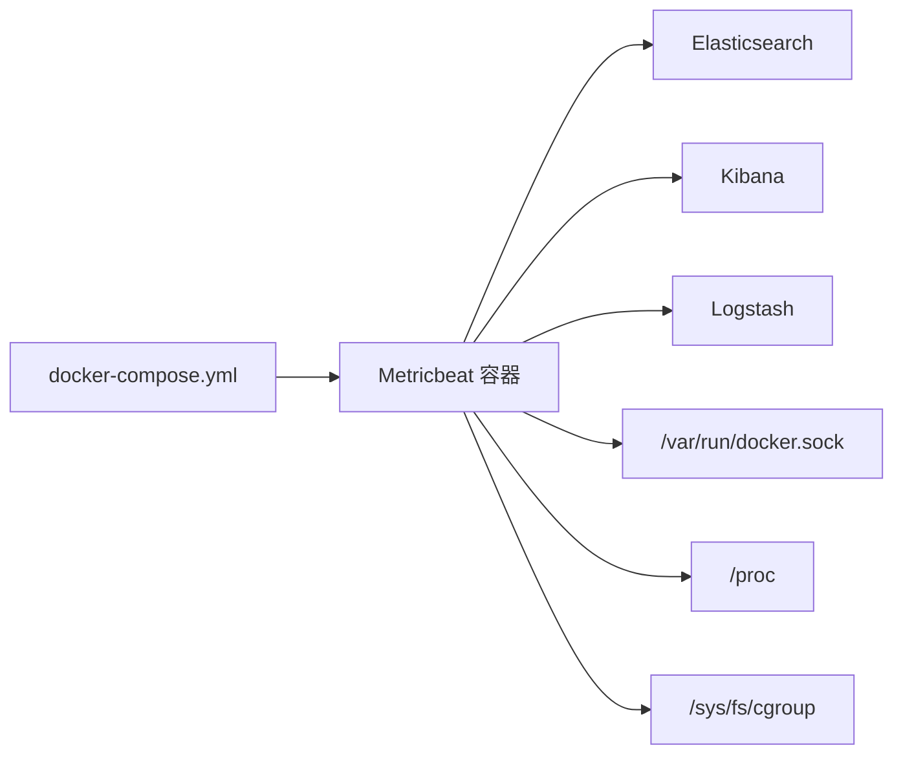

# Metricbeat指标监控

<cite>
**本文引用的文件**
- [metricbeat.yml](file://docker-compose/elk-cluster/metricbeat/metricbeat.yml)
- [docker-compose.yml（ELK 集群）](file://docker-compose/elk-cluster/compose/docker-compose.yml)
- [README.md（ELK 集群）](file://docker-compose/elk-cluster/README.md)
- [filebeat.yml](file://docker-compose/elk-cluster/filebeat/filebeat.yml)
- [logstash.conf](file://docker-compose/elk-cluster/logstash/logstash.conf)
</cite>

## 目录
1. [简介](#简介)
2. [项目结构](#项目结构)
3. [核心组件](#核心组件)
4. [架构总览](#架构总览)
5. [详细组件分析](#详细组件分析)
6. [依赖关系分析](#依赖关系分析)
7. [性能考虑](#性能考虑)
8. [故障排查指南](#故障排查指南)
9. [结论](#结论)
10. [附录](#附录)

## 简介
本文件围绕仓库中提供的 Metricbeat 指标监控配置进行系统化说明，重点覆盖以下方面：
- Metricbeat 作为轻量级指标收集器的功能定位与监控范围
- metricbeat.yml 的结构与关键配置项解析（模块启用、周期控制、认证与安全）
- 支持的监控模块（如 elasticsearch、logstash、kibana、docker）及其配置要点
- 指标采集机制（系统资源、容器指标、应用性能指标）与输出目标（Elasticsearch）
- 与 Elastic Stack 的集成方式（数据导出、可视化与仪表盘）
- 完整监控配置示例（Docker 环境、Kubernetes 场景提示、云服务监控思路）
- 指标解读、告警配置与性能优化建议

## 项目结构
本仓库提供了基于 Docker Compose 的 ELK 集群部署，其中包含 Metricbeat、Filebeat、Logstash、Elasticsearch 和 Kibana。Metricbeat 的配置位于 elk-cluster 子目录下，通过挂载配置文件与 Docker Socket 实现对宿主机与容器的指标采集。

图表来源
- [docker-compose.yml（ELK 集群）:130-154](file://docker-compose/elk-cluster/compose/docker-compose.yml#L130-L154)

章节来源
- [README.md（ELK 集群）:1-352](file://docker-compose/elk-cluster/README.md#L1-L352)
- [docker-compose.yml（ELK 集群）:1-202](file://docker-compose/elk-cluster/compose/docker-compose.yml#L1-L202)

## 核心组件
- Metricbeat：负责从多个模块采集指标，并将结果输出至 Elasticsearch；在本配置中启用了 elasticsearch、logstash、kibana、docker 四个模块。
- Elasticsearch：作为后端存储与检索中心，接收来自 Metricbeat 的指标数据。
- Kibana：用于可视化与仪表盘管理，可直接消费 Elasticsearch 中的指标索引。
- Filebeat：负责日志采集与转发，与 Metricbeat 协同工作。
- Logstash：作为数据处理管道，可与 Filebeat 或 Metricbeat 输出配合使用。

章节来源
- [metricbeat.yml:1-61](file://docker-compose/elk-cluster/metricbeat/metricbeat.yml#L1-L61)
- [docker-compose.yml（ELK 集群）:130-154](file://docker-compose/elk-cluster/compose/docker-compose.yml#L130-L154)
- [README.md（ELK 集群）:167-186](file://docker-compose/elk-cluster/README.md#L167-L186)

## 架构总览
Metricbeat 在容器内以 root 权限运行，挂载了 Docker Socket、/proc、/sys/fs/cgroup 等路径以便采集系统与容器指标。其配置文件通过只读挂载的方式注入容器，同时输出到 Elasticsearch 并可访问 Kibana 进行可视化。

图表来源
- [metricbeat.yml:9-61](file://docker-compose/elk-cluster/metricbeat/metricbeat.yml#L9-L61)
- [docker-compose.yml（ELK 集群）:130-154](file://docker-compose/elk-cluster/compose/docker-compose.yml#L130-L154)

## 详细组件分析

### Metricbeat 配置文件结构与关键项
- 模块配置入口
  - 使用 path 引入 modules.d 下的模块定义，reload.enabled 控制是否自动重载。
  - autodiscover.providers 明确禁用自动发现，仅使用显式定义的模块。
- 模块定义
  - elasticsearch：周期性拉取集群状态与节点指标，启用 SSL 并使用证书链进行双向校验。
  - logstash：周期性拉取 Logstash API 指标。
  - kibana：周期性拉取 Kibana 统计信息。
  - docker：通过 Unix Socket 采集容器运行时指标（容器、CPU、磁盘 IO、内存、网络等），并启用 Docker 元数据处理器。
- 处理器
  - add_host_metadata：为事件补充主机元数据。
  - add_docker_metadata：为事件补充容器元数据。
- 输出
  - 输出到 Elasticsearch，启用 SSL 并使用证书链进行 TLS 校验。

章节来源
- [metricbeat.yml:1-61](file://docker-compose/elk-cluster/metricbeat/metricbeat.yml#L1-L61)

### 模块详解与配置要点

#### Elasticsearch 模块
- 功能：采集 Elasticsearch 集群与节点指标，便于评估索引性能、节点健康度与资源占用。
- 关键点：使用 HTTPS、证书链校验、用户名密码认证、周期性采集。

章节来源
- [metricbeat.yml:10-20](file://docker-compose/elk-cluster/metricbeat/metricbeat.yml#L10-L20)

#### Logstash 模块
- 功能：采集 Logstash 的运行时指标，辅助诊断处理管道性能瓶颈。
- 关键点：HTTP 访问 API，周期性采集。

章节来源
- [metricbeat.yml:21-25](file://docker-compose/elk-cluster/metricbeat/metricbeat.yml#L21-L25)

#### Kibana 模块
- 功能：采集 Kibana 的统计信息，帮助了解仪表盘与用户行为。
- 关键点：启用 xpack，周期性采集，用户名密码认证。

章节来源
- [metricbeat.yml:26-34](file://docker-compose/elk-cluster/metricbeat/metricbeat.yml#L26-L34)

#### Docker 模块
- 功能：采集 Docker 守护进程与容器运行时指标，覆盖容器生命周期、资源使用与网络 IO。
- 关键点：通过 Unix Socket 访问，启用多 metricset，挂载 /proc 与 /sys 路径以提升采集精度。

章节来源
- [metricbeat.yml:35-48](file://docker-compose/elk-cluster/metricbeat/metricbeat.yml#L35-L48)
- [docker-compose.yml（ELK 集群）:138-146](file://docker-compose/elk-cluster/compose/docker-compose.yml#L138-L146)

### 指标采集机制
- 系统资源：通过挂载 /proc 与 /sys 文件系统，结合 cgroup 信息，采集 CPU、内存、网络与磁盘 IO。
- 容器指标：通过 Docker Socket 获取容器状态与资源使用情况，结合 add_docker_metadata 补充容器维度元数据。
- 应用性能指标：通过 elasticsearch、logstash、kibana 模块采集对应组件的内部指标，用于评估整体平台性能。

章节来源
- [metricbeat.yml:49-52](file://docker-compose/elk-cluster/metricbeat/metricbeat.yml#L49-L52)
- [docker-compose.yml（ELK 集群）:138-146](file://docker-compose/elk-cluster/compose/docker-compose.yml#L138-L146)

### 与 Elastic Stack 的集成
- 数据导出到 Elasticsearch：Metricbeat 将指标写入 Elasticsearch，可被 Kibana 直接查询与可视化。
- 可视化配置：通过 Kibana 的 Saved Objects 导入或创建仪表盘，结合内置模板与索引模式实现可视化。
- 日志与指标协同：Filebeat 负责日志采集，Logstash 提供数据处理能力，三者共同构成可观测性闭环。

章节来源
- [metricbeat.yml:53-61](file://docker-compose/elk-cluster/metricbeat/metricbeat.yml#L53-L61)
- [README.md（ELK 集群）:167-186](file://docker-compose/elk-cluster/README.md#L167-L186)
- [filebeat.yml:1-26](file://docker-compose/elk-cluster/filebeat/filebeat.yml#L1-L26)
- [logstash.conf:1-28](file://docker-compose/elk-cluster/logstash/logstash.conf#L1-L28)

### 完整监控配置示例

#### Docker 环境监控
- 启用模块：docker
- 关键配置：Unix Socket 路径、metricset 列表、周期、启用 Docker 元数据处理器
- 输出：Elasticsearch（HTTPS + 证书链）

章节来源
- [metricbeat.yml:35-48](file://docker-compose/elk-cluster/metricbeat/metricbeat.yml#L35-L48)
- [metricbeat.yml:49-52](file://docker-compose/elk-cluster/metricbeat/metricbeat.yml#L49-L52)
- [metricbeat.yml:53-61](file://docker-compose/elk-cluster/metricbeat/metricbeat.yml#L53-L61)

#### Kubernetes 集群监控（概念性说明）
- 建议采用官方 Metricbeat Kubernetes 模块，通过 RBAC 授权与服务账户访问 API Server。
- 可结合 DaemonSet/Deployment 部署，采集节点、Pod、工作负载指标。
- 输出与本仓库一致，统一写入 Elasticsearch 并在 Kibana 可视化。

（本节为概念性说明，不直接分析具体文件）

#### 云服务监控（概念性说明）
- 对于云托管的 Elasticsearch/Kibana/Logstash，保持相同的输出配置即可。
- 注意证书链与网络连通性，确保 TLS 握手成功与鉴权凭据正确。

（本节为概念性说明，不直接分析具体文件）

## 依赖关系分析
- Metricbeat 依赖 Elasticsearch 与 Kibana 的可用性，容器编排中通过 depends_on 保证启动顺序。
- 采集能力依赖宿主机文件系统与 Docker Socket 的挂载，确保 /proc、/sys、/var/run/docker.sock 可用。
- 输出依赖 Elasticsearch 的可达性与认证配置，需与 .env 中的密码保持一致。

图表来源
- [docker-compose.yml（ELK 集群）:130-154](file://docker-compose/elk-cluster/compose/docker-compose.yml#L130-L154)

章节来源
- [docker-compose.yml（ELK 集群）:130-154](file://docker-compose/elk-cluster/compose/docker-compose.yml#L130-L154)

## 性能考虑
- 采集周期：根据业务负载调整 period，避免过短导致资源争用。
- 指标集选择：仅启用必要的 metricset，减少不必要的开销。
- 输出吞吐：确保 Elasticsearch 与网络带宽满足指标写入需求。
- 容器权限：以 root 运行可提升采集精度，但需遵循最小权限原则与安全基线。
- SSL/TLS：证书链校验会带来一定 CPU 开销，建议在生产环境优化证书缓存与连接复用。

（本节提供通用指导，不直接分析具体文件）

## 故障排查指南
- 服务状态检查：使用 docker-compose ps 查看各服务健康状态。
- 日志查看：通过 docker-compose logs elasticsearch|kibana|logstash 定位问题。
- 权限问题：确认挂载路径权限与只读挂载设置，避免权限不足导致采集失败。
- 证书与网络：确保 Elasticsearch 证书链完整且网络连通，TLS 握手成功。
- 数据持久化：确认 temp/ 目录存在且具有写权限，避免数据丢失。

章节来源
- [README.md（ELK 集群）:258-287](file://docker-compose/elk-cluster/README.md#L258-L287)

## 结论
本仓库提供了基于 Docker Compose 的 ELK 集群与 Metricbeat 的完整监控方案。通过明确的模块配置、安全的输出通道与完善的可视化入口，能够有效覆盖系统资源、容器运行时与应用组件的指标采集需求。结合本指南的配置示例与故障排查建议，可在开发与生产环境中快速落地可观测性体系。

## 附录

### 指标解读与告警配置（通用建议）
- 指标解读：关注 CPU 使用率、内存占用、磁盘 IO、网络吞吐、容器重启次数等关键指标，结合时间序列趋势判断异常。
- 告警配置：在 Kibana 中基于 Watcher 或外部告警系统（如 Alertmanager）建立阈值与规则，针对异常波动触发通知。
- 仪表盘：利用内置模板与自定义面板，构建多维度可视化看板，覆盖集群、节点、容器与应用层面。

（本节为通用实践建议，不直接分析具体文件）