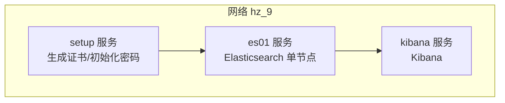
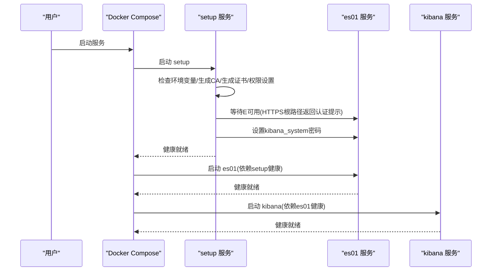
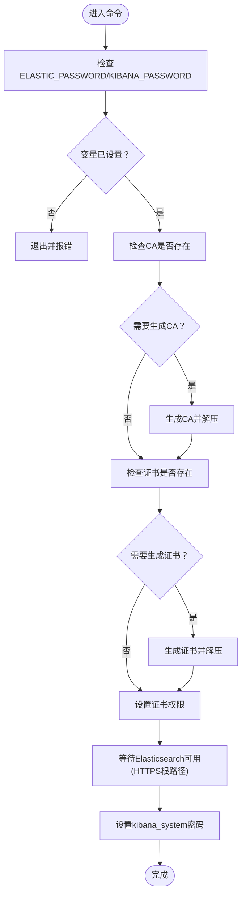
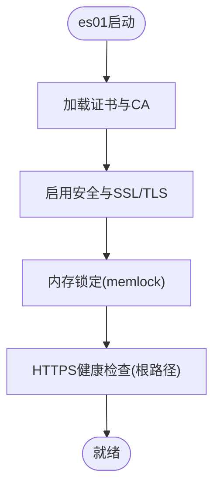
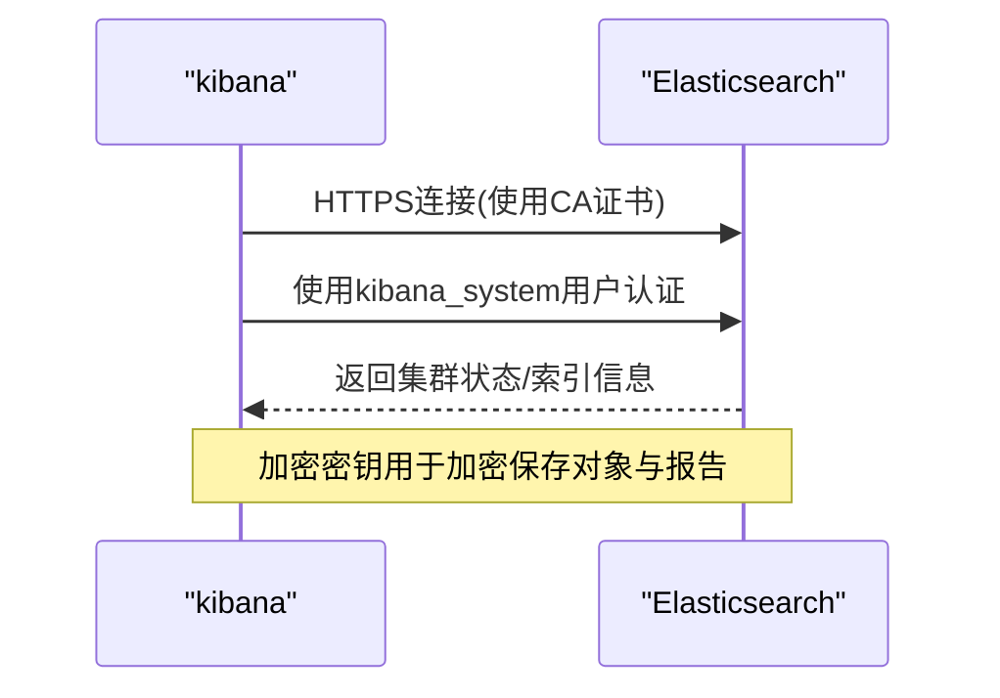
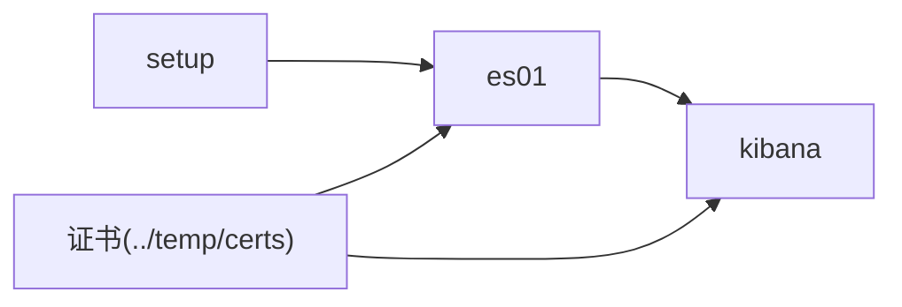

# Elasticsearch单实例配置

<cite>
**本文引用的文件**
- [docker-compose.yml](file://docker-compose/elasticsearch-single/compose/docker-compose.yml)
- [README.md](file://docker-compose/elasticsearch-single/README.md)
- [up.sh](file://docker-compose/elasticsearch-single/bin/up.sh)
- [down.sh](file://docker-compose/elasticsearch-single/bin/down.sh)
- [containers.zh-CN.md](file://docs/overview/containers.zh-CN.md)
- [elasticsearch-cluster README.md](file://docker-compose/elasticsearch-cluster/README.md)
- [elk-cluster README.md](file://docker-compose/elk-cluster/README.md)
- [elk-cluster compose/docker-compose.yml](file://docker-compose/elk-cluster/compose/docker-compose.yml)
- [elk-cluster filebeat.yml](file://docker-compose/elk-cluster/filebeat/filebeat.yml)
- [elk-cluster metricbeat.yml](file://docker-compose/elk-cluster/metricbeat/metricbeat.yml)
- [elk-cluster logstash.conf](file://docker-compose/elk-cluster/logstash/logstash.conf)
</cite>

## 目录
1. [简介](#简介)
2. [项目结构](#项目结构)
3. [核心组件](#核心组件)
4. [架构总览](#架构总览)
5. [详细组件分析](#详细组件分析)
6. [依赖关系分析](#依赖关系分析)
7. [性能考虑](#性能考虑)
8. [故障排查指南](#故障排查指南)
9. [结论](#结论)
10. [附录](#附录)

## 简介
本文件面向希望在单容器环境中部署并运行Elasticsearch与Kibana的用户，提供从零到一的完整配置说明。内容涵盖：
- 单节点Elasticsearch的启动流程与健康检查机制
- SSL/TLS证书的自动生成与配置
- 安全认证（内置用户、密码管理）与加密密钥设置
- 环境变量、数据卷挂载策略与端口映射
- Kibana集成配置与用户密码管理
- 启动流程详解、常见问题排查与性能优化建议

## 项目结构
该单实例Elasticsearch方案由三部分组成：
- setup服务：负责首次启动时生成CA与节点证书、设置Kibana系统用户密码，并进行健康检查
- es01服务：Elasticsearch单节点容器，启用安全与SSL/TLS，配置内存限制与健康检查
- kibana服务：Kibana容器，连接Elasticsearch并启用加密密钥

图表来源
- [docker-compose.yml:1-134](file://docker-compose/elasticsearch-single/compose/docker-compose.yml#L1-L134)

章节来源
- [docker-compose.yml:1-134](file://docker-compose/elasticsearch-single/compose/docker-compose.yml#L1-L134)
- [README.md:1-315](file://docker-compose/elasticsearch-single/README.md#L1-L315)

## 核心组件
- setup服务
  - 自动检测并生成CA与节点证书
  - 在Elasticsearch可用后，为kibana_system用户设置密码
  - 健康检查验证证书生成完成
- es01服务
  - 单节点模式，启用安全与SSL/TLS
  - 内存限制与ulimit配置，防止交换导致性能下降
  - 健康检查通过HTTPS访问根路径并校验认证提示
- kibana服务
  - 连接Elasticsearch并使用CA证书进行TLS校验
  - 使用加密密钥开启加密保存对象与报告功能

章节来源
- [docker-compose.yml:2-50](file://docker-compose/elasticsearch-single/compose/docker-compose.yml#L2-L50)
- [docker-compose.yml:56-128](file://docker-compose/elasticsearch-single/compose/docker-compose.yml#L56-L128)

## 架构总览
下图展示了Elasticsearch单实例的启动顺序与交互流程。

图表来源
- [docker-compose.yml:2-50](file://docker-compose/elasticsearch-single/compose/docker-compose.yml#L2-L50)
- [docker-compose.yml:56-128](file://docker-compose/elasticsearch-single/compose/docker-compose.yml#L56-L128)

## 详细组件分析

### setup服务：证书自动生成与初始化
- 功能职责
  - 校验必需环境变量（如ELASTIC_PASSWORD、KIBANA_PASSWORD）
  - 若不存在CA与证书包，则生成CA与节点证书（含es01与kibana）
  - 设置证书文件权限
  - 等待Elasticsearch可用（通过HTTPS根路径返回“缺少认证凭据”提示）
  - 为kibana_system用户设置密码
- 健康检查
  - 通过检测证书文件是否存在判断是否完成

图表来源
- [docker-compose.yml:7-50](file://docker-compose/elasticsearch-single/compose/docker-compose.yml#L7-L50)

章节来源
- [docker-compose.yml:2-50](file://docker-compose/elasticsearch-single/compose/docker-compose.yml#L2-L50)

### es01服务：单节点Elasticsearch
- 安全与SSL/TLS
  - 启用安全模块与HTTP/传输层SSL/TLS
  - 使用setup生成的证书与CA
  - 验证模式为certificate
- 内存与健康检查
  - 启用内存锁定（memlock），避免交换
  - 通过HTTPS访问根路径进行健康检查
- 环境变量
  - 集群名称、许可类型、内存限制等

图表来源
- [docker-compose.yml:56-100](file://docker-compose/elasticsearch-single/compose/docker-compose.yml#L56-L100)

章节来源
- [docker-compose.yml:56-100](file://docker-compose/elasticsearch-single/compose/docker-compose.yml#L56-L100)

### kibana服务：Kibana集成与加密密钥
- 连接Elasticsearch
  - 通过HTTPS访问es01:9200
  - 使用kibana_system用户与KIBANA_PASSWORD进行认证
  - 使用CA证书进行TLS校验
- 加密密钥
  - 设置X-Pack加密密钥以启用加密保存对象与报告功能

图表来源
- [docker-compose.yml:102-128](file://docker-compose/elasticsearch-single/compose/docker-compose.yml#L102-L128)

章节来源
- [docker-compose.yml:102-128](file://docker-compose/elasticsearch-single/compose/docker-compose.yml#L102-L128)

### 环境变量与配置要点
- 必需变量
  - STACK_VERSION：Elastic Stack版本
  - ELASTIC_PASSWORD：内置elastic用户的密码
  - KIBANA_PASSWORD：内置kibana_system用户的密码
  - CLUSTER_NAME：集群名称
  - LICENSE：许可类型（basic/trial）
  - ES_MEM_LIMIT / KB_MEM_LIMIT：内存限制（字节）
  - ES_PORT / KIBANA_PORT：端口映射
  - ENCRYPTION_KEY：Kibana加密密钥（用于X-Pack加密功能）
- 默认值与约定
  - 默认版本：8.13.4
  - 默认端口：9200（HTTP）、5601（Kibana）
  - 默认集群名称：docker-cluster
  - 默认许可：basic

章节来源
- [containers.zh-CN.md:107-118](file://docs/overview/containers.zh-CN.md#L107-L118)
- [docker-compose.yml:70-122](file://docker-compose/elasticsearch-single/compose/docker-compose.yml#L70-L122)

### 数据卷与端口映射
- 数据卷
  - 证书目录：../temp/certs
  - Elasticsearch数据/日志/插件：../temp/esdata01、../temp/eslogs01、../temp/esplugins01
  - Kibana数据：../temp/kibanadata
- 端口映射
  - Elasticsearch：外部9200映射容器9200
  - Kibana：外部5601映射容器5601

章节来源
- [docker-compose.yml:63-113](file://docker-compose/elasticsearch-single/compose/docker-compose.yml#L63-L113)
- [containers.zh-CN.md:76-91](file://docs/overview/containers.zh-CN.md#L76-L91)

### 启动脚本与操作
- 启动脚本
  - up.sh：读取根目录.env并通过docker compose启动服务，打印访问信息与健康检查命令
- 停止脚本
  - down.sh：停止服务并提示数据卷保留说明

章节来源
- [up.sh:1-32](file://docker-compose/elasticsearch-single/bin/up.sh#L1-L32)
- [down.sh:1-24](file://docker-compose/elasticsearch-single/bin/down.sh#L1-L24)

## 依赖关系分析
- 服务间依赖
  - es01依赖setup健康就绪
  - kibana依赖es01健康就绪
- 外部依赖
  - 证书文件由setup生成并挂载至es01与kibana
  - Kibana通过CA证书与Elasticsearch建立HTTPS连接

图表来源
- [docker-compose.yml:56-128](file://docker-compose/elasticsearch-single/compose/docker-compose.yml#L56-L128)

章节来源
- [docker-compose.yml:56-128](file://docker-compose/elasticsearch-single/compose/docker-compose.yml#L56-L128)

## 性能考虑
- JVM堆大小
  - 默认JVM堆大小为1g，生产环境建议根据硬件调整ES_JAVA_OPTS
- 系统参数
  - 提高虚拟内存映射上限（vm.max_map_count），避免mmap限制导致启动失败
- 内存限制
  - 通过ES_MEM_LIMIT与KB_MEM_LIMIT限制容器内存，避免过度占用宿主机资源
- 禁用交换
  - 通过memlock与bootstrap.memory_lock确保不使用交换分区

章节来源
- [README.md:277-296](file://docker-compose/elasticsearch-single/README.md#L277-L296)
- [docker-compose.yml:87-91](file://docker-compose/elasticsearch-single/compose/docker-compose.yml#L87-L91)

## 故障排查指南
- 启动失败
  - 检查端口占用（9200/5601）与内存资源是否充足
- 证书相关
  - 若出现证书错误，可删除temp/certs目录后重启以重新生成
- 连接超时
  - 等待服务完全启动（约2-3分钟），或查看容器日志定位问题
- 内存不足
  - 调整ES_MEM_LIMIT与KB_MEM_LIMIT，或提升宿主机可用内存
- 健康检查失败
  - 使用提供的健康检查命令验证服务状态；确认证书与CA配置正确

章节来源
- [README.md:306-315](file://docker-compose/elasticsearch-single/README.md#L306-L315)
- [elasticsearch-cluster README.md:176-183](file://docker-compose/elasticsearch-cluster/README.md#L176-L183)

## 结论
本方案通过setup服务实现证书自动化与初始密码设置，结合es01与kibana的服务配置，提供了安全、可验证且易于上手的单节点Elasticsearch部署方式。生产环境建议：
- 明确设置ELASTIC_PASSWORD与KIBANA_PASSWORD
- 配置合适的内存限制与JVM堆大小
- 使用独立的加密密钥并妥善保管
- 关注健康检查与日志，及时发现并解决问题

## 附录

### 环境变量参考表
- STACK_VERSION：Elastic Stack版本（默认8.13.4）
- ELASTIC_PASSWORD：elastic用户密码
- KIBANA_PASSWORD：kibana_system用户密码
- CLUSTER_NAME：集群名称（默认docker-cluster）
- LICENSE：许可类型（basic/trial）
- ES_MEM_LIMIT / KB_MEM_LIMIT：内存限制（字节）
- ES_PORT / KIBANA_PORT：端口映射
- ENCRYPTION_KEY：Kibana加密密钥（用于X-Pack加密功能）

章节来源
- [containers.zh-CN.md:107-118](file://docs/overview/containers.zh-CN.md#L107-L118)
- [docker-compose.yml:70-122](file://docker-compose/elasticsearch-single/compose/docker-compose.yml#L70-L122)

### Kibana集成与加密密钥设置
- Kibana连接Elasticsearch
  - 使用HTTPS与CA证书校验
  - 使用kibana_system用户与KIBANA_PASSWORD进行认证
- 加密密钥
  - 通过XPACK_SECURITY_ENCRYPTIONKEY、XPACK_ENCRYPTEDSAVEDOBJECTS_ENCRYPTIONKEY、XPACK_REPORTING_ENCRYPTIONKEY启用加密功能

章节来源
- [docker-compose.yml:114-122](file://docker-compose/elasticsearch-single/compose/docker-compose.yml#L114-L122)

### 与ELK集群方案的差异
- 单实例与集群
  - 单实例：discovery.type=single-node，仅一个es01节点
  - 集群：多节点（es01/es02/es03），配置初始主节点与种子主机
- 证书与密钥
  - 单实例：setup生成es01与kibana证书
  - ELK集群：setup生成elasticsearch与kibana证书，Beats组件同样使用证书与CA

章节来源
- [docker-compose.yml:73-80](file://docker-compose/elasticsearch-single/compose/docker-compose.yml#L73-L80)
- [elk-cluster compose/docker-compose.yml:23-40](file://docker-compose/elk-cluster/compose/docker-compose.yml#L23-L40)
- [elk-cluster filebeat.yml:20-25](file://docker-compose/elk-cluster/filebeat/filebeat.yml#L20-L25)
- [elk-cluster metricbeat.yml:13-19](file://docker-compose/elk-cluster/metricbeat/metricbeat.yml#L13-L19)
- [elk-cluster logstash.conf:19-26](file://docker-compose/elk-cluster/logstash/logstash.conf#L19-L26)