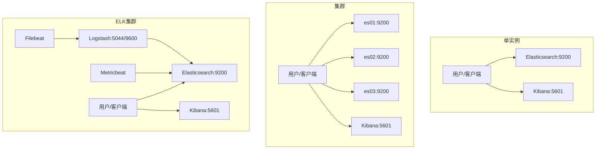
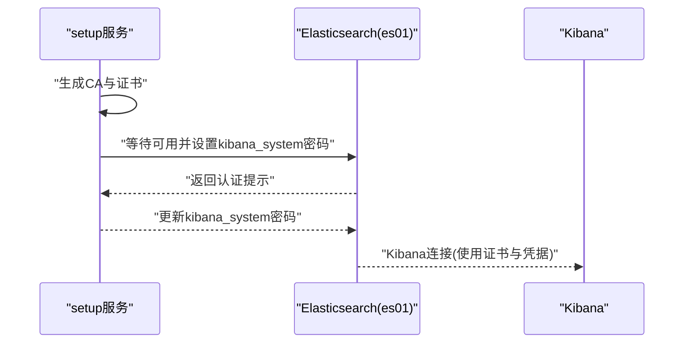
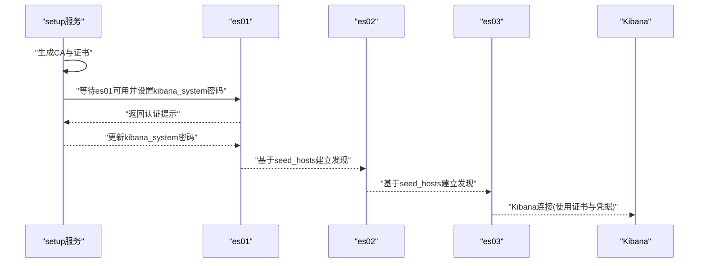
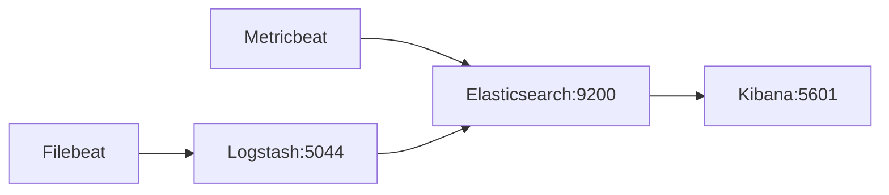
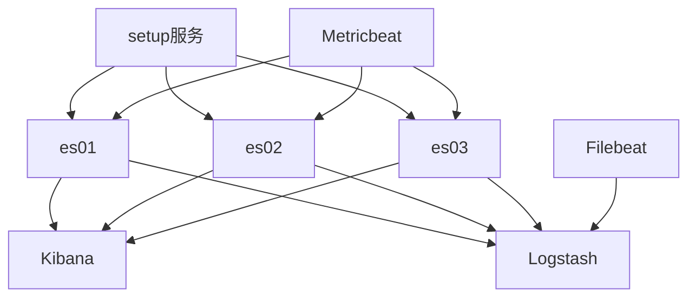

# Elasticsearch环境

<cite>
**本文引用的文件**
- [docker-compose.yml（单实例）](file://docker-compose/elasticsearch-single/compose/docker-compose.yml)
- [README.md（单实例）](file://docker-compose/elasticsearch-single/README.md)
- [up.sh（单实例）](file://docker-compose/elasticsearch-single/bin/up.sh)
- [down.sh（单实例）](file://docker-compose/elasticsearch-single/bin/down.sh)
- [docker-compose.yml（集群）](file://docker-compose/elasticsearch-cluster/compose/docker-compose.yml)
- [README.md（集群）](file://docker-compose/elasticsearch-cluster/README.md)
- [up.sh（集群）](file://docker-compose/elasticsearch-cluster/bin/up.sh)
- [down.sh（集群）](file://docker-compose/elasticsearch-cluster/bin/down.sh)
- [docker-compose.yml（ELK集群）](file://docker-compose/elk-cluster/compose/docker-compose.yml)
- [README.md（ELK集群）](file://docker-compose/elk-cluster/README.md)
</cite>

## 目录
1. [简介](#简介)
2. [项目结构](#项目结构)
3. [核心组件](#核心组件)
4. [架构总览](#架构总览)
5. [详细组件分析](#详细组件分析)
6. [依赖关系分析](#依赖关系分析)
7. [性能考虑](#性能考虑)
8. [故障排查指南](#故障排查指南)
9. [结论](#结论)
10. [附录](#附录)

## 简介
本文件面向在Docker环境中部署与运维Elasticsearch的工程团队，系统性梳理单实例与集群两种部署形态，覆盖核心配置参数、安全与SSL证书、集群发现机制、节点角色与内存设置、健康检查与数据持久化、索引管理与查询优化、性能调优、故障转移与备份恢复、以及监控与常见问题排查。文档同时结合仓库中的Compose编排与脚本，给出可操作的启动、停止、状态检查与日志查看流程。

## 项目结构
仓库提供了三套与Elasticsearch相关的编排方案：
- 单实例：包含Elasticsearch与Kibana，适合开发测试与快速验证。
- 集群：包含3个Elasticsearch主节点与1个Kibana，强调高可用与安全。
- ELK集群：在集群基础上集成Logstash、Filebeat、Metricbeat，形成完整的日志采集、处理与可视化栈。

```mermaid
graph TB
subgraph "单实例"
ES1["Elasticsearch 单实例"]
KB1["Kibana"]
end
subgraph "集群"
ES01["Elasticsearch 节点 es01"]
ES02["Elasticsearch 节点 es02"]
ES03["Elasticsearch 节点 es03"]
KB2["Kibana"]
end
subgraph "ELK集群"
ES3["Elasticsearch"]
KB3["Kibana"]
LS["Logstash"]
FB["Filebeat"]
MB["Metricbeat"]
end
ES1 --> KB1
ES01 --> ES02
ES02 --> ES03
ES03 --> ES01
ES01 --> KB2
ES02 --> KB2
ES03 --> KB2
ES3 --> KB3
ES3 <- --> LS
ES3 <- --> FB
ES3 <- --> MB
```

图示来源
- [docker-compose.yml（单实例）:1-134](file://docker-compose/elasticsearch-single/compose/docker-compose.yml#L1-L134)
- [docker-compose.yml（集群）:1-238](file://docker-compose/elasticsearch-cluster/compose/docker-compose.yml#L1-L238)
- [docker-compose.yml（ELK集群）:1-202](file://docker-compose/elk-cluster/compose/docker-compose.yml#L1-L202)

章节来源
- [docker-compose.yml（单实例）:1-134](file://docker-compose/elasticsearch-single/compose/docker-compose.yml#L1-L134)
- [docker-compose.yml（集群）:1-238](file://docker-compose/elasticsearch-cluster/compose/docker-compose.yml#L1-L238)
- [docker-compose.yml（ELK集群）:1-202](file://docker-compose/elk-cluster/compose/docker-compose.yml#L1-L202)

## 核心组件
- Elasticsearch服务：负责全文检索、分析与存储；支持单节点与多节点集群模式。
- Kibana：提供Web界面进行数据探索、可视化与仪表盘管理。
- Logstash（ELK集群）：日志收集与实时处理管道。
- Filebeat/Metricbeat（ELK集群）：轻量级日志与指标采集器，向Elasticsearch或Logstash发送数据。

章节来源
- [docker-compose.yml（单实例）:56-128](file://docker-compose/elasticsearch-single/compose/docker-compose.yml#L56-L128)
- [docker-compose.yml（集群）:69-232](file://docker-compose/elasticsearch-cluster/compose/docker-compose.yml#L69-L232)
- [docker-compose.yml（ELK集群）:56-176](file://docker-compose/elk-cluster/compose/docker-compose.yml#L56-L176)

## 架构总览
下图展示三种部署形态的组件交互与端口映射：



图示来源
- [docker-compose.yml（单实例）:68-128](file://docker-compose/elasticsearch-single/compose/docker-compose.yml#L68-L128)
- [docker-compose.yml（集群）:81-232](file://docker-compose/elasticsearch-cluster/compose/docker-compose.yml#L81-L232)
- [docker-compose.yml（ELK集群）:68-197](file://docker-compose/elk-cluster/compose/docker-compose.yml#L68-L197)

## 详细组件分析

### 单实例Elasticsearch
- 部署形态：单节点，便于本地开发与演示。
- 安全与证书：通过setup服务自动生成CA与节点证书，并为kibana_system设置密码；Elasticsearch启用安全与SSL/TLS。
- 数据持久化：挂载卷到宿主机temp目录下的data、logs、plugins等路径。
- 健康检查：基于HTTPS访问与认证状态轮询检测。
- 访问方式：Elasticsearch使用HTTPS，Kibana使用HTTP。



图示来源
- [docker-compose.yml（单实例）:7-60](file://docker-compose/elasticsearch-single/compose/docker-compose.yml#L7-L60)
- [docker-compose.yml（单实例）:102-128](file://docker-compose/elasticsearch-single/compose/docker-compose.yml#L102-L128)

章节来源
- [docker-compose.yml（单实例）:1-134](file://docker-compose/elasticsearch-single/compose/docker-compose.yml#L1-L134)
- [README.md（单实例）:1-315](file://docker-compose/elasticsearch-single/README.md#L1-L315)
- [up.sh（单实例）:1-32](file://docker-compose/elasticsearch-single/bin/up.sh#L1-L32)
- [down.sh（单实例）:1-24](file://docker-compose/elasticsearch-single/bin/down.sh#L1-L24)

### 集群Elasticsearch（3主节点）
- 集群发现：每个节点配置了初始主节点列表与seed_hosts，确保跨节点发现与选主。
- 安全与证书：与单实例一致，使用setup服务生成证书并初始化kibana_system密码。
- 数据持久化：每个节点独立挂载data、logs、plugins卷，避免共享存储复杂度。
- 健康检查：基于HTTPS轮询，Kibana对所有节点进行健康探测。
- 访问方式：Elasticsearch使用HTTPS，Kibana使用HTTP。



图示来源
- [docker-compose.yml（集群）:2-67](file://docker-compose/elasticsearch-cluster/compose/docker-compose.yml#L2-L67)
- [docker-compose.yml（集群）:69-232](file://docker-compose/elasticsearch-cluster/compose/docker-compose.yml#L69-L232)

章节来源
- [docker-compose.yml（集群）:1-238](file://docker-compose/elasticsearch-cluster/compose/docker-compose.yml#L1-L238)
- [README.md（集群）:1-194](file://docker-compose/elasticsearch-cluster/README.md#L1-L194)
- [up.sh（集群）:1-42](file://docker-compose/elasticsearch-cluster/bin/up.sh#L1-L42)
- [down.sh（集群）:1-32](file://docker-compose/elasticsearch-cluster/bin/down.sh#L1-L32)

### ELK集群（含Logstash/Filebeat/Metricbeat）
- 组件职责：Elasticsearch提供存储与检索，Kibana用于可视化，Logstash负责日志处理，Filebeat与Metricbeat负责采集。
- 安全与通信：各组件均通过证书与凭据进行加密通信。
- 数据流：Filebeat采集日志至Logstash，Logstash再写入Elasticsearch；Metricbeat采集系统与容器指标；Kibana从Elasticsearch读取数据进行可视化。



图示来源
- [docker-compose.yml（ELK集群）:155-197](file://docker-compose/elk-cluster/compose/docker-compose.yml#L155-L197)

章节来源
- [docker-compose.yml（ELK集群）:1-202](file://docker-compose/elk-cluster/compose/docker-compose.yml#L1-L202)
- [README.md（ELK集群）:1-352](file://docker-compose/elk-cluster/README.md#L1-L352)

## 依赖关系分析
- 启动顺序依赖：
  - setup服务先于各节点启动，完成证书生成与初始用户密码设置。
  - 各Elasticsearch节点依赖setup健康后启动，以确保安全配置就绪。
  - Kibana依赖至少一个Elasticsearch节点健康后启动。
- 外部依赖：
  - 证书与密钥由setup服务生成并挂载至各容器。
  - 端口映射：Elasticsearch默认9200（HTTPS），Kibana默认5601（HTTP），Logstash默认5044/9600（输入输出）。
- 潜在耦合点：
  - 初始主节点列表需与实际节点数量匹配，避免脑裂或无法选主。
  - 证书域名/IP需与容器网络别名一致，否则出现证书校验失败。



图示来源
- [docker-compose.yml（集群）:69-232](file://docker-compose/elasticsearch-cluster/compose/docker-compose.yml#L69-L232)
- [docker-compose.yml（ELK集群）:155-197](file://docker-compose/elk-cluster/compose/docker-compose.yml#L155-L197)

章节来源
- [docker-compose.yml（集群）:1-238](file://docker-compose/elasticsearch-cluster/compose/docker-compose.yml#L1-L238)
- [docker-compose.yml（ELK集群）:1-202](file://docker-compose/elk-cluster/compose/docker-compose.yml#L1-L202)

## 性能考虑
- 内存与JVM堆大小：
  - 建议将Elasticsearch的堆大小设置为其可用内存的50%，最大不超过32GB。
  - 可通过ES_JAVA_OPTS调整堆大小；同时启用内存锁定以避免交换。
- 存储与刷新：
  - 对SSD建议采用niofs存储类型。
  - 在高吞吐场景下可适当延长索引refresh_interval以降低开销。
- 索引模板与分片：
  - 使用索引模板统一字段映射与分片/副本策略。
  - 合理设置副本数以平衡查询并发与写入成本。
- Logstash调优：
  - 提高pipeline.workers、batch.size与batch.delay以提升吞吐。
- 系统内核：
  - 提升vm.max_map_count以避免mmap限制导致的启动失败。

章节来源
- [README.md（ELK集群）:314-337](file://docker-compose/elk-cluster/README.md#L314-L337)
- [README.md（单实例）:277-296](file://docker-compose/elasticsearch-single/README.md#L277-L296)

## 故障排查指南
- 启动失败：
  - 检查端口占用（9200、5601、5044等）与内存资源是否充足。
  - 查看setup服务是否成功生成证书，必要时删除certs目录重新生成。
- 连接超时：
  - 等待所有节点完全启动（约2-3分钟），期间会进行证书生成与初始化。
- Out of Memory：
  - 调整ES_MEM_LIMIT/KB_MEM_LIMIT/Ls_MEM_LIMIT等内存限制。
- 证书错误：
  - 删除temp/certs目录后重启，让setup服务重新生成证书。
- 日志查看：
  - 使用docker compose logs或docker logs查看具体节点日志。
- 健康检查：
  - 单实例：curl http://localhost:9200/_cluster/health
  - 集群：curl -k -u elastic:123456 https://localhost:9200/_cluster/health

章节来源
- [README.md（集群）:176-194](file://docker-compose/elasticsearch-cluster/README.md#L176-L194)
- [README.md（ELK集群）:258-287](file://docker-compose/elk-cluster/README.md#L258-L287)
- [README.md（单实例）:101-114](file://docker-compose/elasticsearch-single/README.md#L101-L114)

## 结论
本仓库提供了从单实例到集群再到完整ELK栈的多层级部署方案，覆盖安全、发现、持久化、健康检查与监控采集等关键主题。生产环境建议采用集群模式并启用安全与SSL，配合合理的内存与索引策略实现稳定高效的日志与检索服务。

## 附录

### 关键配置参数速览
- 集群名称与发现
  - 单实例：discovery.type=single-node
  - 集群：cluster.initial_master_nodes、discovery.seed_hosts
- 安全与SSL
  - xpack.security.enabled=true
  - xpack.security.http.ssl.* 与 xpack.security.transport.ssl.*
  - verification_mode=certificate
- 内存与系统
  - bootstrap.memory_lock=true
  - ES_MEM_LIMIT、KB_MEM_LIMIT
  - vm.max_map_count（系统内核）

章节来源
- [docker-compose.yml（单实例）:70-91](file://docker-compose/elasticsearch-single/compose/docker-compose.yml#L70-L91)
- [docker-compose.yml（集群）:83-100](file://docker-compose/elasticsearch-cluster/compose/docker-compose.yml#L83-L100)
- [README.md（单实例）:288-296](file://docker-compose/elasticsearch-single/README.md#L288-L296)

### 索引管理与查询优化要点
- 索引模板：统一字段映射与分片/副本策略，减少后期变更成本。
- 查询优化：优先使用精确字段查询，避免通配符前缀；合理使用聚合与过滤。
- 刷新与合并：在写入密集场景适当延长refresh_interval，降低段合并压力。

章节来源
- [README.md（ELK集群）:288-305](file://docker-compose/elk-cluster/README.md#L288-L305)

### 集群拓扑、故障转移与备份恢复
- 拓扑：3主节点集群提供高可用与自动选主能力。
- 故障转移：节点退出后，剩余节点继续提供服务；副本分片保障读取可用性。
- 备份恢复：定期导出快照（Snapshot）至共享存储，恢复时可在新集群中还原。

章节来源
- [README.md（集群）:74-90](file://docker-compose/elasticsearch-cluster/README.md#L74-L90)

### 监控最佳实践
- 使用Metricbeat采集主机与容器指标，Filebeat采集应用日志，Logstash进行实时处理。
- 在Kibana中创建仪表盘与告警规则，关注集群健康、节点负载与索引延迟。

章节来源
- [README.md（ELK集群）:167-186](file://docker-compose/elk-cluster/README.md#L167-L186)