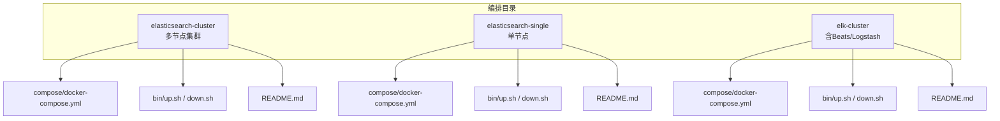
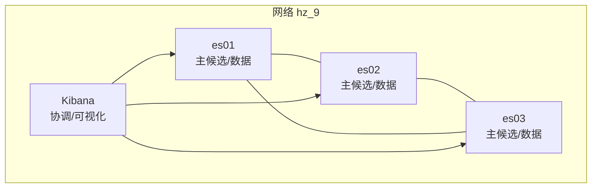
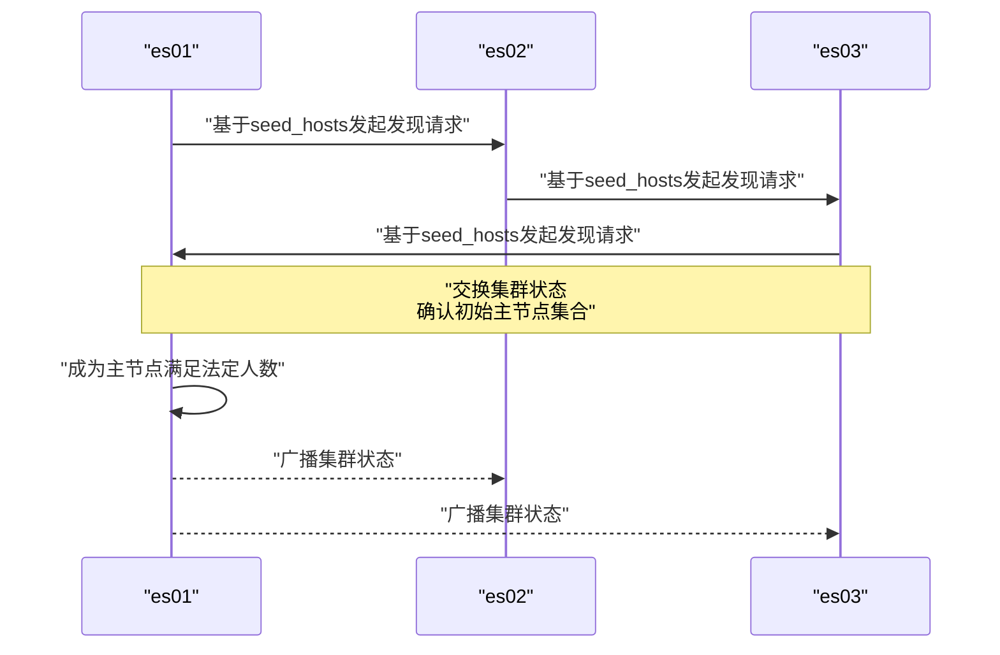
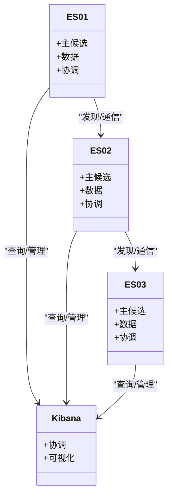
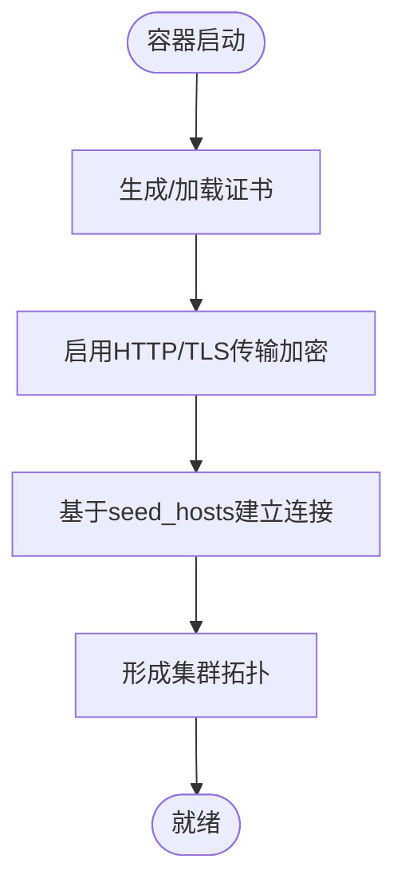
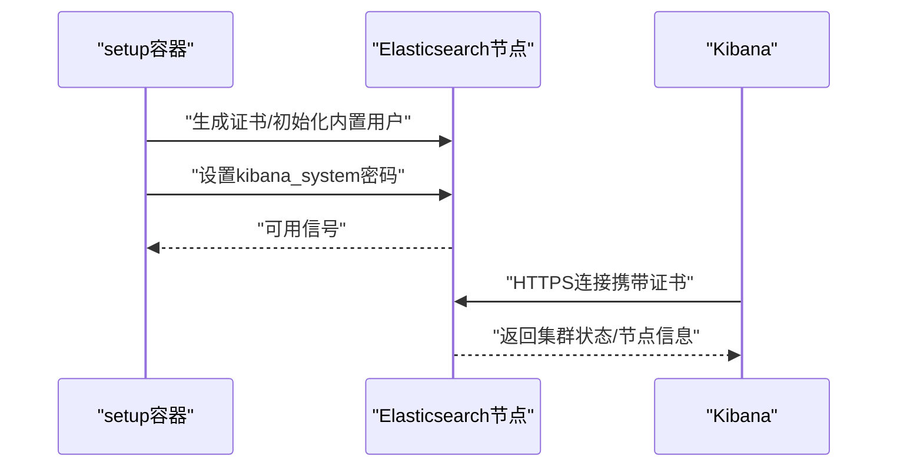
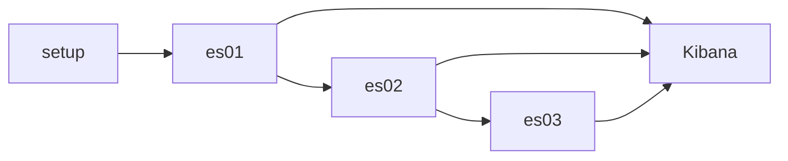

# Elasticsearch集群配置

<cite>
**本文引用的文件**
- [docker-compose.yml（集群）](file://docker-compose/elasticsearch-cluster/compose/docker-compose.yml)
- [README（集群）](file://docker-compose/elasticsearch-cluster/README.md)
- [up.sh（集群）](file://docker-compose/elasticsearch-cluster/bin/up.sh)
- [down.sh（集群）](file://docker-compose/elasticsearch-cluster/bin/down.sh)
- [docker-compose.yml（单节点）](file://docker-compose/elasticsearch-single/compose/docker-compose.yml)
- [README（单节点）](file://docker-compose/elasticsearch-single/README.md)
- [up.sh（单节点）](file://docker-compose/elasticsearch-single/bin/up.sh)
- [down.sh（单节点）](file://docker-compose/elasticsearch-single/bin/down.sh)
- [docker-compose.yml（ELK集群）](file://docker-compose/elk-cluster/compose/docker-compose.yml)
- [README（ELK集群）](file://docker-compose/elk-cluster/README.md)
- [up.sh（ELK集群）](file://docker-compose/elk-cluster/bin/up.sh)
- [down.sh（ELK集群）](file://docker-compose/elk-cluster/bin/down.sh)
</cite>

## 目录
1. [简介](#简介)
2. [项目结构](#项目结构)
3. [核心组件](#核心组件)
4. [架构总览](#架构总览)
5. [详细组件分析](#详细组件分析)
6. [依赖关系分析](#依赖关系分析)
7. [性能与资源规划](#性能与资源规划)
8. [故障排查指南](#故障排查指南)
9. [结论](#结论)
10. [附录：运维与最佳实践](#附录运维与最佳实践)

## 简介
本文件面向需要在容器环境中部署与运维Elasticsearch集群的工程团队，基于仓库中的Docker Compose编排脚本，系统化梳理多节点集群的部署架构、主节点选举、数据节点与协调节点配置、集群发现机制、节点间通信与网络要求、健康检查与故障转移、数据同步策略、节点角色分配、资源限制与负载均衡、扩容缩容与滚动升级、备份恢复、监控与日志采集以及性能调优等关键主题。同时提供针对单节点与ELK集群场景的对照说明，帮助读者快速定位适用方案。

## 项目结构
该仓库采用按功能域分层的目录组织方式，Elasticsearch相关编排位于docker-compose子目录下，每个子项目包含：
- compose/docker-compose.yml：服务定义、环境变量、卷挂载、健康检查与网络配置
- bin/up.sh、bin/down.sh：启动与停止脚本
- README.md：使用说明、访问信息、环境变量、操作指引与故障排查

图示来源
- [docker-compose.yml（集群）:1-238](file://docker-compose/elasticsearch-cluster/compose/docker-compose.yml#L1-L238)
- [docker-compose.yml（单节点）:1-134](file://docker-compose/elasticsearch-single/compose/docker-compose.yml#L1-L134)
- [docker-compose.yml（ELK集群）:1-202](file://docker-compose/elk-cluster/compose/docker-compose.yml#L1-L202)

章节来源
- [docker-compose.yml（集群）:1-238](file://docker-compose/elasticsearch-cluster/compose/docker-compose.yml#L1-L238)
- [README（集群）:1-194](file://docker-compose/elasticsearch-cluster/README.md#L1-L194)
- [docker-compose.yml（单节点）:1-134](file://docker-compose/elasticsearch-single/compose/docker-compose.yml#L1-L134)
- [README（单节点）:1-315](file://docker-compose/elasticsearch-single/README.md#L1-L315)
- [docker-compose.yml（ELK集群）:1-202](file://docker-compose/elk-cluster/compose/docker-compose.yml#L1-L202)
- [README（ELK集群）:1-352](file://docker-compose/elk-cluster/README.md#L1-L352)

## 核心组件
- 集群节点（es01/es02/es03）：三节点主候选，启用安全与证书校验，通过初始主节点列表与种子主机完成发现与组网
- 协调节点（Kibana）：作为前端入口，连接所有Elasticsearch节点进行查询与管理
- 辅助组件（可选）：在ELK集群中包含Filebeat、Metricbeat、Logstash，用于日志采集、指标采集与数据处理
- 证书与权限：首次启动自动生成CA与节点证书，初始化内置用户密码，启用传输层与HTTP层TLS

章节来源
- [docker-compose.yml（集群）:69-200](file://docker-compose/elasticsearch-cluster/compose/docker-compose.yml#L69-L200)
- [README（集群）:7-11](file://docker-compose/elasticsearch-cluster/README.md#L7-L11)
- [docker-compose.yml（ELK集群）:130-197](file://docker-compose/elk-cluster/compose/docker-compose.yml#L130-L197)

## 架构总览
多节点集群采用“三主候选 + 多数据/协调”的经典高可用布局。各节点通过种子主机与初始主节点列表建立联系，形成稳定拓扑；Kibana以轮询或就近原则连接多个节点，实现读写流量的横向扩展与高可用。

图示来源
- [docker-compose.yml（集群）:86-87](file://docker-compose/elasticsearch-cluster/compose/docker-compose.yml#L86-L87)
- [docker-compose.yml（集群）:130-131](file://docker-compose/elasticsearch-cluster/compose/docker-compose.yml#L130-L131)
- [docker-compose.yml（集群）:173-174](file://docker-compose/elasticsearch-cluster/compose/docker-compose.yml#L173-L174)
- [docker-compose.yml（集群）](file://docker-compose/elasticsearch-cluster/compose/docker-compose.yml#L220)

## 详细组件分析

### 组件A：集群发现与主节点选举
- 初始主节点列表：每个节点均声明集群初始主节点集合，确保首次启动时能形成法定人数
- 种子主机：除自身外的其他节点地址，用于跨节点发现
- 主节点职责：维护集群状态、索引元数据变更、分片分配决策
- 选举流程要点：满足最小主节点数后形成仲裁，避免脑裂；新主节点产生后重建路由表

图示来源
- [docker-compose.yml（集群）:86-87](file://docker-compose/elasticsearch-cluster/compose/docker-compose.yml#L86-L87)
- [docker-compose.yml（集群）:130-131](file://docker-compose/elasticsearch-cluster/compose/docker-compose.yml#L130-L131)
- [docker-compose.yml（集群）:173-174](file://docker-compose/elasticsearch-cluster/compose/docker-compose.yml#L173-L174)

章节来源
- [docker-compose.yml（集群）:86-87](file://docker-compose/elasticsearch-cluster/compose/docker-compose.yml#L86-L87)
- [docker-compose.yml（集群）:130-131](file://docker-compose/elasticsearch-cluster/compose/docker-compose.yml#L130-L131)
- [docker-compose.yml（集群）:173-174](file://docker-compose/elasticsearch-cluster/compose/docker-compose.yml#L173-L174)
- [README（集群）:76-84](file://docker-compose/elasticsearch-cluster/README.md#L76-L84)

### 组件B：节点角色与职责
- 主候选节点（master-eligible）：es01/es02/es03均具备主候选资格，通过初始主节点列表参与选举
- 数据节点（data）：默认承载分片存储与查询执行
- 协调节点（coordinating）：Kibana作为客户端入口，负责请求转发与聚合
- 滚动迁移：可通过临时移除主候选资格或禁用数据角色实现平滑迁移

图示来源
- [docker-compose.yml（集群）:69-200](file://docker-compose/elasticsearch-cluster/compose/docker-compose.yml#L69-L200)
- [docker-compose.yml（集群）:202-232](file://docker-compose/elasticsearch-cluster/compose/docker-compose.yml#L202-L232)

章节来源
- [docker-compose.yml（集群）:69-200](file://docker-compose/elasticsearch-cluster/compose/docker-compose.yml#L69-L200)
- [README（集群）:7-11](file://docker-compose/elasticsearch-cluster/README.md#L7-L11)

### 组件C：节点间通信与网络配置
- 传输端口：默认9300（容器内映射由编排决定）
- HTTP端口：9200（容器内），外部通过ES_PORT映射
- TLS加密：启用HTTP与传输层TLS，证书来自CA与节点证书
- 网络：默认使用自定义网络hz_9，便于容器间解析与隔离

图示来源
- [docker-compose.yml（集群）:91-99](file://docker-compose/elasticsearch-cluster/compose/docker-compose.yml#L91-L99)
- [docker-compose.yml（集群）:138-142](file://docker-compose/elasticsearch-cluster/compose/docker-compose.yml#L138-L142)
- [docker-compose.yml（集群）:181-185](file://docker-compose/elasticsearch-cluster/compose/docker-compose.yml#L181-L185)
- [docker-compose.yml（集群）:234-238](file://docker-compose/elasticsearch-cluster/compose/docker-compose.yml#L234-L238)

章节来源
- [docker-compose.yml（集群）:81-82](file://docker-compose/elasticsearch-cluster/compose/docker-compose.yml#L81-L82)
- [docker-compose.yml（集群）:91-99](file://docker-compose/elasticsearch-cluster/compose/docker-compose.yml#L91-L99)
- [docker-compose.yml（集群）:138-142](file://docker-compose/elasticsearch-cluster/compose/docker-compose.yml#L138-L142)
- [docker-compose.yml（集群）:181-185](file://docker-compose/elasticsearch-cluster/compose/docker-compose.yml#L181-L185)
- [README（集群）:16-18](file://docker-compose/elasticsearch-cluster/README.md#L16-L18)

### 组件D：健康检查与故障转移
- 健康检查：各服务配置了健康检查命令，等待服务可用后再进入下一步
- 故障转移：当主节点不可用时，剩余主候选节点重新选举；数据节点自动重平衡分片
- 安全登录：setup阶段为kibana_system设置密码，Kibana通过HTTPS访问

图示来源
- [docker-compose.yml（集群）:57-62](file://docker-compose/elasticsearch-cluster/compose/docker-compose.yml#L57-L62)
- [docker-compose.yml（集群）:202-232](file://docker-compose/elasticsearch-cluster/compose/docker-compose.yml#L202-L232)

章节来源
- [docker-compose.yml（集群）:63-67](file://docker-compose/elasticsearch-cluster/compose/docker-compose.yml#L63-L67)
- [docker-compose.yml（集群）:106-114](file://docker-compose/elasticsearch-cluster/compose/docker-compose.yml#L106-L114)
- [docker-compose.yml（集群）:149-157](file://docker-compose/elasticsearch-cluster/compose/docker-compose.yml#L149-L157)
- [docker-compose.yml（集群）:192-200](file://docker-compose/elasticsearch-cluster/compose/docker-compose.yml#L192-L200)
- [docker-compose.yml（集群）:228-232](file://docker-compose/elasticsearch-cluster/compose/docker-compose.yml#L228-L232)

### 组件E：数据同步策略
- 分片与副本：默认副本数量可在索引模板或创建索引时指定
- 同步写入：主分片成功后复制到副本分片，保证一致性
- 跨节点复制：主节点负责分片分配与复制进度跟踪

章节来源
- [README（集群）:76-84](file://docker-compose/elasticsearch-cluster/README.md#L76-L84)

### 组件F：节点角色分配与负载均衡
- 角色分配：默认均为主候选+数据节点；如需分离，可调整角色配置
- 负载均衡：Kibana连接所有节点，客户端SDK通常支持多节点连接与重试

章节来源
- [README（集群）:16-18](file://docker-compose/elasticsearch-cluster/README.md#L16-L18)
- [docker-compose.yml（集群）:220-227](file://docker-compose/elasticsearch-cluster/compose/docker-compose.yml#L220-L227)

### 组件G：单节点与ELK集群对比
- 单节点：使用single-node模式，适合开发测试；无高可用
- ELK集群：包含Filebeat/Metricbeat/Logstash，提供日志采集、指标采集与数据处理链路

章节来源
- [docker-compose.yml（单节点）](file://docker-compose/elasticsearch-single/compose/docker-compose.yml#L73)
- [README（单节点）](file://docker-compose/elasticsearch-single/README.md#L82)
- [docker-compose.yml（ELK集群）:130-197](file://docker-compose/elk-cluster/compose/docker-compose.yml#L130-L197)
- [README（ELK集群）:7-17](file://docker-compose/elk-cluster/README.md#L7-L17)

## 依赖关系分析
- 服务依赖：es01依赖setup完成证书与用户初始化；es02/03依赖es01；Kibana依赖所有ES节点健康
- 卷依赖：证书、数据、日志、插件分别挂载至宿主机temp目录
- 环境变量：通过.env注入版本号、密码、集群名、端口与内存限制

图示来源
- [docker-compose.yml（集群）:70-72](file://docker-compose/elasticsearch-cluster/compose/docker-compose.yml#L70-L72)
- [docker-compose.yml（集群）:117-118](file://docker-compose/elasticsearch-cluster/compose/docker-compose.yml#L117-L118)
- [docker-compose.yml（集群）:160-161](file://docker-compose/elasticsearch-cluster/compose/docker-compose.yml#L160-L161)
- [docker-compose.yml（集群）:202-209](file://docker-compose/elasticsearch-cluster/compose/docker-compose.yml#L202-L209)

章节来源
- [docker-compose.yml（集群）:70-72](file://docker-compose/elasticsearch-cluster/compose/docker-compose.yml#L70-L72)
- [docker-compose.yml（集群）:117-118](file://docker-compose/elasticsearch-cluster/compose/docker-compose.yml#L117-L118)
- [docker-compose.yml（集群）:160-161](file://docker-compose/elasticsearch-cluster/compose/docker-compose.yml#L160-L161)
- [docker-compose.yml（集群）:202-209](file://docker-compose/elasticsearch-cluster/compose/docker-compose.yml#L202-L209)

## 性能与资源规划
- 内存限制：通过mem_limit控制容器内存上限；建议为Elasticsearch设置合理的JVM堆大小（50%物理内存，不超过32GB）
- 系统参数：建议提升vm.max_map_count，关闭交换（memlock）
- IO优化：SSD场景可调整索引存储类型与刷新间隔
- 并发与批处理：根据吞吐需求调整Logstash pipeline workers/batch size

章节来源
- [README（集群）:106-112](file://docker-compose/elasticsearch-cluster/README.md#L106-L112)
- [README（单节点）:279-296](file://docker-compose/elasticsearch-single/README.md#L279-L296)
- [README（ELK集群）:314-336](file://docker-compose/elk-cluster/README.md#L314-L336)

## 故障排查指南
- 启动失败：检查端口占用、内存资源与系统限制
- 证书错误：删除temp/certs后重启以重新生成
- 连接超时：等待节点完全启动（约2-3分钟）
- 内存不足：提高ES/Kibana内存限制
- 日志查看：使用docker compose logs或具体容器日志

章节来源
- [README（集群）:167-194](file://docker-compose/elasticsearch-cluster/README.md#L167-L194)
- [README（单节点）:306-315](file://docker-compose/elasticsearch-single/README.md#L306-L315)
- [README（ELK集群）:258-287](file://docker-compose/elk-cluster/README.md#L258-L287)

## 结论
该编排提供了生产级多节点Elasticsearch集群的基础能力：安全通信、自动证书管理、健康检查与高可用拓扑。结合Kibana与可选的ELK组件，可覆盖从日志采集到可视化监控的完整链路。实际生产中应进一步细化角色分配、资源配额、备份策略与容量规划，并持续关注监控告警与性能基线。

## 附录：运维与最佳实践
- 集群健康检查
  - 使用_cluster/health、_cat/nodes等API定期巡检
  - 关注主节点切换、分片状态与延迟
- 扩容与缩容
  - 新增节点：在编排中添加节点配置，更新证书与初始主节点列表
  - 缩容：先迁移分片再停止节点，避免数据丢失
- 滚动升级
  - 逐节点停止旧版本容器，拉起新版容器，待健康后再处理下一个
- 备份与恢复
  - 定期备份temp目录下的数据与证书
  - 使用快照机制进行索引级备份
- 监控与日志
  - 使用Metricbeat/Filebeat采集系统与应用日志
  - 在Kibana中建立仪表盘与告警规则
- 性能调优
  - 合理设置JVM堆大小与IO参数
  - 根据业务特征调整分片数量与副本数

章节来源
- [README（集群）:159-166](file://docker-compose/elasticsearch-cluster/README.md#L159-L166)
- [README（ELK集群）:307-313](file://docker-compose/elk-cluster/README.md#L307-L313)
- [README（单节点）:277-296](file://docker-compose/elasticsearch-single/README.md#L277-L296)