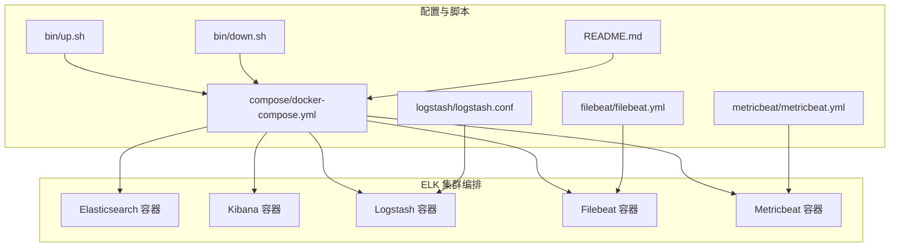
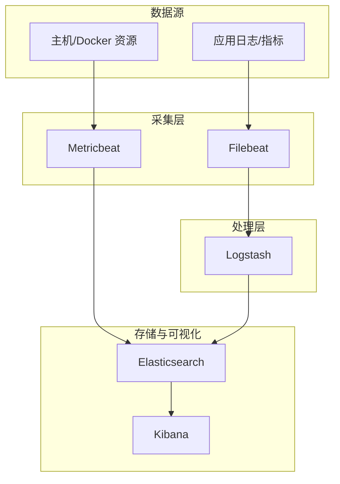
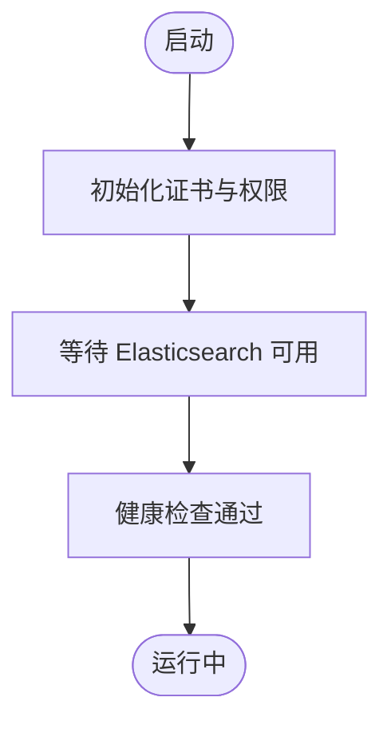
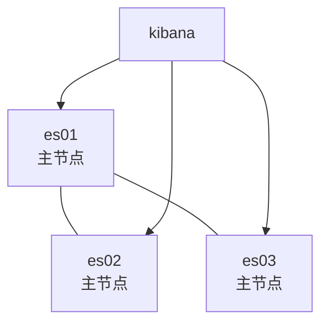
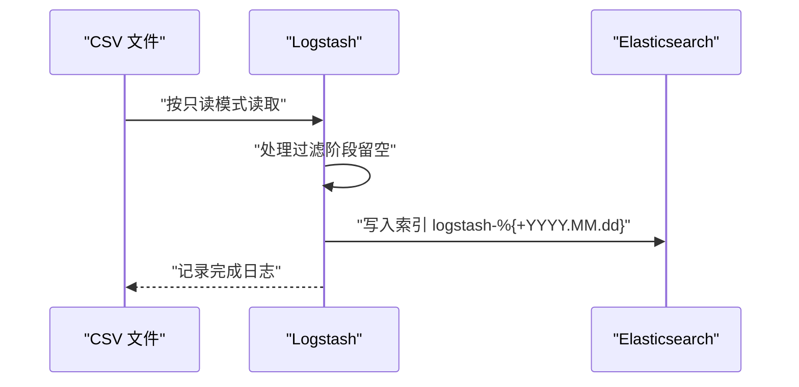
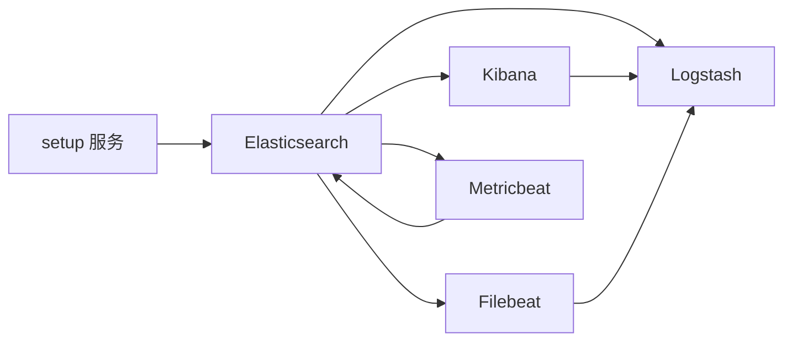

# 搜索引擎与可观测性

<cite>
**本文引用的文件**
- [docker-compose.yml（ELK 集群）](file://docker-compose/elk-cluster/compose/docker-compose.yml)
- [logstash.conf](file://docker-compose/elk-cluster/logstash/logstash.conf)
- [filebeat.yml](file://docker-compose/elk-cluster/filebeat/filebeat.yml)
- [metricbeat.yml](file://docker-compose/elk-cluster/metricbeat/metricbeat.yml)
- [README.md（ELK 集群）](file://docker-compose/elk-cluster/README.md)
- [up.sh（ELK 集群）](file://docker-compose/elk-cluster/bin/up.sh)
- [down.sh（ELK 集群）](file://docker-compose/elk-cluster/bin/down.sh)
- [docker-compose.yml（Elasticsearch 单节点）](file://docker-compose/elasticsearch-single/compose/docker-compose.yml)
- [README.md（Elasticsearch 单节点）](file://docker-compose/elasticsearch-single/README.md)
- [docker-compose.yml（Elasticsearch 多节点）](file://docker-compose/elasticsearch-cluster/compose/docker-compose.yml)
- [README.md（Elasticsearch 多节点）](file://docker-compose/elasticsearch-cluster/README.md)
</cite>

## 目录
1. [简介](#简介)
2. [项目结构](#项目结构)
3. [核心组件](#核心组件)
4. [架构总览](#架构总览)
5. [组件详解](#组件详解)
6. [依赖关系分析](#依赖关系分析)
7. [性能与容量规划](#性能与容量规划)
8. [故障排查指南](#故障排查指南)
9. [结论](#结论)
10. [附录](#附录)

## 简介
本文件面向搜索引擎与可观测性场景，系统化梳理基于 Docker Compose 的 Elasticsearch 与 ELK 栈部署方案，覆盖单节点与多节点集群、Logstash 日志处理、Filebeat 数据采集、Metricbeat 指标监控、索引管理与查询优化、安全配置、性能调优与容量规划等主题。通过仓库中的编排与配置文件，读者可快速理解各组件职责、数据流与控制流，并获得可操作的运维建议。

## 项目结构
该仓库以“按功能域分层”的方式组织：每个服务（如 elasticsearch、kibana、logstash、filebeat、metricbeat）均配有独立的 compose 编排、启动脚本与配置文件；ELK 集群示例同时包含 Logstash、Filebeat、Metricbeat 的完整链路配置。

图表来源
- [docker-compose.yml（ELK 集群）:1-202](file://docker-compose/elk-cluster/compose/docker-compose.yml#L1-L202)
- [logstash.conf:1-28](file://docker-compose/elk-cluster/logstash/logstash.conf#L1-L28)
- [filebeat.yml:1-26](file://docker-compose/elk-cluster/filebeat/filebeat.yml#L1-L26)
- [metricbeat.yml:1-61](file://docker-compose/elk-cluster/metricbeat/metricbeat.yml#L1-L61)
- [up.sh（ELK 集群）:1-32](file://docker-compose/elk-cluster/bin/up.sh#L1-L32)
- [down.sh（ELK 集群）:1-24](file://docker-compose/elk-cluster/bin/down.sh#L1-L24)
- [README.md（ELK 集群）:1-352](file://docker-compose/elk-cluster/README.md#L1-L352)

章节来源
- [docker-compose.yml（ELK 集群）:1-202](file://docker-compose/elk-cluster/compose/docker-compose.yml#L1-L202)
- [README.md（ELK 集群）:1-352](file://docker-compose/elk-cluster/README.md#L1-L352)

## 核心组件
- Elasticsearch：分布式搜索与分析引擎，支持单节点与多节点集群模式，启用安全与 TLS 加密。
- Kibana：可视化与管理界面，连接 Elasticsearch 并提供仪表盘、图表与索引管理能力。
- Logstash：日志处理管道，从文件输入读取数据并写入 Elasticsearch。
- Filebeat：轻量级日志采集器，自动发现容器日志并转发至 Elasticsearch 或 Logstash。
- Metricbeat：系统与服务指标采集器，采集主机、Docker、Elasticsearch、Logstash、Kibana 等指标并输出到 Elasticsearch。

章节来源
- [docker-compose.yml（ELK 集群）:56-197](file://docker-compose/elk-cluster/compose/docker-compose.yml#L56-L197)
- [filebeat.yml:1-26](file://docker-compose/elk-cluster/filebeat/filebeat.yml#L1-L26)
- [metricbeat.yml:1-61](file://docker-compose/elk-cluster/metricbeat/metricbeat.yml#L1-L61)
- [logstash.conf:1-28](file://docker-compose/elk-cluster/logstash/logstash.conf#L1-L28)

## 架构总览
下图展示了 ELK 栈在容器内的交互关系与数据流向：Filebeat 与 Metricbeat 分别采集日志与指标，Logstash 进行处理后写入 Elasticsearch；Kibana 通过 Elasticsearch 提供可视化与管理界面。

图表来源
- [docker-compose.yml（ELK 集群）:155-197](file://docker-compose/elk-cluster/compose/docker-compose.yml#L155-L197)
- [filebeat.yml:1-26](file://docker-compose/elk-cluster/filebeat/filebeat.yml#L1-L26)
- [metricbeat.yml:1-61](file://docker-compose/elk-cluster/metricbeat/metricbeat.yml#L1-L61)
- [logstash.conf:1-28](file://docker-compose/elk-cluster/logstash/logstash.conf#L1-L28)

## 组件详解

### Elasticsearch（单节点）
- 角色与特性：单节点模式，启用安全与 TLS；内存锁定避免交换；健康检查保障可用性。
- 关键配置要点：
  - 环境变量启用安全与证书路径映射
  - 数据/日志/插件持久化卷挂载
  - 健康检查命令与超时重试策略
- 典型用途：开发测试、小规模演示、无需高可用的场景。

图表来源
- [docker-compose.yml（Elasticsearch 单节点）:56-100](file://docker-compose/elasticsearch-single/compose/docker-compose.yml#L56-L100)

章节来源
- [docker-compose.yml（Elasticsearch 单节点）:56-100](file://docker-compose/elasticsearch-single/compose/docker-compose.yml#L56-L100)
- [README.md（Elasticsearch 单节点）:1-315](file://docker-compose/elasticsearch-single/README.md#L1-L315)

### Elasticsearch（多节点集群）
- 角色与特性：三主节点与 Kibana；初始主节点列表与种子主机配置；证书为各节点生成；Kibana 连接所有节点。
- 关键配置要点：
  - 初始主节点与种子主机
  - 各节点独立数据/日志/插件卷
  - 证书生成与验证模式
- 典型用途：生产级高可用与容灾演练。

图表来源
- [docker-compose.yml（Elasticsearch 多节点）:69-200](file://docker-compose/elasticsearch-cluster/compose/docker-compose.yml#L69-L200)

章节来源
- [docker-compose.yml（Elasticsearch 多节点）:69-200](file://docker-compose/elasticsearch-cluster/compose/docker-compose.yml#L69-L200)
- [README.md（Elasticsearch 多节点）:1-194](file://docker-compose/elasticsearch-cluster/README.md#L1-L194)

### Kibana
- 角色与特性：可视化与管理界面；连接 Elasticsearch；启用加密密钥用于 Saved Objects 与 Reporting。
- 关键配置要点：
  - 连接地址与认证用户
  - SSL 证书链路径
  - 内存限制与健康检查

章节来源
- [docker-compose.yml（ELK 集群）:102-128](file://docker-compose/elk-cluster/compose/docker-compose.yml#L102-L128)
- [README.md（ELK 集群）:160-186](file://docker-compose/elk-cluster/README.md#L160-L186)

### Logstash
- 角色与特性：从本地 CSV 文件读取并写入 Elasticsearch；使用只读模式与完成动作记录日志；输出模板指定按日期滚动索引。
- 关键配置要点：
  - 输入插件：文件路径、只读模式、完成后动作
  - 输出插件：目标索引模板、SSL 证书链
- 典型用途：批式数据导入与结构化转换。

图表来源
- [logstash.conf:1-28](file://docker-compose/elk-cluster/logstash/logstash.conf#L1-L28)

章节来源
- [logstash.conf:1-28](file://docker-compose/elk-cluster/logstash/logstash.conf#L1-L28)

### Filebeat
- 角色与特性：自动发现 Docker 容器日志，采集 .log 文件并通过 filestream 输入；输出到 Elasticsearch 并启用 SSL。
- 关键配置要点：
  - inputs：filestream 类型与路径
  - autodiscover：docker 提供者与提示启用
  - processors：添加 Docker 元数据
  - output.elasticsearch：用户名/密码、SSL 证书链

章节来源
- [filebeat.yml:1-26](file://docker-compose/elk-cluster/filebeat/filebeat.yml#L1-L26)

### Metricbeat
- 角色与特性：采集 Elasticsearch、Logstash、Kibana、Docker 等指标；输出到 Elasticsearch 并启用 SSL。
- 关键配置要点：
  - 模块：elasticsearch、logstash、kibana、docker
  - 周期与 SSL 证书链
  - 输出：用户名/密码、SSL 证书链

章节来源
- [metricbeat.yml:1-61](file://docker-compose/elk-cluster/metricbeat/metricbeat.yml#L1-L61)

## 依赖关系分析
- 服务间依赖：
  - setup 完成证书生成后，Elasticsearch 才启动；Kibana 依赖 Elasticsearch 健康；Logstash/Metricbeat/Filebeat 依赖 Elasticsearch 与 Kibana（部分模块）健康。
- 外部依赖：
  - Docker Socket 与 /proc、/sys 等宿主机路径用于 Metricbeat 采集系统信息。
  - SSL 证书由 setup 服务生成并挂载到各服务容器内。

图表来源
- [docker-compose.yml（ELK 集群）:56-197](file://docker-compose/elk-cluster/compose/docker-compose.yml#L56-L197)

章节来源
- [docker-compose.yml（ELK 集群）:56-197](file://docker-compose/elk-cluster/compose/docker-compose.yml#L56-L197)

## 性能与容量规划
- JVM 与内存
  - Elasticsearch 单节点默认堆大小可调整；多节点需确保初始主节点与种子主机配置正确。
  - 建议将堆大小设置为物理内存的 50%，上限不超过 32GB。
- 存储与 IO
  - 推荐使用 SSD；根据写入吞吐调整刷新间隔与段合并策略。
- 索引与查询优化
  - 使用只读模式进行批式导入，避免持续监听导致的资源占用。
  - 对高频字段建立合适的映射与分词策略；合理设置副本数与分片数。
- 安全与网络
  - 生产环境务必启用强口令与 TLS；限制访问端口与网络策略。
- 容量规划
  - 评估日志/指标体量与保留周期，预留磁盘空间与快照策略。
  - 结合业务峰值流量，对 Logstash、Elasticsearch、Kibana 设置合理的内存上限与并发参数。

章节来源
- [README.md（ELK 集群）:314-337](file://docker-compose/elk-cluster/README.md#L314-L337)
- [README.md（Elasticsearch 单节点）:277-296](file://docker-compose/elasticsearch-single/README.md#L277-L296)
- [README.md（Elasticsearch 多节点）:86-89](file://docker-compose/elasticsearch-cluster/README.md#L86-L89)

## 故障排查指南
- 常见问题
  - 内存不足：提高 ES/Kibana/Logstash 的内存限制。
  - SSL 证书错误：确认 setup 服务已完成并重新生成证书。
  - 端口冲突：检查 9200、5601、5044 是否被占用。
  - 权限问题：确认挂载卷权限与只读挂载配置。
- 排查步骤
  - 查看服务状态与日志：使用 compose ps/logs。
  - 验证 Elasticsearch 集群健康与索引列表。
  - 测试 Logstash 管道是否成功写入索引。
- 清理与重置
  - 停止服务并删除 temp 目录以完全清理数据。

章节来源
- [README.md（ELK 集群）:258-286](file://docker-compose/elk-cluster/README.md#L258-L286)
- [up.sh（ELK 集群）:1-32](file://docker-compose/elk-cluster/bin/up.sh#L1-L32)
- [down.sh（ELK 集群）:1-24](file://docker-compose/elk-cluster/bin/down.sh#L1-L24)

## 结论
本仓库提供了从单节点到多节点集群的 Elasticsearch 与 ELK 栈完整编排方案，涵盖安全、采集、处理、存储与可视化的关键环节。结合本文的索引管理、查询优化、性能调优与容量规划建议，可在开发与生产环境中快速落地可观测性平台，并为后续扩展与治理打下基础。

## 附录

### 快速上手（ELK 集群）
- 启动：执行集群启动脚本，查看服务访问信息与健康检查命令。
- 访问：Kibana Web 界面与 Elasticsearch API。
- 验证：使用提供的 curl 命令检查集群健康与索引列表。

章节来源
- [up.sh（ELK 集群）:1-32](file://docker-compose/elk-cluster/bin/up.sh#L1-L32)
- [README.md（ELK 集群）:102-129](file://docker-compose/elk-cluster/README.md#L102-L129)

### 示例用法（应用集成）
- Python/Node.js/Java 应用均可通过标准客户端或日志适配器向 Logstash 发送 JSON 日志，实现统一采集与可视化。

章节来源
- [README.md（ELK 集群）:189-256](file://docker-compose/elk-cluster/README.md#L189-L256)