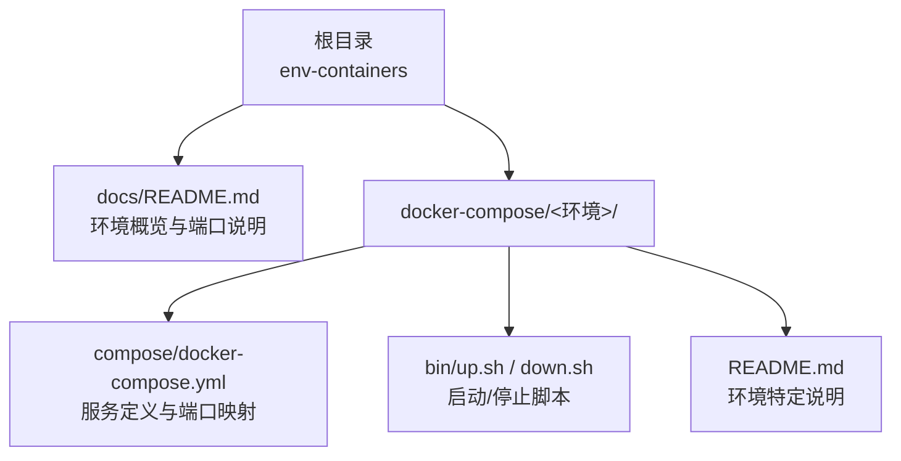
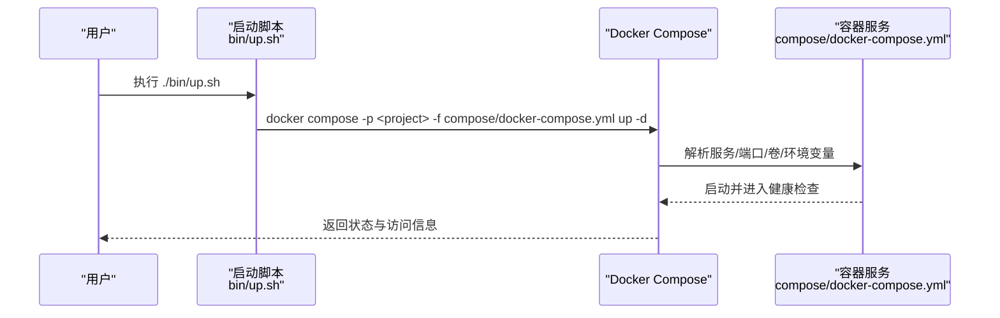
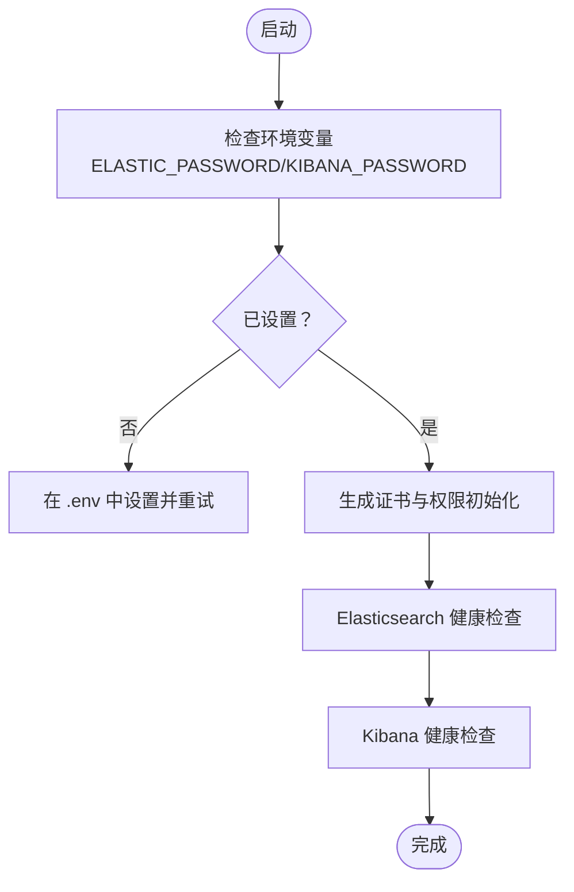
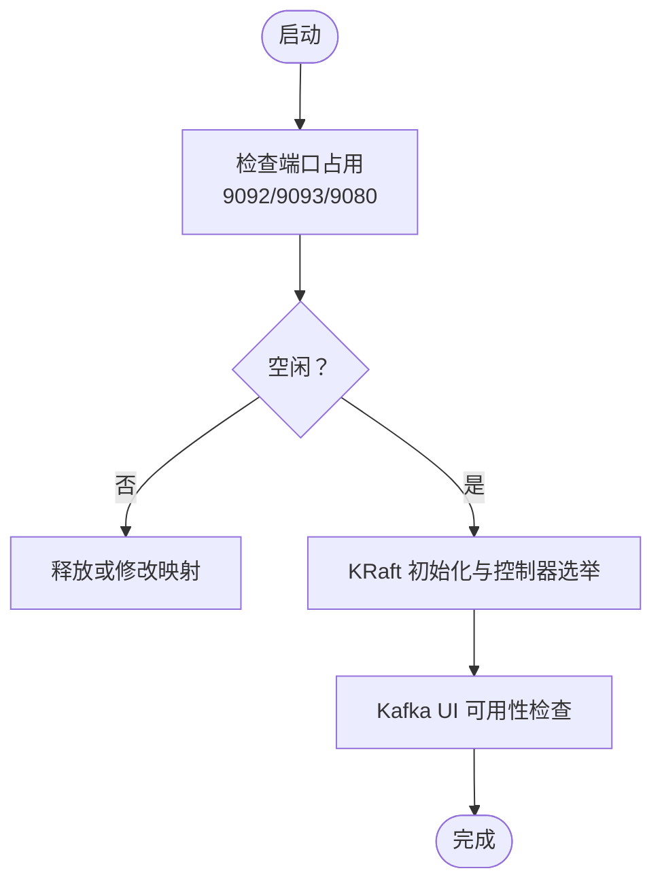
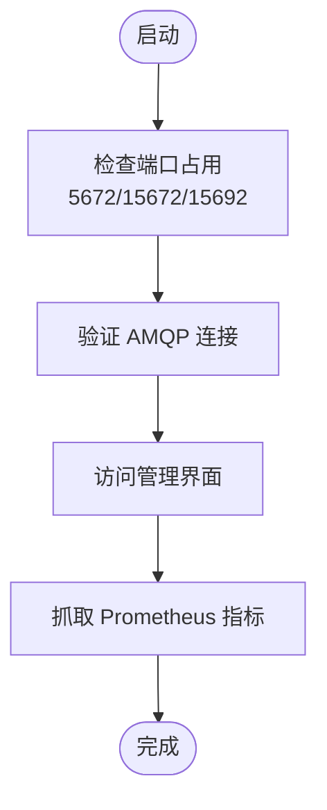
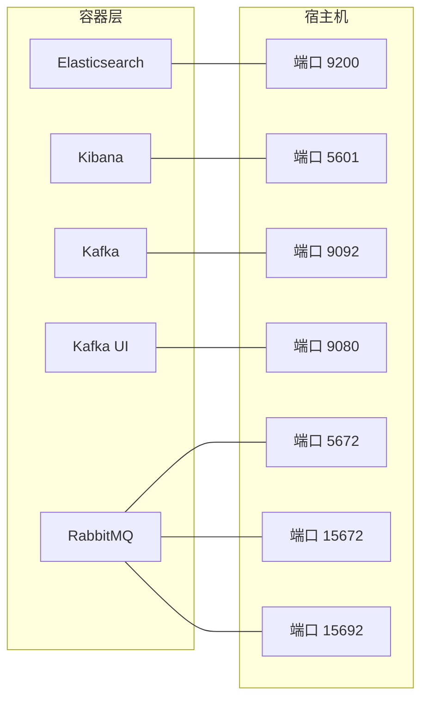

# 故障排除指南

<cite>
**本文引用的文件**
- [README.md](file://README.md)
- [package.json](file://package.json)
- [docs/README.md](file://docs/README.md)
- [docker-compose/elasticsearch-single/compose/docker-compose.yml](file://docker-compose/elasticsearch-single/compose/docker-compose.yml)
- [docker-compose/kafka-single/compose/docker-compose.yml](file://docker-compose/kafka-single/compose/docker-compose.yml)
- [docker-compose/rabbitmq-single/compose/docker-compose.yml](file://docker-compose/rabbitmq-single/compose/docker-compose.yml)
- [docker-compose/mongodb-single/compose/docker-compose.yml](file://docker-compose/mongodb-single/compose/docker-compose.yml)
- [docker-compose/minio-single/compose/docker-compose.yml](file://docker-compose/minio-single/compose/docker-compose.yml)
- [docker-compose/jenkins-single/compose/docker-compose.yml](file://docker-compose/jenkins-single/compose/docker-compose.yml)
- [docker-compose/nexus-single/compose/docker-compose.yml](file://docker-compose/nexus-single/compose/docker-compose.yml)
- [docker-compose/verdaccio-single/compose/docker-compose.yml](file://docker-compose/verdaccio-single/compose/docker-compose.yml)
- [docker-compose/zookeeper-single/compose/docker-compose.yml](file://docker-compose/zookeeper-single/compose/docker-compose.yml)
- [docker-compose/elasticsearch-single/bin/up.sh](file://docker-compose/elasticsearch-single/bin/up.sh)
- [docker-compose/kafka-single/bin/up.sh](file://docker-compose/kafka-single/bin/up.sh)
- [docker-compose/rabbitmq-single/bin/up.sh](file://docker-compose/rabbitmq-single/bin/up.sh)
- [docker-compose/elasticsearch-single/README.md](file://docker-compose/elasticsearch-single/README.md)
- [docker-compose/kafka-single/README.md](file://docker-compose/kafka-single/README.md)
- [docker-compose/rabbitmq-single/README.md](file://docker-compose/rabbitmq-single/README.md)
</cite>

## 目录
1. [简介](#简介)
2. [项目结构](#项目结构)
3. [核心组件](#核心组件)
4. [架构总览](#架构总览)
5. [详细组件分析](#详细组件分析)
6. [依赖关系分析](#依赖关系分析)
7. [性能考量](#性能考量)
8. [故障排除指南](#故障排除指南)
9. [结论](#结论)
10. [附录](#附录)

## 简介
本指南面向使用本仓库提供的 Docker Compose 开发环境的用户，聚焦于启动失败、配置错误与运行时问题的系统化诊断与解决。内容覆盖日志查看、错误分析、问题定位方法，以及端口冲突、权限问题、网络连接与资源不足等常见问题的处理策略；同时提供调试工具使用、性能分析与监控指标解读示例，并给出预防措施与最佳实践。

## 项目结构
- 每个环境遵循统一目录布局：环境名/README.md、bin/up.sh、bin/down.sh、compose/docker-compose.yml。
- 启动与停止通过标准化脚本执行 docker compose up -d 或 down，便于快速排查与复现问题。
- 文档集中于 docs/README.md，提供各服务的端口、UI、数据卷与使用要点，是故障定位的重要参考。

图表来源
- [docs/README.md:71-83](file://docs/README.md#L71-L83)
- [docker-compose/elasticsearch-single/compose/docker-compose.yml:1-134](file://docker-compose/elasticsearch-single/compose/docker-compose.yml#L1-L134)
- [docker-compose/kafka-single/compose/docker-compose.yml:1-54](file://docker-compose/kafka-single/compose/docker-compose.yml#L1-L54)
- [docker-compose/rabbitmq-single/compose/docker-compose.yml:1-38](file://docker-compose/rabbitmq-single/compose/docker-compose.yml#L1-L38)

章节来源
- [docs/README.md:71-83](file://docs/README.md#L71-L83)
- [README.md:1-6](file://README.md#L1-L6)

## 核心组件
- 启动脚本：各环境 bin/up.sh 统一以 docker compose -p <project> 启动，便于按项目名定位与排查。
- 配置文件：compose/docker-compose.yml 定义服务、端口、卷、环境变量与健康检查，是定位配置类问题的关键。
- 环境文档：各环境 README.md 提供访问信息、常用命令与注意事项，用于核对端口占用、凭据与功能开关。

章节来源
- [docker-compose/elasticsearch-single/bin/up.sh:14-15](file://docker-compose/elasticsearch-single/bin/up.sh#L14-L15)
- [docker-compose/kafka-single/bin/up.sh:14-15](file://docker-compose/kafka-single/bin/up.sh#L14-L15)
- [docker-compose/rabbitmq-single/bin/up.sh:29-30](file://docker-compose/rabbitmq-single/bin/up.sh#L29-L30)
- [docker-compose/elasticsearch-single/README.md:14-28](file://docker-compose/elasticsearch-single/README.md#L14-L28)
- [docker-compose/kafka-single/README.md:14-28](file://docker-compose/kafka-single/README.md#L14-L28)
- [docker-compose/rabbitmq-single/README.md:13-34](file://docker-compose/rabbitmq-single/README.md#L13-L34)

## 架构总览
下图展示各单实例环境的典型启动流程与依赖关系（以 ES/Kafka/RabbitMQ 为例）：

图表来源
- [docker-compose/elasticsearch-single/bin/up.sh:14-15](file://docker-compose/elasticsearch-single/bin/up.sh#L14-L15)
- [docker-compose/kafka-single/bin/up.sh:14-15](file://docker-compose/kafka-single/bin/up.sh#L14-L15)
- [docker-compose/rabbitmq-single/bin/up.sh:29-30](file://docker-compose/rabbitmq-single/bin/up.sh#L29-L30)
- [docker-compose/elasticsearch-single/compose/docker-compose.yml:1-134](file://docker-compose/elasticsearch-single/compose/docker-compose.yml#L1-L134)
- [docker-compose/kafka-single/compose/docker-compose.yml:1-54](file://docker-compose/kafka-single/compose/docker-compose.yml#L1-L54)
- [docker-compose/rabbitmq-single/compose/docker-compose.yml:1-38](file://docker-compose/rabbitmq-single/compose/docker-compose.yml#L1-L38)

## 详细组件分析

### Elasticsearch 单节点
- 关键点
  - 端口：9200（HTTP）、5601（Kibana）
  - 健康检查：es01 使用 HTTPS 校验，kibana 使用 HTTP 302 跳转校验
  - 数据卷：esdata01、eslogs01、esplugins01
  - 安全：启用 SSL 与认证，首次启动会生成证书并设置 kibana_system 密码
- 典型问题
  - 启动后无法访问：检查 9200/5601 是否被占用，确认证书生成完成且权限正确
  - 认证失败：确认 ELASTIC_PASSWORD/KIBANA_PASSWORD 已在 .env 中设置
  - 内存限制：mem_limit 与宿主机内存匹配，必要时调整 JVM 设置

图表来源
- [docker-compose/elasticsearch-single/compose/docker-compose.yml:7-50](file://docker-compose/elasticsearch-single/compose/docker-compose.yml#L7-L50)
- [docker-compose/elasticsearch-single/compose/docker-compose.yml:92-128](file://docker-compose/elasticsearch-single/compose/docker-compose.yml#L92-L128)

章节来源
- [docker-compose/elasticsearch-single/compose/docker-compose.yml:1-134](file://docker-compose/elasticsearch-single/compose/docker-compose.yml#L1-L134)
- [docker-compose/elasticsearch-single/README.md:14-315](file://docker-compose/elasticsearch-single/README.md#L14-L315)

### Kafka 单节点（KRaft 模式）
- 关键点
  - 端口：9092（Broker）、9093（Controller）、9080（UI）
  - KRaft：无 ZooKeeper 依赖，简化部署
  - 数据卷：kafka/data、kafka/logs
- 典型问题
  - 端口冲突：确保 9092/9093/9080 未被占用
  - UI 不可用：确认 kafka-ui 的集群名称与 bootstrap 地址一致
  - 性能：合理设置分区数与复制因子，生产环境建议集群模式

图表来源
- [docker-compose/kafka-single/compose/docker-compose.yml:1-54](file://docker-compose/kafka-single/compose/docker-compose.yml#L1-L54)

章节来源
- [docker-compose/kafka-single/compose/docker-compose.yml:1-54](file://docker-compose/kafka-single/compose/docker-compose.yml#L1-L54)
- [docker-compose/kafka-single/README.md:1-155](file://docker-compose/kafka-single/README.md#L1-L155)

### RabbitMQ 单节点
- 关键点
  - 端口：5672（AMQP）、15672（管理界面）、15692（Prometheus）
  - 插件：management、prometheus 已启用
  - 数据卷：data、logs、config
- 典型问题
  - 管理界面 401/403：确认凭据与虚拟主机配置
  - 连接失败：检查 5672 是否被占用，容器网络别名是否可达
  - 监控：访问 http://localhost:15692/metrics 获取指标

图表来源
- [docker-compose/rabbitmq-single/compose/docker-compose.yml:1-38](file://docker-compose/rabbitmq-single/compose/docker-compose.yml#L1-L38)

章节来源
- [docker-compose/rabbitmq-single/compose/docker-compose.yml:1-38](file://docker-compose/rabbitmq-single/compose/docker-compose.yml#L1-L38)
- [docker-compose/rabbitmq-single/README.md:1-233](file://docker-compose/rabbitmq-single/README.md#L1-L233)

### 其他单实例环境（对照参考）
- MongoDB：端口 27017，默认凭据 hz_9/123456，数据卷 /data/db
- MinIO：端口 9000（API）、9001（控制台），默认凭据 hz_9/12345678
- Jenkins：端口 8080、50000，挂载 /var/jenkins_home 与 docker.sock
- Nexus：端口 8081，数据卷 /nexus-data
- Verdaccio：端口 4873，存储与插件卷
- ZooKeeper：端口 2181，附带 Zoonavigator 控制台 9000

章节来源
- [docker-compose/mongodb-single/compose/docker-compose.yml:1-21](file://docker-compose/mongodb-single/compose/docker-compose.yml#L1-L21)
- [docker-compose/minio-single/compose/docker-compose.yml:1-25](file://docker-compose/minio-single/compose/docker-compose.yml#L1-L25)
- [docker-compose/jenkins-single/compose/docker-compose.yml:1-22](file://docker-compose/jenkins-single/compose/docker-compose.yml#L1-L22)
- [docker-compose/nexus-single/compose/docker-compose.yml:1-19](file://docker-compose/nexus-single/compose/docker-compose.yml#L1-L19)
- [docker-compose/verdaccio-single/compose/docker-compose.yml:1-21](file://docker-compose/verdaccio-single/compose/docker-compose.yml#L1-L21)
- [docker-compose/zookeeper-single/compose/docker-compose.yml:1-31](file://docker-compose/zookeeper-single/compose/docker-compose.yml#L1-L31)

## 依赖关系分析
- 项目内依赖
  - 各环境独立的 docker-compose.yml 定义了服务间依赖（如 RabbitMQ 的 healthcheck 依赖自身状态）
  - 网络默认桥接，容器可通过别名通信
- 外部依赖
  - Docker 引擎与 Compose 插件
  - 宿主机端口与磁盘空间

图表来源
- [docker-compose/elasticsearch-single/compose/docker-compose.yml:68-113](file://docker-compose/elasticsearch-single/compose/docker-compose.yml#L68-L113)
- [docker-compose/kafka-single/compose/docker-compose.yml:31-49](file://docker-compose/kafka-single/compose/docker-compose.yml#L31-L49)
- [docker-compose/rabbitmq-single/compose/docker-compose.yml:25-28](file://docker-compose/rabbitmq-single/compose/docker-compose.yml#L25-L28)

章节来源
- [docker-compose/elasticsearch-single/compose/docker-compose.yml:1-134](file://docker-compose/elasticsearch-single/compose/docker-compose.yml#L1-L134)
- [docker-compose/kafka-single/compose/docker-compose.yml:1-54](file://docker-compose/kafka-single/compose/docker-compose.yml#L1-L54)
- [docker-compose/rabbitmq-single/compose/docker-compose.yml:1-38](file://docker-compose/rabbitmq-single/compose/docker-compose.yml#L1-L38)

## 性能考量
- JVM 与内存
  - Elasticsearch：可调整 ES_JAVA_OPTS 以提升堆大小，避免内存不足导致 OOM
  - RabbitMQ：通过 RABBITMQ_VM_MEMORY_HIGH_WATERMARK 控制内存水位
- 系统参数
  - Elasticsearch 在 Linux 上需提高 vm.max_map_count
- 存储与 IO
  - 合理规划数据卷与磁盘配额，避免写入阻塞与慢 IO 影响吞吐

章节来源
- [docker-compose/elasticsearch-single/README.md:277-296](file://docker-compose/elasticsearch-single/README.md#L277-L296)
- [docker-compose/rabbitmq-single/README.md:213-224](file://docker-compose/rabbitmq-single/README.md#L213-L224)

## 故障排除指南

### 通用诊断步骤
- 确认项目名与工作目录
  - 使用 bin/up.sh 时，确保当前目录为具体环境目录，脚本以 -p <project> 启动
- 查看容器状态
  - docker compose -p <project> ps
- 查看日志
  - docker compose -p <project> logs <service>
- 健康检查
  - 依据 compose 中 healthcheck 配置判断服务可用性

章节来源
- [docker-compose/elasticsearch-single/bin/up.sh:14-31](file://docker-compose/elasticsearch-single/bin/up.sh#L14-L31)
- [docker-compose/kafka-single/bin/up.sh:14-33](file://docker-compose/kafka-single/bin/up.sh#L14-L33)
- [docker-compose/rabbitmq-single/bin/up.sh:29-54](file://docker-compose/rabbitmq-single/bin/up.sh#L29-L54)

### 启动失败
- 症状
  - 容器立即退出或反复重启
- 排查要点
  - 检查环境变量是否完整（如 ES 的密码、Kafka 的监听与广告地址）
  - 检查端口是否被占用（9200/5601/9092/9080/5672/15672/15692）
  - 查看健康检查失败原因（es01/kibana/kafka/rabbitmq 的健康探针）
- 处理建议
  - 释放端口或修改映射
  - 补充缺失的环境变量并重新启动
  - 对于 ES，确认证书生成完成且权限正确

章节来源
- [docker-compose/elasticsearch-single/compose/docker-compose.yml:7-50](file://docker-compose/elasticsearch-single/compose/docker-compose.yml#L7-L50)
- [docker-compose/kafka-single/compose/docker-compose.yml:13-33](file://docker-compose/kafka-single/compose/docker-compose.yml#L13-L33)
- [docker-compose/rabbitmq-single/compose/docker-compose.yml:29-33](file://docker-compose/rabbitmq-single/compose/docker-compose.yml#L29-L33)

### 配置错误
- 症状
  - 认证失败、UI 登录异常、Kafka UI 无法连接
- 排查要点
  - ES：确认 ELASTIC_PASSWORD/KIBANA_PASSWORD 已设置，kibana_system 密码已初始化
  - Kafka：确认 KAFKA_ADVERTISED_LISTENERS 与 UI 配置一致
  - RabbitMQ：确认 RABBITMQ_DEFAULT_USER/PASS/VHOST 正确
- 处理建议
  - 在 .env 或 docker-compose.yml 中补齐变量
  - 重新执行启动脚本使新配置生效

章节来源
- [docker-compose/elasticsearch-single/compose/docker-compose.yml:7-50](file://docker-compose/elasticsearch-single/compose/docker-compose.yml#L7-L50)
- [docker-compose/kafka-single/compose/docker-compose.yml:13-22](file://docker-compose/kafka-single/compose/docker-compose.yml#L13-L22)
- [docker-compose/rabbitmq-single/compose/docker-compose.yml:15-24](file://docker-compose/rabbitmq-single/compose/docker-compose.yml#L15-L24)

### 运行时问题

#### 端口冲突
- 症状
  - 启动时报端口已被占用
- 排查与处理
  - 使用 netstat/lsof/ ss 等工具定位占用进程
  - 修改 docker-compose.yml 中的 hostPort 映射或释放宿主端口
  - 重启相关服务后再试

章节来源
- [docker-compose/elasticsearch-single/README.md:308](file://docker-compose/elasticsearch-single/README.md#L308)
- [docker-compose/kafka-single/README.md:148](file://docker-compose/kafka-single/README.md#L148)
- [docker-compose/rabbitmq-single/README.md:227](file://docker-compose/rabbitmq-single/README.md#L227)

#### 权限问题
- 症状
  - ES 启动后权限不正确导致证书读取失败
- 排查与处理
  - 确认 certs 目录权限与属主符合健康检查要求
  - 重新执行启动脚本以触发权限修正逻辑

章节来源
- [docker-compose/elasticsearch-single/compose/docker-compose.yml:41-44](file://docker-compose/elasticsearch-single/compose/docker-compose.yml#L41-L44)

#### 网络连接问题
- 症状
  - 容器间无法通过别名通信，或外部无法访问
- 排查与处理
  - 检查 networks.default.name 与容器别名
  - 使用 docker inspect 查看网络与 IP 分配
  - 确保 advertised/listeners 地址与宿主映射一致（Kafka）

章节来源
- [docker-compose/elasticsearch-single/compose/docker-compose.yml:130-134](file://docker-compose/elasticsearch-single/compose/docker-compose.yml#L130-L134)
- [docker-compose/kafka-single/compose/docker-compose.yml:18-19](file://docker-compose/kafka-single/compose/docker-compose.yml#L18-L19)

#### 资源不足
- 症状
  - 容器频繁 OOM 或性能抖动
- 排查与处理
  - ES：调整 JVM 堆大小与 vm.max_map_count
  - RabbitMQ：调优内存上限与磁盘告警阈值
  - 扩大宿主机资源或减少并发

章节来源
- [docker-compose/elasticsearch-single/README.md:277-296](file://docker-compose/elasticsearch-single/README.md#L277-L296)
- [docker-compose/rabbitmq-single/README.md:213-224](file://docker-compose/rabbitmq-single/README.md#L213-L224)

### 日志查看与错误分析
- 常用命令
  - docker compose -p <project> ps
  - docker compose -p <project> logs <service>
  - docker compose -p <project> logs -f <service>（实时）
- 分析要点
  - ES：关注证书生成、安全模块初始化与健康检查输出
  - Kafka：关注控制器选举与消费者组状态
  - RabbitMQ：关注插件加载与队列状态

章节来源
- [docker-compose/elasticsearch-single/bin/up.sh:14-31](file://docker-compose/elasticsearch-single/bin/up.sh#L14-L31)
- [docker-compose/kafka-single/bin/up.sh:14-33](file://docker-compose/kafka-single/bin/up.sh#L14-L33)
- [docker-compose/rabbitmq-single/bin/up.sh:29-54](file://docker-compose/rabbitmq-single/bin/up.sh#L29-L54)

### 调试工具与监控
- 调试工具
  - curl：验证 ES/Kibana/Kafka UI 的可用性
  - docker exec：进入容器内部执行命令（如 kafka-topics.sh、rabbitmqctl）
- 监控指标
  - RabbitMQ：访问 http://localhost:15692/metrics 抓取 Prometheus 指标
  - ES：通过 _cat/_cluster API 观察健康与节点状态

章节来源
- [docker-compose/elasticsearch-single/README.md:103-114](file://docker-compose/elasticsearch-single/README.md#L103-L114)
- [docker-compose/rabbitmq-single/README.md:29-34](file://docker-compose/rabbitmq-single/README.md#L29-L34)

### 预防措施与最佳实践
- 启动前检查
  - 确认端口未被占用，环境变量齐全，数据卷权限正确
- 配置规范
  - 生产环境开启安全与加密，避免明文凭据
- 运维规范
  - 定期备份数据卷，监控磁盘与内存使用
  - 使用集群模式替代单节点以获得高可用

章节来源
- [docs/README.md:85-90](file://docs/README.md#L85-L90)
- [docker-compose/elasticsearch-single/README.md:306-315](file://docker-compose/elasticsearch-single/README.md#L306-L315)
- [docker-compose/kafka-single/README.md:146-155](file://docker-compose/kafka-single/README.md#L146-L155)
- [docker-compose/rabbitmq-single/README.md:225-233](file://docker-compose/rabbitmq-single/README.md#L225-L233)

## 结论
本指南提供了基于仓库实际配置的系统化故障排除方法，涵盖启动失败、配置错误、运行时问题的诊断路径与处理策略。结合日志、健康检查与监控指标，可快速定位并解决问题；同时建议在生产环境中启用安全与集群模式，以提升稳定性与可维护性。

## 附录
- 快速命令索引
  - 启动：./bin/up.sh
  - 停止：./bin/down.sh
  - 查看状态：docker compose -p <project> ps
  - 查看日志：docker compose -p <project> logs <service>
  - 实时日志：docker compose -p <project> logs -f <service>

章节来源
- [docs/README.md:5-14](file://docs/README.md#L5-L14)
- [docker-compose/elasticsearch-single/bin/up.sh:14-31](file://docker-compose/elasticsearch-single/bin/up.sh#L14-L31)
- [docker-compose/kafka-single/bin/up.sh:14-33](file://docker-compose/kafka-single/bin/up.sh#L14-L33)
- [docker-compose/rabbitmq-single/bin/up.sh:29-54](file://docker-compose/rabbitmq-single/bin/up.sh#L29-L54)