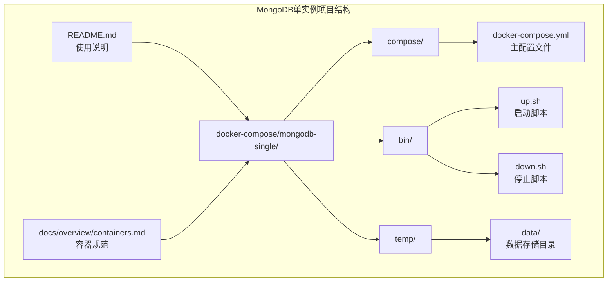
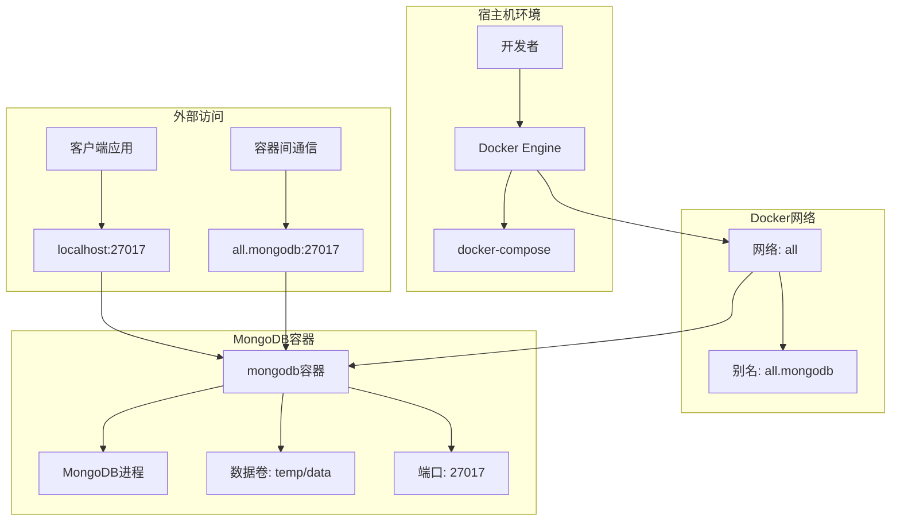
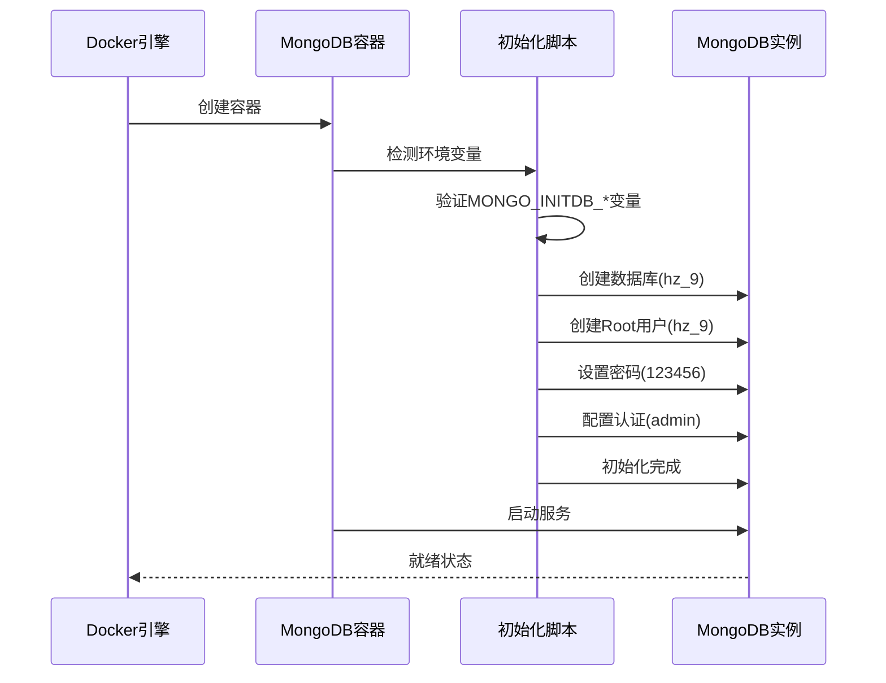
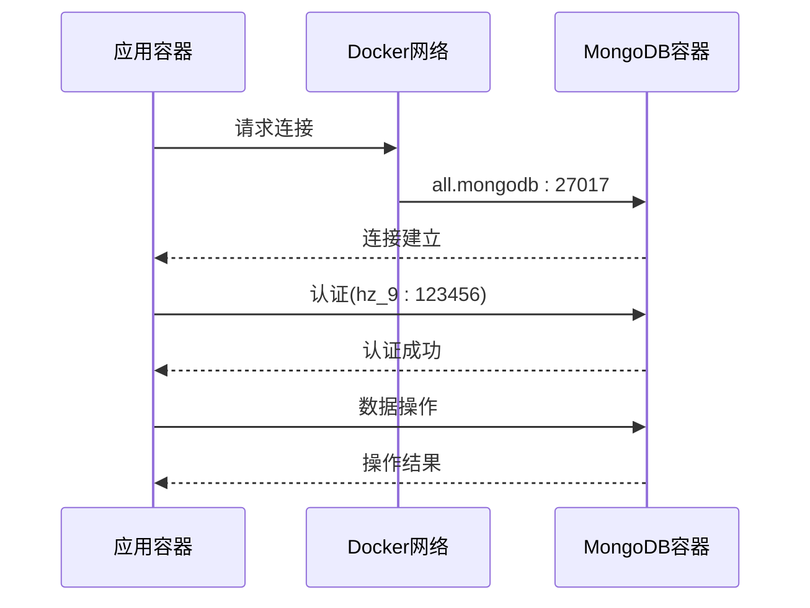
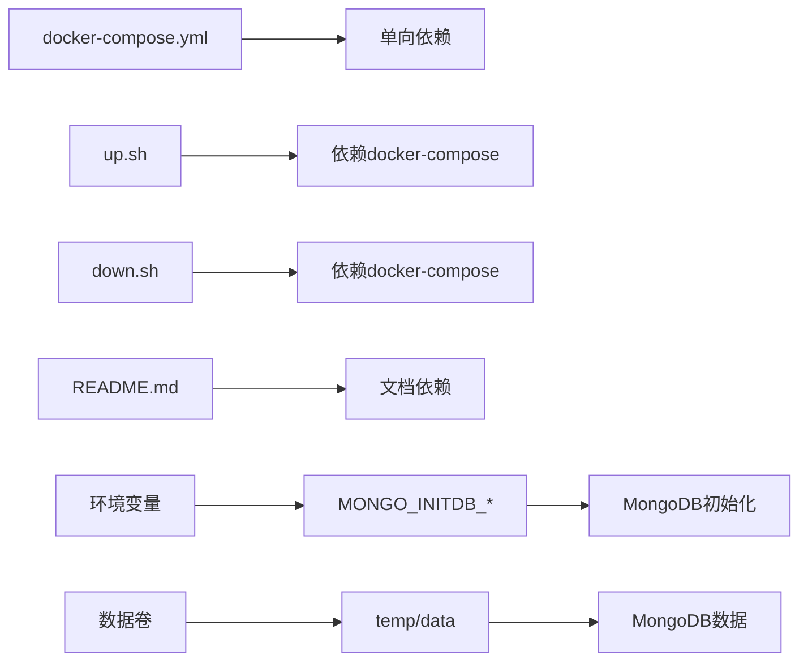

# MongoDB单实例环境

<cite>
**本文档引用的文件**
- [docker-compose.yml](file://docker-compose/mongodb-single/compose/docker-compose.yml)
- [up.sh](file://docker-compose/mongodb-single/bin/up.sh)
- [down.sh](file://docker-compose/mongodb-single/bin/down.sh)
- [README.md](file://docker-compose/mongodb-single/README.md)
- [containers.md](file://docs/overview/containers.md)
</cite>

## 目录
1. [简介](#简介)
2. [项目结构](#项目结构)
3. [核心组件](#核心组件)
4. [架构概览](#架构概览)
5. [详细组件分析](#详细组件分析)
6. [依赖关系分析](#依赖关系分析)
7. [性能考虑](#性能考虑)
8. [故障排除指南](#故障排除指南)
9. [结论](#结论)

## 简介

本项目提供了一个完整的MongoDB单实例容器化部署解决方案，专为开发和测试环境设计。该方案通过Docker Compose实现了MongoDB数据库的快速部署，包含了完整的数据持久化策略、网络配置和环境变量设置。

MongoDB单实例环境适用于以下场景：
- 开发环境中的简单本地开发测试
- 原型开发的快速验证
- MongoDB学习和测试
- 资源受限环境下的轻量级部署

## 项目结构

MongoDB单实例项目的整体结构采用模块化组织方式，主要包含以下关键目录和文件：



**图表来源**
- [docker-compose.yml:1-21](file://docker-compose/mongodb-single/compose/docker-compose.yml#L1-L21)
- [up.sh:1-23](file://docker-compose/mongodb-single/bin/up.sh#L1-L23)
- [down.sh:1-20](file://docker-compose/mongodb-single/bin/down.sh#L1-L20)

**章节来源**
- [docker-compose.yml:1-21](file://docker-compose/mongodb-single/compose/docker-compose.yml#L1-L21)
- [README.md:1-95](file://docker-compose/mongodb-single/README.md#L1-L95)

## 核心组件

### Docker Compose配置详解

MongoDB单实例的核心配置位于`docker-compose.yml`文件中，该文件定义了完整的容器化部署参数：

#### 基础服务配置
- **镜像版本**: 使用mongo:4.0-xenial官方镜像
- **容器名称**: mongodb（便于识别和管理）
- **重启策略**: always（确保服务持续可用）

#### 网络配置
- **网络名称**: all（自定义网络名称）
- **网络别名**: all.mongodb（容器间通信标识符）
- **网络类型**: bridge（Docker默认网络类型）

#### 数据持久化
- **卷挂载路径**: ../temp/data:/data/db
- **主机目录**: temp/data（相对路径，自动创建）
- **容器内路径**: /data/db（MongoDB数据目录）

#### 环境变量配置
系统使用MONGO_INITDB_*系列环境变量进行初始化配置：

| 环境变量 | 值 | 作用 |
|---------|-----|------|
| MONGO_INITDB_DATABASE | hz_9 | 初始化数据库名称 |
| MONGO_INITDB_ROOT_USERNAME | hz_9 | Root用户用户名 |
| MONGO_INITDB_ROOT_PASSWORD | 123456 | Root用户密码 |

#### 端口映射
- **主机端口**: 27017
- **容器端口**: 27017
- **协议**: TCP

**章节来源**
- [docker-compose.yml:1-21](file://docker-compose/mongodb-single/compose/docker-compose.yml#L1-L21)
- [README.md:66-81](file://docker-compose/mongodb-single/README.md#L66-L81)

### 启动和停止脚本

项目提供了两个便捷的Shell脚本来管理MongoDB服务的生命周期：

#### 启动脚本功能
- 自动检测项目根目录
- 使用docker compose启动服务
- 显示连接信息和状态查询命令
- 支持项目命名空间mongodb-single

#### 停止脚本功能
- 安全停止MongoDB容器
- 清理镜像资源（仅本地镜像）
- 保留数据卷以确保数据持久化

**章节来源**
- [up.sh:1-23](file://docker-compose/mongodb-single/bin/up.sh#L1-L23)
- [down.sh:1-20](file://docker-compose/mongodb-single/bin/down.sh#L1-L20)

## 架构概览

MongoDB单实例环境采用简洁的一层架构设计，所有组件都运行在单个容器中：



**图表来源**
- [docker-compose.yml:6-17](file://docker-compose/mongodb-single/compose/docker-compose.yml#L6-L17)
- [up.sh:19-22](file://docker-compose/mongodb-single/bin/up.sh#L19-L22)

### 网络拓扑分析

该架构采用简单的点对点网络模型：

1. **外部网络接口**: 通过27017端口直接暴露给宿主机
2. **内部网络接口**: 通过all.mongodb别名支持容器间通信
3. **网络隔离**: 所有流量都在Docker桥接网络中处理

**章节来源**
- [docker-compose.yml:6-17](file://docker-compose/mongodb-single/compose/docker-compose.yml#L6-L17)
- [README.md:22-27](file://docker-compose/mongodb-single/README.md#L22-L27)

## 详细组件分析

### MONGO_INITDB系列环境变量机制

MongoDB官方镜像提供了强大的初始化机制，通过MONGO_INITDB_*环境变量实现自动化配置：

#### 初始化流程时序图



**图表来源**
- [docker-compose.yml:12-15](file://docker-compose/mongodb-single/compose/docker-compose.yml#L12-L15)

#### 环境变量详细说明

| 变量名称 | 默认值 | 描述 | 安全影响 |
|---------|--------|------|----------|
| MONGO_INITDB_DATABASE | hz_9 | 初始化数据库名称 | 中等风险 |
| MONGO_INITDB_ROOT_USERNAME | hz_9 | Root用户账户名 | 中等风险 |
| MONGO_INITDB_ROOT_PASSWORD | 123456 | Root用户密码 | 高风险 |

**章节来源**
- [docker-compose.yml:12-15](file://docker-compose/mongodb-single/compose/docker-compose.yml#L12-L15)
- [README.md:68-74](file://docker-compose/mongodb-single/README.md#L68-L74)

### 数据持久化策略

#### 卷挂载机制

```mermaid
flowchart TD
A[宿主机] --> B[temp/data目录]
B --> C[自动创建]
C --> D[权限继承]
E[容器内] --> F[/data/db目录]
F --> G[MongoDB数据文件]
H[卷映射] --> I[temp/data:/data/db]
I --> J[双向同步]
K[数据保护] --> L[停止容器不丢失]
K --> M[删除卷才清理]
```

**图表来源**
- [docker-compose.yml:10-11](file://docker-compose/mongodb-single/compose/docker-compose.yml#L10-L11)

#### 数据存储位置

- **主机路径**: temp/data（相对项目根目录）
- **容器路径**: /data/db（MongoDB默认数据目录）
- **自动创建**: 首次启动时自动创建目录结构

**章节来源**
- [docker-compose.yml:10-11](file://docker-compose/mongodb-single/compose/docker-compose.yml#L10-L11)
- [README.md:57-64](file://docker-compose/mongodb-single/README.md#L57-L64)

### 连接配置详解

#### 外部连接配置

| 参数 | 值 | 说明 |
|------|-----|------|
| 主机地址 | 127.0.0.1 | 本地回环地址 |
| 端口号 | 27017 | MongoDB默认端口 |
| 数据库名 | hz_9 | 认证数据库 |
| 用户名 | hz_9 | Root用户 |
| 密码 | 123456 | Root密码 |
| 认证源 | admin | 认证数据库 |

#### 内部容器通信



**图表来源**
- [README.md:19-27](file://docker-compose/mongodb-single/README.md#L19-L27)

**章节来源**
- [README.md:13-27](file://docker-compose/mongodb-single/README.md#L13-L27)

## 依赖关系分析

### 组件耦合度评估

该项目具有极低的组件耦合度，主要体现在：



**图表来源**
- [docker-compose.yml:1-21](file://docker-compose/mongodb-single/compose/docker-compose.yml#L1-L21)
- [up.sh](file://docker-compose/mongodb-single/bin/up.sh#L15)
- [down.sh](file://docker-compose/mongodb-single/bin/down.sh#L15)

### 外部依赖

- **Docker Engine**: 必需的运行时环境
- **Docker Compose**: 编排工具
- **MongoDB镜像**: mongo:4.0-xenial官方镜像

**章节来源**
- [containers.md:119-151](file://docs/overview/containers.md#L119-L151)

## 性能考虑

### 资源优化建议

虽然这是一个单实例部署，但仍有一些性能优化可以考虑：

#### 系统资源规划
- **内存分配**: 建议至少2GB可用内存
- **CPU核心**: 至少1个可用核心
- **磁盘空间**: 至少10GB可用空间（根据数据量调整）

#### 网络性能
- **端口复用**: 单端口27017避免端口冲突
- **连接池**: 应用层合理配置连接池大小
- **超时设置**: 适当设置连接超时和读取超时

#### 数据库性能
- **索引策略**: 根据查询模式创建合适索引
- **集合设计**: 合理的数据模型设计
- **备份策略**: 定期备份重要数据

## 故障排除指南

### 常见问题及解决方案

#### 1. 端口占用问题

**症状**: 启动失败，提示端口已被占用

**诊断步骤**:
```bash
# 检查端口占用情况
netstat -tulpn | grep 27017

# 查看Docker容器状态
docker compose -p mongodb-single ps
```

**解决方法**:
- 修改端口映射或释放占用端口
- 检查防火墙设置

#### 2. 权限认证失败

**症状**: 连接时报认证错误

**诊断步骤**:
```bash
# 进入容器检查用户
docker exec -it mongodb mongosh

# 检查用户列表
use admin
db.getUsers()

# 验证认证
db.auth("hz_9", "123456")
```

**解决方法**:
- 确认连接字符串中的认证信息
- 检查MONGO_INITDB_*环境变量是否正确设置

#### 3. 数据丢失问题

**症状**: 容器重启后数据消失

**诊断步骤**:
```bash
# 检查数据卷挂载
docker inspect mongodb | grep -A 10 "Mounts"

# 验证数据目录
ls -la temp/data/
```

**解决方法**:
- 确认卷挂载路径正确
- 检查宿主机磁盘空间
- 避免手动删除数据目录

#### 4. 启动脚本执行问题

**症状**: up.sh或down.sh执行失败

**诊断步骤**:
```bash
# 检查脚本权限
chmod +x bin/*.sh

# 查看脚本输出
./bin/up.sh
./bin/down.sh
```

**解决方法**:
- 确保脚本具有执行权限
- 检查Docker服务状态
- 验证compose文件语法

**章节来源**
- [README.md:89-95](file://docker-compose/mongodb-single/README.md#L89-L95)

### 日志分析方法

#### 容器日志查看
```bash
# 查看MongoDB启动日志
docker compose -p mongodb-single logs mongodb

# 实时查看日志
docker compose -p mongodb-single logs -f mongodb

# 查看最近日志
docker compose -p mongodb-single logs --tail=100 mongodb
```

#### 健康检查
```bash
# 检查容器健康状态
docker compose -p mongodb-single ps

# 查看容器资源使用
docker stats mongodb
```

## 结论

MongoDB单实例环境提供了一个完整、简洁且易于使用的容器化部署解决方案。该方案的主要优势包括：

### 技术优势
- **简单易用**: 一键启动，配置最少
- **数据持久**: 自动数据卷挂载，确保数据安全
- **网络友好**: 支持容器内外双向通信
- **可扩展性**: 为后续升级到多实例部署奠定基础

### 最佳实践建议
1. **生产环境安全**: 更改默认凭据，启用TLS加密
2. **监控告警**: 配置容器和数据库监控
3. **定期备份**: 建立自动化备份策略
4. **资源规划**: 根据实际负载调整资源配置

### 发展方向
该单实例部署为更复杂的MongoDB集群部署提供了良好的基础，可以平滑迁移到：
- MongoDB副本集部署
- 分片集群部署
- 企业级高可用方案

通过遵循本文档的配置和最佳实践，用户可以在开发环境中快速搭建稳定可靠的MongoDB数据库服务。