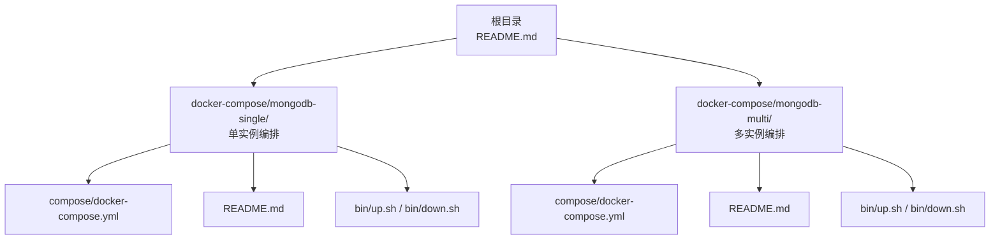
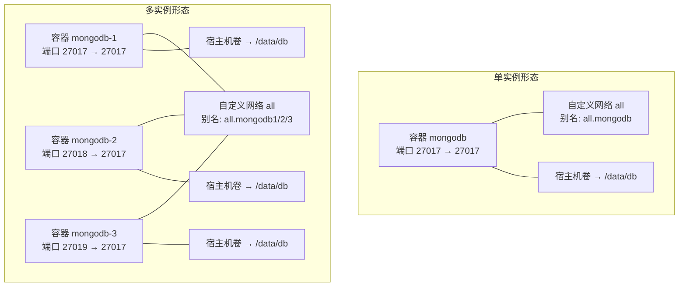
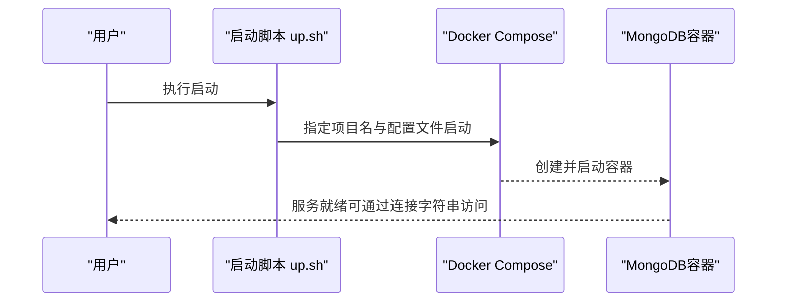
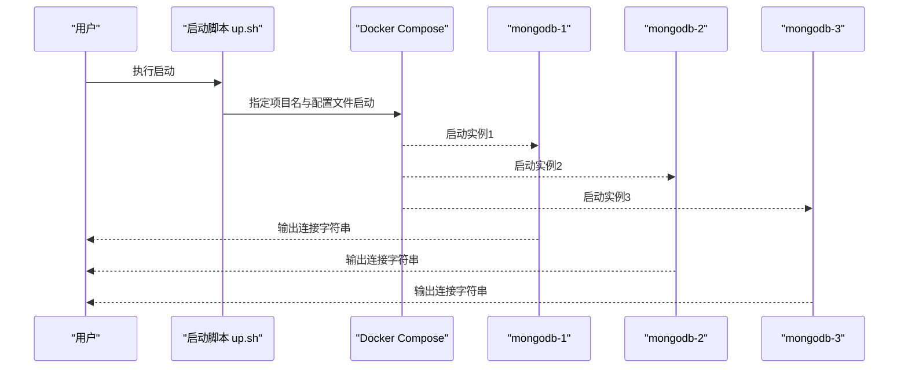
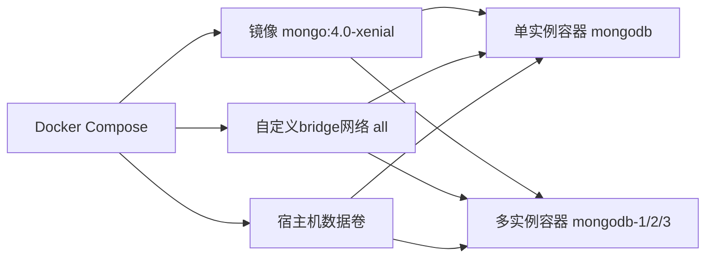

# MongoDB环境

<cite>
**本文引用的文件**
- [docker-compose.yml（单实例）](file://docker-compose/mongodb-single/compose/docker-compose.yml)
- [README.md（单实例）](file://docker-compose/mongodb-single/README.md)
- [up.sh（单实例）](file://docker-compose/mongodb-single/bin/up.sh)
- [down.sh（单实例）](file://docker-compose/mongodb-single/bin/down.sh)
- [docker-compose.yml（多实例）](file://docker-compose/mongodb-multi/compose/docker-compose.yml)
- [README.md（多实例）](file://docker-compose/mongodb-multi/README.md)
- [up.sh（多实例）](file://docker-compose/mongodb-multi/bin/up.sh)
- [down.sh（多实例）](file://docker-compose/mongodb-multi/bin/down.sh)
- [README.md（根目录）](file://README.md)
</cite>

## 目录
1. [简介](#简介)
2. [项目结构](#项目结构)
3. [核心组件](#核心组件)
4. [架构总览](#架构总览)
5. [详细组件分析](#详细组件分析)
6. [依赖关系分析](#依赖关系分析)
7. [性能考虑](#性能考虑)
8. [故障排查指南](#故障排查指南)
9. [结论](#结论)
10. [附录](#附录)

## 简介
本文件面向需要在开发与测试环境中快速搭建与运维MongoDB数据库的用户，基于仓库中的Docker Compose编排方案，系统性说明单实例与多实例（模拟副本集）部署形态、网络与数据持久化配置、连接方式与运维脚本，并给出安全加固、备份恢复、性能监控与诊断的通用实践建议。需要注意：当前仓库提供的多实例编排为独立容器形态，用于演示与学习；若需生产级高可用与自动故障转移，请参考官方副本集配置与运维流程。

## 项目结构
该仓库以“按功能模块划分”的方式组织各中间件的编排与文档，MongoDB相关的内容位于docker-compose/mongodb-*目录中，包含单实例与多实例两套方案，每套方案均提供：
- compose/docker-compose.yml：容器编排定义（镜像、端口映射、卷挂载、环境变量等）
- README.md：使用说明、连接信息、快速启动/停止命令、注意事项
- bin/up.sh、bin/down.sh：一键启动与停止脚本

图表来源
- [README.md（根目录）:1-6](file://README.md#L1-L6)
- [docker-compose.yml（单实例）:1-21](file://docker-compose/mongodb-single/compose/docker-compose.yml#L1-L21)
- [README.md（单实例）:1-95](file://docker-compose/mongodb-single/README.md#L1-L95)
- [up.sh（单实例）:1-23](file://docker-compose/mongodb-single/bin/up.sh#L1-L23)
- [down.sh（单实例）:1-20](file://docker-compose/mongodb-single/bin/down.sh#L1-L20)
- [docker-compose.yml（多实例）:1-55](file://docker-compose/mongodb-multi/compose/docker-compose.yml#L1-L55)
- [README.md（多实例）:1-107](file://docker-compose/mongodb-multi/README.md#L1-L107)
- [up.sh（多实例）:1-25](file://docker-compose/mongodb-multi/bin/up.sh#L1-L25)
- [down.sh（多实例）:1-20](file://docker-compose/mongodb-multi/bin/down.sh#L1-L20)

章节来源
- [README.md（根目录）:1-6](file://README.md#L1-L6)
- [README.md（单实例）:1-95](file://docker-compose/mongodb-single/README.md#L1-L95)
- [README.md（多实例）:1-107](file://docker-compose/mongodb-multi/README.md#L1-L107)

## 核心组件
- 单实例MongoDB容器
  - 镜像版本：mongo:4.0-xenial
  - 数据卷：挂载宿主机目录到容器内默认数据目录，实现持久化
  - 端口映射：27017:27017
  - 初始化凭据：通过环境变量设置初始管理员数据库、用户名与密码
  - 网络：加入自定义bridge网络，支持容器间通过别名访问
- 多实例MongoDB容器（独立运行）
  - 三个独立容器，分别映射不同宿主端口至容器内27017
  - 每个容器拥有独立数据卷，便于隔离
  - 容器间通过同一自定义bridge网络与别名互通

章节来源
- [docker-compose.yml（单实例）:1-21](file://docker-compose/mongodb-single/compose/docker-compose.yml#L1-L21)
- [README.md（单实例）:66-81](file://docker-compose/mongodb-single/README.md#L66-L81)
- [docker-compose.yml（多实例）:1-55](file://docker-compose/mongodb-multi/compose/docker-compose.yml#L1-L55)
- [README.md（多实例）:78-93](file://docker-compose/mongodb-multi/README.md#L78-L93)

## 架构总览
下图展示了两种部署形态的总体架构与交互关系：

图表来源
- [docker-compose.yml（单实例）:1-21](file://docker-compose/mongodb-single/compose/docker-compose.yml#L1-L21)
- [docker-compose.yml（多实例）:1-55](file://docker-compose/mongodb-multi/compose/docker-compose.yml#L1-L55)

## 详细组件分析

### 单实例组件分析
- 运行参数要点
  - 镜像与重启策略：固定镜像版本，启用always重启
  - 网络：加入自定义bridge网络并设置别名，便于跨容器访问
  - 存储：将宿主机目录挂载到容器内默认数据目录
  - 凭据：通过环境变量初始化管理员数据库、用户名与密码
  - 端口：将容器27017映射到宿主机27017
- 连接方式
  - 外部直连：使用宿主机IP与映射端口
  - 容器内互访：通过网络别名与端口访问
- 启停脚本
  - up.sh：定位项目根目录，调用docker compose启动
  - down.sh：停止并移除服务，保留数据卷

图表来源
- [up.sh（单实例）:1-23](file://docker-compose/mongodb-single/bin/up.sh#L1-L23)
- [docker-compose.yml（单实例）:1-21](file://docker-compose/mongodb-single/compose/docker-compose.yml#L1-L21)

章节来源
- [docker-compose.yml（单实例）:1-21](file://docker-compose/mongodb-single/compose/docker-compose.yml#L1-L21)
- [README.md（单实例）:13-27](file://docker-compose/mongodb-single/README.md#L13-L27)
- [up.sh（单实例）:1-23](file://docker-compose/mongodb-single/bin/up.sh#L1-L23)
- [down.sh（单实例）:1-20](file://docker-compose/mongodb-single/bin/down.sh#L1-L20)

### 多实例组件分析
- 组件构成
  - 三个独立容器，分别命名为mongodb-1/2/3
  - 端口映射分别为27017、27018、27019
  - 每个容器拥有独立数据卷，避免数据交叉
  - 均加入同一自定义bridge网络并设置不同别名
- 连接方式
  - 可通过宿主机不同端口直连任一实例
  - 容器内可使用对应网络别名访问
- 启停脚本
  - up.sh：启动三个实例并输出各实例连接字符串
  - down.sh：停止并移除服务，保留数据卷

图表来源
- [up.sh（多实例）:1-25](file://docker-compose/mongodb-multi/bin/up.sh#L1-L25)
- [docker-compose.yml（多实例）:1-55](file://docker-compose/mongodb-multi/compose/docker-compose.yml#L1-L55)

章节来源
- [docker-compose.yml（多实例）:1-55](file://docker-compose/mongodb-multi/compose/docker-compose.yml#L1-L55)
- [README.md（多实例）:15-37](file://docker-compose/mongodb-multi/README.md#L15-L37)
- [up.sh（多实例）:1-25](file://docker-compose/mongodb-multi/bin/up.sh#L1-L25)
- [down.sh（多实例）:1-20](file://docker-compose/mongodb-multi/bin/down.sh#L1-L20)

### 单实例与多实例形态对比
- 配置差异
  - 单实例：仅一个容器与一个数据卷，端口映射唯一
  - 多实例：三个容器与三个数据卷，端口映射各不相同
- 数据复制与高可用
  - 当前多实例为独立容器，未启用副本集复制；如需复制与自动故障转移，请参考官方副本集配置
- 故障转移策略
  - 当前未实现自动故障转移；如需HA，应在副本集形态下进行仲裁节点与优先级配置

章节来源
- [docker-compose.yml（单实例）:1-21](file://docker-compose/mongodb-single/compose/docker-compose.yml#L1-L21)
- [docker-compose.yml（多实例）:1-55](file://docker-compose/mongodb-multi/compose/docker-compose.yml#L1-L55)
- [README.md（多实例）:94-107](file://docker-compose/mongodb-multi/README.md#L94-L107)

### 分片集群与水平扩展
- 当前仓库未提供分片集群编排
- 若需分片集群，通常由Config Server、Shard（含副本集）、Mongos路由组成；请结合官方文档进行部署与维护

章节来源
- [README.md（单实例）:82-87](file://docker-compose/mongodb-single/README.md#L82-L87)
- [README.md（多实例）:94-99](file://docker-compose/mongodb-multi/README.md#L94-L99)

### 认证授权与网络安全
- 认证授权
  - 使用环境变量初始化管理员数据库、用户名与密码
  - 连接字符串示例包含authSource参数，指向认证数据库
- 网络安全
  - 默认暴露27017端口；生产环境建议限制来源IP、启用TLS/SSL、使用防火墙策略
  - 多实例形态通过不同宿主端口区分实例，便于隔离访问

章节来源
- [docker-compose.yml（单实例）:12-16](file://docker-compose/mongodb-single/compose/docker-compose.yml#L12-L16)
- [README.md（单实例）:13-27](file://docker-compose/mongodb-single/README.md#L13-L27)
- [docker-compose.yml（多实例）:12-16](file://docker-compose/mongodb-multi/compose/docker-compose.yml#L12-L16)
- [README.md（多实例）:15-37](file://docker-compose/mongodb-multi/README.md#L15-L37)

### 数据导入导出、备份与恢复
- 导入导出
  - 使用mongoimport/mongoexport或mongodump/mongorestore进行数据迁移与备份
- 备份恢复
  - 建议定期执行逻辑备份；结合容器数据卷快照进行物理备份
- 监控与诊断
  - 结合系统监控与日志采集，关注连接数、慢查询、磁盘空间与CPU/内存占用

章节来源
- [README.md（单实例）:91-94](file://docker-compose/mongodb-single/README.md#L91-L94)
- [README.md（多实例）:101-106](file://docker-compose/mongodb-multi/README.md#L101-L106)

### 聚合管道、索引与事务最佳实践
- 聚合管道
  - 在应用层合理设计聚合阶段顺序，减少中间结果集大小
- 索引策略
  - 基于查询模式建立复合索引；避免过度索引导致写入开销增大
- 事务
  - 单文档写入无需事务；跨集合/跨文档事务应谨慎使用，控制事务时长

章节来源
- [README.md（单实例）:82-87](file://docker-compose/mongodb-single/README.md#L82-L87)
- [README.md（多实例）:94-99](file://docker-compose/mongodb-multi/README.md#L94-L99)

## 依赖关系分析
- 组件耦合
  - 单实例与多实例均依赖Docker Compose进行编排
  - 容器与宿主机之间通过数据卷建立持久化依赖
  - 容器间通过自定义bridge网络实现通信
- 外部依赖
  - Docker与Docker Compose运行环境
  - 宿主机端口与磁盘空间资源

图表来源
- [docker-compose.yml（单实例）:1-21](file://docker-compose/mongodb-single/compose/docker-compose.yml#L1-L21)
- [docker-compose.yml（多实例）:1-55](file://docker-compose/mongodb-multi/compose/docker-compose.yml#L1-L55)

章节来源
- [docker-compose.yml（单实例）:1-21](file://docker-compose/mongodb-single/compose/docker-compose.yml#L1-L21)
- [docker-compose.yml（多实例）:1-55](file://docker-compose/mongodb-multi/compose/docker-compose.yml#L1-L55)

## 性能考虑
- I/O优化
  - 将数据卷挂载至高性能存储；避免与系统盘混用
- 连接管理
  - 控制最大连接数，避免过多并发导致上下文切换开销
- 查询优化
  - 合理使用索引与投影字段，减少不必要的数据传输
- 监控指标
  - 关注缓存命中率、锁等待时间、慢查询数量与磁盘队列长度

## 故障排查指南
- 无法连接
  - 检查端口是否被占用、容器状态是否正常、网络别名是否正确
- 权限问题
  - 确认连接字符串中的认证数据库与凭据是否匹配
- 数据丢失风险
  - 确认数据卷路径与挂载权限，避免误删或覆盖
- 启停异常
  - 使用提供的up.sh/down.sh脚本进行统一启停，必要时查看Compose日志

章节来源
- [README.md（单实例）:89-95](file://docker-compose/mongodb-single/README.md#L89-L95)
- [README.md（多实例）:101-107](file://docker-compose/mongodb-multi/README.md#L101-L107)
- [up.sh（单实例）:1-23](file://docker-compose/mongodb-single/bin/up.sh#L1-L23)
- [down.sh（单实例）:1-20](file://docker-compose/mongodb-single/bin/down.sh#L1-L20)
- [up.sh（多实例）:1-25](file://docker-compose/mongodb-multi/bin/up.sh#L1-L25)
- [down.sh（多实例）:1-20](file://docker-compose/mongodb-multi/bin/down.sh#L1-L20)

## 结论
本仓库提供了MongoDB在开发与测试场景下的便捷部署方案：单实例适合简单验证，多实例可用于隔离与演示。对于生产级高可用与自动故障转移，建议采用官方副本集形态；对于大规模数据与高并发，建议结合分片集群与完善的监控告警体系。同时，务必重视认证授权、网络安全与备份恢复策略，确保数据安全与业务连续性。

## 附录
- 快速开始
  - 单实例：执行单实例启动脚本，使用连接字符串访问
  - 多实例：执行多实例启动脚本，使用对应端口访问任一实例
- 停止与清理
  - 使用对应down.sh停止服务，数据卷默认保留

章节来源
- [README.md（单实例）:29-55](file://docker-compose/mongodb-single/README.md#L29-L55)
- [README.md（多实例）:39-65](file://docker-compose/mongodb-multi/README.md#L39-L65)
- [up.sh（单实例）:1-23](file://docker-compose/mongodb-single/bin/up.sh#L1-L23)
- [down.sh（单实例）:1-20](file://docker-compose/mongodb-single/bin/down.sh#L1-L20)
- [up.sh（多实例）:1-25](file://docker-compose/mongodb-multi/bin/up.sh#L1-L25)
- [down.sh（多实例）:1-20](file://docker-compose/mongodb-multi/bin/down.sh#L1-L20)