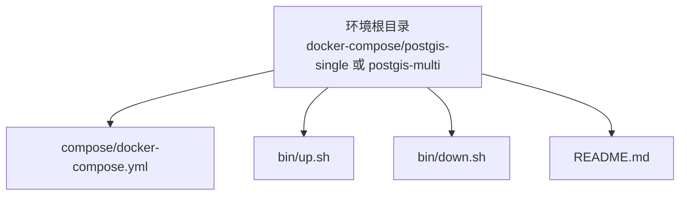
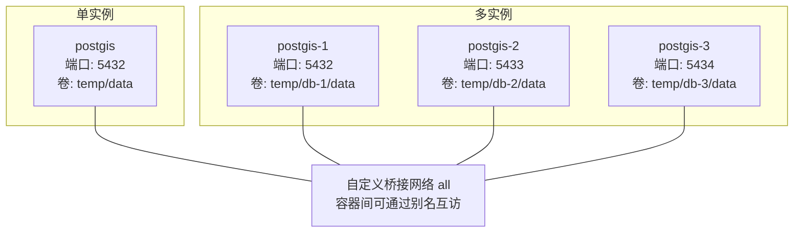
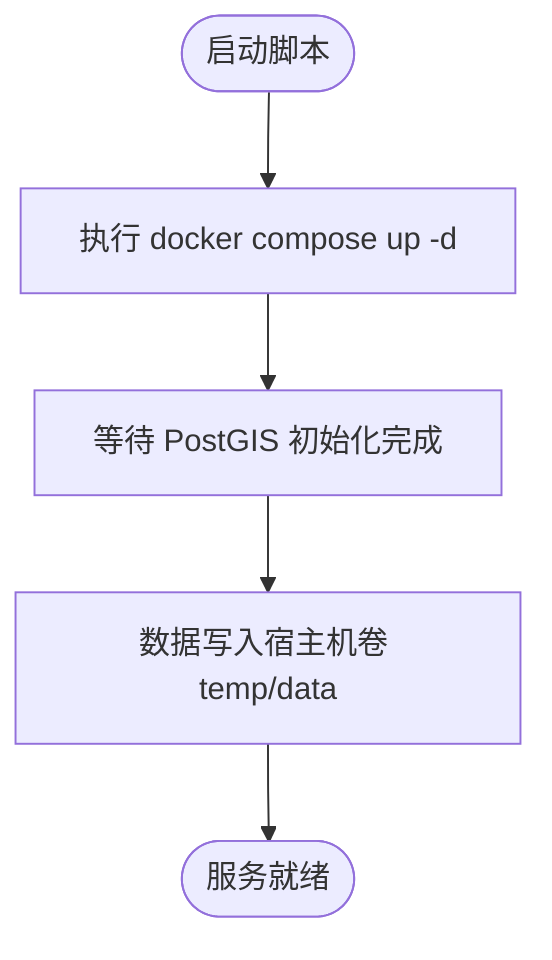
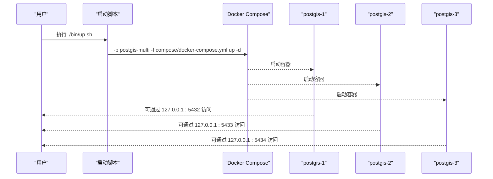
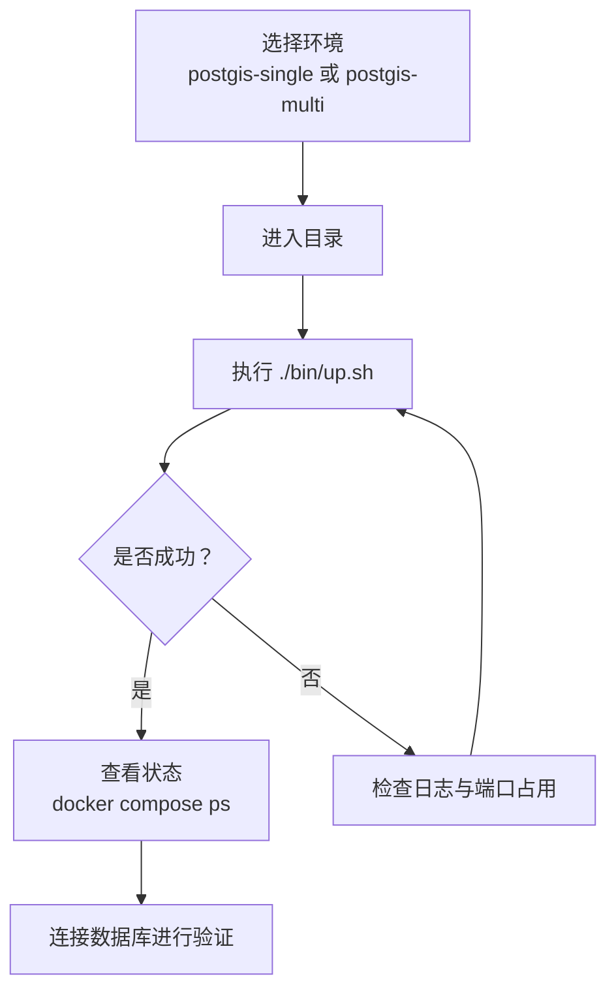
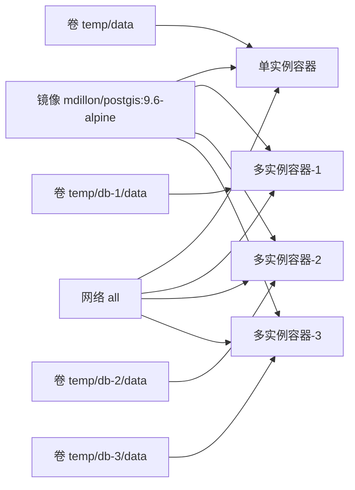

# PostGIS环境

<cite>
**本文引用的文件**
- [docker-compose.yml（单实例）](file://docker-compose/postgis-single/compose/docker-compose.yml)
- [README.md（单实例）](file://docker-compose/postgis-single/README.md)
- [up.sh（单实例）](file://docker-compose/postgis-single/bin/up.sh)
- [down.sh（单实例）](file://docker-compose/postgis-single/bin/down.sh)
- [docker-compose.yml（多实例）](file://docker-compose/postgis-multi/compose/docker-compose.yml)
- [README.md（多实例）](file://docker-compose/postgis-multi/README.md)
- [up.sh（多实例）](file://docker-compose/postgis-multi/bin/up.sh)
- [down.sh（多实例）](file://docker-compose/postgis-multi/bin/down.sh)
- [容器编排规范](file://docs/overview/containers.md)
- [环境总览](file://docs/README.md)
</cite>

## 目录
1. [简介](#简介)
2. [项目结构](#项目结构)
3. [核心组件](#核心组件)
4. [架构总览](#架构总览)
5. [详细组件分析](#详细组件分析)
6. [依赖关系分析](#依赖关系分析)
7. [性能与可扩展性](#性能与可扩展性)
8. [故障排查指南](#故障排查指南)
9. [结论](#结论)
10. [附录](#附录)

## 简介
本文件面向需要在本地或开发环境中快速搭建与运维 PostGIS 数据库的用户，基于仓库中的 Docker Compose 配置，系统性说明以下内容：
- 单实例与多实例（3 节点）部署形态的差异与适用场景
- 网络拓扑与容器间通信方式
- 数据持久化策略与卷挂载约定
- PostGIS 扩展能力与典型使用要点（空间数据类型、几何函数与索引）
- 启动流程、连接配置、数据导入导出与备份恢复思路
- 常用 SQL 查询与性能优化建议
- 空间参考系统（SRS）、坐标转换与地理分析最佳实践

## 项目结构
该仓库采用“按环境分目录”的组织方式，PostGIS 环境包含单实例与多实例两套配置，每套均遵循统一的目录布局：
- 环境根目录
  - compose/docker-compose.yml：Docker Compose 编排定义
  - bin/up.sh、bin/down.sh：启动与停止脚本
  - README.md：环境说明与使用指南

图表来源
- [docker-compose.yml（单实例）:1-22](file://docker-compose/postgis-single/compose/docker-compose.yml#L1-L22)
- [docker-compose.yml（多实例）:1-58](file://docker-compose/postgis-multi/compose/docker-compose.yml#L1-L58)
- [README.md（单实例）:1-95](file://docker-compose/postgis-single/README.md#L1-L95)
- [README.md（多实例）:1-107](file://docker-compose/postgis-multi/README.md#L1-L107)

章节来源
- [环境总览:71-90](file://docs/README.md#L71-L90)
- [容器编排规范:76-91](file://docs/overview/containers.md#L76-L91)

## 核心组件
- PostGIS 容器镜像：基于 mdillon/postgis:9.6-alpine，内置 PostgreSQL 与 PostGIS 扩展
- 网络：统一桥接网络 all，支持容器间通过别名互访
- 持久化：将容器内 /var/lib/postgresql/data 映射到宿主机 temp/ 目录
- 连接信息：默认数据库名、用户名、密码均为 hz_9/123456；端口映射为 5432（单实例）或 5432/5433/5434（多实例）

章节来源
- [docker-compose.yml（单实例）:1-22](file://docker-compose/postgis-single/compose/docker-compose.yml#L1-L22)
- [docker-compose.yml（多实例）:1-58](file://docker-compose/postgis-multi/compose/docker-compose.yml#L1-L58)
- [README.md（单实例）:66-95](file://docker-compose/postgis-single/README.md#L66-L95)
- [README.md（多实例）:78-107](file://docker-compose/postgis-multi/README.md#L78-L107)
- [容器编排规范:7-14](file://docs/overview/containers.md#L7-L14)

## 架构总览
下图展示两种部署形态的网络与数据流：

图表来源
- [docker-compose.yml（单实例）:1-22](file://docker-compose/postgis-single/compose/docker-compose.yml#L1-L22)
- [docker-compose.yml（多实例）:1-58](file://docker-compose/postgis-multi/compose/docker-compose.yml#L1-L58)

## 详细组件分析

### 单实例组件分析
- 镜像与平台：linux/amd64 平台下的 mdillon/postgis:9.6-alpine
- 端口映射：仅 5432:5432
- 网络与别名：加入 all 网络并设置别名 all.postgis，便于容器内互访
- 持久化：卷挂载至 temp/data
- 环境变量：POSTGRES_DB/USER/PASSWORD 均为 hz_9/123456

图表来源
- [up.sh（单实例）:14-16](file://docker-compose/postgis-single/bin/up.sh#L14-L16)
- [docker-compose.yml（单实例）:1-22](file://docker-compose/postgis-single/compose/docker-compose.yml#L1-L22)

章节来源
- [docker-compose.yml（单实例）:1-22](file://docker-compose/postgis-single/compose/docker-compose.yml#L1-L22)
- [README.md（单实例）:13-95](file://docker-compose/postgis-single/README.md#L13-L95)
- [up.sh（单实例）:1-23](file://docker-compose/postgis-single/bin/up.sh#L1-L23)
- [down.sh（单实例）:1-20](file://docker-compose/postgis-single/bin/down.sh#L1-L20)

### 多实例组件分析
- 三个独立容器：postgis-1、postgis-2、postgis-3
- 端口映射：分别映射到 5432、5433、5434
- 网络与别名：各容器在 all 网络下拥有不同别名（all.postgis1/2/3）
- 持久化：三套卷分别映射到 temp/db-1/data、temp/db-2/data、temp/db-3/data
- 环境变量：三节点一致

图表来源
- [up.sh（多实例）:14-24](file://docker-compose/postgis-multi/bin/up.sh#L14-L24)
- [docker-compose.yml（多实例）:1-58](file://docker-compose/postgis-multi/compose/docker-compose.yml#L1-L58)

章节来源
- [docker-compose.yml（多实例）:1-58](file://docker-compose/postgis-multi/compose/docker-compose.yml#L1-L58)
- [README.md（多实例）:15-107](file://docker-compose/postgis-multi/README.md#L15-L107)
- [up.sh（多实例）:1-24](file://docker-compose/postgis-multi/bin/up.sh#L1-L24)
- [down.sh（多实例）:1-19](file://docker-compose/postgis-multi/bin/down.sh#L1-L19)

### 启动与停止流程
- 启动：进入环境目录，运行 ./bin/up.sh 或直接调用 docker compose -p <project> -f compose/docker-compose.yml up -d
- 停止：./bin/down.sh 或 docker compose -p <project> -f compose/docker-compose.yml down

图表来源
- [up.sh（单实例）:14-22](file://docker-compose/postgis-single/bin/up.sh#L14-L22)
- [down.sh（单实例）:14-19](file://docker-compose/postgis-single/bin/down.sh#L14-L19)
- [up.sh（多实例）:14-24](file://docker-compose/postgis-multi/bin/up.sh#L14-L24)
- [down.sh（多实例）:14-19](file://docker-compose/postgis-multi/bin/down.sh#L14-L19)

章节来源
- [README.md（单实例）:29-55](file://docker-compose/postgis-single/README.md#L29-L55)
- [README.md（多实例）:39-65](file://docker-compose/postgis-multi/README.md#L39-L65)

### 连接配置
- 外部直连（本机客户端）：使用 127.0.0.1:5432（单实例）或对应端口（多实例）
- 容器内互访：通过 all.<alias>:5432 访问（如 all.postgis、all.postgis1/2/3）
- 默认凭据：用户名/密码 均为 hz_9/123456

章节来源
- [README.md（单实例）:13-27](file://docker-compose/postgis-single/README.md#L13-L27)
- [README.md（多实例）:15-37](file://docker-compose/postgis-multi/README.md#L15-L37)

### 数据持久化策略
- 卷挂载路径：单实例 temp/data；多实例 temp/db-1/data、temp/db-2/data、temp/db-3/data
- 建议：停止服务时数据不会丢失；删除容器会保留卷；如需迁移，备份宿主机对应目录即可

章节来源
- [README.md（单实例）:57-64](file://docker-compose/postgis-single/README.md#L57-L64)
- [README.md（多实例）:67-76](file://docker-compose/postgis-multi/README.md#L67-L76)
- [容器编排规范:76-91](file://docs/overview/containers.md#L76-L91)

### PostGIS 特性与使用要点
- PostGIS 扩展：镜像已内置，无需手动安装
- 空间数据类型：常见几何类型（点、线、面等）与文本表示（WKT/WKB）
- 几何函数：包含距离、相交、缓冲区、简化等常用函数族
- 空间索引：推荐 GIST 索引以提升空间查询性能
- SRS 与坐标转换：通过 SRID 与 transform/ST_Transform 实现坐标系管理
- 地理分析：结合函数族实现邻近分析、叠加分析等

章节来源
- [README.md（单实例）:94-95](file://docker-compose/postgis-single/README.md#L94-L95)
- [README.md（多实例）:105-107](file://docker-compose/postgis-multi/README.md#L105-L107)

### 数据导入导出与备份恢复
- 导入导出：可使用标准 PostgreSQL 工具（如 pg_dump/pg_restore、psql）对接本机端口
- 备份恢复：建议定期对宿主机卷目录进行归档备份；恢复时先停止容器，替换或还原卷内数据后重启

章节来源
- [README.md（单实例）:92-94](file://docker-compose/postgis-single/README.md#L92-L94)
- [README.md（多实例）:103-106](file://docker-compose/postgis-multi/README.md#L103-L106)

### Web 界面 Adminer 使用（概念性说明）
- Adminer 为通用数据库 Web 管理工具，可在同一网络中部署并通过浏览器访问
- 在本仓库中未提供 Adminer 的具体编排，但可按常规方式将其加入同一网络并暴露端口

章节来源
- [容器编排规范:7-14](file://docs/overview/containers.md#L7-L14)

## 依赖关系分析
- 组件耦合：容器依赖于统一的镜像版本与网络；多实例之间无直接依赖，仅共享网络命名约定
- 外部依赖：Docker 引擎与 Compose 插件
- 环境变量与卷：统一的凭据与卷挂载约定降低配置复杂度

图表来源
- [docker-compose.yml（单实例）:1-22](file://docker-compose/postgis-single/compose/docker-compose.yml#L1-L22)
- [docker-compose.yml（多实例）:1-58](file://docker-compose/postgis-multi/compose/docker-compose.yml#L1-L58)

章节来源
- [容器编排规范:7-14](file://docs/overview/containers.md#L7-L14)

## 性能与可扩展性
- 单实例适合学习、原型与轻量部署；多实例适合模拟集群与隔离开发
- 空间查询性能建议：
  - 对几何列建立 GIST 索引
  - 合理设计查询条件，避免全表扫描
  - 使用 ST_Distance、ST_Within 等选择性高的过滤函数
- 端口与资源：多实例需确保端口不冲突；根据业务规模评估内存与 CPU 分配

章节来源
- [README.md（单实例）:81-87](file://docker-compose/postgis-single/README.md#L81-L87)
- [README.md（多实例）:93-99](file://docker-compose/postgis-multi/README.md#L93-L99)

## 故障排查指南
- 端口占用：多实例需确认 5432/5433/5434 未被占用
- 权限与凭据：生产环境务必修改默认密码
- 数据备份：定期备份宿主机卷目录
- 容器状态：使用 docker compose ps 查看运行状态
- 日志定位：若启动失败，检查容器日志与端口占用情况

章节来源
- [README.md（单实例）:90-94](file://docker-compose/postgis-single/README.md#L90-L94)
- [README.md（多实例）:101-107](file://docker-compose/postgis-multi/README.md#L101-L107)
- [up.sh（单实例）:14-22](file://docker-compose/postgis-single/bin/up.sh#L14-L22)
- [down.sh（单实例）:14-19](file://docker-compose/postgis-single/bin/down.sh#L14-L19)
- [up.sh（多实例）:14-24](file://docker-compose/postgis-multi/bin/up.sh#L14-L24)
- [down.sh（多实例）:14-19](file://docker-compose/postgis-multi/bin/down.sh#L14-L19)

## 结论
本仓库提供了标准化的 PostGIS 开发环境模板，覆盖单实例与多实例两种形态，统一了网络、卷与启动流程。结合 PostGIS 的空间能力与本项目的编排约定，用户可以快速完成本地空间数据库的搭建、连接与运维。

## 附录

### 常用 SQL 查询与示例（路径指引）
- 创建空间表与索引：参见 [docker-compose.yml（单实例）:1-22](file://docker-compose/postgis-single/compose/docker-compose.yml#L1-L22) 中的镜像与环境变量
- 几何函数与 SRS：参见 [README.md（单实例）:94-95](file://docker-compose/postgis-single/README.md#L94-L95) 与 [README.md（多实例）:105-107](file://docker-compose/postgis-multi/README.md#L105-L107)

### 空间参考系统（SRS）与坐标转换（概念性说明）
- 通过 SRID 标识坐标系，使用 transform/ST_Transform 实现坐标转换
- 建议在建表时明确几何列的 SRID，并在查询时保持输入输出一致

章节来源
- [README.md（单实例）:94-95](file://docker-compose/postgis-single/README.md#L94-L95)
- [README.md（多实例）:105-107](file://docker-compose/postgis-multi/README.md#L105-L107)