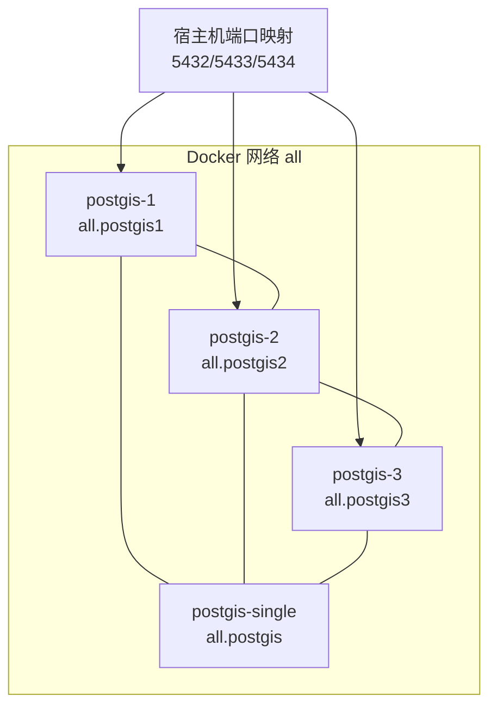
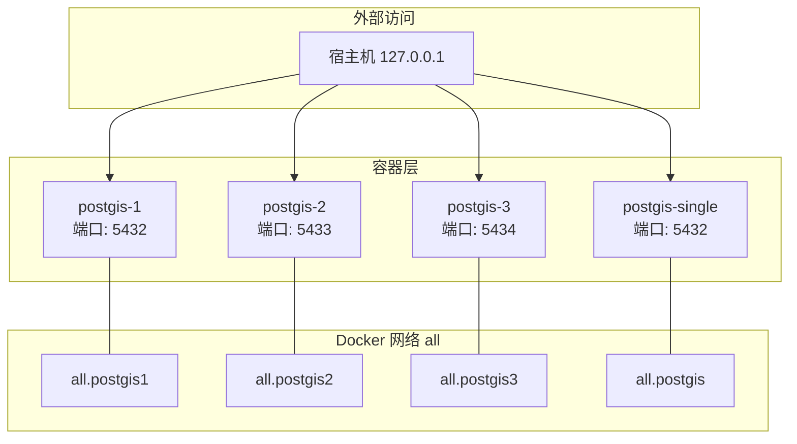
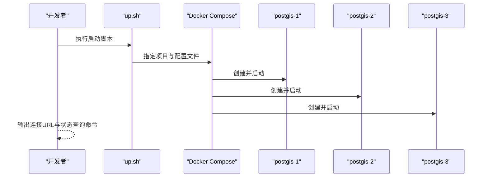
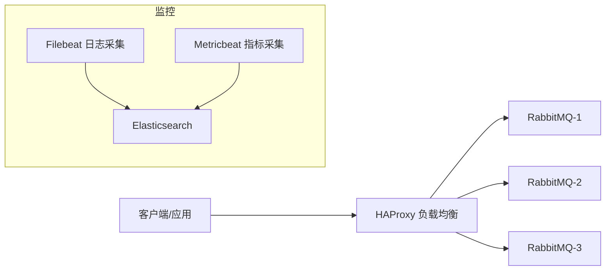
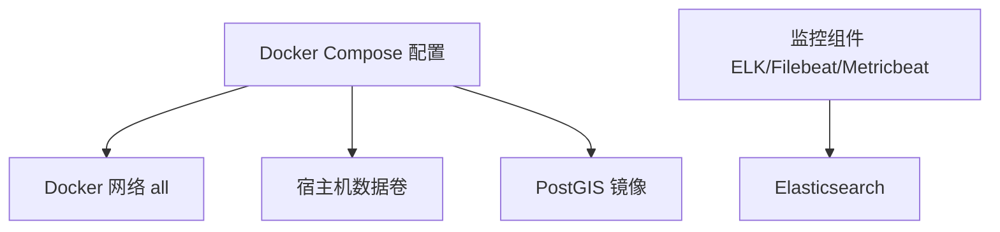

# PostGIS集群环境

<cite>
**本文引用的文件**
- [postgis-multi/README.md](file://docker-compose/postgis-multi/README.md)
- [postgis-multi/compose/docker-compose.yml](file://docker-compose/postgis-multi/compose/docker-compose.yml)
- [postgis-multi/bin/up.sh](file://docker-compose/postgis-multi/bin/up.sh)
- [postgis-multi/bin/down.sh](file://docker-compose/postgis-multi/bin/down.sh)
- [postgis-single/README.md](file://docker-compose/postgis-single/README.md)
- [postgis-single/compose/docker-compose.yml](file://docker-compose/postgis-single/compose/docker-compose.yml)
- [postgis-single/temp/data/postgresql.conf](file://docker-compose/postgis-single/temp/data/postgresql.conf)
- [postgis-single/temp/data/pg_hba.conf](file://docker-compose/postgis-single/temp/data/pg_hba.conf)
- [rabbitmq-cluster/haproxy/haproxy.cfg](file://docker-compose/rabbitmq-cluster/haproxy/haproxy.cfg)
- [elk-cluster/metricbeat/metricbeat.yml](file://docker-compose/elk-cluster/metricbeat/metricbeat.yml)
- [elk-cluster/filebeat/filebeat.yml](file://docker-compose/elk-cluster/filebeat/filebeat.yml)
- [docs/overview/containers.md](file://docs/overview/containers.md)
</cite>

## 目录
1. [简介](#简介)
2. [项目结构](#项目结构)
3. [核心组件](#核心组件)
4. [架构总览](#架构总览)
5. [详细组件分析](#详细组件分析)
6. [依赖关系分析](#依赖关系分析)
7. [性能考虑](#性能考虑)
8. [故障排查指南](#故障排查指南)
9. [结论](#结论)
10. [附录](#附录)

## 简介
本文件面向在容器化环境中部署与运维PostGIS的空间数据库集群，聚焦于高可用架构设计、主从复制配置与负载均衡策略，以及集群节点间网络通信、数据同步机制与故障转移流程。同时提供集群启动顺序、节点加入与退出管理方法，涵盖监控配置、健康检查与性能指标采集，并解释在集群环境下如何保证空间数据一致性、制定备份策略与灾难恢复方案，最后给出扩容缩容操作指南与最佳实践。

需要特别说明：当前仓库中的PostGIS多实例配置为三个独立PostGIS容器（端口映射5432/5433/5434），彼此通过同一Docker网络互联，但未启用PostgreSQL流复制或逻辑复制等主从同步机制。因此，本文件在“架构总览”“详细组件分析”中对“主从复制”“数据同步机制”“故障转移流程”的描述将以“概念性说明+现有配置的局限性”形式呈现；在“性能考虑”“故障排查指南”“附录”中提供可落地的运维建议与替代方案，帮助读者在现有基础上实现高可用目标。

## 项目结构
PostGIS相关编排位于 docker-compose/postgis-multi 与 docker-compose/postgis-single，分别提供多实例与单实例部署模板。两者均使用 mdillon/postgis:9.6-alpine 镜像，通过 Docker 网络 all 提供容器间互访能力，并将数据持久化到宿主机目录。

- 多实例（postgis-multi）：三个独立容器，分别映射不同宿主端口，便于本地开发与测试场景下的多实例隔离。
- 单实例（postgis-single）：一个容器，适合简单开发与学习场景。
- 公共网络：all 为自定义桥接网络，容器通过别名 all.postgis1/all.postgis2/all.postgis3 或 all.postgis 进行互访。
- 数据持久化：各实例的数据目录挂载至宿主机 temp/db-*/data 或 temp/data，避免容器删除导致数据丢失。

图表来源
- [postgis-multi/compose/docker-compose.yml:1-58](file://docker-compose/postgis-multi/compose/docker-compose.yml#L1-L58)
- [postgis-single/compose/docker-compose.yml:1-22](file://docker-compose/postgis-single/compose/docker-compose.yml#L1-L22)

章节来源
- [postgis-multi/README.md:1-107](file://docker-compose/postgis-multi/README.md#L1-L107)
- [postgis-multi/compose/docker-compose.yml:1-58](file://docker-compose/postgis-multi/compose/docker-compose.yml#L1-L58)
- [postgis-single/README.md:1-95](file://docker-compose/postgis-single/README.md#L1-L95)
- [postgis-single/compose/docker-compose.yml:1-22](file://docker-compose/postgis-single/compose/docker-compose.yml#L1-L22)
- [docs/overview/containers.md:1-14](file://docs/overview/containers.md#L1-L14)

## 核心组件
- PostGIS 容器服务
  - 使用镜像：mdillon/postgis:9.6-alpine
  - 环境变量：POSTGRES_DB、POSTGRES_USER、POSTGRES_PASSWORD
  - 端口映射：多实例分别为 5432、5433、5434；单实例为 5432
  - 网络：加入自定义桥接网络 all，并设置容器别名用于内部互访
  - 数据卷：挂载宿主机目录至 /var/lib/postgresql/data，实现持久化
- 启停脚本
  - up.sh：统一启动多实例或单实例服务，并输出连接信息与状态查询命令
  - down.sh：停止并移除服务，保留数据卷
- 数据库配置文件
  - postgresql.conf：监听地址、连接数、共享内存、WAL、归档、复制等参数（默认值）
  - pg_hba.conf：认证方式（示例为本地信任与全库MD5）

章节来源
- [postgis-multi/compose/docker-compose.yml:1-58](file://docker-compose/postgis-multi/compose/docker-compose.yml#L1-L58)
- [postgis-single/compose/docker-compose.yml:1-22](file://docker-compose/postgis-single/compose/docker-compose.yml#L1-L22)
- [postgis-multi/bin/up.sh:1-25](file://docker-compose/postgis-multi/bin/up.sh#L1-L25)
- [postgis-multi/bin/down.sh:1-20](file://docker-compose/postgis-multi/bin/down.sh#L1-L20)
- [postgis-single/temp/data/postgresql.conf:1-644](file://docker-compose/postgis-single/temp/data/postgresql.conf#L1-L644)
- [postgis-single/temp/data/pg_hba.conf:1-96](file://docker-compose/postgis-single/temp/data/pg_hba.conf#L1-L96)

## 架构总览
当前仓库提供的PostGIS多实例为“独立容器集合”，而非具备自动故障转移与强一致性的主从复制集群。下图展示容器间网络拓扑与端口映射关系：

图表来源
- [postgis-multi/compose/docker-compose.yml:1-58](file://docker-compose/postgis-multi/compose/docker-compose.yml#L1-L58)
- [postgis-single/compose/docker-compose.yml:1-22](file://docker-compose/postgis-single/compose/docker-compose.yml#L1-L22)

说明
- 当前配置未启用PostgreSQL流复制或逻辑复制，因此不存在“主节点写入、备节点同步”的强一致复制链路。
- 若需实现主从复制与故障转移，应在现有容器基础上引入逻辑复制、外置复制代理或采用支持高可用的PostgreSQL发行版/Operator方案。

## 详细组件分析

### 组件一：PostGIS多实例编排
- 服务定义
  - postgis-1、postgis-2、postgis-3：分别映射不同宿主端口，容器内均指向5432端口
  - 网络 all：容器通过别名 all.postgis1/2/3 互访
  - 数据卷：挂载至宿主机 temp/db-*/data，确保重启后数据不丢失
- 启动与停止
  - up.sh：统一启动，打印连接URL与状态查询命令
  - down.sh：停止并移除服务，保留数据卷
- 连接与用途
  - 支持通过宿主机端口直连，也支持通过网络别名在容器内互访
  - 适用于开发与测试场景下的多实例隔离与并发验证

图表来源
- [postgis-multi/bin/up.sh:14-24](file://docker-compose/postgis-multi/bin/up.sh#L14-L24)
- [postgis-multi/compose/docker-compose.yml:1-58](file://docker-compose/postgis-multi/compose/docker-compose.yml#L1-L58)

章节来源
- [postgis-multi/README.md:7-65](file://docker-compose/postgis-multi/README.md#L7-L65)
- [postgis-multi/compose/docker-compose.yml:1-58](file://docker-compose/postgis-multi/compose/docker-compose.yml#L1-L58)
- [postgis-multi/bin/up.sh:1-25](file://docker-compose/postgis-multi/bin/up.sh#L1-L25)
- [postgis-multi/bin/down.sh:1-20](file://docker-compose/postgis-multi/bin/down.sh#L1-L20)

### 组件二：PostGIS单实例编排
- 服务定义
  - postgis：单一容器，映射宿主5432端口
  - 网络 all：容器别名为 all.postgis
  - 数据卷：挂载至宿主机 temp/data
- 适用场景
  - 简单开发、原型验证、学习与资源受限环境

章节来源
- [postgis-single/README.md:1-95](file://docker-compose/postgis-single/README.md#L1-L95)
- [postgis-single/compose/docker-compose.yml:1-22](file://docker-compose/postgis-single/compose/docker-compose.yml#L1-L22)

### 组件三：数据库配置与认证
- postgresql.conf
  - 监听地址、最大连接数、共享内存、WAL、归档、复制、统计等参数（默认值）
  - 可按需调整以满足生产环境要求
- pg_hba.conf
  - 示例包含本地信任与全库MD5认证，便于开发环境快速访问
  - 生产环境建议限制来源IP、使用更强认证方式

章节来源
- [postgis-single/temp/data/postgresql.conf:1-644](file://docker-compose/postgis-single/temp/data/postgresql.conf#L1-L644)
- [postgis-single/temp/data/pg_hba.conf:1-96](file://docker-compose/postgis-single/temp/data/pg_hba.conf#L1-L96)

### 组件四：负载均衡与健康检查（参考）
- HAProxy（RabbitMQ集群示例）
  - 提供AMQP与管理接口的轮询负载均衡
  - 健康检查：TCP检查与HTTP检查结合
  - 统计页面：内置管理端点
- ELK集群监控（Filebeat/Metricbeat）
  - Filebeat：采集日志并发送至Elasticsearch
  - Metricbeat：采集Docker与系统指标并发送至Elasticsearch
  - 用于构建统一监控与可视化平台

图表来源
- [rabbitmq-cluster/haproxy/haproxy.cfg:1-56](file://docker-compose/rabbitmq-cluster/haproxy/haproxy.cfg#L1-L56)
- [elk-cluster/filebeat/filebeat.yml:1-26](file://docker-compose/elk-cluster/filebeat/filebeat.yml#L1-L26)
- [elk-cluster/metricbeat/metricbeat.yml:1-61](file://docker-compose/elk-cluster/metricbeat/metricbeat.yml#L1-L61)

章节来源
- [rabbitmq-cluster/haproxy/haproxy.cfg:1-56](file://docker-compose/rabbitmq-cluster/haproxy/haproxy.cfg#L1-L56)
- [elk-cluster/filebeat/filebeat.yml:1-26](file://docker-compose/elk-cluster/filebeat/filebeat.yml#L1-L26)
- [elk-cluster/metricbeat/metricbeat.yml:1-61](file://docker-compose/elk-cluster/metricbeat/metricbeat.yml#L1-L61)

## 依赖关系分析
- 组件耦合
  - PostGIS容器依赖 Docker 网络 all 实现互访
  - 数据持久化依赖宿主机目录挂载
  - 启停脚本依赖 Docker Compose 配置文件
- 外部依赖
  - 镜像版本：mdillon/postgis:9.6-alpine
  - 网络类型：bridge
  - 监控生态：可选集成 ELK 与 Filebeat/Metricbeat

图表来源
- [postgis-multi/compose/docker-compose.yml:1-58](file://docker-compose/postgis-multi/compose/docker-compose.yml#L1-L58)
- [postgis-single/compose/docker-compose.yml:1-22](file://docker-compose/postgis-single/compose/docker-compose.yml#L1-L22)
- [elk-cluster/filebeat/filebeat.yml:1-26](file://docker-compose/elk-cluster/filebeat/filebeat.yml#L1-L26)
- [elk-cluster/metricbeat/metricbeat.yml:1-61](file://docker-compose/elk-cluster/metricbeat/metricbeat.yml#L1-L61)

章节来源
- [postgis-multi/compose/docker-compose.yml:1-58](file://docker-compose/postgis-multi/compose/docker-compose.yml#L1-L58)
- [postgis-single/compose/docker-compose.yml:1-22](file://docker-compose/postgis-single/compose/docker-compose.yml#L1-L22)
- [docs/overview/containers.md:9-12](file://docs/overview/containers.md#L9-L12)

## 性能考虑
- 连接与监听
  - 监听地址应允许来自 all 网络的连接，避免仅限本地导致跨容器访问失败
- 内存与WAL
  - 共享缓冲区、工作内存等参数可根据业务量调优
  - WAL 参数与归档策略影响数据安全与恢复时间目标
- 并发与锁
  - 最大连接数与锁超时需结合应用并发与事务特性进行评估
- 监控与指标
  - 建议启用运行时统计与自动维护任务，结合 ELK/Metricbeat 采集关键指标（连接数、查询时长、WAL写入、磁盘IO）

[本节为通用指导，不直接分析具体文件]

## 故障排查指南
- 容器无法启动
  - 检查端口占用（5432/5433/5434）与磁盘空间
  - 查看容器日志与状态
- 无法连接数据库
  - 确认容器网络别名是否正确（all.postgis1/2/3 或 all.postgis）
  - 检查认证配置（pg_hba.conf）与密码
- 数据丢失或损坏
  - 确认数据卷挂载路径与权限
  - 定期执行备份，避免容器重建导致数据丢失
- 监控缺失
  - 验证 Filebeat/Metricbeat 配置与Elasticsearch连通性
  - 确保日志与指标输出已启用

章节来源
- [postgis-multi/README.md:100-107](file://docker-compose/postgis-multi/README.md#L100-L107)
- [postgis-single/README.md:88-95](file://docker-compose/postgis-single/README.md#L88-L95)
- [postgis-single/temp/data/pg_hba.conf:80-96](file://docker-compose/postgis-single/temp/data/pg_hba.conf#L80-L96)

## 结论
当前仓库提供了PostGIS多实例与单实例的容器化部署模板，便于在本地进行空间数据开发与测试。由于未启用PostgreSQL流复制或逻辑复制，因此不具备自动故障转移与强一致同步能力。若要实现真正的高可用集群，建议在现有容器基础上引入复制机制、仲裁与故障转移策略，或采用专业的PostgreSQL高可用解决方案。同时，结合ELK等监控工具完善可观测性，确保在生产环境中实现稳定、可追踪、可恢复的数据库集群。

[本节为总结性内容，不直接分析具体文件]

## 附录

### A. 高可用架构设计与主从复制配置（概念性说明）
- 主从复制要点
  - 明确主节点与备节点角色，配置复制槽与WAL保留策略
  - 设置同步提交与备用节点只读查询，降低主节点压力
  - 引入仲裁或外部工具实现自动故障检测与切换
- 数据同步机制
  - 流复制：基于WAL的实时同步，延迟低但复杂度较高
  - 逻辑复制：按表/发布订阅模式同步，灵活性更高
- 故障转移流程
  - 自动检测：心跳、健康检查、仲裁投票
  - 切换策略：写入节点降级、读写分离切换、回切与数据一致性校验

说明
- 以上为通用高可用设计思路，当前仓库未包含相应配置文件，请根据实际需求扩展。

[本节为概念性内容，不直接分析具体文件]

### B. 集群启动顺序与节点管理
- 启动顺序
  - 建议先启动“主节点”容器，再启动“备节点”容器，确保复制初始化成功
  - 如需在已有数据上启动，先确认数据卷权限与配置文件正确
- 节点加入
  - 新增容器时，确保加入相同网络并使用一致的环境变量
  - 在应用侧更新连接字符串，指向新增节点
- 节点退出
  - 先在应用侧下线该节点流量，再优雅停止容器
  - 停止后保留数据卷，以便后续重新加入或迁移

[本节为通用指导，不直接分析具体文件]

### C. 监控配置与健康检查
- 健康检查
  - 可参考 HAProxy 的TCP/HTTP检查策略，对PostGIS端口进行周期性探测
  - 结合应用侧自定义探针，检测数据库连接与关键查询响应
- 指标采集
  - 使用 Metricbeat 采集PostGIS所在容器与主机指标
  - 使用 Filebeat 采集PostgreSQL日志与慢查询日志
- 可视化
  - 将指标与日志导入 Elasticsearch/Kibana，建立统一监控面板

章节来源
- [rabbitmq-cluster/haproxy/haproxy.cfg:22-46](file://docker-compose/rabbitmq-cluster/haproxy/haproxy.cfg#L22-L46)
- [elk-cluster/metricbeat/metricbeat.yml:1-61](file://docker-compose/elk-cluster/metricbeat/metricbeat.yml#L1-L61)
- [elk-cluster/filebeat/filebeat.yml:1-26](file://docker-compose/elk-cluster/filebeat/filebeat.yml#L1-L26)

### D. 空间数据一致性与备份策略
- 一致性保障
  - 使用事务封装空间数据变更，避免部分更新导致几何无效
  - 对空间索引与拓扑关系的批量更新，建议在维护窗口执行
- 备份策略
  - 定时逻辑备份（如使用逻辑复制或pg_dump），并验证恢复流程
  - 归档WAL与定期快照，缩短RPO/RTO
- 灾难恢复
  - 准备多套恢复演练方案（跨机房/跨云）
  - 建立恢复时间目标与恢复点目标（RTO/RPO）指标并持续优化

[本节为通用指导，不直接分析具体文件]

### E. 扩容缩容操作指南与最佳实践
- 扩容
  - 增加备节点：复制现有容器配置，调整端口与数据卷，加入网络
  - 应用侧：增加连接池与读写分离路由规则
- 缩容
  - 下线读流量，停止容器并清理无用数据卷
  - 如涉及主节点替换，先完成故障转移再缩容
- 最佳实践
  - 保持镜像与配置版本一致
  - 使用独立网络与命名规范，避免冲突
  - 建立变更审批与回滚预案

[本节为通用指导，不直接分析具体文件]