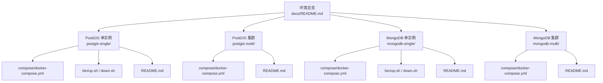
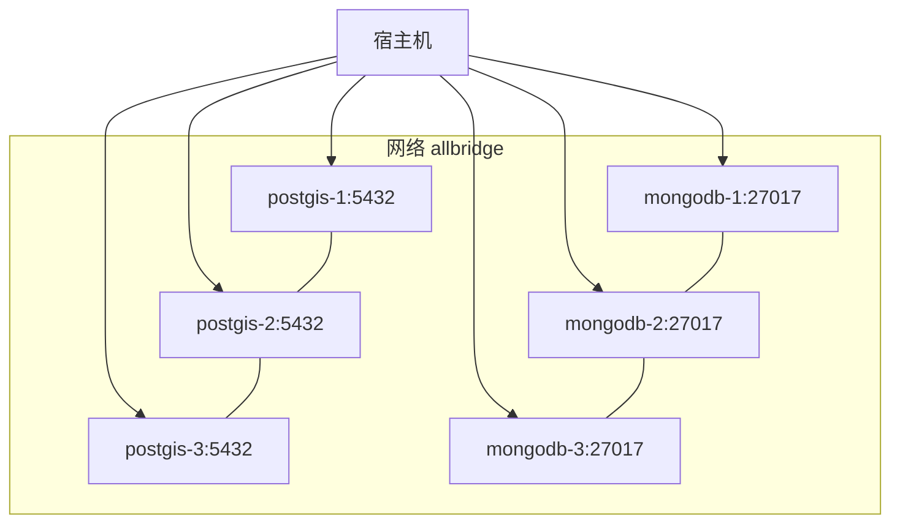
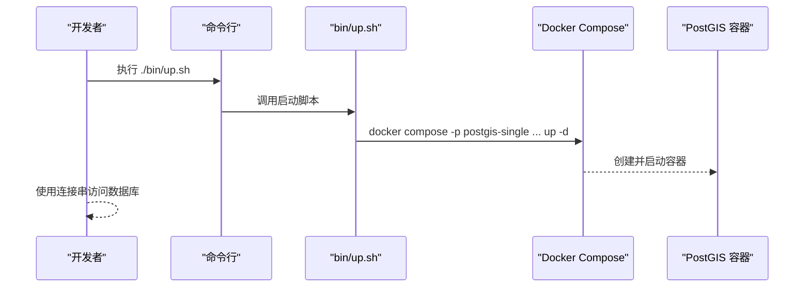
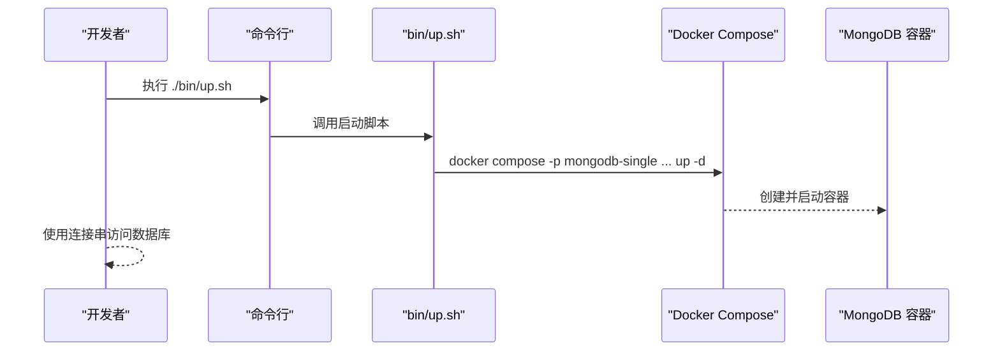
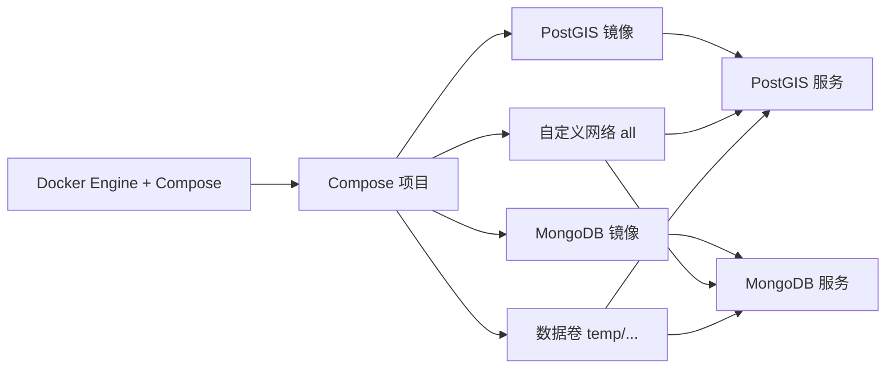

# 数据库系统环境

<cite>
**本文引用的文件**
- [docker-compose.yml（PostGIS 单实例）](file://docker-compose/postgis-single/compose/docker-compose.yml)
- [up.sh（PostGIS 单实例）](file://docker-compose/postgis-single/bin/up.sh)
- [down.sh（PostGIS 单实例）](file://docker-compose/postgis-single/bin/down.sh)
- [README.md（PostGIS 单实例）](file://docker-compose/postgis-single/README.md)
- [docker-compose.yml（PostGIS 集群）](file://docker-compose/postgis-multi/compose/docker-compose.yml)
- [README.md（PostGIS 集群）](file://docker-compose/postgis-multi/README.md)
- [docker-compose.yml（MongoDB 单实例）](file://docker-compose/mongodb-single/compose/docker-compose.yml)
- [up.sh（MongoDB 单实例）](file://docker-compose/mongodb-single/bin/up.sh)
- [down.sh（MongoDB 单实例）](file://docker-compose/mongodb-single/bin/down.sh)
- [README.md（MongoDB 单实例）](file://docker-compose/mongodb-single/README.md)
- [docker-compose.yml（MongoDB 集群）](file://docker-compose/mongodb-multi/compose/docker-compose.yml)
- [README.md（MongoDB 集群）](file://docker-compose/mongodb-multi/README.md)
- [README.md（总览）](file://docs/README.md)
</cite>

## 目录
1. [简介](#简介)
2. [项目结构](#项目结构)
3. [核心组件](#核心组件)
4. [架构总览](#架构总览)
5. [详细组件分析](#详细组件分析)
6. [依赖关系分析](#依赖关系分析)
7. [性能与容量规划](#性能与容量规划)
8. [运维操作指南](#运维操作指南)
9. [故障排查](#故障排查)
10. [结论](#结论)
11. [附录](#附录)

## 简介
本文件面向数据库系统环境的容器化部署，聚焦于 PostGIS 与 MongoDB 的单实例与集群两种模式，覆盖配置差异、适用场景、性能特征、连接方式、数据持久化、备份恢复、监控告警以及最佳实践与常见问题。所有操作均基于仓库内提供的 Docker Compose 配置与启动脚本。

## 项目结构
- 每个数据库环境采用统一目录结构：环境根目录下包含说明文档、启动/停止脚本与 Compose 配置。
- PostGIS 提供单实例与三节点集群两种形态；MongoDB 同样提供单实例与三节点集群形态。
- 默认凭据与数据卷位置遵循统一约定：默认用户名与密码均为 hz_9/123456，数据持久化在各环境 temp/ 目录中。

图表来源
- [README.md（总览）:71-83](file://docs/README.md#L71-L83)
- [docker-compose.yml（PostGIS 单实例）:1-22](file://docker-compose/postgis-single/compose/docker-compose.yml#L1-L22)
- [docker-compose.yml（PostGIS 集群）:1-58](file://docker-compose/postgis-multi/compose/docker-compose.yml#L1-L58)
- [docker-compose.yml（MongoDB 单实例）:1-21](file://docker-compose/mongodb-single/compose/docker-compose.yml#L1-L21)
- [docker-compose.yml（MongoDB 集群）:1-55](file://docker-compose/mongodb-multi/compose/docker-compose.yml#L1-L55)

章节来源
- [README.md（总览）:71-83](file://docs/README.md#L71-L83)
- [README.md（总览）:144-156](file://docs/README.md#L144-L156)

## 核心组件
- PostGIS 单实例：基于 mdillon/postgis:9.6-alpine，端口映射 5432，数据卷指向 temp/data。
- PostGIS 集群：三个独立实例，端口映射分别为 5432、5433、5434，分别对应 temp/db-1/data、temp/db-2/data、temp/db-3/data。
- MongoDB 单实例：基于 mongo:4.0-xenial，端口映射 27017，数据卷指向 temp/data。
- MongoDB 集群：三个独立实例，端口映射分别为 27017、27018、27019，分别对应 temp/db-1/data、temp/db-2/data、temp/db-3/data。

章节来源
- [docker-compose.yml（PostGIS 单实例）:1-22](file://docker-compose/postgis-single/compose/docker-compose.yml#L1-L22)
- [docker-compose.yml（PostGIS 集群）:1-58](file://docker-compose/postgis-multi/compose/docker-compose.yml#L1-L58)
- [docker-compose.yml（MongoDB 单实例）:1-21](file://docker-compose/mongodb-single/compose/docker-compose.yml#L1-L21)
- [docker-compose.yml（MongoDB 集群）:1-55](file://docker-compose/mongodb-multi/compose/docker-compose.yml#L1-L55)

## 架构总览
两类数据库均采用“多容器单网络”的架构：每个环境通过一个自定义桥接网络 all 实现容器间互通；服务暴露端口用于本地访问；数据卷挂载确保持久化。

图表来源
- [docker-compose.yml（PostGIS 集群）:1-58](file://docker-compose/postgis-multi/compose/docker-compose.yml#L1-L58)
- [docker-compose.yml（MongoDB 集群）:1-55](file://docker-compose/mongodb-multi/compose/docker-compose.yml#L1-L55)

## 详细组件分析

### PostGIS 组件
- 单实例
  - 容器名与服务名一致，端口 5432 映射至宿主，数据卷指向 temp/data。
  - 连接串示例与内部网络别名已在单实例说明文档中给出。
- 集群
  - 三个实例分别映射不同宿主端口，便于并行访问与隔离。
  - 内部网络别名分别以 all.postgis1、all.postgis2、all.postgis3 提供跨容器通信。

图表来源
- [up.sh（PostGIS 单实例）:14-15](file://docker-compose/postgis-single/bin/up.sh#L14-L15)
- [docker-compose.yml（PostGIS 单实例）:1-22](file://docker-compose/postgis-single/compose/docker-compose.yml#L1-L22)

章节来源
- [README.md（PostGIS 单实例）:1-95](file://docker-compose/postgis-single/README.md#L1-L95)
- [README.md（PostGIS 集群）:1-107](file://docker-compose/postgis-multi/README.md#L1-L107)
- [docker-compose.yml（PostGIS 单实例）:1-22](file://docker-compose/postgis-single/compose/docker-compose.yml#L1-L22)
- [docker-compose.yml（PostGIS 集群）:1-58](file://docker-compose/postgis-multi/compose/docker-compose.yml#L1-L58)

### MongoDB 组件
- 单实例
  - 容器名与服务名一致，端口 27017 映射至宿主，数据卷指向 temp/data。
  - 连接串示例与内部网络别名已在单实例说明文档中给出。
- 集群
  - 三个实例分别映射不同宿主端口，便于并行访问与隔离。
  - 内部网络别名分别以 all.mongodb1、all.mongodb2、all.mongodb3 提供跨容器通信。

图表来源
- [up.sh（MongoDB 单实例）:14-15](file://docker-compose/mongodb-single/bin/up.sh#L14-L15)
- [docker-compose.yml（MongoDB 单实例）:1-21](file://docker-compose/mongodb-single/compose/docker-compose.yml#L1-L21)

章节来源
- [README.md（MongoDB 单实例）:1-107](file://docker-compose/mongodb-single/README.md#L1-L107)
- [README.md（MongoDB 集群）:1-107](file://docker-compose/mongodb-multi/README.md#L1-L107)
- [docker-compose.yml（MongoDB 单实例）:1-21](file://docker-compose/mongodb-single/compose/docker-compose.yml#L1-L21)
- [docker-compose.yml（MongoDB 集群）:1-55](file://docker-compose/mongodb-multi/compose/docker-compose.yml#L1-L55)

## 依赖关系分析
- 环境层依赖
  - 所有环境均依赖 Docker Engine 与 Compose 插件。
  - 统一的启动/停止脚本封装了项目名与配置路径，降低误操作风险。
- 服务层依赖
  - PostGIS 基于 PostGIS 预构建镜像，自动启用空间扩展。
  - MongoDB 基于官方社区版镜像，支持认证与初始化数据库。
- 网络与存储
  - 统一使用自定义 bridge 网络 all，便于跨容器通信。
  - 数据卷挂载到各环境 temp/ 目录，实现持久化。

图表来源
- [README.md（总览）:91-98](file://docs/README.md#L91-L98)
- [docker-compose.yml（PostGIS 单实例）:1-22](file://docker-compose/postgis-single/compose/docker-compose.yml#L1-L22)
- [docker-compose.yml（MongoDB 单实例）:1-21](file://docker-compose/mongodb-single/compose/docker-compose.yml#L1-L21)

章节来源
- [README.md（总览）:91-98](file://docs/README.md#L91-L98)

## 性能与容量规划
- 单实例优势
  - 部署简单、资源占用低，适合开发测试、原型验证与学习场景。
  - 访问延迟低，无需跨实例复制或分片开销。
- 集群优势
  - 多实例可实现数据隔离与并行访问，适合多项目并行开发与压力测试。
  - 可模拟真实生产环境的多节点交互，便于验证应用的连接策略与容错逻辑。
- 端口与并发
  - 集群模式通过不同宿主端口区分实例，避免冲突；需确保端口范围未被占用。
- 存储与 IO
  - 数据卷位于宿主机 temp/ 目录，建议评估磁盘空间与 IO 性能，必要时调整挂载路径或使用更高性能的存储后端。

章节来源
- [README.md（PostGIS 单实例）:81-87](file://docker-compose/postgis-single/README.md#L81-L87)
- [README.md（PostGIS 集群）:93-99](file://docker-compose/postgis-multi/README.md#L93-L99)
- [README.md（MongoDB 单实例）:94-99](file://docker-compose/mongodb-single/README.md#L94-L99)
- [README.md（MongoDB 集群）:94-99](file://docker-compose/mongodb-multi/README.md#L94-L99)

## 运维操作指南

### 连接配置
- PostGIS
  - 外部连接串示例与内部网络别名详见单实例与集群说明文档。
- MongoDB
  - 外部连接串示例与内部网络别名详见单实例与集群说明文档。
  - 认证数据库为 admin，连接时需指定 authSource=admin。

章节来源
- [README.md（PostGIS 单实例）:13-27](file://docker-compose/postgis-single/README.md#L13-L27)
- [README.md（PostGIS 集群）:15-37](file://docker-compose/postgis-multi/README.md#L15-L37)
- [README.md（MongoDB 单实例）:15-37](file://docker-compose/mongodb-single/README.md#L15-L37)
- [README.md（MongoDB 集群）:15-37](file://docker-compose/mongodb-multi/README.md#L15-L37)

### 数据导入与导出
- PostGIS
  - 可使用 psql/pg_dump 等工具通过宿主机端口连接容器进行导入导出。
  - 建议在导入前确认目标数据库与用户权限。
- MongoDB
  - 可使用 mongodump/mongoexport/mongoimport 等工具通过宿主机端口连接容器进行导入导出。
  - 注意选择正确的集合与数据库名称，以及认证参数。

章节来源
- [docker-compose.yml（PostGIS 单实例）:17-18](file://docker-compose/postgis-single/compose/docker-compose.yml#L17-L18)
- [docker-compose.yml（PostGIS 集群）:17-54](file://docker-compose/postgis-multi/compose/docker-compose.yml#L17-L54)
- [docker-compose.yml（MongoDB 单实例）:16-17](file://docker-compose/mongodb-single/compose/docker-compose.yml#L16-L17)
- [docker-compose.yml（MongoDB 集群）:16-51](file://docker-compose/mongodb-multi/compose/docker-compose.yml#L16-L51)

### 备份与恢复
- 备份
  - PostGIS：使用 pg_dump 导出 SQL 或使用容器内逻辑备份工具。
  - MongoDB：使用 mongodump 导出 BSON/JSON 结构的数据集。
- 恢复
  - PostGIS：使用 psql 或 pg_restore 将备份恢复到目标数据库。
  - MongoDB：使用 mongorestore 或 mongoimport 将备份导入目标集合。
- 建议
  - 定期执行增量/全量备份，将备份归档至安全位置。
  - 在恢复前先在隔离环境中验证备份完整性。

章节来源
- [README.md（PostGIS 单实例）:90-94](file://docker-compose/postgis-single/README.md#L90-L94)
- [README.md（PostGIS 集群）:100-106](file://docker-compose/postgis-multi/README.md#L100-L106)
- [README.md（MongoDB 单实例）:101-107](file://docker-compose/mongodb-single/README.md#L101-L107)
- [README.md（MongoDB 集群）:101-107](file://docker-compose/mongodb-multi/README.md#L101-L107)

### 监控与告警
- 建议
  - 使用系统自带的健康检查与日志采集方案，结合外部监控平台（如 Prometheus/Grafana）对 CPU、内存、磁盘与网络进行观测。
  - 对数据库连接数、查询耗时、慢查询日志等关键指标建立阈值告警。
- 注意
  - 本仓库未内置监控组件，请按团队规范自行集成。

章节来源
- [README.md（总览）:91-98](file://docs/README.md#L91-L98)

## 故障排查
- 端口冲突
  - 确认宿主机端口未被占用；集群模式需同时保证多个端口可用。
- 权限与认证
  - MongoDB 连接需指定 authSource=admin；默认凭据请勿用于生产。
- 数据丢失
  - 若容器重建导致数据丢失，请检查 temp/ 目录是否正确挂载与保留。
- 启动失败
  - 查看容器日志与 Compose 输出，确认镜像拉取、网络与卷挂载是否正常。

章节来源
- [README.md（PostGIS 单实例）:88-94](file://docker-compose/postgis-single/README.md#L88-L94)
- [README.md（PostGIS 集群）:100-107](file://docker-compose/postgis-multi/README.md#L100-L107)
- [README.md（MongoDB 单实例）:101-107](file://docker-compose/mongodb-single/README.md#L101-L107)
- [README.md（MongoDB 集群）:101-107](file://docker-compose/mongodb-multi/README.md#L101-L107)

## 结论
本仓库提供了 PostGIS 与 MongoDB 的标准化容器化部署模板，覆盖单实例与集群两种形态。通过统一的启动脚本、网络与数据卷约定，能够快速搭建开发与测试环境。建议在生产前完成凭据替换、端口规划、存储与监控配置，并制定完善的备份与恢复流程。

## 附录

### 快速上手
- PostGIS 单实例
  - 启动：进入目录执行启动脚本。
  - 停止：执行停止脚本。
  - 状态：查看容器状态。
- PostGIS 集群
  - 启动：进入目录执行启动脚本。
  - 停止：执行停止脚本。
  - 状态：查看容器状态。
- MongoDB 单实例
  - 启动：进入目录执行启动脚本。
  - 停止：执行停止脚本。
  - 状态：查看容器状态。
- MongoDB 集群
  - 启动：进入目录执行启动脚本。
  - 停止：执行停止脚本。
  - 状态：查看容器状态。

章节来源
- [up.sh（PostGIS 单实例）:14-22](file://docker-compose/postgis-single/bin/up.sh#L14-L22)
- [down.sh（PostGIS 单实例）:14-19](file://docker-compose/postgis-single/bin/down.sh#L14-L19)
- [README.md（PostGIS 单实例）:29-55](file://docker-compose/postgis-single/README.md#L29-L55)
- [README.md（PostGIS 集群）:39-65](file://docker-compose/postgis-multi/README.md#L39-L65)
- [up.sh（MongoDB 单实例）:14-22](file://docker-compose/mongodb-single/bin/up.sh#L14-L22)
- [down.sh（MongoDB 单实例）:14-19](file://docker-compose/mongodb-single/bin/down.sh#L14-L19)
- [README.md（MongoDB 单实例）:39-65](file://docker-compose/mongodb-single/README.md#L39-L65)
- [README.md（MongoDB 集群）:39-65](file://docker-compose/mongodb-multi/README.md#L39-L65)