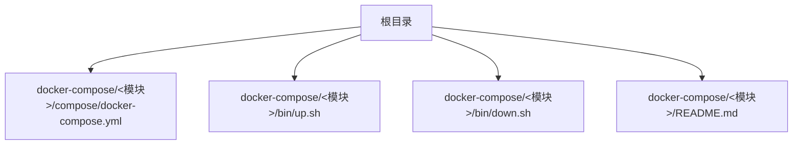
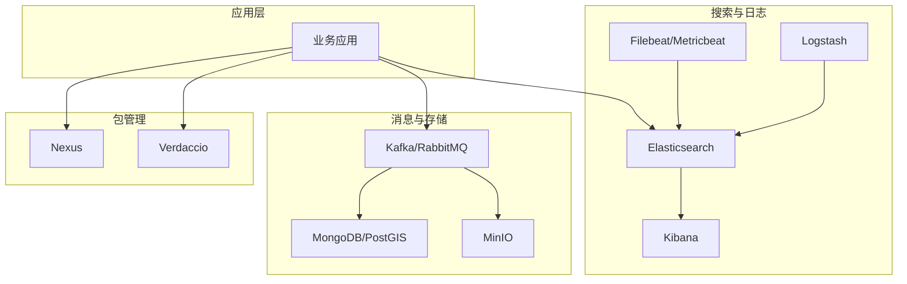
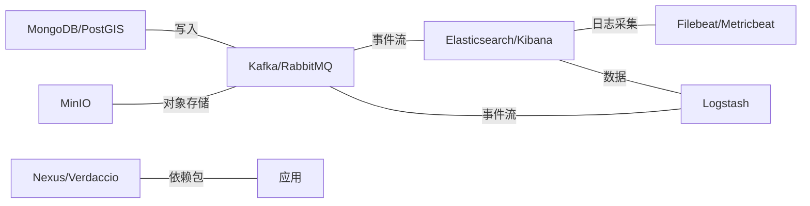

# 最佳实践

<cite>
**本文引用的文件**
- [README.md](file://README.md)
- [elasticsearch-single/compose/docker-compose.yml](file://docker-compose/elasticsearch-single/compose/docker-compose.yml)
- [elasticsearch-single/bin/up.sh](file://docker-compose/elasticsearch-single/bin/up.sh)
- [elasticsearch-single/bin/down.sh](file://docker-compose/elasticsearch-single/bin/down.sh)
- [elasticsearch-single/README.md](file://docker-compose/elasticsearch-single/README.md)
- [elk-cluster/compose/docker-compose.yml](file://docker-compose/elk-cluster/compose/docker-compose.yml)
- [kafka-single/compose/docker-compose.yml](file://docker-compose/kafka-single/compose/docker-compose.yml)
- [kafka-cluster/compose/docker-compose.yml](file://docker-compose/kafka-cluster/compose/docker-compose.yml)
- [mongodb-single/compose/docker-compose.yml](file://docker-compose/mongodb-single/compose/docker-compose.yml)
- [rabbitmq-single/compose/docker-compose.yml](file://docker-compose/rabbitmq-single/compose/docker-compose.yml)
- [rabbitmq-cluster/compose/docker-compose.yml](file://docker-compose/rabbitmq-cluster/compose/docker-compose.yml)
- [minio-single/compose/docker-compose.yml](file://docker-compose/minio-single/compose/docker-compose.yml)
- [nexus-single/compose/docker-compose.yml](file://docker-compose/nexus-single/compose/docker-compose.yml)
- [verdaccio-single/compose/docker-compose.yml](file://docker-compose/verdaccio-single/compose/docker-compose.yml)
- [zookeeper-cluster/compose/docker-compose.yml](file://docker-compose/zookeeper-cluster/compose/docker-compose.yml)
- [postgis-single/compose/docker-compose.yml](file://docker-compose/postgis-single/compose/docker-compose.yml)
</cite>

## 目录
1. 引言
2. 项目结构
3. 核心组件
4. 架构总览
5. 组件详解与最佳实践
6. 依赖关系分析
7. 性能与资源优化
8. 故障排查指南
9. 结论
10. 附录

## 引言
本最佳实践指南面向在容器化环境中进行开发与运维的团队，围绕安全配置、性能优化、运维管理、资源限制、监控告警、日志管理、环境隔离、版本管理与扩展升级、以及企业级部署与合规性等方面，结合仓库中现有编排样例给出可落地的建议与流程。目标是帮助读者在保证安全性与稳定性的同时，提升系统可用性与可维护性。

## 项目结构
该仓库以“按功能模块分目录”的方式组织 docker-compose 编排，每个子目录包含：
- compose/docker-compose.yml：服务定义与运行参数
- bin/up.sh、bin/down.sh：启动/停止脚本（部分模块）
- README.md：使用说明、端口映射、数据持久化等

章节来源
- [README.md:1-6](file://README.md#L1-L6)

## 核心组件
- 搜索与可视化栈：Elasticsearch 单实例/Kibana；ELK 集群（含 Metricbeat/Filebeat/Logstash）
- 消息队列：Kafka 单实例/集群；RabbitMQ 单实例/集群；ZooKeeper 集群
- 存储与包管理：MinIO（对象存储）、Nexus（Maven/NPM 私有库）、Verdaccio（npm 私有库）
- 数据库：MongoDB 单实例；PostGIS 单实例
- 其他：GeoServer、Stable Diffusion WebUI 等（按需启用）

章节来源
- [elasticsearch-single/compose/docker-compose.yml:1-134](file://docker-compose/elasticsearch-single/compose/docker-compose.yml#L1-L134)
- [elk-cluster/compose/docker-compose.yml:1-202](file://docker-compose/elk-cluster/compose/docker-compose.yml#L1-L202)
- [kafka-single/compose/docker-compose.yml:1-54](file://docker-compose/kafka-single/compose/docker-compose.yml#L1-L54)
- [kafka-cluster/compose/docker-compose.yml:1-119](file://docker-compose/kafka-cluster/compose/docker-compose.yml#L1-L119)
- [rabbitmq-single/compose/docker-compose.yml:1-38](file://docker-compose/rabbitmq-single/compose/docker-compose.yml#L1-L38)
- [rabbitmq-cluster/compose/docker-compose.yml:1-137](file://docker-compose/rabbitmq-cluster/compose/docker-compose.yml#L1-L137)
- [zookeeper-cluster/compose/docker-compose.yml:1-68](file://docker-compose/zookeeper-cluster/compose/docker-compose.yml#L1-L68)
- [mongodb-single/compose/docker-compose.yml:1-21](file://docker-compose/mongodb-single/compose/docker-compose.yml#L1-L21)
- [minio-single/compose/docker-compose.yml:1-25](file://docker-compose/minio-single/compose/docker-compose.yml#L1-L25)
- [nexus-single/compose/docker-compose.yml:1-19](file://docker-compose/nexus-single/compose/docker-compose.yml#L1-L19)
- [verdaccio-single/compose/docker-compose.yml:1-21](file://docker-compose/verdaccio-single/compose/docker-compose.yml#L1-L21)
- [postgis-single/compose/docker-compose.yml:1-22](file://docker-compose/postgis-single/compose/docker-compose.yml#L1-L22)

## 架构总览
下图展示典型开发环境中的核心组件交互：应用通过消息中间件与数据存储互通，搜索与日志链路由 ELK 提供统一采集与可视化能力。

## 组件详解与最佳实践

### 安全配置
- 密码与凭据
  - 使用环境变量注入敏感信息，避免硬编码于镜像或配置文件中。示例：Elasticsearch/Kibana 的用户名/密码、RabbitMQ/MongoDB/MinIO 的默认账户密码等均来自环境变量或配置文件。
  - 建议：为每套组件设置独立强口令，定期轮换；在 CI/CD 中使用密文管理器（如 HashiCorp Vault、KMS）注入。
- 传输加密与证书
  - ELK 集群启用了 HTTP/Transport SSL 与证书校验；建议生产环境强制开启并使用受信 CA 签发的证书。
- 访问控制
  - 启用各组件内置鉴权（如 Elasticsearch/X-Pack、Kibana、RabbitMQ 管理插件），限制管理端口暴露范围。
- 网络隔离
  - 将不同信任域的服务置于独立网络；仅开放必要端口；对管理端口（如 5601、15672、9001）做防火墙/反向代理保护。

章节来源
- [elasticsearch-single/compose/docker-compose.yml:70-86](file://docker-compose/elasticsearch-single/compose/docker-compose.yml#L70-L86)
- [elk-cluster/compose/docker-compose.yml:70-86](file://docker-compose/elk-cluster/compose/docker-compose.yml#L70-L86)
- [rabbitmq-single/compose/docker-compose.yml:15-24](file://docker-compose/rabbitmq-single/compose/docker-compose.yml#L15-L24)
- [mongodb-single/compose/docker-compose.yml:12-15](file://docker-compose/mongodb-single/compose/docker-compose.yml#L12-L15)
- [minio-single/compose/docker-compose.yml:15-21](file://docker-compose/minio-single/compose/docker-compose.yml#L15-L21)

### 资源限制与性能优化
- 内存与 JVM
  - Elasticsearch 默认 JVM 堆大小可按生产需求调整；建议与宿主机内存匹配，避免交换导致抖动。
  - 参考：Elasticsearch 单实例部署文档中提供了 JVM 调整示例与系统参数建议。
- 文件描述符与内核参数
  - 提升文件句柄上限与 mmap 计数，满足大数据场景。
- Kafka
  - 生产环境使用 KRaft 模式且多副本；合理设置分区数与复制因子；开启自动创建主题时注意容量规划。
- RabbitMQ
  - 集群模式下共享 Erlang Cookie 并固定节点集合；为管理端口与指标端口设置独立映射。
- ZooKeeper
  - 三节点集群，明确 ZOO_SERVERS 与端口映射；提供可视化工具便于运维。

章节来源
- [elasticsearch-single/README.md:277-296](file://docker-compose/elasticsearch-single/README.md#L277-L296)
- [kafka-single/compose/docker-compose.yml:23-30](file://docker-compose/kafka-single/compose/docker-compose.yml#L23-L30)
- [kafka-cluster/compose/docker-compose.yml:23-29](file://docker-compose/kafka-cluster/compose/docker-compose.yml#L23-L29)
- [rabbitmq-cluster/compose/docker-compose.yml:19-26](file://docker-compose/rabbitmq-cluster/compose/docker-compose.yml#L19-L26)
- [zookeeper-cluster/compose/docker-compose.yml:13-15](file://docker-compose/zookeeper-cluster/compose/docker-compose.yml#L13-L15)

### 运维管理与生命周期
- 启停脚本
  - 使用模块内的 up.sh/down.sh 快速拉起/关停服务；支持指定项目名与 env 文件。
- 健康检查
  - 各组件配置了健康检查命令，便于编排层感知状态。
- 数据持久化
  - 通过挂载宿主机目录到容器内部数据目录实现持久化；注意权限与磁盘配额。

章节来源
- [elasticsearch-single/bin/up.sh:14-17](file://docker-compose/elasticsearch-single/bin/up.sh#L14-L17)
- [elasticsearch-single/bin/down.sh:14-16](file://docker-compose/elasticsearch-single/bin/down.sh#L14-L16)
- [kafka-single/compose/docker-compose.yml:30-33](file://docker-compose/kafka-single/compose/docker-compose.yml#L30-L33)
- [rabbitmq-single/compose/docker-compose.yml:29-33](file://docker-compose/rabbitmq-single/compose/docker-compose.yml#L29-L33)

### 监控告警与日志管理
- 日志采集
  - ELK 集群包含 Filebeat/Metricbeat/Logstash，用于容器与主机系统日志采集与处理。
- 指标采集
  - RabbitMQ 提供 Prometheus 指标端口；建议在 Prometheus 中抓取并配置告警规则。
- 可视化
  - Kibana 提供仪表板与查询界面；建议建立索引模板与字段映射规范。

章节来源
- [elk-cluster/compose/docker-compose.yml:130-197](file://docker-compose/elk-cluster/compose/docker-compose.yml#L130-L197)
- [rabbitmq-single/compose/docker-compose.yml:25-28](file://docker-compose/rabbitmq-single/compose/docker-compose.yml#L25-L28)

### 环境隔离、版本管理与扩展升级
- 环境隔离
  - 不同业务/租户的服务置于独立网络；最小暴露面原则；管理端口不直接对外。
- 版本管理
  - 统一通过 compose 中的镜像标签锁定版本；在 CI 中验证新版本兼容性。
- 扩展升级
  - 优先采用滚动升级策略；对有状态组件先备份再升级；Kafka/RabbitMQ/ZooKeeper 需遵循各自集群升级步骤。

章节来源
- [kafka-single/compose/docker-compose.yml:3-10](file://docker-compose/kafka-single/compose/docker-compose.yml#L3-L10)
- [rabbitmq-cluster/compose/docker-compose.yml:115-133](file://docker-compose/rabbitmq-cluster/compose/docker-compose.yml#L115-L133)
- [zookeeper-cluster/compose/docker-compose.yml:53-64](file://docker-compose/zookeeper-cluster/compose/docker-compose.yml#L53-L64)

### 企业级部署考虑与合规性
- 合规与审计
  - 对外暴露的管理端口必须经由网关/堡垒机访问；启用 TLS 与双向认证；记录操作审计日志。
- 数据保护
  - 对敏感数据进行静态加密；备份策略覆盖全量+增量；定期恢复演练。
- 合规基线
  - 镜像来源可信；定期扫描漏洞；最小权限原则；网络策略限制横向移动。

## 依赖关系分析
以下图示展示各模块间潜在的依赖与耦合关系，便于在升级与迁移时评估影响面。

## 性能与资源优化
- CPU/内存/磁盘
  - 为有状态组件设置 mem_limit 与 ulimit；确保宿主机具备足够的 I/O 能力与带宽。
- 索引与查询
  - Elasticsearch：合理设置分片与副本；禁用动态映射字段过多；定期 force merge 与冷热分层。
- 消息队列
  - Kafka：分区数与副本数平衡吞吐与容灾；开启压缩与批处理；监控 LAG。
  - RabbitMQ：合理设置队列与消费者并发；启用镜像队列；监控队列长度与内存使用。

章节来源
- [elasticsearch-single/compose/docker-compose.yml:87-91](file://docker-compose/elasticsearch-single/compose/docker-compose.yml#L87-L91)
- [kafka-single/compose/docker-compose.yml:27-30](file://docker-compose/kafka-single/compose/docker-compose.yml#L27-L30)
- [rabbitmq-single/compose/docker-compose.yml:15-24](file://docker-compose/rabbitmq-single/compose/docker-compose.yml#L15-L24)

## 故障排查指南
- 常见问题定位
  - 查看容器日志与健康检查状态；确认端口占用与网络连通性。
  - 对于 Elasticsearch：检查证书路径与权限、JVM 参数、bootstrap.memory_lock。
  - 对于 Kafka：确认 KRaft 控制器投票配置与 advertised.listeners。
  - 对于 RabbitMQ：确认 Erlang Cookie 一致与集群节点可见性。
- 备份与回滚
  - 在升级前对数据卷与配置进行快照；失败时快速回滚至上一个稳定版本。

章节来源
- [elasticsearch-single/bin/down.sh:18-23](file://docker-compose/elasticsearch-single/bin/down.sh#L18-L23)
- [elk-cluster/compose/docker-compose.yml:50-50](file://docker-compose/elk-cluster/compose/docker-compose.yml#L50-L50)
- [kafka-cluster/compose/docker-compose.yml:17-17](file://docker-compose/kafka-cluster/compose/docker-compose.yml#L17-L17)
- [rabbitmq-cluster/compose/docker-compose.yml:22-22](file://docker-compose/rabbitmq-cluster/compose/docker-compose.yml#L22-L22)

## 结论
通过标准化的容器编排、严格的权限与网络隔离、完善的监控与日志体系、以及规范的版本与变更流程，可以在保证开发效率的同时，显著提升系统的安全性与可运维性。建议在进入生产前完成安全加固、合规评审与灾难恢复演练。

## 附录
- 快速启动与停止
  - 使用模块内 up.sh/down.sh 或 docker compose 指令进行启停。
- 数据与配置
  - 关注各模块 README 中的数据目录与配置位置，确保权限与备份策略到位。

章节来源
- [elasticsearch-single/bin/up.sh:14-17](file://docker-compose/elasticsearch-single/bin/up.sh#L14-L17)
- [elasticsearch-single/bin/down.sh:14-16](file://docker-compose/elasticsearch-single/bin/down.sh#L14-L16)
- [elasticsearch-single/README.md:65-74](file://docker-compose/elasticsearch-single/README.md#L65-L74)