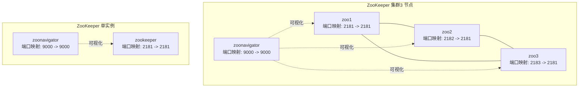
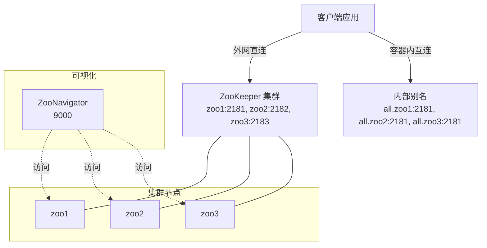
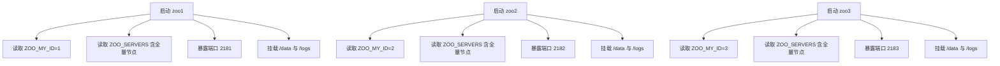
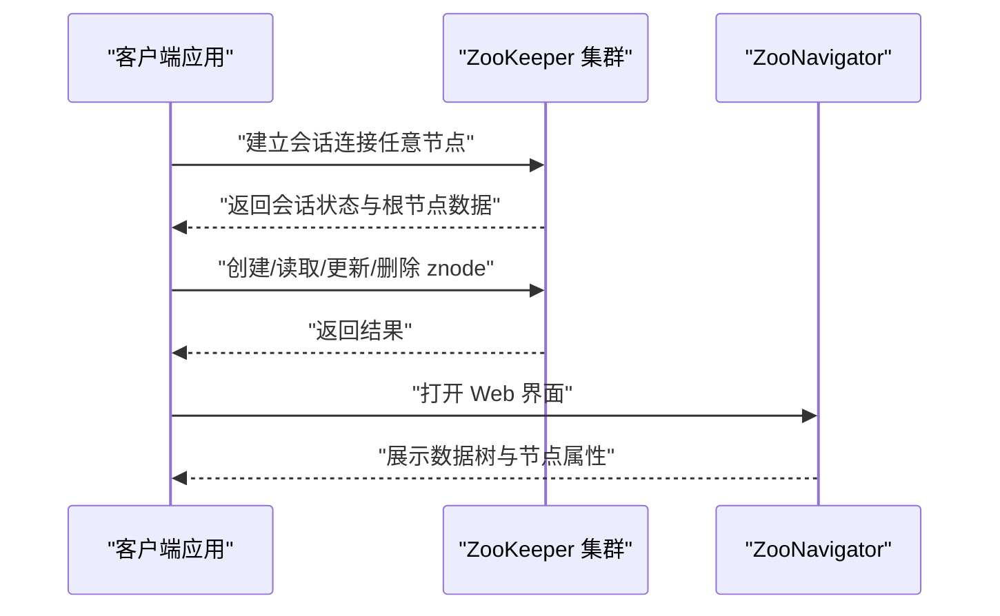
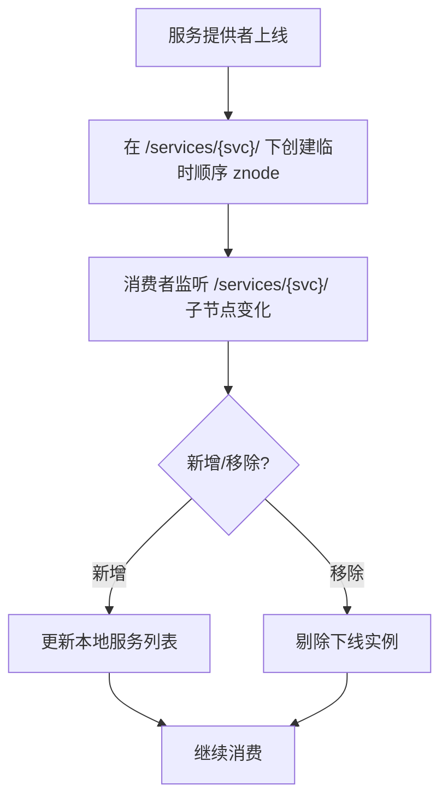
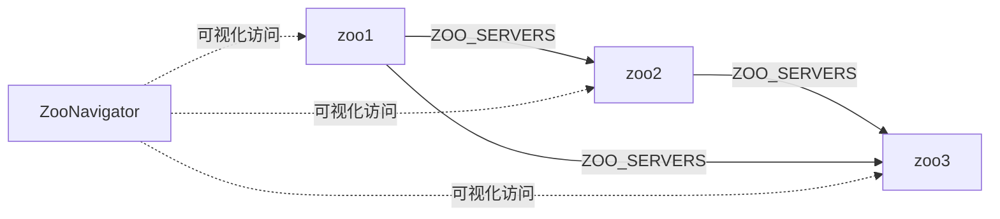

# 服务发现

<cite>
**本文引用的文件**
- [docker-compose.yml（ZooKeeper 集群）](file://docker-compose/zookeeper-cluster/compose/docker-compose.yml)
- [docker-compose.yml（ZooKeeper 单实例）](file://docker-compose/zookeeper-single/compose/docker-compose.yml)
- [启动脚本（ZooKeeper 集群）](file://docker-compose/zookeeper-cluster/bin/up.sh)
- [停止脚本（ZooKeeper 集群）](file://docker-compose/zookeeper-cluster/bin/down.sh)
- [启动脚本（ZooKeeper 单实例）](file://docker-compose/zookeeper-single/bin/up.sh)
- [停止脚本（ZooKeeper 单实例）](file://docker-compose/zookeeper-single/bin/down.sh)
- [ZooKeeper 集群说明文档](file://docker-compose/zookeeper-cluster/README.md)
- [ZooKeeper 单实例说明文档](file://docker-compose/zookeeper-single/README.md)
</cite>

## 目录
1. [简介](#简介)
2. [项目结构](#项目结构)
3. [核心组件](#核心组件)
4. [架构总览](#架构总览)
5. [详细组件分析](#详细组件分析)
6. [依赖关系分析](#依赖关系分析)
7. [性能考虑](#性能考虑)
8. [故障排查指南](#故障排查指南)
9. [结论](#结论)
10. [附录](#附录)

## 简介
本文件面向“服务发现”场景，聚焦 ZooKeeper 分布式协调服务在容器中的部署与配置，覆盖集群节点配置、会话管理、服务注册机制、配置管理、数据同步与故障转移策略，并提供客户端连接、数据操作与监控告警的实践路径。同时给出分布式一致性原理的要点说明、性能调优建议与安全配置最佳实践，帮助读者在开发与生产环境中高效落地。

## 项目结构
该仓库提供了 ZooKeeper 的单实例与三节点集群两种容器化方案，配套启动/停止脚本与使用说明文档。集群模式通过 ZooNavigator 提供可视化管理界面；单实例模式用于学习与轻量测试。

图表来源
- [docker-compose.yml（ZooKeeper 集群）:1-68](file://docker-compose/zookeeper-cluster/compose/docker-compose.yml#L1-L68)
- [docker-compose.yml（ZooKeeper 单实例）:1-31](file://docker-compose/zookeeper-single/compose/docker-compose.yml#L1-L31)

章节来源
- [ZooKeeper 集群说明文档:1-125](file://docker-compose/zookeeper-cluster/README.md#L1-L125)
- [ZooKeeper 单实例说明文档:1-103](file://docker-compose/zookeeper-single/README.md#L1-L103)

## 核心组件
- ZooKeeper 集群（3 节点）
  - 使用官方镜像版本：zookeeper:3.5
  - 数据持久化：每个节点挂载宿主机目录至容器内 /data 与 /logs
  - 网络：统一桥接网络 all，节点间可通过别名通信
  - 端口：zoo1 映射 2181，zoo2 映射 2182，zoo3 映射 2183；ZooNavigator 暴露 9000
  - 环境变量：每台节点均配置完整集群信息，支持高可用
- ZooNavigator
  - 提供 Web 管理界面，便于查看与操作 ZooKeeper 数据树
- 单实例 ZooKeeper
  - 仅一个 ZooKeeper 容器与 ZooNavigator 组成，适合学习与轻量测试

章节来源
- [docker-compose.yml（ZooKeeper 集群）:1-68](file://docker-compose/zookeeper-cluster/compose/docker-compose.yml#L1-L68)
- [ZooKeeper 集群说明文档:84-108](file://docker-compose/zookeeper-cluster/README.md#L84-L108)
- [docker-compose.yml（ZooKeeper 单实例）:1-31](file://docker-compose/zookeeper-single/compose/docker-compose.yml#L1-L31)
- [ZooKeeper 单实例说明文档:76-88](file://docker-compose/zookeeper-single/README.md#L76-L88)

## 架构总览
下图展示 ZooKeeper 集群与可视化工具的交互关系，以及客户端访问路径（外网直连与容器内互连）。

图表来源
- [docker-compose.yml（ZooKeeper 集群）:1-68](file://docker-compose/zookeeper-cluster/compose/docker-compose.yml#L1-L68)
- [ZooKeeper 集群说明文档:16-37](file://docker-compose/zookeeper-cluster/README.md#L16-L37)

## 详细组件分析

### 集群节点配置与角色
- 节点标识与端口
  - zoo1: ZOO_MY_ID=1，对外映射 2181
  - zoo2: ZOO_MY_ID=2，对外映射 2182
  - zoo3: ZOO_MY_ID=3，对外映射 2183
- 集群成员列表
  - 每个节点的 ZOO_SERVERS 均包含全部三个节点的地址与端口，确保任一节点可独立工作并参与选举
- 数据与日志卷
  - 每个节点分别挂载宿主机目录到容器内的 /data 与 /logs，实现持久化存储

图表来源
- [docker-compose.yml（ZooKeeper 集群）:2-51](file://docker-compose/zookeeper-cluster/compose/docker-compose.yml#L2-L51)

章节来源
- [docker-compose.yml（ZooKeeper 集群）:2-51](file://docker-compose/zookeeper-cluster/compose/docker-compose.yml#L2-L51)
- [ZooKeeper 集群说明文档:100-108](file://docker-compose/zookeeper-cluster/README.md#L100-L108)

### 会话管理与客户端连接
- 外网直连
  - 集群：127.0.0.1:2181,127.0.0.1:2182,127.0.0.1:2183
  - 单实例：127.0.0.1:2181
- 容器内互连
  - 通过网络别名 all.zoo1/all.zoo2/all.zoo3:2181 连接
- ZooNavigator
  - Web 界面访问：http://127.0.0.1:9000
  - 连接字符串示例：zoo1:2181,zoo2:2181,zoo3:2181（集群）

图表来源
- [ZooKeeper 集群说明文档:16-37](file://docker-compose/zookeeper-cluster/README.md#L16-L37)
- [ZooKeeper 单实例说明文档:14-35](file://docker-compose/zookeeper-single/README.md#L14-L35)

章节来源
- [ZooKeeper 集群说明文档:16-37](file://docker-compose/zookeeper-cluster/README.md#L16-L37)
- [ZooKeeper 单实例说明文档:14-35](file://docker-compose/zookeeper-single/README.md#L14-L35)

### 服务注册机制（基于 znode 的典型用法）
- 服务提供者启动后向 ZooKeeper 注册临时顺序 znode，路径通常为 /services/{service-name}/{provider-id}
- 消费者订阅该路径下的子节点，监听变更事件以动态感知服务上下线
- 临时 znode 在会话断开时自动清理，天然支持故障摘除

（本图为概念性流程示意，不对应具体源码文件）

### 配置管理与数据同步
- 配置管理
  - 将应用配置集中存放在 ZooKeeper 中的特定 znode 下，客户端按需拉取并监听变更
  - 推荐分层组织：/configs/{app}/{env}/{key}
- 数据同步
  - 集群内部通过 ZAB 协议保证写入一致与顺序性
  - 客户端通过会话与 Watcher 机制感知变更，避免轮询

章节来源
- [ZooKeeper 集群说明文档:110-117](file://docker-compose/zookeeper-cluster/README.md#L110-L117)
- [ZooKeeper 单实例说明文档:89-95](file://docker-compose/zookeeper-single/README.md#L89-L95)

### 故障转移策略
- 任一节点故障
  - 其余节点继续提供服务；客户端重连任一健康节点即可恢复
- 脑裂处理
  - 集群要求奇数节点（推荐 3 或 5），避免多数派冲突
- 数据备份
  - 建议定期备份宿主机上的 /data 与 /logs 目录

章节来源
- [ZooKeeper 集群说明文档:118-125](file://docker-compose/zookeeper-cluster/README.md#L118-L125)
- [ZooKeeper 单实例说明文档:96-103](file://docker-compose/zookeeper-single/README.md#L96-L103)

### 客户端连接、数据操作与监控告警（实践路径）
- 客户端连接
  - 使用任意节点地址作为连接字符串，或通过容器别名进行内网访问
- 数据操作
  - 创建 znode、设置数据、设置 ACL、删除 znode、递归删除等
  - 使用 Watcher 监听节点变化，实现配置热更新与服务发现
- 监控与告警
  - 使用 ZooNavigator Web 界面观察节点状态与数据树
  - 结合系统监控工具采集容器资源与网络指标，结合业务侧埋点实现告警

章节来源
- [ZooKeeper 集群说明文档:16-37](file://docker-compose/zookeeper-cluster/README.md#L16-L37)
- [ZooKeeper 单实例说明文档:14-35](file://docker-compose/zookeeper-single/README.md#L14-L35)

## 依赖关系分析
- 组件耦合
  - 集群节点之间强耦合于 ZOO_SERVERS 配置，弱耦合于 ZooNavigator
  - ZooNavigator 仅作为外部可视化工具，不参与数据一致性决策
- 外部依赖
  - Docker Compose 用于编排
  - ZooKeeper 官方镜像与 ZooNavigator 镜像

图表来源
- [docker-compose.yml（ZooKeeper 集群）:13-49](file://docker-compose/zookeeper-cluster/compose/docker-compose.yml#L13-L49)

章节来源
- [docker-compose.yml（ZooKeeper 集群）:1-68](file://docker-compose/zookeeper-cluster/compose/docker-compose.yml#L1-L68)

## 性能考虑
- 磁盘与 IO
  - 将 /data 与 /logs 挂载到高性能磁盘，避免容器内小文件频繁写入影响性能
- 端口与网络
  - 集群节点端口映射分散（2181/2182/2183），降低单点压力
- JVM 参数（建议）
  - 生产环境建议调整 JVM 内存与 GC 参数，以提升吞吐与稳定性
- 会话超时与重试
  - 客户端合理设置会话超时与重试策略，避免抖动导致频繁重建会话

（本节为通用指导，不直接分析具体文件）

## 故障排查指南
- 启停脚本
  - 集群与单实例均提供 up.sh 与 down.sh，便于快速启停与状态检查
- 常见问题
  - 端口占用：确认 2181-2183 与 9000 未被占用
  - 数据卷：停止后数据保留于 ./temp/，重启后可恢复
  - 单实例无高可用：生产环境建议使用集群部署

章节来源
- [启动脚本（ZooKeeper 集群）:1-27](file://docker-compose/zookeeper-cluster/bin/up.sh#L1-L27)
- [停止脚本（ZooKeeper 集群）:1-20](file://docker-compose/zookeeper-cluster/bin/down.sh#L1-L20)
- [启动脚本（ZooKeeper 单实例）:1-27](file://docker-compose/zookeeper-single/bin/up.sh#L1-L27)
- [停止脚本（ZooKeeper 单实例）:1-20](file://docker-compose/zookeeper-single/bin/down.sh#L1-L20)
- [ZooKeeper 集群说明文档:118-125](file://docker-compose/zookeeper-cluster/README.md#L118-L125)
- [ZooKeeper 单实例说明文档:96-103](file://docker-compose/zookeeper-single/README.md#L96-L103)

## 结论
本方案提供了 ZooKeeper 在容器中的标准化部署模板：集群模式强调高可用与可视化运维，单实例模式强调易用与学习成本。通过合理的节点配置、会话管理与数据组织，可满足服务发现、配置中心与分布式锁等典型场景。建议在生产环境采用集群部署，并结合监控与备份策略保障稳定性与可恢复性。

## 附录

### 快速上手（集群）
- 启动
  - 执行 ./bin/up.sh 或使用 docker compose 指令
- 访问
  - 外网直连：127.0.0.1:2181,127.0.0.1:2182,127.0.0.1:2183
  - ZooNavigator：http://127.0.0.1:9000
- 停止
  - 执行 ./bin/down.sh 或使用 docker compose 指令

章节来源
- [ZooKeeper 集群说明文档:39-65](file://docker-compose/zookeeper-cluster/README.md#L39-L65)
- [启动脚本（ZooKeeper 集群）:14-26](file://docker-compose/zookeeper-cluster/bin/up.sh#L14-L26)
- [停止脚本（ZooKeeper 集群）:14-19](file://docker-compose/zookeeper-cluster/bin/down.sh#L14-L19)

### 快速上手（单实例）
- 启动
  - 执行 ./bin/up.sh 或使用 docker compose 指令
- 访问
  - 外网直连：127.0.0.1:2181
  - ZooNavigator：http://127.0.0.1:9000
- 停止
  - 执行 ./bin/down.sh 或使用 docker compose 指令

章节来源
- [ZooKeeper 单实例说明文档:37-63](file://docker-compose/zookeeper-single/README.md#L37-L63)
- [启动脚本（ZooKeeper 单实例）:14-26](file://docker-compose/zookeeper-single/bin/up.sh#L14-L26)
- [停止脚本（ZooKeeper 单实例）:14-19](file://docker-compose/zookeeper-single/bin/down.sh#L14-L19)