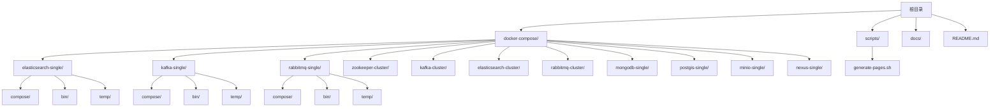
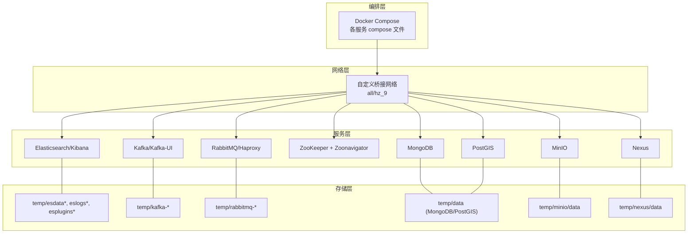
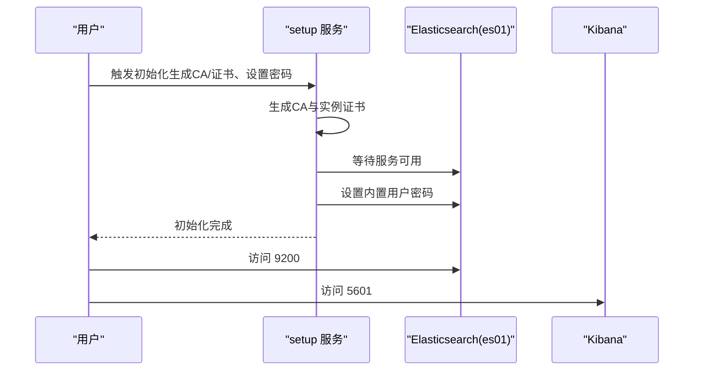
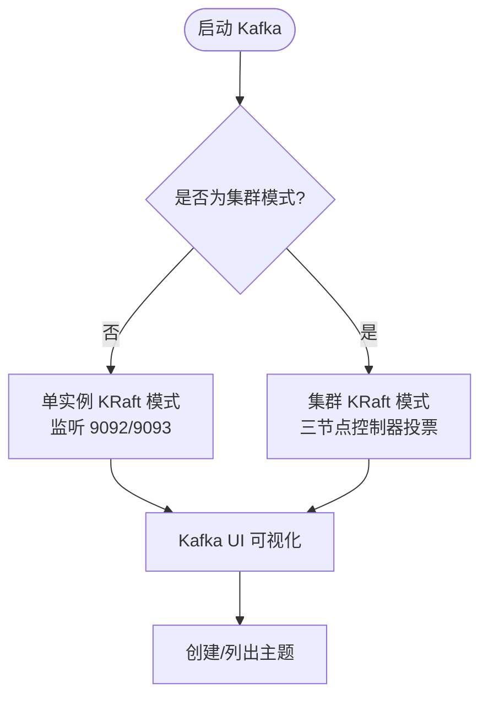
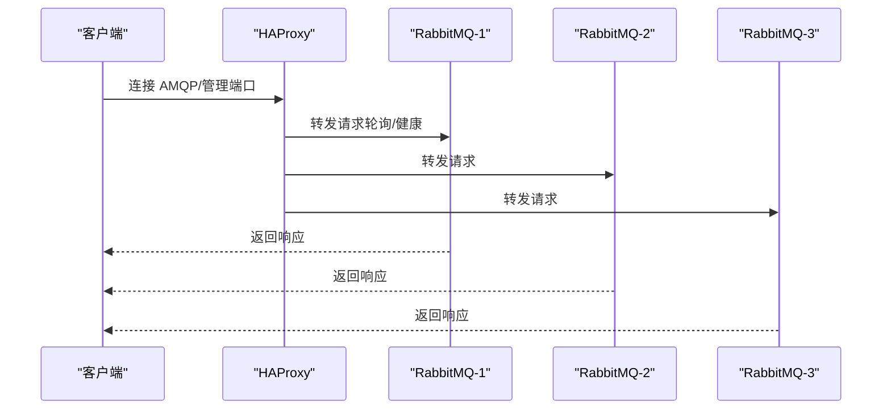
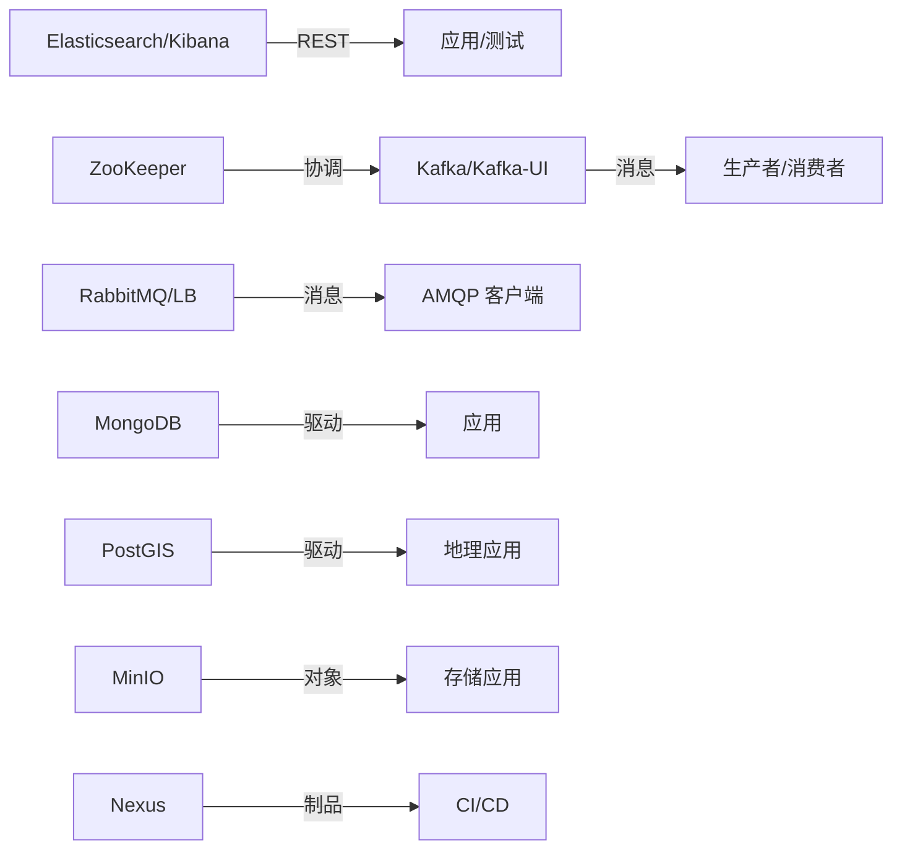

# 架构设计

<cite>
**本文引用的文件**
- [README.md](file://README.md)
- [elasticsearch-single-compose.yml](file://docker-compose/elasticsearch-single/compose/docker-compose.yml)
- [kafka-single-compose.yml](file://docker-compose/kafka-single/compose/docker-compose.yml)
- [mongodb-single-compose.yml](file://docker-compose/mongodb-single/compose/docker-compose.yml)
- [rabbitmq-single-compose.yml](file://docker-compose/rabbitmq-single/compose/docker-compose.yml)
- [postgis-single-compose.yml](file://docker-compose/postgis-single/compose/docker-compose.yml)
- [elasticsearch-cluster-compose.yml](file://docker-compose/elasticsearch-cluster/compose/docker-compose.yml)
- [kafka-cluster-compose.yml](file://docker-compose/kafka-cluster/compose/docker-compose.yml)
- [rabbitmq-cluster-compose.yml](file://docker-compose/rabbitmq-cluster/compose/docker-compose.yml)
- [zookeeper-cluster-compose.yml](file://docker-compose/zookeeper-cluster/compose/docker-compose.yml)
- [nexus-single-compose.yml](file://docker-compose/nexus-single/compose/docker-compose.yml)
- [minio-single-compose.yml](file://docker-compose/minio-single/compose/docker-compose.yml)
- [elasticsearch-single-up.sh](file://docker-compose/elasticsearch-single/bin/up.sh)
- [elasticsearch-single-down.sh](file://docker-compose/elasticsearch-single/bin/down.sh)
- [kafka-single-up.sh](file://docker-compose/kafka-single/bin/up.sh)
- [rabbitmq-single-up.sh](file://docker-compose/rabbitmq-single/bin/up.sh)
- [generate-pages.sh](file://scripts/generate-pages.sh)
- [package.json](file://package.json)
</cite>

## 目录
1. [引言](#引言)
2. [项目结构](#项目结构)
3. [核心组件](#核心组件)
4. [架构总览](#架构总览)
5. [详细组件分析](#详细组件分析)
6. [依赖关系分析](#依赖关系分析)
7. [性能考虑](#性能考虑)
8. [故障排查指南](#故障排查指南)
9. [结论](#结论)
10. [附录](#附录)

## 引言
本项目为容器化开发环境集合，通过 Docker Compose 提供标准化的多组件开发栈，覆盖搜索与可视化（Elastic Stack）、消息队列（Kafka/RabbitMQ/ZooKeeper）、数据库（MongoDB/PostGIS）、对象存储（MinIO）与制品库（Nexus）等场景。其设计遵循模块化、可复用与可扩展原则：每个服务以独立子目录组织，采用统一的 compose 文件与启动脚本，结合外部卷实现数据持久化与配置隔离；网络层通过自定义网络与别名实现服务间发现与访问；环境变量集中管理，便于按需定制。

## 项目结构
项目采用“功能域+模块化”的目录组织方式：
- docker-compose/<服务>/<子模块>/compose：存放该服务的 Docker Compose 编排文件
- docker-compose/<服务>/<子模块>/bin：存放启动/停止脚本
- docker-compose/<服务>/<子模块>/temp：用于挂载到容器的数据卷（持久化）
- scripts：文档生成与自动化脚本
- docs：文档源与构建配置
- 根级 README.md：项目概览与文档链接

图示来源
- [README.md](file://README.md)
- [elasticsearch-single-compose.yml](file://docker-compose/elasticsearch-single/compose/docker-compose.yml)
- [kafka-single-compose.yml](file://docker-compose/kafka-single/compose/docker-compose.yml)
- [rabbitmq-single-compose.yml](file://docker-compose/rabbitmq-single/compose/docker-compose.yml)
- [zookeeper-cluster-compose.yml](file://docker-compose/zookeeper-cluster/compose/docker-compose.yml)
- [kafka-cluster-compose.yml](file://docker-compose/kafka-cluster/compose/docker-compose.yml)
- [elasticsearch-cluster-compose.yml](file://docker-compose/elasticsearch-cluster/compose/docker-compose.yml)
- [rabbitmq-cluster-compose.yml](file://docker-compose/rabbitmq-cluster/compose/docker-compose.yml)
- [mongodb-single-compose.yml](file://docker-compose/mongodb-single/compose/docker-compose.yml)
- [postgis-single-compose.yml](file://docker-compose/postgis-single/compose/docker-compose.yml)
- [minio-single-compose.yml](file://docker-compose/minio-single/compose/docker-compose.yml)
- [nexus-single-compose.yml](file://docker-compose/nexus-single/compose/docker-compose.yml)

章节来源
- [README.md](file://README.md)

## 核心组件
- 搜索与可视化栈（Elasticsearch/Kibana）
  - 单实例与集群两种形态，支持证书初始化、安全加固与健康检查
  - 数据/日志/插件目录通过外部卷持久化
- 消息中间件
  - Kafka：单实例（KRaft 模式）与集群（KRaft 多节点），含 UI 管理界面
  - RabbitMQ：单实例与集群（含 HAProxy 负载均衡）
  - ZooKeeper：三节点集群与可视化工具
- 数据库
  - MongoDB 单实例
  - PostGIS 单实例（PostgreSQL 扩展）
- 对象存储与制品库
  - MinIO 单实例（含控制台）
  - Nexus 单实例（Maven/NPM 等制品库）

章节来源
- [elasticsearch-single-compose.yml](file://docker-compose/elasticsearch-single/compose/docker-compose.yml)
- [elasticsearch-cluster-compose.yml](file://docker-compose/elasticsearch-cluster/compose/docker-compose.yml)
- [kafka-single-compose.yml](file://docker-compose/kafka-single/compose/docker-compose.yml)
- [kafka-cluster-compose.yml](file://docker-compose/kafka-cluster/compose/docker-compose.yml)
- [rabbitmq-single-compose.yml](file://docker-compose/rabbitmq-single/compose/docker-compose.yml)
- [rabbitmq-cluster-compose.yml](file://docker-compose/rabbitmq-cluster/compose/docker-compose.yml)
- [zookeeper-cluster-compose.yml](file://docker-compose/zookeeper-cluster/compose/docker-compose.yml)
- [mongodb-single-compose.yml](file://docker-compose/mongodb-single/compose/docker-compose.yml)
- [postgis-single-compose.yml](file://docker-compose/postgis-single/compose/docker-compose.yml)
- [minio-single-compose.yml](file://docker-compose/minio-single/compose/docker-compose.yml)
- [nexus-single-compose.yml](file://docker-compose/nexus-single/compose/docker-compose.yml)

## 架构总览
整体架构由“编排层（Compose）+ 网络层（自定义网络）+ 存储层（外部卷）+ 启动脚本层（bin）”构成。各服务在独立命名空间内运行，通过服务别名与端口映射对外暴露能力；数据通过卷持久化至宿主机 temp 目录，便于调试与备份。

图示来源
- [elasticsearch-single-compose.yml](file://docker-compose/elasticsearch-single/compose/docker-compose.yml)
- [kafka-single-compose.yml](file://docker-compose/kafka-single/compose/docker-compose.yml)
- [rabbitmq-single-compose.yml](file://docker-compose/rabbitmq-single/compose/docker-compose.yml)
- [zookeeper-cluster-compose.yml](file://docker-compose/zookeeper-cluster/compose/docker-compose.yml)
- [kafka-cluster-compose.yml](file://docker-compose/kafka-cluster/compose/docker-compose.yml)
- [elasticsearch-cluster-compose.yml](file://docker-compose/elasticsearch-cluster/compose/docker-compose.yml)
- [rabbitmq-cluster-compose.yml](file://docker-compose/rabbitmq-cluster/compose/docker-compose.yml)
- [mongodb-single-compose.yml](file://docker-compose/mongodb-single/compose/docker-compose.yml)
- [postgis-single-compose.yml](file://docker-compose/postgis-single/compose/docker-compose.yml)
- [minio-single-compose.yml](file://docker-compose/minio-single/compose/docker-compose.yml)
- [nexus-single-compose.yml](file://docker-compose/nexus-single/compose/docker-compose.yml)

## 详细组件分析

### Elasticsearch 单实例与集群
- 设计要点
  - 使用初始化任务生成证书与设置内置用户密码，启用传输/HTTP 安全与内存锁定
  - 通过外部卷挂载数据、日志、插件目录，确保重启后数据不丢失
  - 健康检查基于 HTTPS 探测，保障服务可用性
- 网络与端口
  - 默认网络名称为 hz_9；Elasticsearch 暴露 9200，Kibana 暴露 5601
- 环境变量
  - 支持版本、集群名、许可证类型、内存限制、端口映射等参数化配置
- 可扩展性
  - 集群版通过多节点与初始主节点列表实现高可用；SSL 与认证策略一致，便于横向扩展

图示来源
- [elasticsearch-single-compose.yml](file://docker-compose/elasticsearch-single/compose/docker-compose.yml)
- [elasticsearch-cluster-compose.yml](file://docker-compose/elasticsearch-cluster/compose/docker-compose.yml)

章节来源
- [elasticsearch-single-compose.yml](file://docker-compose/elasticsearch-single/compose/docker-compose.yml)
- [elasticsearch-cluster-compose.yml](file://docker-compose/elasticsearch-cluster/compose/docker-compose.yml)

### Kafka 单实例与集群（KRaft 模式）
- 设计要点
  - 单实例采用 KRaft 模式，无需 ZooKeeper；集群版三节点共享控制器投票配置
  - 通过环境变量配置监听器、广告地址、分区数与复制因子等
  - 提供 Kafka UI 作为可视化管理入口
- 网络与端口
  - 单实例映射 9092/9093；集群版为每节点映射不同端口以避免冲突
- 可扩展性
  - 集群复制因子与分区数可调；可通过 UI 或命令行进行主题管理

图示来源
- [kafka-single-compose.yml](file://docker-compose/kafka-single/compose/docker-compose.yml)
- [kafka-cluster-compose.yml](file://docker-compose/kafka-cluster/compose/docker-compose.yml)

章节来源
- [kafka-single-compose.yml](file://docker-compose/kafka-single/compose/docker-compose.yml)
- [kafka-cluster-compose.yml](file://docker-compose/kafka-cluster/compose/docker-compose.yml)

### RabbitMQ 单实例与集群（含负载均衡）
- 设计要点
  - 单实例默认开启管理与指标插件；集群版通过 Erlang Cookie 实现自动发现
  - 提供 HAProxy 作为外部负载均衡器，统一暴露 AMQP 与管理端口
- 网络与端口
  - 单实例：5672/15672/15692；集群：多节点不同端口映射；LB：5675/15675/8404
- 可扩展性
  - 集群节点数量可扩展；LB 统一入口简化客户端连接

图示来源
- [rabbitmq-single-compose.yml](file://docker-compose/rabbitmq-single/compose/docker-compose.yml)
- [rabbitmq-cluster-compose.yml](file://docker-compose/rabbitmq-cluster/compose/docker-compose.yml)

章节来源
- [rabbitmq-single-compose.yml](file://docker-compose/rabbitmq-single/compose/docker-compose.yml)
- [rabbitmq-cluster-compose.yml](file://docker-compose/rabbitmq-cluster/compose/docker-compose.yml)

### ZooKeeper 集群与可视化
- 设计要点
  - 三节点集群，节点间通过 ZOO_SERVERS 互相发现；提供 Zoonavigator 可视化
- 网络与端口
  - 端口映射区分节点；UI 暴露 9000

章节来源
- [zookeeper-cluster-compose.yml](file://docker-compose/zookeeper-cluster/compose/docker-compose.yml)

### 数据库（MongoDB 与 PostGIS）
- 设计要点
  - 单实例挂载数据目录；PostGIS 基于 PostgreSQL 扩展，适合地理空间数据
- 网络与端口
  - MongoDB：27017；PostGIS：5432

章节来源
- [mongodb-single-compose.yml](file://docker-compose/mongodb-single/compose/docker-compose.yml)
- [postgis-single-compose.yml](file://docker-compose/postgis-single/compose/docker-compose.yml)

### 对象存储与制品库
- MinIO
  - 单实例，提供 API 与控制台端口映射；默认凭据与控制台地址通过环境变量配置
- Nexus
  - 单实例，挂载数据目录，暴露 Web 管理端口

章节来源
- [minio-single-compose.yml](file://docker-compose/minio-single/compose/docker-compose.yml)
- [nexus-single-compose.yml](file://docker-compose/nexus-single/compose/docker-compose.yml)

## 依赖关系分析
- 组件耦合
  - 各服务相对独立，通过网络与端口进行交互；部分服务（如 Kafka UI、Zoonavigator）仅作为管理工具，不承载核心业务
- 外部依赖
  - Docker 与 Docker Compose；部分镜像版本固定以保证一致性
- 可能的循环依赖
  - 无直接循环依赖；服务间通过 Compose 的 depends_on 与健康检查实现有序启动

图示来源
- [elasticsearch-single-compose.yml](file://docker-compose/elasticsearch-single/compose/docker-compose.yml)
- [kafka-single-compose.yml](file://docker-compose/kafka-single/compose/docker-compose.yml)
- [rabbitmq-single-compose.yml](file://docker-compose/rabbitmq-single/compose/docker-compose.yml)
- [zookeeper-cluster-compose.yml](file://docker-compose/zookeeper-cluster/compose/docker-compose.yml)
- [mongodb-single-compose.yml](file://docker-compose/mongodb-single/compose/docker-compose.yml)
- [postgis-single-compose.yml](file://docker-compose/postgis-single/compose/docker-compose.yml)
- [minio-single-compose.yml](file://docker-compose/minio-single/compose/docker-compose.yml)
- [nexus-single-compose.yml](file://docker-compose/nexus-single/compose/docker-compose.yml)

## 性能考虑
- 内存与资源
  - Elasticsearch 通过内存锁定与内存上限限制，避免 OOM；其他服务通过环境变量控制资源配额
- I/O 与持久化
  - 所有状态数据均挂载到外部卷，减少容器层 I/O 并提升恢复效率
- 网络与端口
  - 单实例与集群模式下端口映射策略不同，需避免冲突；集群模式建议使用负载均衡或统一入口
- 安全与合规
  - Elasticsearch 启用 SSL/TLS 与内置用户认证；RabbitMQ 开启管理与指标插件；MinIO 提供默认凭据与控制台

## 故障排查指南
- 启停脚本
  - 各服务提供 up.sh/down.sh，支持指定项目名与 env 文件，便于快速启动/停止与查看服务状态
- 健康检查
  - Elasticsearch/Kibana/Kafka/RabbitMQ 均配置健康检查，可通过 Compose 状态与日志定位问题
- 数据清理
  - 停止服务不会删除外部卷；如需完全清理，需手动删除 temp 目录
- 常见问题
  - 端口冲突：检查宿主机端口占用与 compose 中端口映射
  - 权限问题：确认外部卷权限与用户映射（如 Elasticsearch 的证书权限）
  - 网络连通：确认服务别名与网络名称一致

章节来源
- [elasticsearch-single-up.sh](file://docker-compose/elasticsearch-single/bin/up.sh)
- [elasticsearch-single-down.sh](file://docker-compose/elasticsearch-single/bin/down.sh)
- [kafka-single-up.sh](file://docker-compose/kafka-single/bin/up.sh)
- [rabbitmq-single-up.sh](file://docker-compose/rabbitmq-single/bin/up.sh)
- [elasticsearch-single-compose.yml](file://docker-compose/elasticsearch-single/compose/docker-compose.yml)
- [kafka-single-compose.yml](file://docker-compose/kafka-single/compose/docker-compose.yml)
- [rabbitmq-single-compose.yml](file://docker-compose/rabbitmq-single/compose/docker-compose.yml)

## 结论
本项目通过模块化的 Compose 编排、统一的网络与持久化策略，以及标准化的启动脚本，实现了多组件开发环境的一致部署与运维。其设计兼顾易用性与可扩展性，适合在本地与 CI 场景中快速搭建与演进。

## 附录
- 文档生成
  - 通过脚本与构建配置生成静态文档页面，便于发布与分享
- 项目名称
  - 项目名称定义于包配置文件

章节来源
- [generate-pages.sh](file://scripts/generate-pages.sh)
- [package.json](file://package.json)