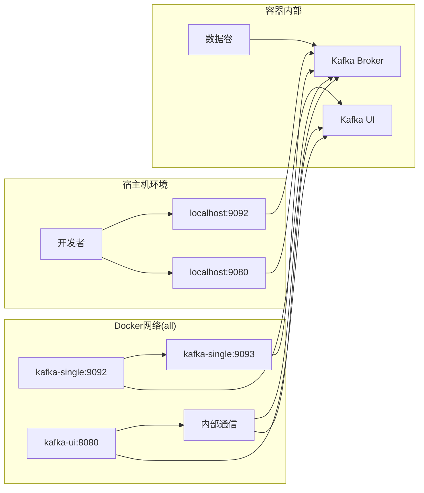
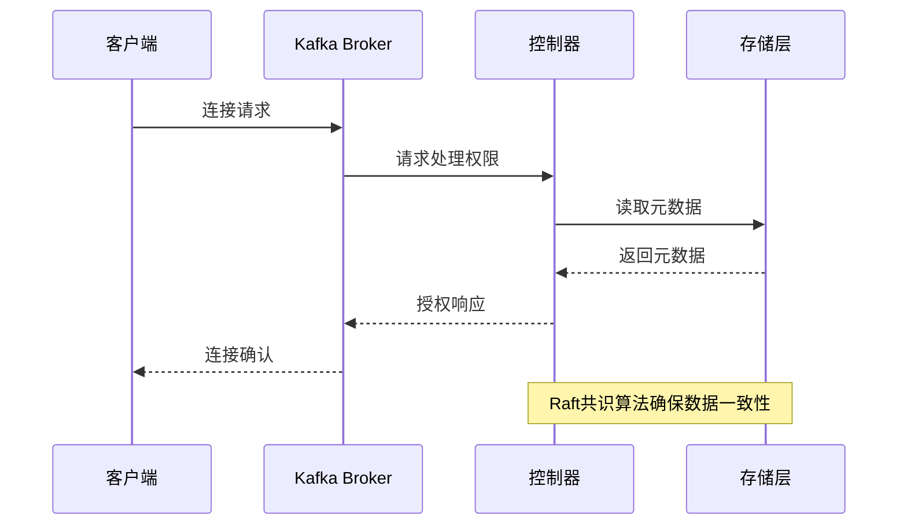
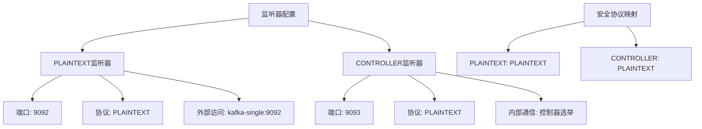
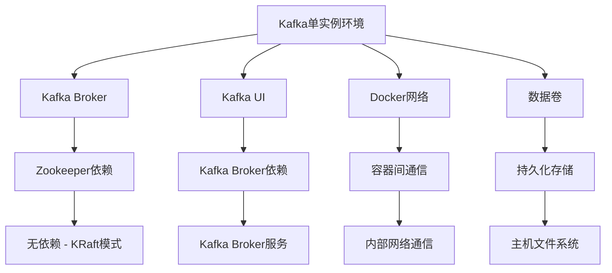

# Kafka单实例环境

<cite>
**本文档引用的文件**
- [docker-compose.yml](file://docker-compose/kafka-single/compose/docker-compose.yml)
- [README.md](file://docker-compose/kafka-single/README.md)
- [up.sh](file://docker-compose/kafka-single/bin/up.sh)
- [down.sh](file://docker-compose/kafka-single/bin/down.sh)
- [kafka-cluster README.md](file://docker-compose/kafka-cluster/README.md)
</cite>

## 目录
1. [简介](#简介)
2. [项目结构](#项目结构)
3. [核心组件](#核心组件)
4. [架构概览](#架构概览)
5. [详细组件分析](#详细组件分析)
6. [依赖关系分析](#依赖关系分析)
7. [性能考虑](#性能考虑)
8. [故障排除指南](#故障排除指南)
9. [结论](#结论)
10. [附录](#附录)

## 简介

本项目提供了一个基于KRaft模式的Kafka单实例容器化部署解决方案。该环境无需ZooKeeper即可运行，提供了现代化的Kafka管理界面，适合开发测试、学习研究和轻量级部署场景。

KRaft（Kafka Raft Metadata）是Apache Kafka 2.8.0引入的新模式，它使用Raft共识算法替代传统的ZooKeeper，简化了部署架构并提高了启动速度。本单实例环境采用KRaft模式，通过单一容器提供完整的Kafka服务和Web管理界面。

## 项目结构

该项目采用模块化的Docker Compose组织方式，每个服务都有独立的目录结构：

```mermaid
graph TB
subgraph "Kafka单实例项目结构"
A[docker-compose/kafka-single/] --> B[compose/]
A --> C[bin/]
A --> D[README.md]
B --> E[docker-compose.yml]
C --> F[up.sh]
C --> G[down.sh]
subgraph "网络配置"
H[all网络] --> I[kafka-single容器]
H --> J[kafka-ui容器]
end
subgraph "存储卷"
K[data卷] --> L[/opt/kafka/data]
M[logs卷] --> N[/opt/kafka/logs]
end
end
```

**图表来源**
- [docker-compose.yml:1-54](file://docker-compose/kafka-single/compose/docker-compose.yml#L1-L54)

**章节来源**
- [docker-compose.yml:1-54](file://docker-compose/kafka-single/compose/docker-compose.yml#L1-L54)
- [README.md:1-155](file://docker-compose/kafka-single/README.md#L1-L155)

## 核心组件

### Kafka Broker服务

Kafka Broker是消息中间件的核心组件，负责处理生产者和消费者的请求。在单实例环境中，Broker同时承担控制器角色，简化了部署架构。

**关键配置参数：**

| 配置项 | 值 | 说明 |
|--------|-----|------|
| KAFKA_NODE_ID | 1 | 节点唯一标识符 |
| KAFKA_PROCESS_ROLES | broker,controller | 同时作为Broker和Controller |
| KAFKA_CONTROLLER_QUORUM_VOTERS | 1@kafka-single:9093 | 控制器投票配置 |
| KAFKA_LISTENERS | PLAINTEXT://0.0.0.0:9092,CONTROLLER://0.0.0.0:9093 | 监听器配置 |
| KAFKA_ADVERTISED_LISTENERS | PLAINTEXT://kafka-single:9092 | 外部访问地址 |

### Kafka UI管理界面

Kafka UI是一个现代化的Web管理界面，提供直观的Kafka集群管理功能，包括主题管理、消费者组监控和消息浏览等特性。

**主要功能特性：**
- 主题创建和管理
- 消费者组状态监控
- 消息内容浏览
- 集群状态可视化
- 实时指标展示

**章节来源**
- [docker-compose.yml:14-30](file://docker-compose/kafka-single/compose/docker-compose.yml#L14-L30)
- [docker-compose.yml:35-49](file://docker-compose/kafka-single/compose/docker-compose.yml#L35-L49)

## 架构概览

本项目的整体架构采用单容器部署模式，通过Docker网络实现服务间的通信：



**图表来源**
- [docker-compose.yml:1-54](file://docker-compose/kafka-single/compose/docker-compose.yml#L1-L54)

### 端口映射说明

| 端口 | 映射到宿主机 | 用途 | 安全协议 |
|------|-------------|------|----------|
| 9092 | 9092 | Kafka客户端连接 | PLAINTEXT |
| 9093 | 9093 | 控制器通信 | PLAINTEXT |
| 9080 | 8080 | Kafka UI管理界面 | HTTP |

**章节来源**
- [docker-compose.yml:31-33](file://docker-compose/kafka-single/compose/docker-compose.yml#L31-L33)
- [README.md:14-28](file://docker-compose/kafka-single/README.md#L14-L28)

## 详细组件分析

### KRaft模式配置原理

KRaft模式通过Raft共识算法实现元数据管理，消除了对ZooKeeper的依赖：



**图表来源**
- [docker-compose.yml:15-21](file://docker-compose/kafka-single/compose/docker-compose.yml#L15-L21)

#### 节点ID设置机制

节点ID是KRaft模式中唯一的标识符，用于区分不同的Kafka实例：

**配置要点：**
- 单实例环境中设置为1
- 在多实例集群中需要唯一性
- 影响控制器选举和分区分配

#### 控制器角色分配

在单实例环境中，Broker同时承担控制器职责：

**角色特点：**
- 同时处理客户端请求和元数据管理
- 简化了部署架构
- 适用于开发和测试场景

#### 监听器配置详解

监听器配置定义了Kafka服务对外暴露的接口：



**图表来源**
- [docker-compose.yml:18-21](file://docker-compose/kafka-single/compose/docker-compose.yml#L18-L21)

**章节来源**
- [docker-compose.yml:14-21](file://docker-compose/kafka-single/compose/docker-compose.yml#L14-L21)

### Kafka UI管理界面使用指南

Kafka UI提供了直观的Web管理界面，支持多种管理操作：

#### 主题管理操作

**创建主题流程：**
1. 访问Web界面：http://localhost:9080
2. 导航到"Topics"页面
3. 点击"Create Topic"按钮
4. 填写主题名称和配置参数
5. 点击"Create"完成创建

#### 消息生产和消费

**生产者操作：**
1. 选择目标主题
2. 点击"Produce Message"按钮
3. 输入消息内容
4. 点击"Produce"发送

**消费者操作：**
1. 选择目标主题
2. 点击"Consume Messages"按钮
3. 查看实时消息流

**章节来源**
- [README.md:108-116](file://docker-compose/kafka-single/README.md#L108-L116)
- [README.md:119-144](file://docker-compose/kafka-single/README.md#L119-L144)

### 环境变量配置详解

Kafka单实例环境的关键配置参数如下：

#### 基础配置

| 环境变量 | 默认值 | 说明 |
|----------|--------|------|
| KAFKA_NODE_ID | 1 | 节点唯一标识符 |
| KAFKA_PROCESS_ROLES | broker,controller | 角色分配 |
| KAFKA_CONTROLLER_QUORUM_VOTERS | 1@kafka-single:9093 | 控制器投票配置 |

#### 监听器配置

| 环境变量 | 值 | 说明 |
|----------|----|------|
| KAFKA_LISTENERS | PLAINTEXT://0.0.0.0:9092,CONTROLLER://0.0.0.0:9093 | 监听器定义 |
| KAFKA_ADVERTISED_LISTENERS | PLAINTEXT://kafka-single:9092 | 外部访问地址 |
| KAFKA_CONTROLLER_LISTENER_NAMES | CONTROLLER | 控制器监听器名称 |
| KAFKA_LISTENER_SECURITY_PROTOCOL_MAP | PLAINTEXT:PLAINTEXT,CONTROLLER:PLAINTEXT | 协议映射 |

#### 集群配置

| 环境变量 | 值 | 说明 |
|----------|----|------|
| KAFKA_OFFSETS_TOPIC_REPLICATION_FACTOR | 1 | 偏移量主题复制因子 |
| KAFKA_TRANSACTION_STATE_LOG_REPLICATION_FACTOR | 1 | 事务状态日志复制因子 |
| KAFKA_TRANSACTION_STATE_LOG_MIN_ISR | 1 | 事务日志最小内ISR |

#### 性能优化

| 环境变量 | 值 | 说明 |
|----------|----|------|
| KAFKA_NUM_PARTITIONS | 3 | 默认分区数 |
| KAFKA_DEFAULT_REPLICATION_FACTOR | 1 | 默认复制因子 |
| KAFKA_AUTO_CREATE_TOPICS_ENABLE | true | 自动创建主题 |

**章节来源**
- [docker-compose.yml:14-30](file://docker-compose/kafka-single/compose/docker-compose.yml#L14-L30)

### 数据卷挂载策略

数据持久化是Kafka部署的重要考虑因素：

```mermaid
graph TB
subgraph "宿主机存储"
A[temp/kafka/] --> B[data/]
A --> C[logs/]
end
subgraph "容器内部"
D[/opt/kafka/data] --> E[Kafka数据文件]
F[/opt/kafka/logs] --> G[Kafka日志文件]
end
B --> D
C --> F
subgraph "数据类型"
H[消息数据]
I[索引文件]
J[日志文件]
K[配置文件]
end
E --> H
E --> I
G --> J
G --> K
```

**图表来源**
- [docker-compose.yml:10-12](file://docker-compose/kafka-single/compose/docker-compose.yml#L10-L12)

**数据卷配置说明：**
- **数据卷1**: `../temp/kafka/data:/opt/kafka/data` - 存储Kafka消息数据
- **数据卷2**: `../temp/kafka/logs:/opt/kafka/logs` - 存储Kafka日志文件

**章节来源**
- [docker-compose.yml:10-12](file://docker-compose/kafka-single/compose/docker-compose.yml#L10-L12)
- [README.md:67-76](file://docker-compose/kafka-single/README.md#L67-L76)

## 依赖关系分析

### 组件耦合度分析



**图表来源**
- [docker-compose.yml:1-54](file://docker-compose/kafka-single/compose/docker-compose.yml#L1-L54)

### 外部依赖关系

**直接依赖：**
- Apache Kafka 3.9.1 (KRaft模式)
- Provectus Labs Kafka UI (最新版本)
- Docker Compose (容器编排)

**间接依赖：**
- Docker Engine (容器运行时)
- Linux内核 (网络和存储功能)
- 主机文件系统 (数据持久化)

**章节来源**
- [docker-compose.yml:3,36](file://docker-compose/kafka-single/compose/docker-compose.yml#L3,L36)
- [README.md:82-83](file://docker-compose/kafka-single/README.md#L82-L83)

## 性能考虑

### 资源配置建议

**内存配置：**
- 建议至少2GB可用内存
- 生产环境推荐4GB以上
- JVM堆大小建议设置为总内存的50%

**存储配置：**
- SSD存储优先，提高I/O性能
- 留存空间至少为数据容量的20%
- 定期清理过期消息

**网络配置：**
- 使用千兆网络适配器
- 关闭不必要的防火墙规则
- 优化TCP缓冲区大小

### 性能调优参数

| 参数类别 | 建议值 | 说明 |
|----------|--------|------|
| 分区数量 | 3-10 | 并发处理能力 |
| 复制因子 | 1 | 单实例环境 |
| 缓冲区大小 | 32KB-64KB | 生产者性能 |
| 批处理大小 | 1000-5000条 | 提高吞吐量 |

## 故障排除指南

### 常见问题及解决方案

**端口冲突问题：**
- **症状**: 容器启动失败，显示端口占用
- **解决**: 修改docker-compose.yml中的端口映射或停止占用进程
- **检查命令**: `netstat -tulpn | grep 9092`

**数据卷权限问题：**
- **症状**: Kafka无法写入数据文件
- **解决**: 设置正确的目录权限和所有者
- **修复命令**: `sudo chown -R 185:0 /path/to/temp/kafka`

**网络连接问题：**
- **症状**: 客户端无法连接到Kafka
- **解决**: 检查防火墙设置和网络配置
- **验证命令**: `telnet localhost 9092`

**内存不足问题：**
- **症状**: Kafka频繁重启或性能下降
- **解决**: 增加容器内存限制或优化JVM参数
- **检查命令**: `docker stats kafka-single`

### 日志分析方法

**Kafka日志位置：**
- 容器内路径: `/opt/kafka/logs`
- 宿主机映射: `temp/kafka/logs/`

**常用日志分析命令：**
```bash
# 查看最近的日志
docker exec kafka-single tail -f /opt/kafka/logs/server.log

# 搜索错误信息
docker exec kafka-single grep -i error /opt/kafka/logs/server.log

# 查看启动日志
docker logs kafka-single --tail 100
```

**章节来源**
- [README.md:146-155](file://docker-compose/kafka-single/README.md#L146-L155)
- [down.sh:18-22](file://docker-compose/kafka-single/bin/down.sh#L18-L22)

## 结论

Kafka单实例环境提供了一个简洁高效的Kafka部署方案，特别适合以下场景：

**适用场景：**
- 开发环境和本地测试
- 学习和实验目的
- 原型开发和快速验证
- 资源受限的环境

**优势特点：**
- 无需ZooKeeper，简化部署
- 快速启动和配置
- 低资源消耗
- 现代化架构设计

**局限性：**
- 不提供高可用性
- 仅适用于单节点部署
- 生产环境不推荐使用

对于生产环境，建议使用KRaft模式的多节点集群部署，以获得更好的高可用性和扩展性。

## 附录

### 快速开始指南

**启动服务：**
```bash
# 方法1: 使用启动脚本
./bin/up.sh

# 方法2: 直接使用Docker Compose
docker compose -p kafka-single -f compose/docker-compose.yml up -d
```

**停止服务：**
```bash
# 方法1: 使用停止脚本
./bin/down.sh

# 方法2: 直接使用Docker Compose
docker compose -p kafka-single -f compose/docker-compose.yml down
```

**状态检查：**
```bash
docker compose -p kafka-single -f compose/docker-compose.yml ps
```

### 相关参考

**与集群模式的对比：**
- 参考Kafka集群部署配置
- 对比单实例与集群的差异
- 了解迁移方案

**章节来源**
- [up.sh:14-17](file://docker-compose/kafka-single/bin/up.sh#L14-L17)
- [down.sh:13-14](file://docker-compose/kafka-single/bin/down.sh#L13-L14)
- [kafka-cluster README.md:84-91](file://docker-compose/kafka-cluster/README.md#L84-L91)