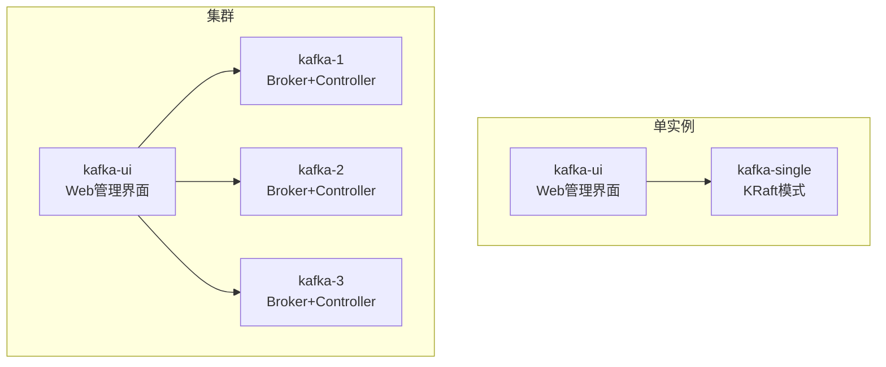
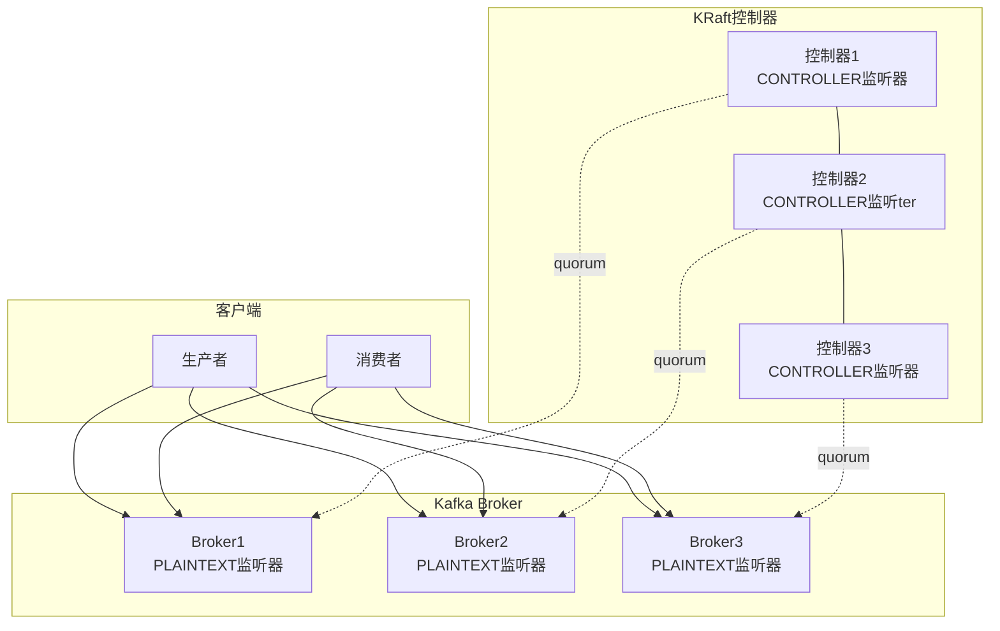
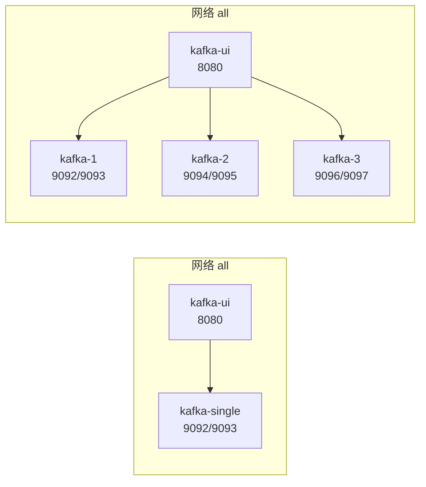

# Kafka环境

<cite>
**本文引用的文件**
- [docker-compose.yml（单实例）](file://docker-compose/kafka-single/compose/docker-compose.yml)
- [README（单实例）](file://docker-compose/kafka-single/README.md)
- [up.sh（单实例）](file://docker-compose/kafka-single/bin/up.sh)
- [down.sh（单实例）](file://docker-compose/kafka-single/bin/down.sh)
- [docker-compose.yml（集群）](file://docker-compose/kafka-cluster/compose/docker-compose.yml)
- [README（集群）](file://docker-compose/kafka-cluster/README.md)
- [up.sh（集群）](file://docker-compose/kafka-cluster/bin/up.sh)
- [down.sh（集群）](file://docker-compose/kafka-cluster/bin/down.sh)
</cite>

## 目录
1. [简介](#简介)
2. [项目结构](#项目结构)
3. [核心组件](#核心组件)
4. [架构总览](#架构总览)
5. [组件详解](#组件详解)
6. [依赖关系分析](#依赖关系分析)
7. [性能与优化](#性能与优化)
8. [故障排查指南](#故障排查指南)
9. [结论](#结论)
10. [附录](#附录)

## 简介
本文件面向希望在本地或开发环境中快速搭建并使用Kafka消息队列的用户，覆盖以下内容：
- 单实例与集群两种部署形态的实现细节
- 基于KRaft模式的无ZooKeeper配置、监听器与控制器配置要点
- Kafka UI管理界面的使用方法
- 生产者与消费者的常用操作路径
- 环境变量配置、数据持久化策略与性能优化参数
- 集群部署的高可用性设计与故障恢复机制

## 项目结构
该仓库通过Docker Compose提供两套Kafka环境：
- 单实例：基于KRaft模式，不依赖ZooKeeper，包含Kafka Broker与Kafka UI
- 集群：三节点KRaft集群，每个节点同时承担Broker与Controller角色，包含Kafka UI

图表来源
- [docker-compose.yml（单实例）:1-54](file://docker-compose/kafka-single/compose/docker-compose.yml#L1-L54)
- [docker-compose.yml（集群）:1-119](file://docker-compose/kafka-cluster/compose/docker-compose.yml#L1-L119)

章节来源
- [docker-compose.yml（单实例）:1-54](file://docker-compose/kafka-single/compose/docker-compose.yml#L1-L54)
- [docker-compose.yml（集群）:1-119](file://docker-compose/kafka-cluster/compose/docker-compose.yml#L1-L119)
- [README（单实例）:1-155](file://docker-compose/kafka-single/README.md#L1-L155)
- [README（集群）:1-169](file://docker-compose/kafka-cluster/README.md#L1-L169)

## 核心组件
- Kafka Broker（单实例/集群）
  - 使用KRaft模式，无需ZooKeeper
  - 监听器配置包含业务端口与控制器端口
  - 控制器选举与投票由KRaft quorum维护
- Kafka UI
  - 提供Web界面用于主题管理、消费者组监控与消息浏览
  - 单实例与集群分别配置不同的Bootstrap Servers
- 数据持久化
  - 挂载主机目录到容器内Kafka数据与日志目录，确保重启后数据不丢失
- 启停脚本
  - 统一通过Docker Compose进行服务编排，支持一键启动与停止

章节来源
- [docker-compose.yml（单实例）:13-33](file://docker-compose/kafka-single/compose/docker-compose.yml#L13-L33)
- [docker-compose.yml（集群）:13-96](file://docker-compose/kafka-cluster/compose/docker-compose.yml#L13-L96)
- [README（单实例）:67-76](file://docker-compose/kafka-single/README.md#L67-L76)
- [README（集群）:67-82](file://docker-compose/kafka-cluster/README.md#L67-L82)
- [up.sh（单实例）:14-17](file://docker-compose/kafka-single/bin/up.sh#L14-L17)
- [up.sh（集群）:14-17](file://docker-compose/kafka-cluster/bin/up.sh#L14-L17)

## 架构总览
KRaft模式下，Kafka不再依赖ZooKeeper，控制器与Broker可运行在同一进程或不同进程，通过监听器区分业务流量与控制器流量。

图表来源
- [docker-compose.yml（集群）:17-17](file://docker-compose/kafka-cluster/compose/docker-compose.yml#L17-L17)
- [docker-compose.yml（集群）:49-49](file://docker-compose/kafka-cluster/compose/docker-compose.yml#L49-L49)
- [docker-compose.yml（集群）:81-81](file://docker-compose/kafka-cluster/compose/docker-compose.yml#L81-L81)

## 组件详解

### 单实例KRaft配置
- 节点角色与ID
  - 角色：broker,controller
  - 节点ID：1
- 监听器与安全协议映射
  - 监听器：PLAINTEXT://0.0.0.0:9092, CONTROLLER://0.0.0.0:9093
  - 安全协议映射：PLAINTEXT:PLAINTEXT, CONTROLLER:PLAINTEXT
  - 广告地址：PLAINTEXT://kafka-single:9092
  - 控制器监听名称：CONTROLLER
- 控制器投票
  - 投票人集合：1@kafka-single:9093
- 日志与分区
  - 日志目录：/opt/kafka/data
  - 分区数：3
  - 默认副本因子：1
  - 偏移量主题副本因子：1
  - 事务状态日志副本因子：1
  - 事务状态日志最小ISR：1
  - 自动创建主题：启用
- 数据持久化
  - 挂载目录：data与logs至宿主机temp/kafka/

章节来源
- [docker-compose.yml（单实例）:14-30](file://docker-compose/kafka-single/compose/docker-compose.yml#L14-L30)
- [README（单实例）:67-85](file://docker-compose/kafka-single/README.md#L67-L85)

### 集群KRaft配置
- 节点角色与ID
  - 三个节点均配置为broker,controller
  - 节点ID分别为1、2、3
- 监听器与安全协议映射
  - 监听器：PLAINTEXT://0.0.0.0:9092, CONTROLLER://0.0.0.0:9093
  - 安全协议映射：PLAINTEXT:PLAINTEXT, CONTROLLER:PLAINTEXT
  - 广告地址：kafka-1:9092、kafka-2:9092、kafka-3:9092
  - 控制器监听名称：CONTROLLER
- 控制器投票
  - 投票人集合：1@kafka-1:9093, 2@kafka-2:9093, 3@kafka-3:9093
- 日志与分区
  - 日志目录：/opt/kafka/data
  - 分区数：3
  - 默认副本因子：3
  - 偏移量主题副本因子：3
  - 事务状态日志副本因子：3
  - 事务状态日志最小ISR：2
  - 自动创建主题：启用
- 端口映射
  - kafka-1: 9092:9092, 9093:9093
  - kafka-2: 9094:9092, 9095:9093
  - kafka-3: 9096:9092, 9097:9093
- 数据持久化
  - 挂载目录：每个节点独立的data与logs至宿主机temp/kafka-{n}/

章节来源
- [docker-compose.yml（集群）:14-29](file://docker-compose/kafka-cluster/compose/docker-compose.yml#L14-L29)
- [docker-compose.yml（集群）:46-61](file://docker-compose/kafka-cluster/compose/docker-compose.yml#L46-L61)
- [docker-compose.yml（集群）:77-93](file://docker-compose/kafka-cluster/compose/docker-compose.yml#L77-L93)
- [README（集群）:67-91](file://docker-compose/kafka-cluster/README.md#L67-L91)

### Kafka UI使用
- 单实例
  - 访问地址：http://localhost:9080
  - 集群名：kafka-single
  - Bootstrap Servers：kafka-single:9092
- 集群
  - 访问地址：http://localhost:9080
  - 集群名：kafka-cluster
  - Bootstrap Servers：kafka-1:9092,kafka-2:9092,kafka-3:9092

章节来源
- [docker-compose.yml（单实例）:35-49](file://docker-compose/kafka-single/compose/docker-compose.yml#L35-L49)
- [docker-compose.yml（集群）:98-114](file://docker-compose/kafka-cluster/compose/docker-compose.yml#L98-L114)
- [README（单实例）:108-115](file://docker-compose/kafka-single/README.md#L108-L115)
- [README（集群）:122-129](file://docker-compose/kafka-cluster/README.md#L122-L129)

### 生产者与消费者操作路径
- 单实例
  - 创建主题：通过exec进入容器执行kafka-topics.sh命令
  - 列出主题：同上
  - 描述主题：同上
  - 生产消息：通过kafka-console-producer.sh连接localhost:9092
  - 消费消息：通过kafka-console-consumer.sh连接localhost:9092
- 集群
  - 创建主题：推荐指定分区与副本数
  - 列出/描述主题：同单实例
  - 生产/消费消息：任选任一节点的9092端口

章节来源
- [README（单实例）:119-144](file://docker-compose/kafka-single/README.md#L119-L144)
- [README（集群）:131-158](file://docker-compose/kafka-cluster/README.md#L131-L158)

### 启停流程与数据保留
- 单实例
  - 启动：执行up.sh，使用docker compose启动
  - 停止：执行down.sh，服务停止但数据卷保留
- 集群
  - 启动：执行up.sh，使用docker compose启动
  - 停止：执行down.sh，服务停止但数据卷保留

章节来源
- [up.sh（单实例）:14-17](file://docker-compose/kafka-single/bin/up.sh#L14-L17)
- [down.sh（单实例）:14-16](file://docker-compose/kafka-single/bin/down.sh#L14-L16)
- [up.sh（集群）:14-17](file://docker-compose/kafka-cluster/bin/up.sh#L14-L17)
- [down.sh（集群）:14-16](file://docker-compose/kafka-cluster/bin/down.sh#L14-L16)

## 依赖关系分析
- 单实例
  - kafka-single依赖bridge网络“all”，并暴露9092与9093端口
  - kafka-ui依赖kafka-single，并通过环境变量配置Bootstrap Servers
- 集群
  - 三个kafka节点共享同一bridge网络“all”，彼此通过网络别名通信
  - kafka-ui依赖所有三个kafka节点作为Bootstrap Servers

图表来源
- [docker-compose.yml（单实例）:6-33](file://docker-compose/kafka-single/compose/docker-compose.yml#L6-L33)
- [docker-compose.yml（集群）:6-96](file://docker-compose/kafka-cluster/compose/docker-compose.yml#L6-L96)

章节来源
- [docker-compose.yml（单实例）:6-33](file://docker-compose/kafka-single/compose/docker-compose.yml#L6-L33)
- [docker-compose.yml（集群）:6-96](file://docker-compose/kafka-cluster/compose/docker-compose.yml#L6-L96)

## 性能与优化
- 监听器与端口
  - 业务端口：9092
  - 控制器端口：9093
- 副本与分区
  - 单实例：副本因子1，适合开发测试
  - 集群：副本因子3，提升可靠性；事务状态日志最小ISR设为2以平衡一致性与可用性
- 自动化
  - 自动创建主题已启用，便于快速验证
- JVM与资源
  - 生产建议调整JVM参数与资源限制，以获得更稳定性能

章节来源
- [docker-compose.yml（单实例）:24-30](file://docker-compose/kafka-single/compose/docker-compose.yml#L24-L30)
- [docker-compose.yml（集群）:23-29](file://docker-compose/kafka-cluster/compose/docker-compose.yml#L23-L29)
- [docker-compose.yml（集群）:55-61](file://docker-compose/kafka-cluster/compose/docker-compose.yml#L55-L61)
- [docker-compose.yml（集群）:87-93](file://docker-compose/kafka-cluster/compose/docker-compose.yml#L87-L93)
- [README（集群）:165-167](file://docker-compose/kafka-cluster/README.md#L165-L167)

## 故障排查指南
- 端口占用
  - 单实例：确认9092、9093、9080未被占用
  - 集群：确认9092、9094、9096、9080未被占用
- 高可用与故障恢复
  - 单实例：不具备高可用能力
  - 集群：具备高可用能力，单点故障不影响整体服务
- 数据清理
  - 建议定期清理过期消息，释放磁盘空间
- 启停与状态
  - 使用提供的up.sh与down.sh脚本进行启停
  - 使用docker compose ps检查各服务状态

章节来源
- [README（单实例）:148-154](file://docker-compose/kafka-single/README.md#L148-L154)
- [README（集群）:162-168](file://docker-compose/kafka-cluster/README.md#L162-L168)
- [up.sh（单实例）:14-17](file://docker-compose/kafka-single/bin/up.sh#L14-L17)
- [down.sh（单实例）:14-16](file://docker-compose/kafka-single/bin/down.sh#L14-L16)
- [up.sh（集群）:14-17](file://docker-compose/kafka-cluster/bin/up.sh#L14-L17)
- [down.sh（集群）:14-16](file://docker-compose/kafka-cluster/bin/down.sh#L14-L16)

## 结论
- 本仓库提供了开箱即用的Kafka KRaft环境，单实例适合学习与开发，集群适合需要高可用与扩展性的场景
- 通过统一的Docker Compose编排与脚本，可快速完成部署、启停与日常运维
- 建议在生产环境中进一步调优JVM与资源限制，并结合监控与备份策略完善整体可靠性

## 附录

### 环境变量与配置清单（节选）
- 单实例关键变量
  - KAFKA_NODE_ID、KAFKA_PROCESS_ROLES、KAFKA_CONTROLLER_QUORUM_VOTERS
  - KAFKA_LISTENERS、KAFKA_ADVERTISED_LISTENERS、KAFKA_CONTROLLER_LISTENER_NAMES
  - KAFKA_LISTENER_SECURITY_PROTOCOL_MAP、KAFKA_LOG_DIRS
  - KAFKA_OFFSETS_TOPIC_REPLICATION_FACTOR、KAFKA_TRANSACTION_STATE_LOG_REPLICATION_FACTOR、KAFKA_TRANSACTION_STATE_LOG_MIN_ISR
  - KAFKA_NUM_PARTITIONS、KAFKA_DEFAULT_REPLICATION_FACTOR、KAFKA_AUTO_CREATE_TOPICS_ENABLE
- 集群关键变量
  - 与单实例类似，但副本因子与控制器投票集不同

章节来源
- [docker-compose.yml（单实例）:14-30](file://docker-compose/kafka-single/compose/docker-compose.yml#L14-L30)
- [docker-compose.yml（集群）:14-29](file://docker-compose/kafka-cluster/compose/docker-compose.yml#L14-L29)
- [docker-compose.yml（集群）:46-61](file://docker-compose/kafka-cluster/compose/docker-compose.yml#L46-L61)
- [docker-compose.yml（集群）:77-93](file://docker-compose/kafka-cluster/compose/docker-compose.yml#L77-L93)