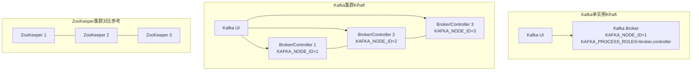
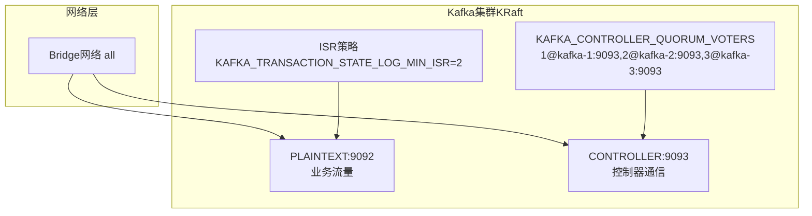
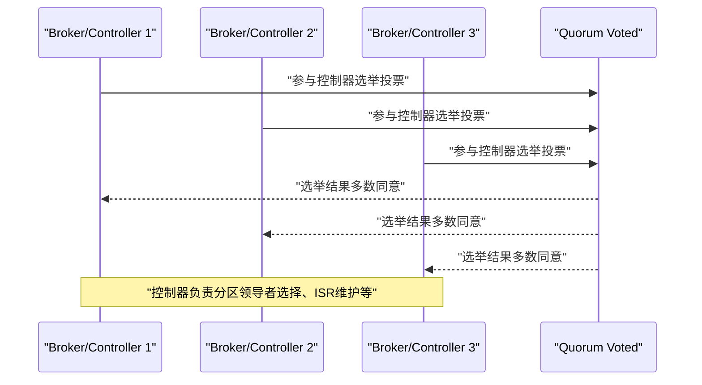
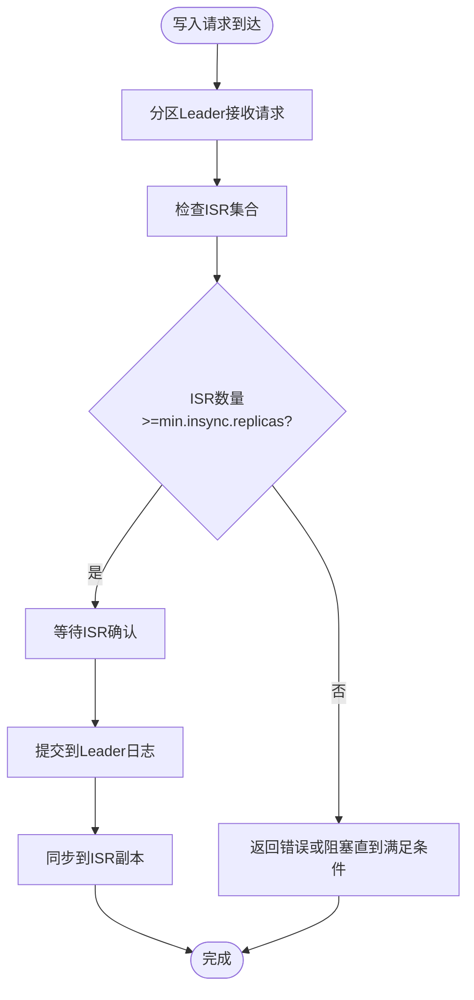
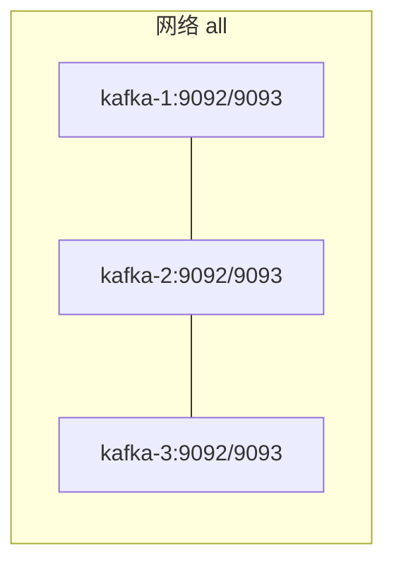
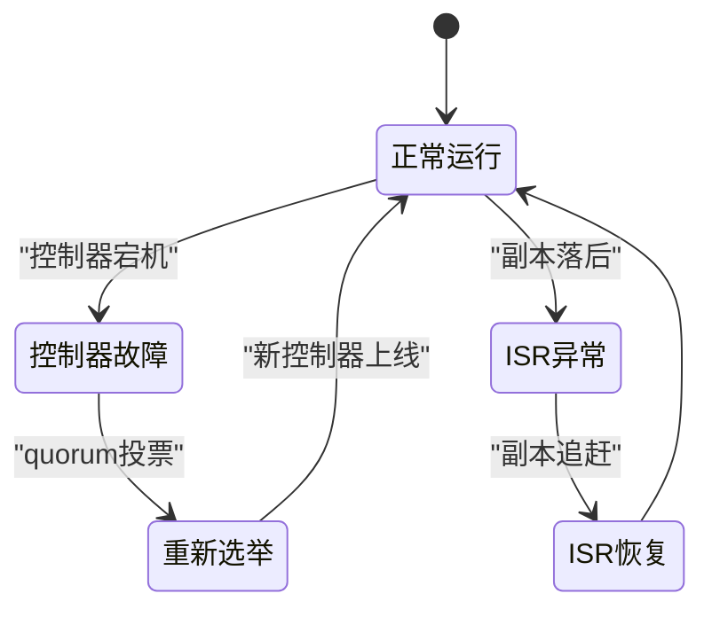
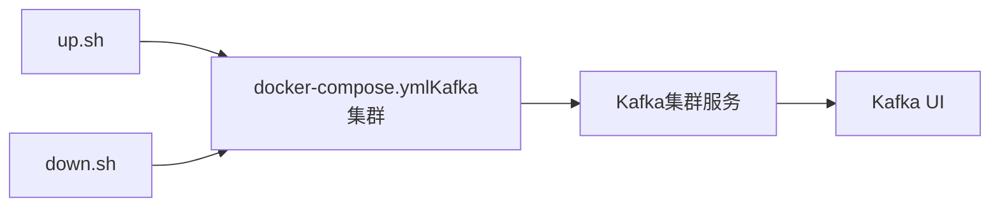

# Kafka集群环境

<cite>
**本文引用的文件**
- [docker-compose.yml（Kafka集群）](file://docker-compose/kafka-cluster/compose/docker-compose.yml)
- [up.sh（Kafka集群启动脚本）](file://docker-compose/kafka-cluster/bin/up.sh)
- [down.sh（Kafka集群停止脚本）](file://docker-compose/kafka-cluster/bin/down.sh)
- [README.md（Kafka集群）](file://docker-compose/kafka-cluster/README.md)
- [docker-compose.yml（Kafka单实例）](file://docker-compose/kafka-single/compose/docker-compose.yml)
- [README.md（Kafka单实例）](file://docker-compose/kafka-single/README.md)
- [docker-compose.yml（ZooKeeper集群）](file://docker-compose/zookeeper-cluster/compose/docker-compose.yml)
- [README.md（容器环境概览）](file://docs/overview/containers.md)
</cite>

## 目录
1. [简介](#简介)
2. [项目结构](#项目结构)
3. [核心组件](#核心组件)
4. [架构总览](#架构总览)
5. [详细组件分析](#详细组件分析)
6. [依赖关系分析](#依赖关系分析)
7. [性能考量](#性能考量)
8. [故障排查指南](#故障排查指南)
9. [结论](#结论)
10. [附录](#附录)

## 简介
本文件面向Kafka集群环境的搭建与运维，基于仓库中的Docker Compose编排方案，重点覆盖：
- 多节点KRaft集群的节点角色分配、控制器选举机制与副本同步策略
- 集群内部通信配置、跨节点数据复制与故障转移机制
- 监控与管理最佳实践（健康检查、性能调优、容量规划）
- 扩容与缩容操作指南
- 常见问题诊断与解决方案
- 生产者与消费者的配置要点与示例路径

## 项目结构
该仓库提供了两种Kafka部署形态：
- 单实例KRaft模式：适合开发与学习
- 三节点KRaft集群：适合演示高可用与生产前验证

此外还包含传统基于ZooKeeper的集群作为对比参考。

图表来源
- [docker-compose.yml（Kafka单实例）:1-34](file://docker-compose/kafka-single/compose/docker-compose.yml#L1-L34)
- [docker-compose.yml（Kafka集群）:1-119](file://docker-compose/kafka-cluster/compose/docker-compose.yml#L1-L119)
- [docker-compose.yml（ZooKeeper集群）:1-68](file://docker-compose/zookeeper-cluster/compose/docker-compose.yml#L1-L68)

章节来源
- [README.md（容器环境概览）:16-23](file://docs/overview/containers.md#L16-L23)
- [README.md（Kafka集群）:1-169](file://docker-compose/kafka-cluster/README.md#L1-L169)
- [README.md（Kafka单实例）:1-155](file://docker-compose/kafka-single/README.md#L1-L155)

## 核心组件
- Kafka集群（KRaft模式）
  - 三个节点均同时承担Broker与Controller角色，通过KRaft无ZooKeeper模式运行
  - 控制器选举由KRaft quorum voters决定，监听端口区分业务与控制器通信
  - 默认副本因子为3，满足高可用需求
- Kafka UI
  - 提供Web界面进行主题管理、消费者组监控、消息浏览与集群监控
- 启停脚本
  - 统一使用docker compose命令启动/停止服务，并保留数据卷

章节来源
- [docker-compose.yml（Kafka集群）:1-119](file://docker-compose/kafka-cluster/compose/docker-compose.yml#L1-L119)
- [README.md（Kafka集群）:1-169](file://docker-compose/kafka-cluster/README.md#L1-L169)
- [docker-compose.yml（Kafka单实例）:1-34](file://docker-compose/kafka-single/compose/docker-compose.yml#L1-L34)
- [README.md（Kafka单实例）:1-155](file://docker-compose/kafka-single/README.md#L1-L155)

## 架构总览
KRaft模式下，Kafka不再依赖ZooKeeper，控制器与Broker角色可由同一节点承担，简化了部署与运维复杂度。集群通过KRaft quorum实现控制器选举与元数据一致性，副本同步遵循ISR（In-Sync Replicas）策略保障数据可靠性。

图表来源
- [docker-compose.yml（Kafka集群）:14-32](file://docker-compose/kafka-cluster/compose/docker-compose.yml#L14-L32)
- [docker-compose.yml（Kafka集群）:46-64](file://docker-compose/kafka-cluster/compose/docker-compose.yml#L46-L64)
- [docker-compose.yml（Kafka集群）:78-96](file://docker-compose/kafka-cluster/compose/docker-compose.yml#L78-L96)

## 详细组件分析

### 节点角色与控制器选举
- 每个节点同时具备Broker与Controller角色，提升资源利用率与部署灵活性
- 控制器选举通过quorum voters配置，确保在多数节点存活时维持控制权
- 监听器分离：业务流量与控制器通信分别使用不同端口，便于网络隔离与安全策略配置

图表来源
- [docker-compose.yml（Kafka集群）:14-32](file://docker-compose/kafka-cluster/compose/docker-compose.yml#L14-L32)
- [docker-compose.yml（Kafka集群）:46-64](file://docker-compose/kafka-cluster/compose/docker-compose.yml#L46-L64)
- [docker-compose.yml（Kafka集群）:78-96](file://docker-compose/kafka-cluster/compose/docker-compose.yml#L78-L96)

章节来源
- [docker-compose.yml（Kafka集群）:14-32](file://docker-compose/kafka-cluster/compose/docker-compose.yml#L14-L32)
- [docker-compose.yml（Kafka集群）:46-64](file://docker-compose/kafka-cluster/compose/docker-compose.yml#L46-L64)
- [docker-compose.yml（Kafka集群）:78-96](file://docker-compose/kafka-cluster/compose/docker-compose.yml#L78-L96)

### 副本同步与ISR策略
- 副本同步遵循ISR（In-Sync Replicas）策略，保证只有与Leader保持同步的副本参与写入确认
- 事务状态日志最小ISR设置为2，提高事务提交的可用性与一致性平衡
- 默认副本因子为3，结合ISR策略实现高可用与数据安全

图表来源
- [docker-compose.yml（Kafka集群）:24-29](file://docker-compose/kafka-cluster/compose/docker-compose.yml#L24-L29)
- [docker-compose.yml（Kafka集群）:56-61](file://docker-compose/kafka-cluster/compose/docker-compose.yml#L56-L61)
- [docker-compose.yml（Kafka集群）:88-93](file://docker-compose/kafka-cluster/compose/docker-compose.yml#L88-L93)

章节来源
- [docker-compose.yml（Kafka集群）:24-29](file://docker-compose/kafka-cluster/compose/docker-compose.yml#L24-L29)
- [docker-compose.yml（Kafka集群）:56-61](file://docker-compose/kafka-cluster/compose/docker-compose.yml#L56-L61)
- [docker-compose.yml（Kafka集群）:88-93](file://docker-compose/kafka-cluster/compose/docker-compose.yml#L88-L93)

### 集群内部通信与跨节点复制
- 使用统一bridge网络，节点间可通过容器别名进行内部通信
- 业务监听器与控制器监听器分离，避免冲突并提升安全性
- 数据目录与日志目录挂载至宿主机，便于持久化与运维

图表来源
- [docker-compose.yml（Kafka集群）:6-32](file://docker-compose/kafka-cluster/compose/docker-compose.yml#L6-L32)
- [docker-compose.yml（Kafka集群）:38-64](file://docker-compose/kafka-cluster/compose/docker-compose.yml#L38-L64)
- [docker-compose.yml（Kafka集群）:70-96](file://docker-compose/kafka-cluster/compose/docker-compose.yml#L70-L96)

章节来源
- [docker-compose.yml（Kafka集群）:6-32](file://docker-compose/kafka-cluster/compose/docker-compose.yml#L6-L32)
- [docker-compose.yml（Kafka集群）:38-64](file://docker-compose/kafka-cluster/compose/docker-compose.yml#L38-L64)
- [docker-compose.yml（Kafka集群）:70-96](file://docker-compose/kafka-cluster/compose/docker-compose.yml#L70-L96)

### 故障转移机制
- 当当前控制器不可用时，其余节点根据quorum投票选出新的控制器
- ISR集合动态调整，落后副本被移出ISR，确保写入确认只依赖可靠副本
- 副本因子为3，允许最多一个节点故障而不影响写入与读取

图表来源
- [docker-compose.yml（Kafka集群）:17-18](file://docker-compose/kafka-cluster/compose/docker-compose.yml#L17-L18)
- [docker-compose.yml（Kafka集群）:49-50](file://docker-compose/kafka-cluster/compose/docker-compose.yml#L49-L50)
- [docker-compose.yml（Kafka集群）:81-82](file://docker-compose/kafka-cluster/compose/docker-compose.yml#L81-L82)

章节来源
- [docker-compose.yml（Kafka集群）:17-18](file://docker-compose/kafka-cluster/compose/docker-compose.yml#L17-L18)
- [docker-compose.yml（Kafka集群）:49-50](file://docker-compose/kafka-cluster/compose/docker-compose.yml#L49-L50)
- [docker-compose.yml（Kafka集群）:81-82](file://docker-compose/kafka-cluster/compose/docker-compose.yml#L81-L82)

### 监控与管理最佳实践
- 使用Kafka UI进行可视化监控与运维，支持主题管理、消费者组监控、消息浏览与集群监控
- 健康检查建议：定期检查控制器状态、ISR集合完整性、磁盘空间与网络连通性
- 性能调优建议：合理设置分区数、副本因子与ISR最小值；优化JVM参数与磁盘IO
- 容量规划建议：预留足够的磁盘空间与网络带宽，按峰值吞吐量与保留周期估算存储需求

章节来源
- [README.md（Kafka集群）:122-129](file://docker-compose/kafka-cluster/README.md#L122-L129)
- [README.md（Kafka集群）:160-169](file://docker-compose/kafka-cluster/README.md#L160-L169)
- [README.md（Kafka单实例）:108-116](file://docker-compose/kafka-single/README.md#L108-L116)

### 扩容与缩容操作指南
- 扩容
  - 新增节点：在编排文件中添加新节点，设置唯一node.id与对应的quorum voters条目
  - 更新副本因子与分区分配策略，确保新节点参与数据分片
  - 重启或滚动更新以应用变更
- 缩容
  - 将目标节点上的分区迁移到其他节点后，再停止该节点
  - 更新quorum voters配置，移除已下线节点
  - 降低副本因子或重新分配分区，确保数据仍满足可用性要求

章节来源
- [docker-compose.yml（Kafka集群）:17-18](file://docker-compose/kafka-cluster/compose/docker-compose.yml#L17-L18)
- [docker-compose.yml（Kafka集群）:49-50](file://docker-compose/kafka-cluster/compose/docker-compose.yml#L49-L50)
- [docker-compose.yml（Kafka集群）:81-82](file://docker-compose/kafka-cluster/compose/docker-compose.yml#L81-L82)

### 生产者与消费者配置示例
- 生产者
  - 关键参数：acks、retries、batch.size、linger.ms、compression.type
  - 建议：启用幂等与事务支持，合理设置acks=1或acks=all以平衡性能与可靠性
- 消费者
  - 关键参数：enable.auto.commit、isolation.level、fetch.min.bytes、max.poll.interval.ms
  - 建议：使用自动提交或手动提交，结合消费者组实现水平扩展

章节来源
- [README.md（Kafka集群）:131-158](file://docker-compose/kafka-cluster/README.md#L131-L158)
- [README.md（Kafka单实例）:117-144](file://docker-compose/kafka-single/README.md#L117-L144)

## 依赖关系分析
- Kafka集群依赖于KRaft模式，无需ZooKeeper
- Kafka UI依赖于Kafka集群暴露的Bootstrap Servers
- 启停脚本统一使用docker compose管理服务生命周期

图表来源
- [up.sh（Kafka集群启动脚本）:14-15](file://docker-compose/kafka-cluster/bin/up.sh#L14-L15)
- [down.sh（Kafka集群停止脚本）:14-15](file://docker-compose/kafka-cluster/bin/down.sh#L14-L15)
- [docker-compose.yml（Kafka集群）:1-119](file://docker-compose/kafka-cluster/compose/docker-compose.yml#L1-L119)

章节来源
- [up.sh（Kafka集群启动脚本）:1-35](file://docker-compose/kafka-cluster/bin/up.sh#L1-L35)
- [down.sh（Kafka集群停止脚本）:1-25](file://docker-compose/kafka-cluster/bin/down.sh#L1-L25)
- [docker-compose.yml（Kafka集群）:1-119](file://docker-compose/kafka-cluster/compose/docker-compose.yml#L1-L119)

## 性能考量
- 分区与副本
  - 合理增加分区数以提升并行度，但需考虑ISR维护成本
  - 副本因子与ISR最小值应根据硬件能力与SLA要求设定
- 存储与网络
  - 使用SSD或高性能磁盘，确保刷盘性能
  - 控制器与业务流量分离监听端口，避免相互干扰
- JVM与系统
  - 调整JVM堆大小与GC策略，避免频繁Full GC
  - 优化内核参数（文件句柄、网络缓冲等）

章节来源
- [README.md（Kafka集群）:160-169](file://docker-compose/kafka-cluster/README.md#L160-L169)
- [docker-compose.yml（Kafka集群）:24-29](file://docker-compose/kafka-cluster/compose/docker-compose.yml#L24-L29)
- [docker-compose.yml（Kafka集群）:56-61](file://docker-compose/kafka-cluster/compose/docker-compose.yml#L56-L61)
- [docker-compose.yml（Kafka集群）:88-93](file://docker-compose/kafka-cluster/compose/docker-compose.yml#L88-L93)

## 故障排查指南
- 常见问题
  - 端口占用：确保9092、9094、9096、9080未被占用
  - 数据卷清理：停止服务后数据卷默认保留，如需清理请手动删除temp目录
  - 高可用性：单实例不具备高可用，生产环境建议使用集群
- 排查步骤
  - 使用docker compose ps检查服务状态
  - 通过Kafka UI查看控制器状态与ISR集合
  - 使用kafka-topics.sh列出/描述主题，确认副本与分区状态

章节来源
- [README.md（Kafka集群）:160-169](file://docker-compose/kafka-cluster/README.md#L160-L169)
- [README.md（Kafka单实例）:146-154](file://docker-compose/kafka-single/README.md#L146-L154)
- [down.sh（Kafka集群停止脚本）:19-24](file://docker-compose/kafka-cluster/bin/down.sh#L19-L24)

## 结论
本仓库提供了基于KRaft模式的Kafka集群与单实例部署方案，具备简化的架构与良好的可运维性。通过合理的分区与副本策略、ISR配置与监控手段，可在开发与生产前验证场景中获得稳定表现。建议在生产环境中进一步完善JVM与系统级调优，并结合容量规划与故障演练持续优化。

## 附录
- 快速开始
  - 启动：执行集群启动脚本或直接使用docker compose命令
  - 访问：Kafka UI地址与各Broker访问方式详见各README
- 对比参考
  - 传统ZooKeeper集群：用于理解历史架构与迁移路径

章节来源
- [README.md（Kafka集群）:39-65](file://docker-compose/kafka-cluster/README.md#L39-L65)
- [README.md（Kafka单实例）:39-65](file://docker-compose/kafka-single/README.md#L39-L65)
- [docker-compose.yml（ZooKeeper集群）:1-68](file://docker-compose/zookeeper-cluster/compose/docker-compose.yml#L1-L68)