# RabbitMQ单实例配置

<cite>
**本文档引用的文件**
- [docker-compose.yml](file://docker-compose/rabbitmq-single/compose/docker-compose.yml)
- [up.sh](file://docker-compose/rabbitmq-single/bin/up.sh)
- [down.sh](file://docker-compose/rabbitmq-single/bin/down.sh)
- [README.md](file://docker-compose/rabbitmq-single/README.md)
</cite>

## 目录
1. [简介](#简介)
2. [项目结构](#项目结构)
3. [核心组件](#核心组件)
4. [架构概览](#架构概览)
5. [详细组件分析](#详细组件分析)
6. [依赖关系分析](#依赖关系分析)
7. [性能考虑](#性能考虑)
8. [故障排除指南](#故障排除指南)
9. [结论](#结论)

## 简介

本文件提供了RabbitMQ单实例环境的完整配置文档。该配置实现了基于Docker Compose的单容器RabbitMQ部署，包含完整的消息队列服务、Web管理界面和Prometheus监控功能。文档详细说明了容器镜像选择、端口映射、环境变量配置、数据持久化策略以及健康检查机制，并提供了启动脚本使用方法和停止清理流程。

## 项目结构

RabbitMQ单实例项目的目录结构采用标准的Docker Compose组织方式：

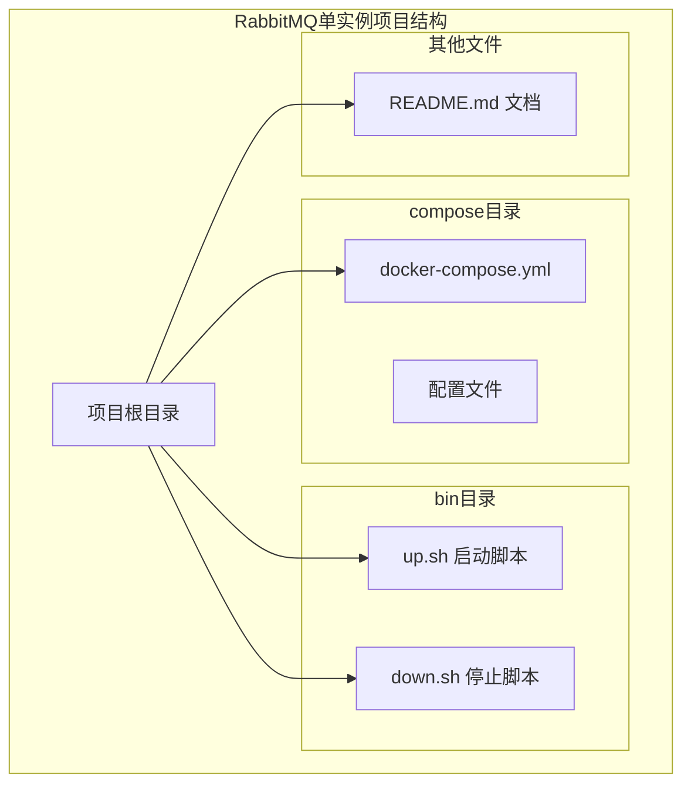

**图表来源**
- [docker-compose.yml:1-38](file://docker-compose/rabbitmq-single/compose/docker-compose.yml#L1-L38)
- [up.sh:1-55](file://docker-compose/rabbitmq-single/bin/up.sh#L1-L55)
- [down.sh:1-23](file://docker-compose/rabbitmq-single/bin/down.sh#L1-L23)

**章节来源**
- [docker-compose.yml:1-38](file://docker-compose/rabbitmq-single/compose/docker-compose.yml#L1-L38)
- [README.md:1-233](file://docker-compose/rabbitmq-single/README.md#L1-L233)

## 核心组件

### 容器配置

RabbitMQ单实例容器配置包含以下关键组件：

#### 镜像选择
- **基础镜像**: `rabbitmq:4.1.2-management`
- **版本特性**: 包含管理界面插件和Prometheus监控支持

#### 网络配置
- **网络名称**: `all`
- **网络类型**: Bridge网络
- **容器别名**: `all.rabbitmq`
- **主机名**: `rabbitmq-single`

#### 存储卷配置
- **数据卷**: `/var/lib/rabbitmq` → `../temp/data`
- **日志卷**: `/var/log/rabbitmq` → `../temp/logs`
- **配置卷**: `/etc/rabbitmq` → `../temp/config`

#### 端口映射
- **AMQP端口**: 5672:5672 (消息传输协议)
- **管理端口**: 15672:15672 (Web管理界面)
- **监控端口**: 15692:15692 (Prometheus指标)

**章节来源**
- [docker-compose.yml:2-38](file://docker-compose/rabbitmq-single/compose/docker-compose.yml#L2-L38)

### 环境变量配置

系统通过环境变量进行配置管理：

#### 用户认证配置
- `RABBITMQ_DEFAULT_USER`: 默认用户名 `hz_9`
- `RABBITMQ_DEFAULT_PASS`: 默认密码 `123456`

#### 节点配置
- `RABBITMQ_NODENAME`: 节点名称 `rabbit@rabbitmq-single`

#### 管理界面配置
- `RABBITMQ_MANAGEMENT_ALLOW_WEB_ACCESS`: 允许Web访问 `true`

#### 虚拟主机配置
- `RABBITMQ_DEFAULT_VHOST`: 默认虚拟主机 `/`

**章节来源**
- [docker-compose.yml:15-25](file://docker-compose/rabbitmq-single/compose/docker-compose.yml#L15-L25)

## 架构概览

RabbitMQ单实例部署采用简洁的一层架构设计：

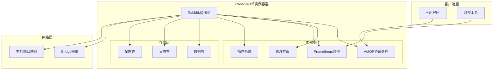

**图表来源**
- [docker-compose.yml:1-38](file://docker-compose/rabbitmq-single/compose/docker-compose.yml#L1-L38)

## 详细组件分析

### Docker Compose配置分析

#### 服务定义详解

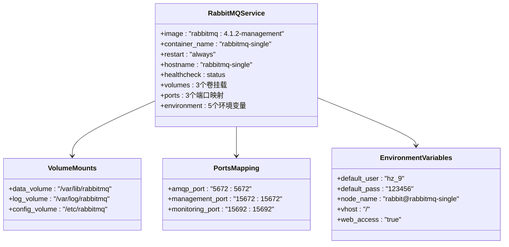

**图表来源**
- [docker-compose.yml:2-38](file://docker-compose/rabbitmq-single/compose/docker-compose.yml#L2-L38)

#### 健康检查机制

健康检查配置确保容器运行状态的可靠性：

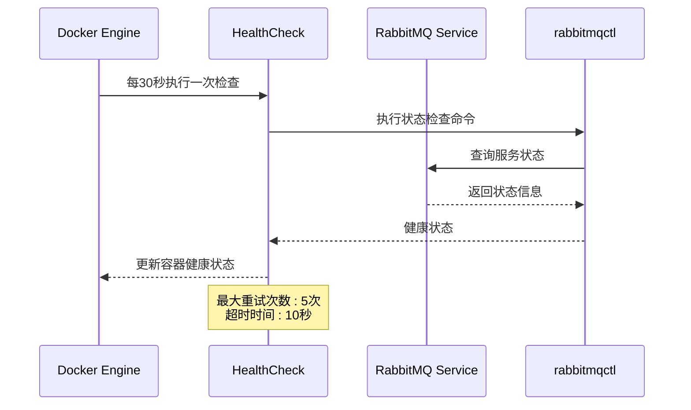

**图表来源**
- [docker-compose.yml:29-33](file://docker-compose/rabbitmq-single/compose/docker-compose.yml#L29-L33)

**章节来源**
- [docker-compose.yml:29-33](file://docker-compose/rabbitmq-single/compose/docker-compose.yml#L29-L33)

### 启动脚本分析

#### up.sh脚本功能

启动脚本提供了自动化的部署流程：

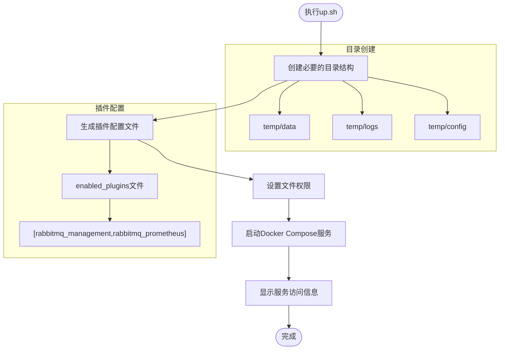

**图表来源**
- [up.sh:14-28](file://docker-compose/rabbitmq-single/bin/up.sh#L14-L28)

#### 下载脚本功能

停止脚本提供了安全的服务终止机制：

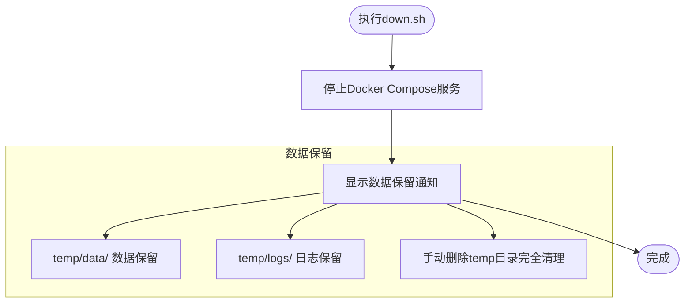

**图表来源**
- [down.sh:13-22](file://docker-compose/rabbitmq-single/bin/down.sh#L13-L22)

**章节来源**
- [up.sh:1-55](file://docker-compose/rabbitmq-single/bin/up.sh#L1-L55)
- [down.sh:1-23](file://docker-compose/rabbitmq-single/bin/down.sh#L1-L23)

### 数据持久化配置

#### 卷挂载策略

数据持久化通过三个独立的卷实现：

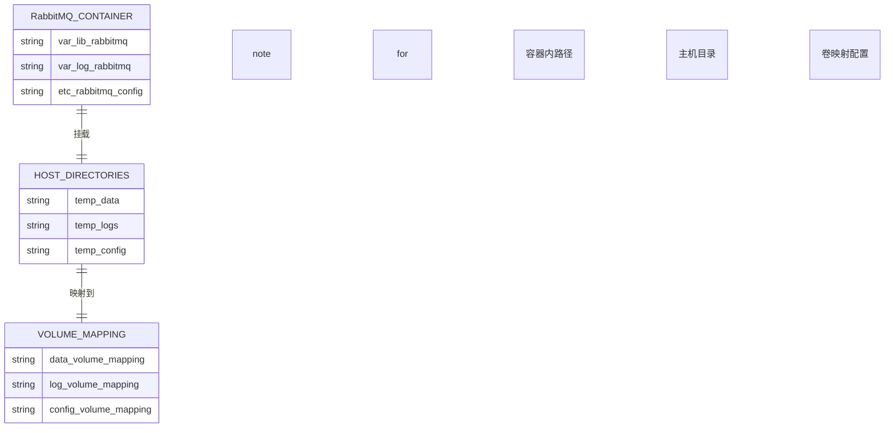

**图表来源**
- [docker-compose.yml:11-14](file://docker-compose/rabbitmq-single/compose/docker-compose.yml#L11-L14)

#### 存储卷用途

| 卷类型 | 容器内路径 | 主机映射路径 | 用途 |
|--------|------------|-------------|------|
| 数据卷 | `/var/lib/rabbitmq` | `../temp/data` | 消息持久化存储 |
| 日志卷 | `/var/log/rabbitmq` | `../temp/logs` | 运行日志记录 |
| 配置卷 | `/etc/rabbitmq` | `../temp/config` | 插件和配置文件 |

**章节来源**
- [docker-compose.yml:11-14](file://docker-compose/rabbitmq-single/compose/docker-compose.yml#L11-L14)

## 依赖关系分析

### 组件间依赖关系

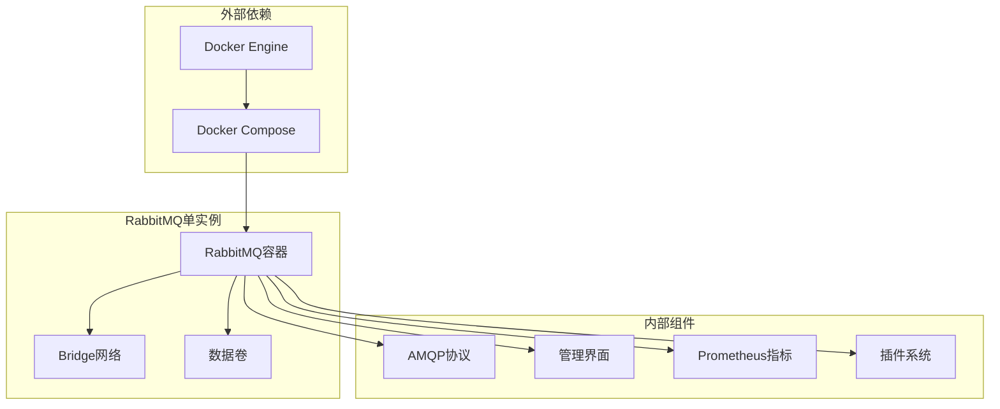

**图表来源**
- [docker-compose.yml:1-38](file://docker-compose/rabbitmq-single/compose/docker-compose.yml#L1-L38)

### 环境变量依赖

系统配置依赖于以下环境变量的正确设置：

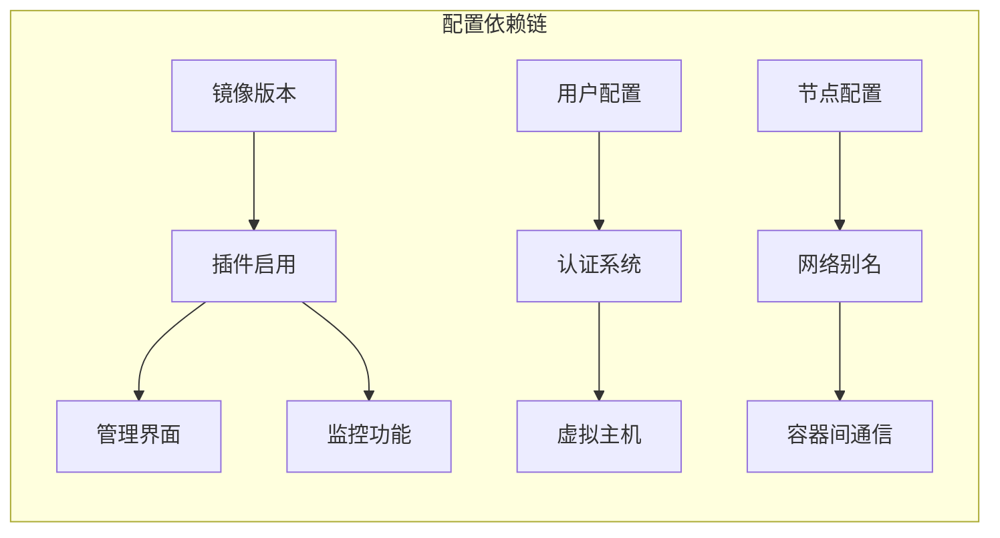

**图表来源**
- [docker-compose.yml:15-25](file://docker-compose/rabbitmq-single/compose/docker-compose.yml#L15-L25)

**章节来源**
- [docker-compose.yml:15-25](file://docker-compose/rabbitmq-single/compose/docker-compose.yml#L15-L25)

## 性能考虑

### 内存配置优化

根据生产环境需求，建议调整内存配置参数：

#### 内存水位线设置
- **默认值**: 40%可用RAM
- **生产推荐**: 通过 `RABBITMQ_VM_MEMORY_HIGH_WATERMARK` 参数调整
- **适用场景**: 高并发消息处理环境

#### 磁盘空间监控
- **默认阈值**: 50MB磁盘空间
- **生产推荐**: 通过 `RABBITMQ_DISK_FREE_LIMIT` 参数设置
- **监控建议**: 定期检查磁盘使用率

### 端口和服务配置

| 服务类型 | 端口号 | 用途 | 建议配置 |
|----------|--------|------|----------|
| AMQP协议 | 5672 | 消息传输 | 标准端口，无需修改 |
| 管理界面 | 15672 | Web管理 | 仅本地访问 |
| 监控指标 | 15692 | Prometheus | 仅本地访问 |

**章节来源**
- [README.md:213-224](file://docker-compose/rabbitmq-single/README.md#L213-L224)

## 故障排除指南

### 常见问题诊断

#### 启动失败问题

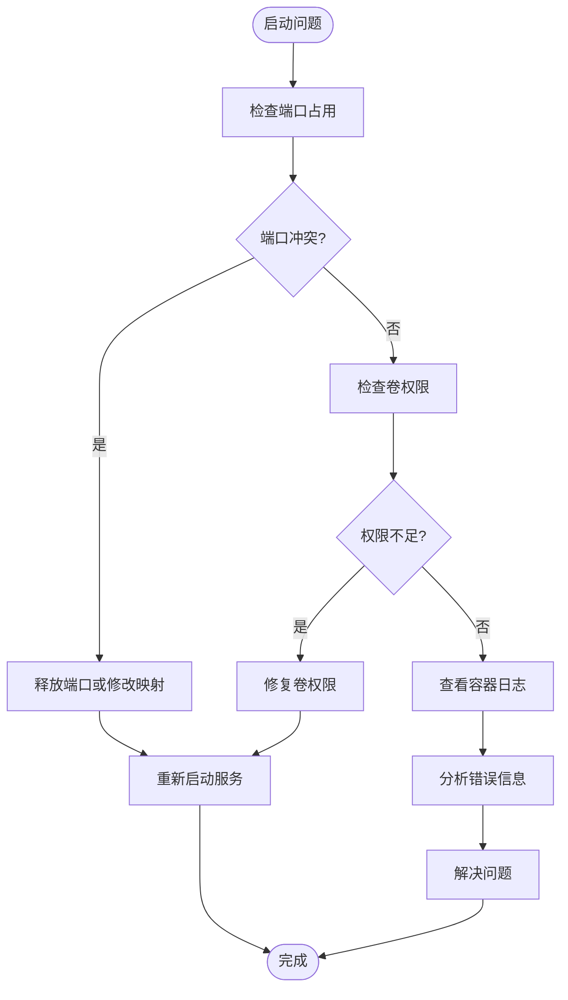

#### 连接问题排查

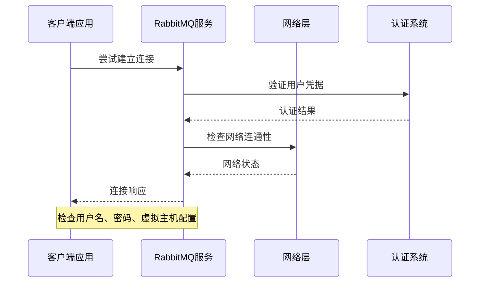

#### 监控指标获取

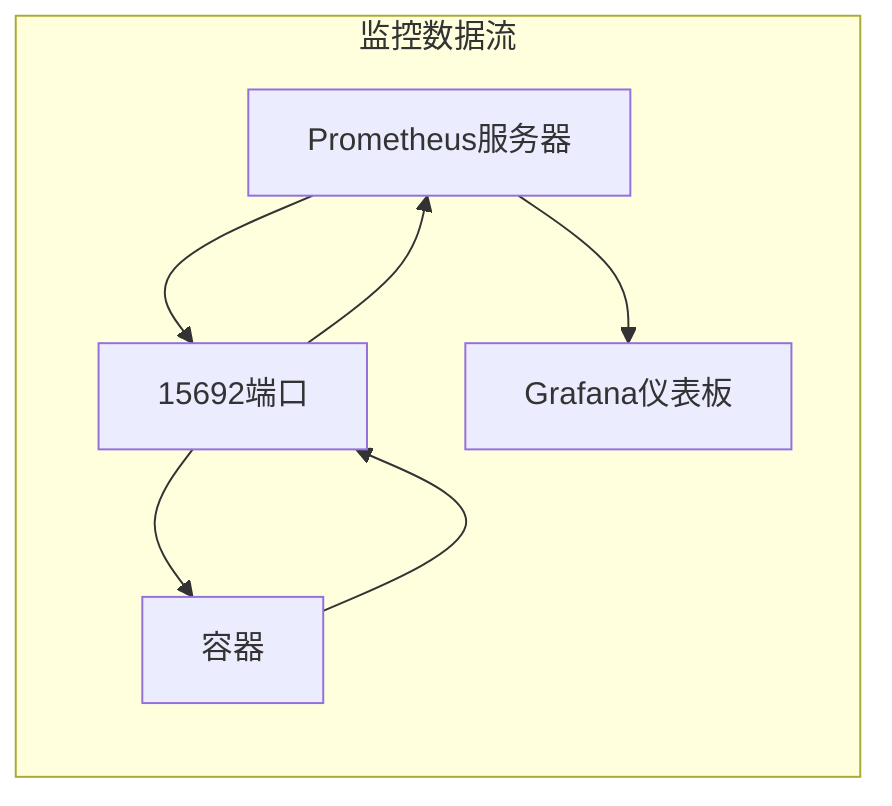

**章节来源**
- [README.md:186-203](file://docker-compose/rabbitmq-single/README.md#L186-L203)

### 停止和清理流程

#### 安全停止步骤

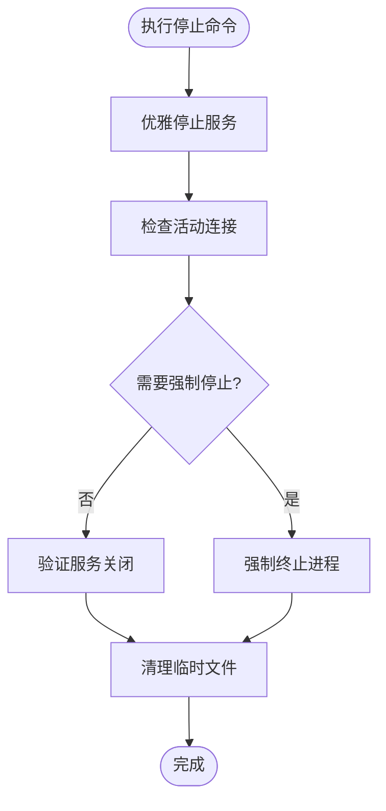

#### 数据清理选项

| 清理级别 | 操作内容 | 影响范围 | 使用场景 |
|----------|----------|----------|----------|
| 服务停止 | 仅停止容器 | 无数据丢失 | 临时维护 |
| 数据保留 | 停止并保留卷 | 数据和配置保留 | 开发测试 |
| 完全清理 | 删除所有数据和配置 | 完全重置 | 环境重建 |

**章节来源**
- [down.sh:18-22](file://docker-compose/rabbitmq-single/bin/down.sh#L18-L22)

## 结论

RabbitMQ单实例配置提供了一个完整、可靠的单容器消息队列解决方案。该配置具有以下特点：

### 优势特性
- **简化部署**: 单容器架构，易于理解和维护
- **完整功能**: 包含管理界面和监控功能
- **数据持久化**: 三个独立卷确保数据安全
- **自动化脚本**: 提供便捷的启动和停止流程

### 适用场景
- **开发测试环境**: 快速搭建和销毁
- **小型应用**: 低复杂度的消息传递需求
- **学习研究**: 理解RabbitMQ基本概念

### 生产环境建议
考虑到单实例部署的局限性，建议在生产环境中：
- 考虑集群部署以获得高可用性
- 实施定期备份策略
- 监控资源使用情况
- 制定灾难恢复计划

该配置为RabbitMQ的使用提供了良好的起点，可根据具体需求进行扩展和优化。