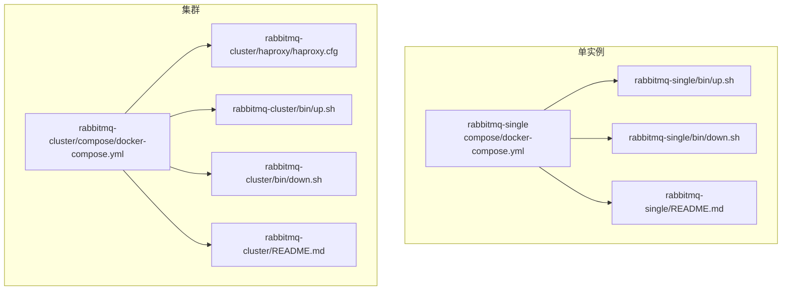
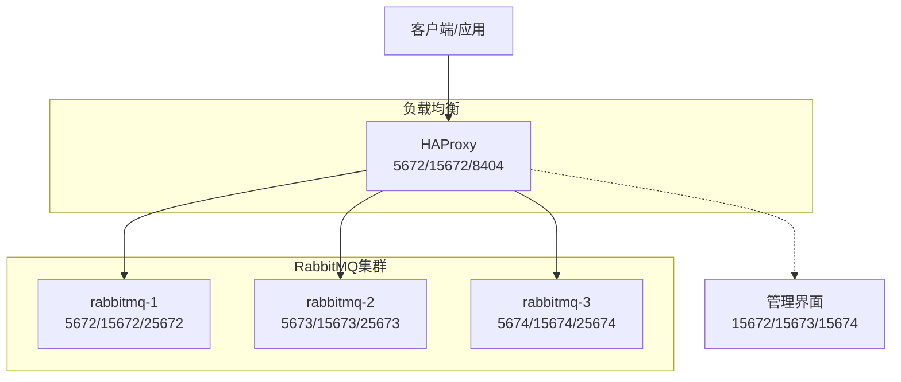
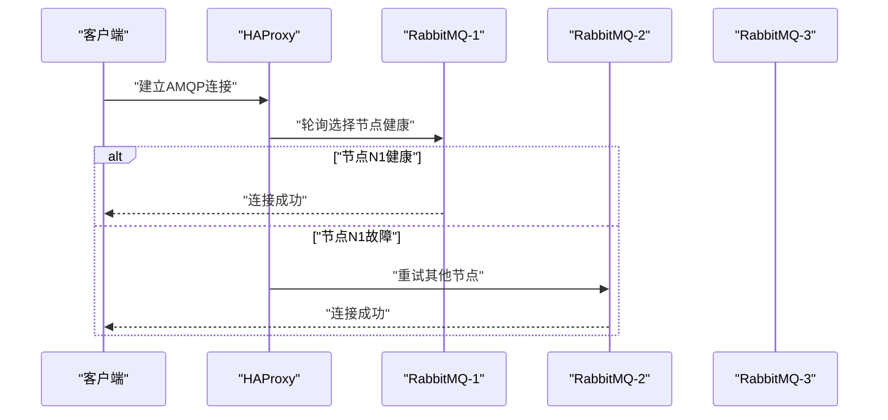
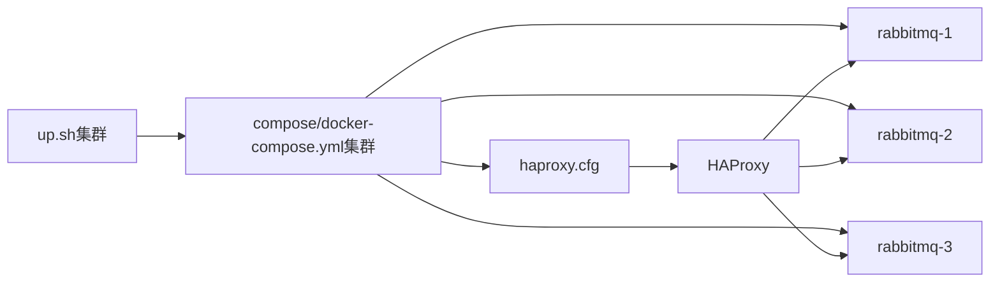
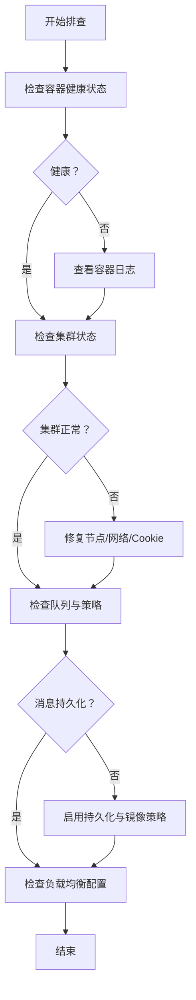

# RabbitMQ环境

<cite>
**本文引用的文件**
- [docker-compose.yml（单实例）](file://docker-compose/rabbitmq-single/compose/docker-compose.yml)
- [README.md（单实例）](file://docker-compose/rabbitmq-single/README.md)
- [up.sh（单实例启动）](file://docker-compose/rabbitmq-single/bin/up.sh)
- [down.sh（单实例停止）](file://docker-compose/rabbitmq-single/bin/down.sh)
- [docker-compose.yml（集群）](file://docker-compose/rabbitmq-cluster/compose/docker-compose.yml)
- [README.md（集群）](file://docker-compose/rabbitmq-cluster/README.md)
- [haproxy.cfg（集群负载均衡）](file://docker-compose/rabbitmq-cluster/haproxy/haproxy.cfg)
- [up.sh（集群启动）](file://docker-compose/rabbitmq-cluster/bin/up.sh)
- [down.sh（集群停止）](file://docker-compose/rabbitmq-cluster/bin/down.sh)
</cite>

## 目录
1. [简介](#简介)
2. [项目结构](#项目结构)
3. [核心组件](#核心组件)
4. [架构总览](#架构总览)
5. [详细组件分析](#详细组件分析)
6. [依赖关系分析](#依赖关系分析)
7. [性能与调优](#性能与调优)
8. [故障排查指南](#故障排查指南)
9. [结论](#结论)
10. [附录](#附录)

## 简介
本文件面向RabbitMQ消息队列环境的搭建与运维，覆盖单实例与集群两种部署形态，重点说明以下方面：
- 单实例与集群的容器编排与端口映射
- 集群节点设置、发现与健康检查
- 镜像队列策略与高可用配置
- HAProxy负载均衡器的配置与使用
- 消息代理管理界面（Management）与监控指标
- 环境变量、插件启用与性能调优建议
- 高可用设计、故障转移与监控配置

## 项目结构
该仓库以“按功能分层”的方式组织，RabbitMQ相关环境位于 docker-compose/rabbitmq-* 子目录中，分别提供单实例与集群两种方案，并配套启动/停止脚本与说明文档。

图表来源
- [docker-compose.yml（单实例）:1-38](file://docker-compose/rabbitmq-single/compose/docker-compose.yml#L1-L38)
- [docker-compose.yml（集群）:1-137](file://docker-compose/rabbitmq-cluster/compose/docker-compose.yml#L1-L137)
- [haproxy.cfg（集群负载均衡）:1-56](file://docker-compose/rabbitmq-cluster/haproxy/haproxy.cfg#L1-L56)

章节来源
- [docker-compose.yml（单实例）:1-38](file://docker-compose/rabbitmq-single/compose/docker-compose.yml#L1-L38)
- [docker-compose.yml（集群）:1-137](file://docker-compose/rabbitmq-cluster/compose/docker-compose.yml#L1-L137)
- [README.md（单实例）:1-233](file://docker-compose/rabbitmq-single/README.md#L1-L233)
- [README.md（集群）:1-313](file://docker-compose/rabbitmq-cluster/README.md#L1-L313)

## 核心组件
- RabbitMQ服务：单实例或三节点集群，均基于官方镜像并启用管理插件与Prometheus指标导出。
- 网络：统一桥接网络 all，支持容器间通过别名访问。
- 数据持久化：挂载主机目录到容器内数据与日志路径，确保重启不丢失。
- 健康检查：通过 rabbitmqctl status 进行周期性健康探测。
- 负载均衡：HAProxy作为AMQP与管理接口的入口，提供轮询与健康检查。
- 插件：management、prometheus；集群模式下还启用经典集群发现插件。

章节来源
- [docker-compose.yml（单实例）:1-38](file://docker-compose/rabbitmq-single/compose/docker-compose.yml#L1-L38)
- [docker-compose.yml（集群）:1-137](file://docker-compose/rabbitmq-cluster/compose/docker-compose.yml#L1-L137)
- [haproxy.cfg（集群负载均衡）:1-56](file://docker-compose/rabbitmq-cluster/haproxy/haproxy.cfg#L1-L56)
- [up.sh（单实例）:20-28](file://docker-compose/rabbitmq-single/bin/up.sh#L20-L28)
- [up.sh（集群启动）:26-43](file://docker-compose/rabbitmq-cluster/bin/up.sh#L26-L43)

## 架构总览
单实例与集群在容器层面差异主要体现在：
- 单实例：一个RabbitMQ容器对外提供AMQP与管理接口。
- 集群：三个RabbitMQ节点组成集群，外部通过HAProxy进行连接与管理流量分发。

图表来源
- [docker-compose.yml（集群）:115-133](file://docker-compose/rabbitmq-cluster/compose/docker-compose.yml#L115-L133)
- [haproxy.cfg（集群负载均衡）:21-46](file://docker-compose/rabbitmq-cluster/haproxy/haproxy.cfg#L21-L46)

## 详细组件分析

### 单实例组件
- 容器与网络
  - 使用桥接网络 all 并设置别名，便于内部服务发现。
  - 挂载数据、日志与配置目录，确保持久化与可维护性。
- 环境变量与端口
  - 默认用户、密码、虚拟主机、节点名称等。
  - 对外暴露AMQP、管理与Prometheus指标端口。
- 健康检查
  - 通过 rabbitmqctl status 执行周期性探测。
- 启停脚本
  - 自动创建配置文件与必要目录，启动后输出访问信息与示例。

章节来源
- [docker-compose.yml（单实例）:1-38](file://docker-compose/rabbitmq-single/compose/docker-compose.yml#L1-L38)
- [up.sh（单实例启动）:14-28](file://docker-compose/rabbitmq-single/bin/up.sh#L14-L28)
- [down.sh（单实例停止）:13-23](file://docker-compose/rabbitmq-single/bin/down.sh#L13-L23)
- [README.md（单实例）:13-41](file://docker-compose/rabbitmq-single/README.md#L13-L41)

### 集群组件
- 节点定义与发现
  - 三个节点共享相同的 Erlang Cookie，静态声明集群节点列表。
  - 通过 depends_on 保证节点顺序启动，减少发现失败概率。
- 端口映射
  - 每个节点独立映射AMQP、管理与集群通信端口，避免冲突。
- HAProxy负载均衡
  - AMQP前端采用TCP模式与轮询算法，后端对三节点进行健康检查。
  - 管理接口前端采用HTTP模式，使用API健康检查。
  - 统计页面开启并设置认证，便于运维观察。
- 启停脚本
  - 启动前为每个节点生成插件配置文件，等待集群形成后再输出访问信息。

章节来源
- [docker-compose.yml（集群）:1-137](file://docker-compose/rabbitmq-cluster/compose/docker-compose.yml#L1-L137)
- [haproxy.cfg（集群负载均衡）:1-56](file://docker-compose/rabbitmq-cluster/haproxy/haproxy.cfg#L1-L56)
- [up.sh（集群启动）:14-49](file://docker-compose/rabbitmq-cluster/bin/up.sh#L14-L49)
- [down.sh（集群停止）:13-24](file://docker-compose/rabbitmq-cluster/bin/down.sh#L13-L24)
- [README.md（集群）:16-55](file://docker-compose/rabbitmq-cluster/README.md#L16-L55)

### 镜像队列与高可用策略
- 策略配置
  - 支持对特定前缀队列应用“镜像到全部节点”或“镜像到指定数量节点”的策略。
- 实践建议
  - 生产环境建议对关键队列启用镜像策略，并结合持久化提升可靠性。
  - 可通过管理界面或命令行工具进行策略的查看与调整。

章节来源
- [README.md（集群）:141-152](file://docker-compose/rabbitmq-cluster/README.md#L141-L152)

### HAProxy负载均衡器
- 配置要点
  - AMQP：TCP模式，轮询，健康检查为TCP连通性。
  - 管理接口：HTTP模式，健康检查为管理API返回状态。
  - 统计页：开启并设置认证，刷新频率可配置。
- 使用方法
  - 应用侧统一连接负载均衡器的端口，由HAProxy自动分发至健康节点。
  - 通过统计页实时掌握节点健康与连接分布情况。

图表来源
- [haproxy.cfg（集群负载均衡）:21-46](file://docker-compose/rabbitmq-cluster/haproxy/haproxy.cfg#L21-L46)

章节来源
- [haproxy.cfg（集群负载均衡）:1-56](file://docker-compose/rabbitmq-cluster/haproxy/haproxy.cfg#L1-L56)
- [README.md（集群）:154-162](file://docker-compose/rabbitmq-cluster/README.md#L154-L162)

### 管理界面与监控
- 管理界面
  - 提供队列、交换机、绑定、用户权限、虚拟主机与统计信息的可视化管理。
- 监控指标
  - Prometheus指标端口用于采集运行时指标，便于集成监控系统。
- 集群监控命令
  - 提供常用命令用于查看内存、磁盘、连接与消费者等状态。

章节来源
- [README.md（单实例）:174-203](file://docker-compose/rabbitmq-single/README.md#L174-L203)
- [README.md（集群）:229-255](file://docker-compose/rabbitmq-cluster/README.md#L229-L255)

## 依赖关系分析
- 单实例
  - 仅依赖本地网络与挂载卷，无外部依赖。
- 集群
  - HAProxy依赖RabbitMQ节点健康状态；节点之间通过ERLANG COOKIE与静态节点列表建立信任与发现。
  - 启动顺序通过 depends_on 控制，降低集群形成失败的概率。

图表来源
- [docker-compose.yml（集群）:1-137](file://docker-compose/rabbitmq-cluster/compose/docker-compose.yml#L1-L137)
- [haproxy.cfg（集群负载均衡）:1-56](file://docker-compose/rabbitmq-cluster/haproxy/haproxy.cfg#L1-L56)
- [up.sh（集群启动）:45-49](file://docker-compose/rabbitmq-cluster/bin/up.sh#L45-L49)

章节来源
- [docker-compose.yml（集群）:43-83](file://docker-compose/rabbitmq-cluster/compose/docker-compose.yml#L43-L83)
- [up.sh（集群启动）:48-49](file://docker-compose/rabbitmq-cluster/bin/up.sh#L48-L49)

## 性能与调优
- 内存与磁盘阈值
  - 单实例文档提供了内存水位与磁盘限制的推荐项，生产环境应结合资源情况调整。
- 集群优化
  - 合理规划网络分区处理策略，避免脑裂影响。
  - 将队列均匀分布在不同节点，避免热点。
  - 结合镜像队列策略保障高可用。
- 负载均衡优化
  - 合理设置健康检查间隔与超时，平衡响应时间与稳定性。
  - 在应用侧使用连接池，降低频繁建连开销。

章节来源
- [README.md（单实例）:213-224](file://docker-compose/rabbitmq-single/README.md#L213-L224)
- [README.md（集群）:289-303](file://docker-compose/rabbitmq-cluster/README.md#L289-L303)

## 故障排查指南
- 健康检查失败
  - 检查容器日志与健康检查命令是否可执行。
  - 单实例可通过 exec 进入容器执行 rabbitmqctl status。
- 集群未形成或节点加入失败
  - 确认Erlang Cookie一致、节点列表正确、网络互通。
  - 可先启动主节点，等待其就绪后再启动其余节点。
- 队列不可用或消息丢失
  - 确认队列与消息已设置为持久化。
  - 对关键队列配置镜像策略，确保多节点备份。
- 负载均衡异常
  - 查看HAProxy统计页，确认节点健康状态与连接分布。
  - 检查后端服务器地址与端口映射是否匹配。

章节来源
- [README.md（集群）:257-279](file://docker-compose/rabbitmq-cluster/README.md#L257-L279)
- [README.md（集群）:298-303](file://docker-compose/rabbitmq-cluster/README.md#L298-L303)

## 结论
本仓库提供了RabbitMQ从单实例到集群的完整容器化部署方案，配合HAProxy实现连接与管理流量的负载均衡，并内置管理界面与Prometheus指标，满足开发与生产环境的基本需求。建议在生产环境中：
- 使用集群+镜像队列策略保障高可用；
- 启用持久化与合理的内存/磁盘阈值；
- 通过负载均衡与健康检查提升可用性；
- 建立完善的监控与告警体系。

## 附录
- 访问信息与示例
  - 单实例：AMQP、管理界面、Prometheus指标端口与默认凭据。
  - 集群：负载均衡后的AMQP与管理接口，以及HAProxy统计页。
- 快速操作
  - 使用 bin 目录下的 up.sh/down.sh 脚本快速启动/停止服务。
- 数据与日志
  - 数据与日志目录挂载至宿主机，便于备份与维护。

章节来源
- [README.md（单实例）:13-41](file://docker-compose/rabbitmq-single/README.md#L13-L41)
- [README.md（集群）:16-55](file://docker-compose/rabbitmq-cluster/README.md#L16-L55)
- [up.sh（单实例）:34-54](file://docker-compose/rabbitmq-single/bin/up.sh#L34-L54)
- [up.sh（集群启动）:53-75](file://docker-compose/rabbitmq-cluster/bin/up.sh#L53-L75)
- [down.sh（单实例停止）:17-23](file://docker-compose/rabbitmq-single/bin/down.sh#L17-L23)
- [down.sh（集群停止）:18-24](file://docker-compose/rabbitmq-cluster/bin/down.sh#L18-L24)