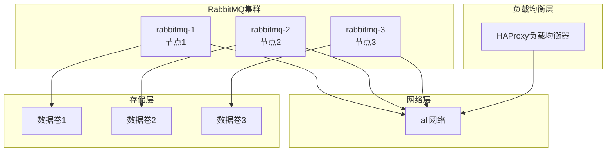
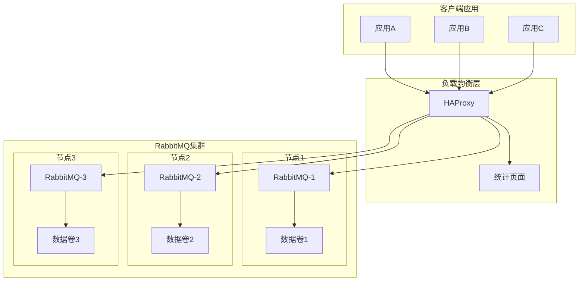
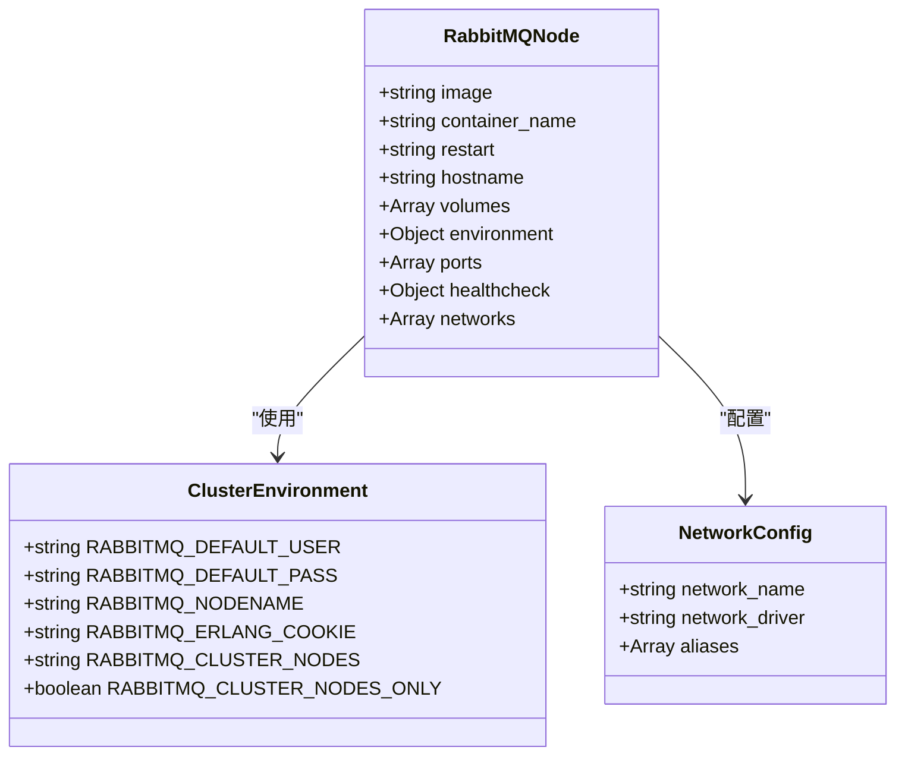
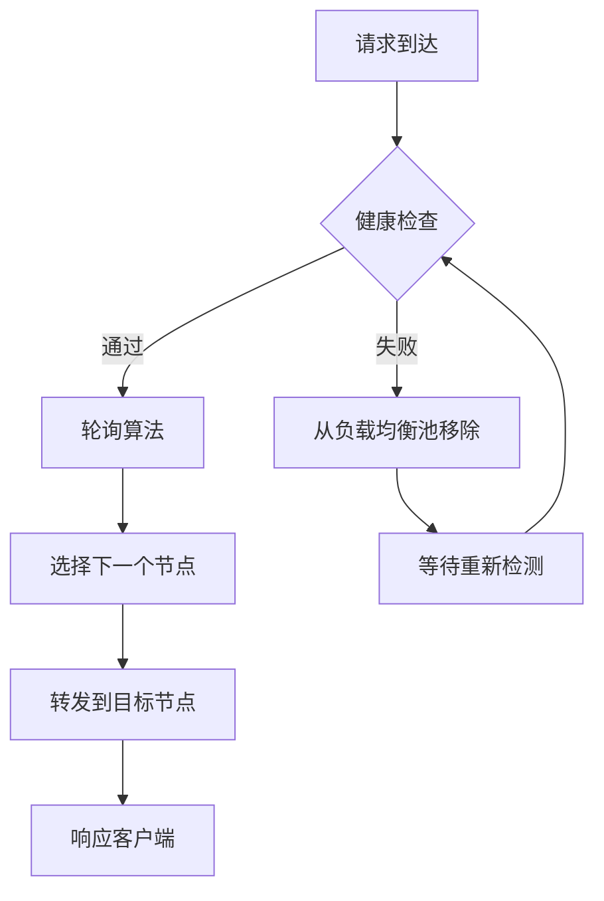
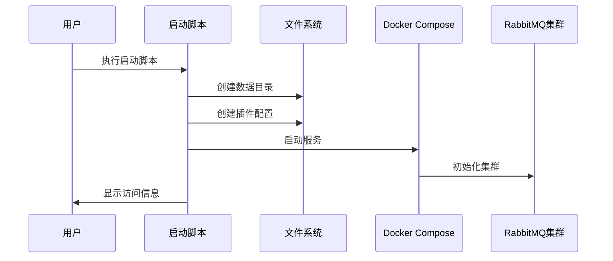
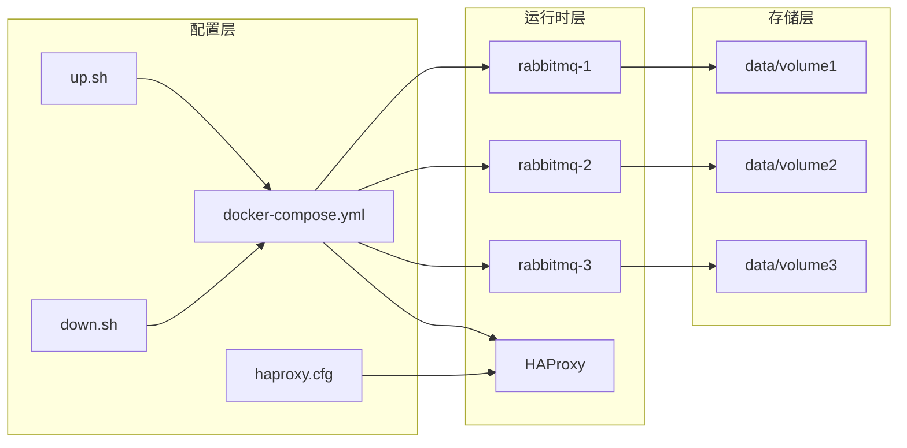
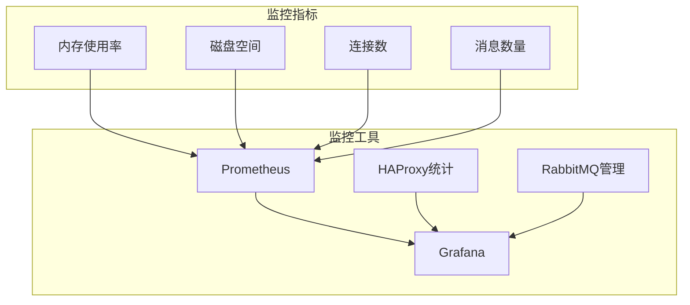
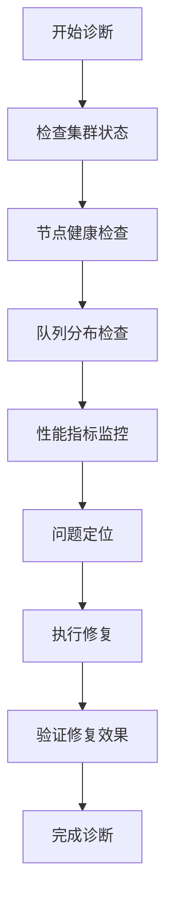

# RabbitMQ集群配置

<cite>
**本文档引用的文件**
- [docker-compose.yml](file://docker-compose/rabbitmq-cluster/compose/docker-compose.yml)
- [haproxy.cfg](file://docker-compose/rabbitmq-cluster/haproxy/haproxy.cfg)
- [up.sh](file://docker-compose/rabbitmq-cluster/bin/up.sh)
- [down.sh](file://docker-compose/rabbitmq-cluster/bin/down.sh)
- [README.md](file://docker-compose/rabbitmq-cluster/README.md)
- [rabbitmq-compose.yml](file://docker-compose/rabbitmq-single/compose/docker-compose.yml)
- [rabbitmq-up.sh](file://docker-compose/rabbitmq-single/bin/up.sh)
</cite>

## 目录
1. [简介](#简介)
2. [项目结构](#项目结构)
3. [核心组件](#核心组件)
4. [架构概览](#架构概览)
5. [详细组件分析](#详细组件分析)
6. [依赖关系分析](#依赖关系分析)
7. [性能考虑](#性能考虑)
8. [故障排除指南](#故障排除指南)
9. [结论](#结论)

## 简介

本文件提供了RabbitMQ集群环境的详细配置文档，涵盖多节点集群的Docker Compose配置、网络配置、数据持久化和同步机制。重点解释了HAProxy负载均衡器的配置，包括负载均衡算法、健康检查配置和故障转移策略。同时提供了集群节点的添加和移除流程，说明镜像队列的配置和高可用性设计，并包含集群监控、性能调优和故障恢复的最佳实践。

## 项目结构

RabbitMQ集群配置采用Docker Compose进行编排，主要包含以下组件：

**图表来源**
- [docker-compose.yml:1-137](file://docker-compose/rabbitmq-cluster/compose/docker-compose.yml#L1-L137)
- [haproxy.cfg:1-56](file://docker-compose/rabbitmq-cluster/haproxy/haproxy.cfg#L1-L56)

**章节来源**
- [docker-compose.yml:1-137](file://docker-compose/rabbitmq-cluster/compose/docker-compose.yml#L1-L137)
- [README.md:1-313](file://docker-compose/rabbitmq-cluster/README.md#L1-L313)

## 核心组件

### RabbitMQ集群节点配置

系统包含三个RabbitMQ节点，每个节点都有独立的数据目录、日志目录和配置目录：

| 节点 | 容器名 | AMQP端口映射 | 管理端口映射 | 数据目录 | 配置目录 |
|------|--------|-------------|-------------|----------|----------|
| 节点1 | rabbitmq-1 | 5672:5672 | 15672:15672 | data/ | config/ |
| 节点2 | rabbitmq-2 | 5673:5672 | 15673:15672 | data/ | config/ |
| 节点3 | rabbitmq-3 | 5674:5672 | 15674:15672 | data/ | config/ |

### HAProxy负载均衡器配置

负载均衡器提供统一的入口点，支持AMQP协议和HTTP管理界面的负载均衡：

- **AMQP负载均衡**: 使用轮询算法分发消息代理连接
- **管理界面负载均衡**: 支持HTTP协议的健康检查
- **统计监控**: 提供实时监控页面和认证功能

**章节来源**
- [docker-compose.yml:2-113](file://docker-compose/rabbitmq-cluster/compose/docker-compose.yml#L2-L113)
- [haproxy.cfg:21-56](file://docker-compose/rabbitmq-cluster/haproxy/haproxy.cfg#L21-L56)

## 架构概览

RabbitMQ集群采用经典的三节点架构，结合HAProxy实现高可用性：

**图表来源**
- [docker-compose.yml:115-137](file://docker-compose/rabbitmq-cluster/compose/docker-compose.yml#L115-L137)
- [haproxy.cfg:14-56](file://docker-compose/rabbitmq-cluster/haproxy/haproxy.cfg#L14-L56)

## 详细组件分析

### Docker Compose配置分析

#### 集群服务定义

每个RabbitMQ节点都配置了完整的环境变量和网络设置：

**图表来源**
- [docker-compose.yml:2-113](file://docker-compose/rabbitmq-cluster/compose/docker-compose.yml#L2-L113)

#### 网络配置详解

集群使用自定义的bridge网络，确保容器间通信：

- **网络名称**: `all`
- **网络驱动**: `bridge`
- **容器别名**: 每个节点都有对应的网络别名
- **内部通信**: 支持容器间的直接通信

#### 数据持久化机制

每个节点都配置了独立的数据持久化卷：

- **数据目录**: `/var/lib/rabbitmq` -> 主机目录
- **日志目录**: `/var/log/rabbitmq` -> 主机目录  
- **配置目录**: `/etc/rabbitmq` -> 主机目录

**章节来源**
- [docker-compose.yml:7-14](file://docker-compose/rabbitmq-cluster/compose/docker-compose.yml#L7-L14)
- [docker-compose.yml:45-52](file://docker-compose/rabbitmq-cluster/compose/docker-compose.yml#L45-L52)
- [docker-compose.yml:84-91](file://docker-compose/rabbitmq-cluster/compose/docker-compose.yml#L84-L91)

### HAProxy负载均衡器配置

#### 负载均衡算法配置

HAProxy采用轮询算法进行负载均衡：

**图表来源**
- [haproxy.cfg:26-31](file://docker-compose/rabbitmq-cluster/haproxy/haproxy.cfg#L26-L31)

#### 健康检查配置

负载均衡器配置了多层次的健康检查机制：

- **AMQP健康检查**: TCP连接检查
- **管理界面健康检查**: HTTP GET请求检查
- **检查间隔**: 5秒
- **超时时间**: 5秒

#### 故障转移策略

当节点出现故障时，系统自动执行故障转移：

1. **自动检测**: HAProxy定期检查节点状态
2. **节点移除**: 失败节点从负载均衡池中移除
3. **流量重定向**: 流量自动转发到健康的节点
4. **自动恢复**: 节点恢复后自动重新加入

**章节来源**
- [haproxy.cfg:22-46](file://docker-compose/rabbitmq-cluster/haproxy/haproxy.cfg#L22-L46)

### 启动和停止脚本分析

#### 启动脚本功能

启动脚本负责完整的集群初始化过程：

**图表来源**
- [up.sh:14-46](file://docker-compose/rabbitmq-cluster/bin/up.sh#L14-L46)

#### 停止脚本功能

停止脚本提供安全的集群关闭机制：

- **优雅关闭**: 正常停止所有服务
- **数据保护**: 保留数据卷不被删除
- **清理通知**: 提供数据清理指导

**章节来源**
- [up.sh:1-76](file://docker-compose/rabbitmq-cluster/bin/up.sh#L1-L76)
- [down.sh:1-24](file://docker-compose/rabbitmq-cluster/bin/down.sh#L1-L24)

## 依赖关系分析

### 组件耦合度分析

**图表来源**
- [docker-compose.yml:1-137](file://docker-compose/rabbitmq-cluster/compose/docker-compose.yml#L1-L137)
- [haproxy.cfg:1-56](file://docker-compose/rabbitmq-cluster/haproxy/haproxy.cfg#L1-L56)

### 外部依赖关系

系统依赖的关键外部组件：

- **Docker Compose**: 容器编排和管理
- **HAProxy**: 负载均衡和故障转移
- **Bridge网络**: 容器间通信
- **主机文件系统**: 数据持久化

**章节来源**
- [docker-compose.yml:134-137](file://docker-compose/rabbitmq-cluster/compose/docker-compose.yml#L134-L137)
- [haproxy.cfg:1-56](file://docker-compose/rabbitmq-cluster/haproxy/haproxy.cfg#L1-L56)

## 性能考虑

### 集群性能优化

基于配置分析，系统在性能方面有以下特点：

#### 连接池配置
- **最大连接数**: 4096个连接
- **连接超时**: 5秒
- **客户端超时**: 30秒
- **服务器超时**: 30秒

#### 负载均衡优化
- **轮询算法**: 平均分配请求
- **健康检查**: 5秒间隔
- **故障转移**: 自动处理

### 监控和指标

系统集成了完整的监控体系：

**图表来源**
- [docker-compose.yml:30](file://docker-compose/rabbitmq-cluster/compose/docker-compose.yml#L30)
- [docker-compose.yml:69](file://docker-compose/rabbitmq-cluster/compose/docker-compose.yml#L69)
- [docker-compose.yml:108](file://docker-compose/rabbitmq-cluster/compose/docker-compose.yml#L108)

**章节来源**
- [README.md:229-255](file://docker-compose/rabbitmq-cluster/README.md#L229-L255)

## 故障排除指南

### 常见问题诊断

#### 集群启动问题

**症状**: 集群无法正常启动
**可能原因**:
- 端口冲突
- Erlang Cookie不匹配
- 数据卷权限问题

**解决步骤**:
1. 检查端口占用情况
2. 验证Erlang Cookie配置
3. 确认数据目录权限

#### 负载均衡问题

**症状**: 请求转发失败或节点不可用
**可能原因**:
- 健康检查失败
- 网络连接问题
- 节点过载

**解决步骤**:
1. 检查HAProxy统计页面
2. 验证节点健康状态
3. 分析网络连接情况

#### 数据持久化问题

**症状**: 容器重启后数据丢失
**可能原因**:
- 数据卷挂载错误
- 权限不足
- 存储空间不足

**解决步骤**:
1. 检查数据卷挂载路径
2. 验证目录权限设置
3. 监控磁盘使用情况

### 集群管理命令

系统提供了丰富的管理命令用于故障诊断：

**图表来源**
- [README.md:128-152](file://docker-compose/rabbitmq-cluster/README.md#L128-L152)

**章节来源**
- [README.md:128-152](file://docker-compose/rabbitmq-cluster/README.md#L128-L152)
- [README.md:257-279](file://docker-compose/rabbitmq-cluster/README.md#L257-L279)

## 结论

本RabbitMQ集群配置方案提供了完整的高可用消息队列解决方案。通过Docker Compose实现容器化部署，利用HAProxy提供负载均衡和故障转移，结合数据持久化确保服务可靠性。

### 主要优势

1. **高可用性**: 三节点集群提供冗余保障
2. **负载均衡**: HAProxy实现智能流量分发
3. **易于管理**: 统一的配置管理和监控
4. **可扩展性**: 支持节点的动态添加和移除
5. **可观测性**: 完整的监控和统计功能

### 最佳实践建议

1. **生产环境配置**: 建议启用队列镜像策略
2. **监控告警**: 配置适当的监控和告警机制
3. **备份策略**: 制定定期的数据备份计划
4. **容量规划**: 根据业务需求合理规划资源
5. **安全加固**: 加强网络隔离和访问控制

该配置方案为微服务架构和高并发场景提供了可靠的基础设施支撑，能够满足大多数企业级应用的消息传递需求。