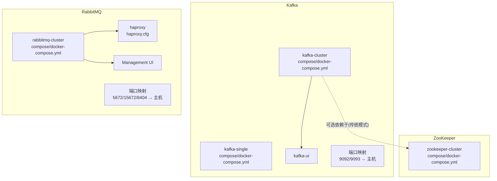
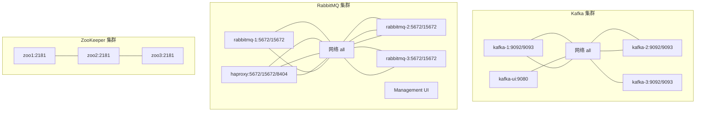
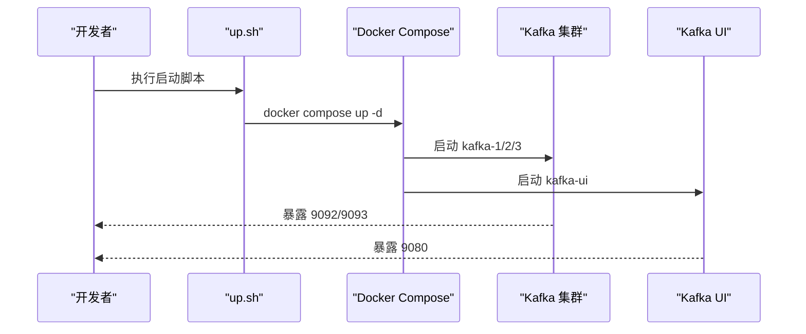
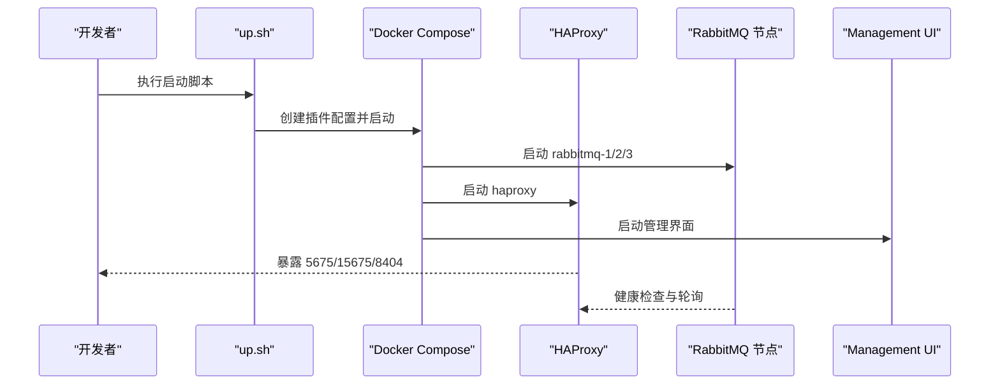
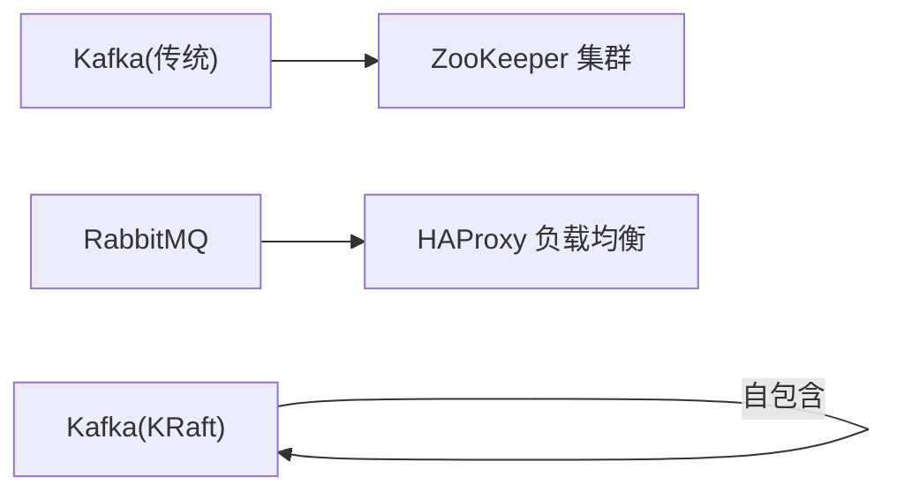

# 消息队列环境

<cite>
**本文引用的文件**
- [docker-compose.yml（Kafka 集群）](file://docker-compose/kafka-cluster/compose/docker-compose.yml)
- [up.sh（Kafka 集群启动脚本）](file://docker-compose/kafka-cluster/bin/up.sh)
- [down.sh（Kafka 集群停止脚本）](file://docker-compose/kafka-cluster/bin/down.sh)
- [README.md（Kafka 集群）](file://docker-compose/kafka-cluster/README.md)
- [docker-compose.yml（RabbitMQ 集群）](file://docker-compose/rabbitmq-cluster/compose/docker-compose.yml)
- [haproxy.cfg（RabbitMQ 负载均衡）](file://docker-compose/rabbitmq-cluster/haproxy/haproxy.cfg)
- [up.sh（RabbitMQ 集群启动脚本）](file://docker-compose/rabbitmq-cluster/bin/up.sh)
- [down.sh（RabbitMQ 集群停止脚本）](file://docker-compose/rabbitmq-cluster/bin/down.sh)
- [README.md（RabbitMQ 集群）](file://docker-compose/rabbitmq-cluster/README.md)
- [docker-compose.yml（Kafka 单节点）](file://docker-compose/kafka-single/compose/docker-compose.yml)
- [docker-compose.yml（RabbitMQ 单节点）](file://docker-compose/rabbitmq-single/compose/docker-compose.yml)
- [docker-compose.yml（ZooKeeper 集群）](file://docker-compose/zookeeper-cluster/compose/docker-compose.yml)
</cite>

## 目录
1. [简介](#简介)
2. [项目结构](#项目结构)
3. [核心组件](#核心组件)
4. [架构总览](#架构总览)
5. [详细组件分析](#详细组件分析)
6. [依赖关系分析](#依赖关系分析)
7. [性能考虑](#性能考虑)
8. [故障排除指南](#故障排除指南)
9. [结论](#结论)
10. [附录](#附录)

## 简介
本文件面向消息队列环境的容器化部署与运维，重点覆盖两大消息中间件：Kafka 与 RabbitMQ。内容包括：
- 容器化配置与集群部署要点
- 生产者/消费者使用模式与消息路由策略
- 可靠性保障机制（副本、镜像队列、事务）
- 集群负载均衡与高可用设计
- 性能调优建议、监控指标与故障排除

## 项目结构
该仓库采用按功能模块组织的目录结构，消息队列相关配置集中在 docker-compose 子目录中，每个中间件提供单节点与集群两种形态，并配套启动/停止脚本与使用说明。

图表来源
- [docker-compose.yml（Kafka 集群）:1-119](file://docker-compose/kafka-cluster/compose/docker-compose.yml#L1-L119)
- [docker-compose.yml（RabbitMQ 集群）:1-137](file://docker-compose/rabbitmq-cluster/compose/docker-compose.yml#L1-L137)
- [haproxy.cfg（RabbitMQ 负载均衡）:1-56](file://docker-compose/rabbitmq-cluster/haproxy/haproxy.cfg#L1-L56)
- [docker-compose.yml（ZooKeeper 集群）:1-68](file://docker-compose/zookeeper-cluster/compose/docker-compose.yml#L1-L68)

章节来源
- [README.md（Kafka 集群）:1-169](file://docker-compose/kafka-cluster/README.md#L1-L169)
- [README.md（RabbitMQ 集群）:1-313](file://docker-compose/rabbitmq-cluster/README.md#L1-L313)

## 核心组件
- Kafka 集群（KRaft 模式，无 ZooKeeper）
  - 三个 broker/controller 节点，支持副本与分区
  - 提供 Kafka UI Web 管理界面
  - 端口映射：9092（业务）、9093（控制器）
- RabbitMQ 集群（经典集群 + HAProxy 负载均衡）
  - 三个节点，Erlang Cookie 一致实现自动发现
  - HAProxy 实现 AMQP 与管理接口的轮询与健康检查
  - 端口映射：5672/5673/5674（AMQP）、15672/15673/15674（管理）、8404（HAProxy 统计）
- ZooKeeper 集群（传统 Kafka 模式可选依赖）
  - 三节点，提供服务发现与协调能力
  - 提供 zoonavigator Web 界面

章节来源
- [docker-compose.yml（Kafka 集群）:1-119](file://docker-compose/kafka-cluster/compose/docker-compose.yml#L1-L119)
- [docker-compose.yml（RabbitMQ 集群）:1-137](file://docker-compose/rabbitmq-cluster/compose/docker-compose.yml#L1-L137)
- [docker-compose.yml（ZooKeeper 集群）:1-68](file://docker-compose/zookeeper-cluster/compose/docker-compose.yml#L1-L68)

## 架构总览
下图展示 Kafka 与 RabbitMQ 的容器化架构及交互关系：

图表来源
- [docker-compose.yml（Kafka 集群）:1-119](file://docker-compose/kafka-cluster/compose/docker-compose.yml#L1-L119)
- [docker-compose.yml（RabbitMQ 集群）:1-137](file://docker-compose/rabbitmq-cluster/compose/docker-compose.yml#L1-L137)
- [haproxy.cfg（RabbitMQ 负载均衡）:1-56](file://docker-compose/rabbitmq-cluster/haproxy/haproxy.cfg#L1-L56)
- [docker-compose.yml（ZooKeeper 集群）:1-68](file://docker-compose/zookeeper-cluster/compose/docker-compose.yml#L1-L68)

## 详细组件分析

### Kafka 集群（KRaft 模式）
- 配置要点
  - 使用 KRaft 模式，无需 ZooKeeper；每个节点同时承担 broker 与 controller 角色
  - 控制器投票集合明确指定各节点参与选举
  - 复制因子与分区数在集群模式下推荐设置为 3
  - 提供 Kafka UI 用于主题管理、消费者组监控与消息浏览
- 网络与端口
  - 业务端口：9092（对外暴露）
  - 控制器端口：9093（仅内部通信）
  - UI 端口：9080
- 数据持久化
  - 挂载主机目录至容器内数据与日志路径，便于灾备与运维
- 启停流程
  - 使用项目根目录下的 up.sh 启动，down.sh 停止；脚本输出访问地址与常用命令提示

图表来源
- [up.sh（Kafka 集群启动脚本）:1-35](file://docker-compose/kafka-cluster/bin/up.sh#L1-L35)
- [docker-compose.yml（Kafka 集群）:1-119](file://docker-compose/kafka-cluster/compose/docker-compose.yml#L1-L119)

章节来源
- [docker-compose.yml（Kafka 集群）:1-119](file://docker-compose/kafka-cluster/compose/docker-compose.yml#L1-L119)
- [README.md（Kafka 集群）:1-169](file://docker-compose/kafka-cluster/README.md#L1-L169)
- [up.sh（Kafka 集群启动脚本）:1-35](file://docker-compose/kafka-cluster/bin/up.sh#L1-L35)
- [down.sh（Kafka 集群停止脚本）:1-25](file://docker-compose/kafka-cluster/bin/down.sh#L1-L25)

### RabbitMQ 集群（经典集群 + HAProxy 负载均衡）
- 配置要点
  - 三节点经典集群，Erlang Cookie 一致以启用自动发现
  - 通过静态配置指定集群节点列表，限制仅允许列出节点加入
  - 启用管理插件与 Prometheus 插件，便于监控与可观测性
  - HAProxy 实现 AMQP 与管理接口的轮询与健康检查
- 网络与端口
  - AMQP：5672/5673/5674（对外暴露 5675 作为负载均衡入口）
  - 管理接口：15672/15673/15674（对外暴露 15675 作为负载均衡入口）
  - HAProxy 统计页：8404
- 数据持久化
  - 挂载 data、logs、config 三类目录，确保重启后状态与配置不丢失
- 启停流程
  - up.sh 自动创建数据目录与插件配置，然后启动 compose；down.sh 停止并保留数据卷

图表来源
- [up.sh（RabbitMQ 集群启动脚本）:1-76](file://docker-compose/rabbitmq-cluster/bin/up.sh#L1-L76)
- [docker-compose.yml（RabbitMQ 集群）:1-137](file://docker-compose/rabbitmq-cluster/compose/docker-compose.yml#L1-L137)
- [haproxy.cfg（RabbitMQ 负载均衡）:1-56](file://docker-compose/rabbitmq-cluster/haproxy/haproxy.cfg#L1-L56)

章节来源
- [docker-compose.yml（RabbitMQ 集群）:1-137](file://docker-compose/rabbitmq-cluster/compose/docker-compose.yml#L1-L137)
- [haproxy.cfg（RabbitMQ 负载均衡）:1-56](file://docker-compose/rabbitmq-cluster/haproxy/haproxy.cfg#L1-L56)
- [README.md（RabbitMQ 集群）:1-313](file://docker-compose/rabbitmq-cluster/README.md#L1-L313)
- [up.sh（RabbitMQ 集群启动脚本）:1-76](file://docker-compose/rabbitmq-cluster/bin/up.sh#L1-L76)
- [down.sh（RabbitMQ 集群停止脚本）:1-24](file://docker-compose/rabbitmq-cluster/bin/down.sh#L1-L24)

### ZooKeeper 集群（传统 Kafka 模式可选依赖）
- 配置要点
  - 三节点集群，配置 server 列表互相指向
  - 提供 zoonavigator Web 界面用于可视化管理
- 端口
  - 2181（客户端连接），映射到 2181/2182/2183

章节来源
- [docker-compose.yml（ZooKeeper 集群）:1-68](file://docker-compose/zookeeper-cluster/compose/docker-compose.yml#L1-L68)

### 单节点部署对比
- Kafka 单节点
  - 使用 KRaft 模式，简化配置
  - 端口映射：9092/9093，UI 端口 9080
- RabbitMQ 单节点
  - 端口映射：5672/15672/15692，健康检查配置

章节来源
- [docker-compose.yml（Kafka 单节点）:1-54](file://docker-compose/kafka-single/compose/docker-compose.yml#L1-L54)
- [docker-compose.yml（RabbitMQ 单节点）:1-38](file://docker-compose/rabbitmq-single/compose/docker-compose.yml#L1-L38)

## 依赖关系分析
- Kafka（KRaft 模式）：自包含，无需 ZooKeeper
- Kafka（传统模式）：可依赖 ZooKeeper 集群
- RabbitMQ：依赖 HAProxy 进行负载均衡与健康检查

图表来源
- [docker-compose.yml（Kafka 集群）:1-119](file://docker-compose/kafka-cluster/compose/docker-compose.yml#L1-L119)
- [docker-compose.yml（ZooKeeper 集群）:1-68](file://docker-compose/zookeeper-cluster/compose/docker-compose.yml#L1-L68)
- [docker-compose.yml（RabbitMQ 集群）:1-137](file://docker-compose/rabbitmq-cluster/compose/docker-compose.yml#L1-L137)
- [haproxy.cfg（RabbitMQ 负载均衡）:1-56](file://docker-compose/rabbitmq-cluster/haproxy/haproxy.cfg#L1-L56)

## 性能考虑
- Kafka
  - 分区数量与复制因子：集群模式建议分区与复制因子均为 3，提升吞吐与容错
  - 端口与网络：避免端口冲突，合理规划宿主机端口映射
  - JVM 参数与资源：生产环境建议调整 JVM 与资源限制
- RabbitMQ
  - 连接池：客户端侧使用连接池降低连接开销
  - 健康检查与超时：根据网络状况调整 HAProxy 健康检查间隔与超时
  - 内存与磁盘水位：结合监控指标设置内存上限与磁盘空间预警
  - 队列镜像策略：对关键队列配置镜像策略，提升可用性

## 故障排除指南
- Kafka
  - 端口占用：确认 9092/9093/9080 未被占用
  - 数据卷清理：down.sh 明确提示数据卷保留，如需完全清理请手动删除 temp 目录
  - 常用命令：通过 kafka-topics.sh 等工具进行主题管理与消息验证
- RabbitMQ
  - 端口占用：确认 5672-5675、15672-15675、8404 未被占用
  - 集群状态：使用 cluster_status、node_health_check 等命令检查节点健康
  - 分裂脑处理：停机后先启动一个节点作为主，等待其就绪后再启动其余节点
  - HAProxy 统计：访问 8404 页面查看节点健康、连接分布与错误率

章节来源
- [README.md（Kafka 集群）:160-169](file://docker-compose/kafka-cluster/README.md#L160-L169)
- [down.sh（Kafka 集群停止脚本）:19-25](file://docker-compose/kafka-cluster/bin/down.sh#L19-L25)
- [README.md（RabbitMQ 集群）:257-279](file://docker-compose/rabbitmq-cluster/README.md#L257-L279)
- [README.md（RabbitMQ 集群）:229-255](file://docker-compose/rabbitmq-cluster/README.md#L229-L255)

## 结论
本仓库提供了 Kafka（KRaft 与传统模式）与 RabbitMQ 的完整容器化部署方案，涵盖集群高可用、负载均衡、监控与运维操作。Kafka 推荐使用 KRaft 模式以简化架构；RabbitMQ 通过 HAProxy 实现连接层的高可用与可观测性。生产部署建议结合监控指标与容量规划，持续优化分区/队列策略与网络拓扑。

## 附录
- 访问与测试
  - Kafka UI：http://localhost:9080
  - RabbitMQ 管理界面（负载均衡）：http://localhost:15675
  - HAProxy 统计页面：http://localhost:8404（admin/123456）