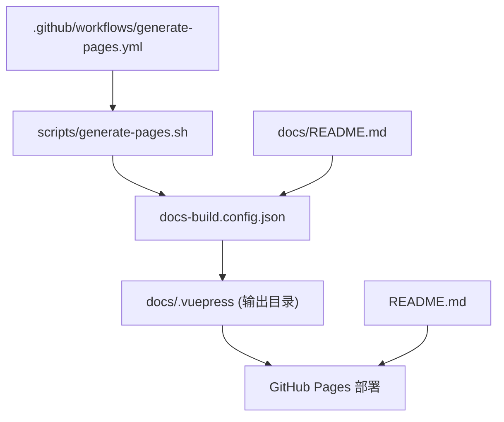
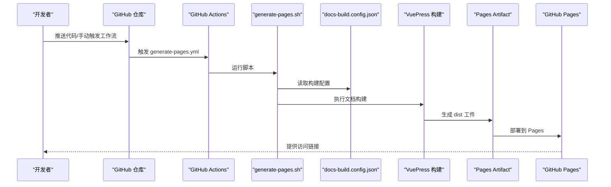
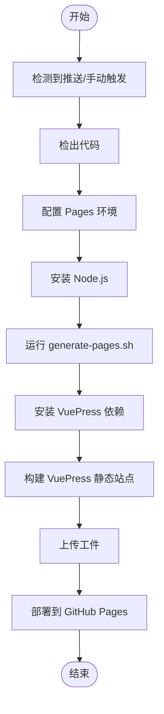
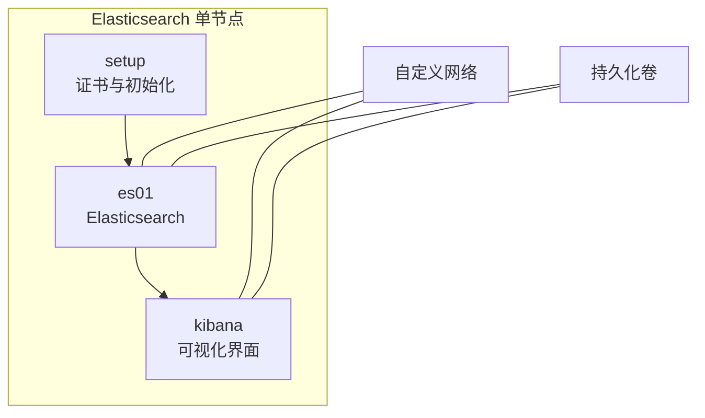
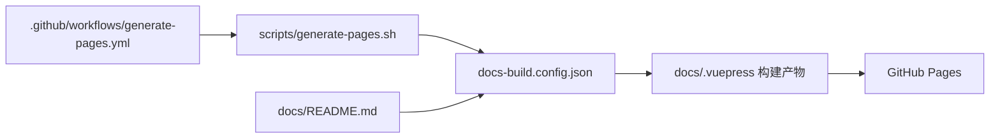

# 自动化部署

<cite>
**本文引用的文件**
- [.github/workflows/generate-pages.yml](file://.github/workflows/generate-pages.yml)
- [scripts/generate-pages.sh](file://scripts/generate-pages.sh)
- [docs-build.config.json](file://docs-build.config.json)
- [package.json](file://package.json)
- [README.md](file://README.md)
- [docs/README.md](file://docs/README.md)
- [docker-compose/elasticsearch-single/compose/docker-compose.yml](file://docker-compose/elasticsearch-single/compose/docker-compose.yml)
- [docker-compose/elasticsearch-single/README.md](file://docker-compose/elasticsearch-single/README.md)
- [docker-compose/elasticsearch-single/bin/up.sh](file://docker-compose/elasticsearch-single/bin/up.sh)
- [docker-compose/elasticsearch-single/bin/down.sh](file://docker-compose/elasticsearch-single/bin/down.sh)
- [docker-compose/mongodb-single/README.md](file://docker-compose/mongodb-single/README.md)
- [docker-compose/kafka-single/README.md](file://docker-compose/kafka-single/README.md)
- [docker-compose/jenkins-single/README.md](file://docker-compose/jenkins-single/README.md)
- [docker-compose/nexus-single/README.md](file://docker-compose/nexus-single/README.md)
- [docker-compose/verdaccio-single/README.md](file://docker-compose/verdaccio-single/README.md)
</cite>

## 目录
1. [简介](#简介)
2. [项目结构](#项目结构)
3. [核心组件](#核心组件)
4. [架构总览](#架构总览)
5. [详细组件分析](#详细组件分析)
6. [依赖关系分析](#依赖关系分析)
7. [性能考虑](#性能考虑)
8. [故障排查指南](#故障排查指南)
9. [结论](#结论)
10. [附录](#附录)

## 简介
本项目通过 GitHub Actions 实现文档与静态站点的自动化生成与部署，结合统一的文档构建配置与多语言支持，形成可复用的 CI/CD 流程。工作流在推送至默认分支或手动触发时运行，执行文档生成脚本、安装 VuePress 依赖、构建静态站点，并上传工件部署到 GitHub Pages。同时，项目提供了大量标准化的 Docker Compose 开发环境模板，便于本地快速搭建与验证。

## 项目结构
项目采用“文档 + 工作流 + 脚本 + 配置”的组织方式，核心目录与职责如下：
- .github/workflows：存放 GitHub Actions 工作流定义，当前包含 generate-pages.yml
- scripts：存放自动化脚本，如 generate-pages.sh
- docs-build.config.json：文档构建配置（站点信息、导航、多语言等）
- docs：文档源文件与多语言版本
- docker-compose/*：各服务的 Docker Compose 模板与使用说明
- package.json：包元数据（用于标识项目名称）

图表来源
- [.github/workflows/generate-pages.yml:1-84](file://.github/workflows/generate-pages.yml#L1-L84)
- [scripts/generate-pages.sh:1-10](file://scripts/generate-pages.sh#L1-L10)
- [docs-build.config.json:1-38](file://docs-build.config.json#L1-L38)
- [docs/README.md:1-188](file://docs/README.md#L1-L188)
- [README.md:1-6](file://README.md#L1-L6)

章节来源
- [.github/workflows/generate-pages.yml:1-84](file://.github/workflows/generate-pages.yml#L1-L84)
- [scripts/generate-pages.sh:1-10](file://scripts/generate-pages.sh#L1-L10)
- [docs-build.config.json:1-38](file://docs-build.config.json#L1-L38)
- [package.json:1-3](file://package.json#L1-L3)
- [README.md:1-6](file://README.md#L1-L6)
- [docs/README.md:1-188](file://docs/README.md#L1-L188)

## 核心组件
- GitHub Actions 工作流：定义触发条件、权限、并发策略与构建/部署步骤
- 文档生成脚本：调用文档构建工具并传入配置文件
- 文档构建配置：定义站点基础路径、标题、描述、语言、导航与侧边栏
- VuePress 构建链路：安装依赖、构建静态站点、上传工件并部署到 Pages
- Docker Compose 环境模板：为开发与演示提供标准化的服务编排

章节来源
- [.github/workflows/generate-pages.yml:1-84](file://.github/workflows/generate-pages.yml#L1-L84)
- [scripts/generate-pages.sh:1-10](file://scripts/generate-pages.sh#L1-L10)
- [docs-build.config.json:1-38](file://docs-build.config.json#L1-L38)

## 架构总览
下图展示了从代码提交到静态站点上线的端到端流程：

图表来源
- [.github/workflows/generate-pages.yml:1-84](file://.github/workflows/generate-pages.yml#L1-L84)
- [scripts/generate-pages.sh:1-10](file://scripts/generate-pages.sh#L1-L10)
- [docs-build.config.json:1-38](file://docs-build.config.json#L1-L38)

## 详细组件分析

### GitHub Actions 工作流（generate-pages.yml）
- 触发条件
  - 推送至默认分支（master）
  - 手动触发（workflow_dispatch）
- 权限设置
  - 允许读取内容、写入 Pages、签发 ID Token
- 并发控制
  - 组名 pages，允许排队但不取消进行中的部署，保证生产部署稳定性
- 步骤分解
  - 检出代码
  - 配置 GitHub Pages 环境
  - 安装 Node.js（指定版本）
  - 运行 generate-pages.sh
  - 在 docs/.vuepress 目录安装 VuePress 依赖
  - 在 docs/.vuepress 目录执行构建命令
  - 上传 dist 工件
  - 部署到 GitHub Pages
  - 可选：发送邮件通知（需配置 SMTP 凭据）

图表来源
- [.github/workflows/generate-pages.yml:1-84](file://.github/workflows/generate-pages.yml#L1-L84)

章节来源
- [.github/workflows/generate-pages.yml:1-84](file://.github/workflows/generate-pages.yml#L1-L84)

### 文档生成脚本（generate-pages.sh）
- 功能：以可中断模式执行，调用文档构建工具并传入配置文件路径
- 关键点：确保在失败时立即退出，避免后续步骤继续执行

章节来源
- [scripts/generate-pages.sh:1-10](file://scripts/generate-pages.sh#L1-L10)

### 文档构建配置（docs-build.config.json）
- 基础信息
  - baseSourceDir：文档源目录
  - site.base：站点基础路径（用于 Pages 子路径部署）
  - site.lang：默认语言（en-US）
  - site.title / site.description：站点标题与描述
- 多语言
  - locales.languages：支持的语言列表（含 zh-CN）
- 输出目录
  - output：VuePress 输出目录（docs/.vuepress）
- 导航与侧边栏
  - navigation.navbar：主导航项（含多语言文本与图标）
  - navigation.sidebar：按路径分组的侧边栏规则

章节来源
- [docs-build.config.json:1-38](file://docs-build.config.json#L1-L38)

### VuePress 构建与部署链路
- 依赖安装：在 docs/.vuepress 目录内执行安装
- 构建命令：在 docs/.vuepress 目录内执行构建
- 工件上传：上传 dist 目录
- 部署：使用官方部署动作发布到 Pages

章节来源
- [.github/workflows/generate-pages.yml:46-60](file://.github/workflows/generate-pages.yml#L46-L60)

### Docker Compose 环境模板（示例：Elasticsearch 单节点）
- 服务组成
  - setup：证书生成与初始化任务
  - es01：Elasticsearch 主节点（单节点）
  - kibana：可视化界面
- 网络与存储
  - 使用自定义网络；持久化数据、日志与插件目录
- 健康检查
  - Elasticsearch 与 Kibana 均配置健康检查
- 启停脚本
  - up.sh：启动并打印访问信息
  - down.sh：停止并提示数据保留

图表来源
- [docker-compose/elasticsearch-single/compose/docker-compose.yml:1-134](file://docker-compose/elasticsearch-single/compose/docker-compose.yml#L1-L134)
- [docker-compose/elasticsearch-single/bin/up.sh:1-32](file://docker-compose/elasticsearch-single/bin/up.sh#L1-L32)
- [docker-compose/elasticsearch-single/bin/down.sh:1-24](file://docker-compose/elasticsearch-single/bin/down.sh#L1-L24)

章节来源
- [docker-compose/elasticsearch-single/compose/docker-compose.yml:1-134](file://docker-compose/elasticsearch-single/compose/docker-compose.yml#L1-L134)
- [docker-compose/elasticsearch-single/README.md:1-315](file://docker-compose/elasticsearch-single/README.md#L1-L315)
- [docker-compose/elasticsearch-single/bin/up.sh:1-32](file://docker-compose/elasticsearch-single/bin/up.sh#L1-L32)
- [docker-compose/elasticsearch-single/bin/down.sh:1-24](file://docker-compose/elasticsearch-single/bin/down.sh#L1-L24)

### 其他环境模板（简要）
- MongoDB 单节点：提供连接字符串与认证信息，强调默认凭据与数据持久化
- Kafka 单节点（KRaft）：无 ZooKeeper 的现代架构，提供 UI 管理界面与常用操作
- Jenkins 单节点：提供 Web 界面与初始密码获取方式，强调插件推荐
- Nexus 单节点：提供 Web 界面与代理仓库配置建议
- Verdaccio 单节点：提供 NPM 私有仓库的使用指南与配置要点

章节来源
- [docker-compose/mongodb-single/README.md:1-95](file://docker-compose/mongodb-single/README.md#L1-L95)
- [docker-compose/kafka-single/README.md:1-155](file://docker-compose/kafka-single/README.md#L1-L155)
- [docker-compose/jenkins-single/README.md:1-119](file://docker-compose/jenkins-single/README.md#L1-L119)
- [docker-compose/nexus-single/README.md:1-132](file://docker-compose/nexus-single/README.md#L1-L132)
- [docker-compose/verdaccio-single/README.md:1-167](file://docker-compose/verdaccio-single/README.md#L1-L167)

## 依赖关系分析
- 工作流依赖
  - generate-pages.yml 依赖 generate-pages.sh 与 docs-build.config.json
  - VuePress 构建依赖 docs-build.config.json 中的导航与多语言配置
- 文档依赖
  - docs/README.md 作为入口文档，与 docs-build.config.json 的导航配置相互映射
- 产物依赖
  - dist 工件由 VuePress 构建生成，最终部署到 GitHub Pages

图表来源
- [.github/workflows/generate-pages.yml:1-84](file://.github/workflows/generate-pages.yml#L1-L84)
- [scripts/generate-pages.sh:1-10](file://scripts/generate-pages.sh#L1-L10)
- [docs-build.config.json:1-38](file://docs-build.config.json#L1-L38)
- [docs/README.md:1-188](file://docs/README.md#L1-L188)

章节来源
- [.github/workflows/generate-pages.yml:1-84](file://.github/workflows/generate-pages.yml#L1-L84)
- [scripts/generate-pages.sh:1-10](file://scripts/generate-pages.sh#L1-L10)
- [docs-build.config.json:1-38](file://docs-build.config.json#L1-L38)
- [docs/README.md:1-188](file://docs/README.md#L1-L188)

## 性能考虑
- 构建缓存
  - 在 Actions 中启用依赖缓存（例如 npm 缓存），减少重复安装时间
- 并发策略
  - 当前工作流允许排队但不取消进行中的部署，适合生产环境稳定发布
- 体积优化
  - 控制输出目录大小，仅上传必要资源
- 语言与导航
  - 多语言配置应与实际内容匹配，避免冗余翻译导致的构建开销

## 故障排查指南
- 工作流权限不足
  - 确认工作流中已授予 Pages 写入权限与 ID Token 权限
- 构建失败
  - 检查 generate-pages.sh 是否正确执行且未被提前退出
  - 确认 docs-build.config.json 路径与字段正确
- VuePress 构建异常
  - 在 docs/.vuepress 目录内确认依赖安装与构建命令可用
- Pages 部署失败
  - 检查输出工件路径是否与上传步骤一致
- 邮件通知失败
  - 确认 SMTP 凭据已配置且网络可达

章节来源
- [.github/workflows/generate-pages.yml:18-27](file://.github/workflows/generate-pages.yml#L18-L27)
- [scripts/generate-pages.sh:5-9](file://scripts/generate-pages.sh#L5-L9)

## 结论
本项目通过标准化的工作流与脚本实现了文档的自动化生成与部署，配合多语言与导航配置，能够高效产出静态站点并发布到 GitHub Pages。结合丰富的 Docker Compose 环境模板，既满足文档自动化，也为本地开发与演示提供了即开即用的基础设施。

## 附录
- 快速开始
  - 查看根 README 获取文档站点链接
  - 查看 docs/README.md 了解项目概览与使用方式
- 环境模板使用
  - 进入任一 docker-compose/*/ 目录，使用 bin/up.sh 启动，bin/down.sh 停止
- 版本与许可
  - package.json 提供项目名称
  - 项目遵循 MIT 许可证

章节来源
- [README.md:1-6](file://README.md#L1-L6)
- [docs/README.md:1-188](file://docs/README.md#L1-L188)
- [package.json:1-3](file://package.json#L1-L3)