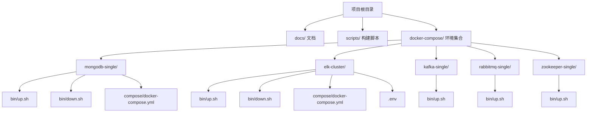
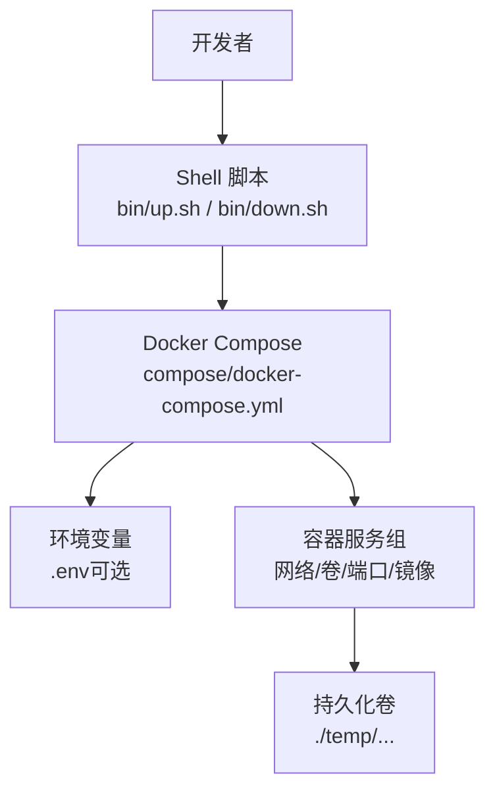
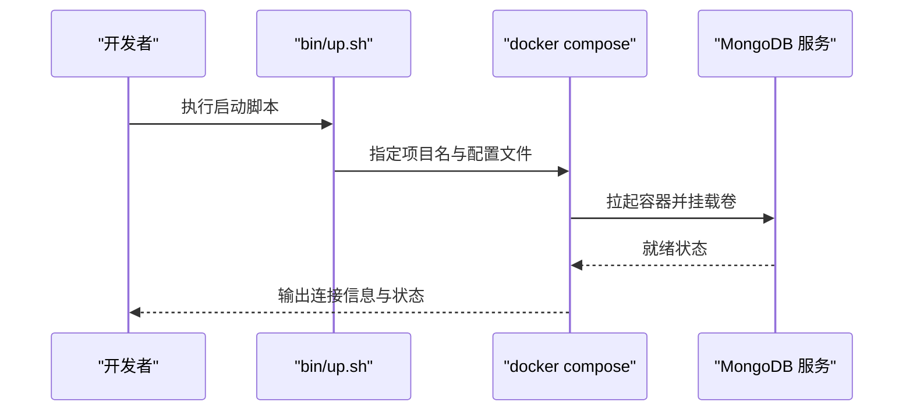
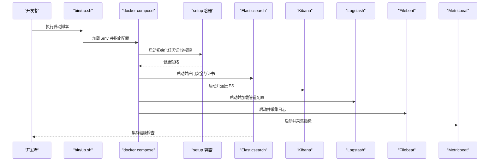
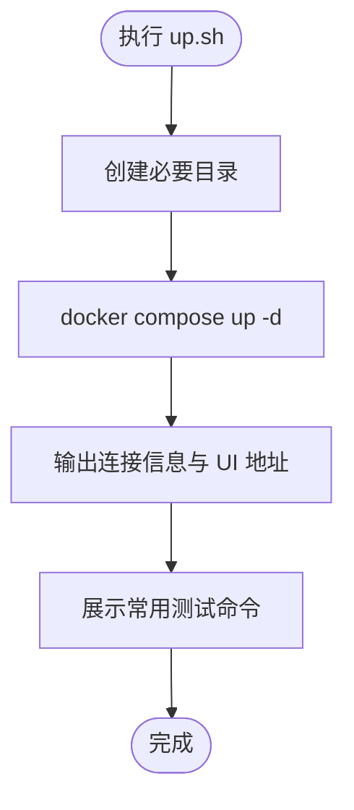
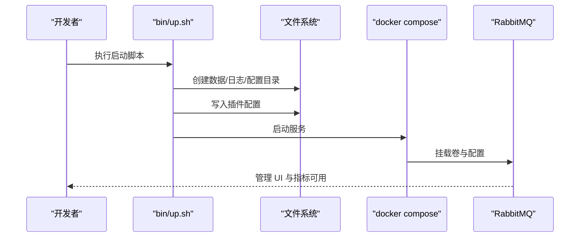
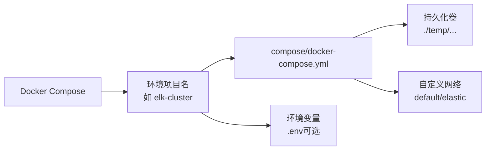

# 项目概述

<cite>
**本文引用的文件**
- [README.md](file://README.md)
- [package.json](file://package.json)
- [docs/README.md](file://docs/README.md)
- [docs/README.zh-CN.md](file://docs/README.zh-CN.md)
- [scripts/generate-pages.sh](file://scripts/generate-pages.sh)
- [docker-compose/mongodb-single/bin/up.sh](file://docker-compose/mongodb-single/bin/up.sh)
- [docker-compose/mongodb-single/bin/down.sh](file://docker-compose/mongodb-single/bin/down.sh)
- [docker-compose/mongodb-single/compose/docker-compose.yml](file://docker-compose/mongodb-single/compose/docker-compose.yml)
- [docker-compose/elk-cluster/bin/up.sh](file://docker-compose/elk-cluster/bin/up.sh)
- [docker-compose/elk-cluster/bin/down.sh](file://docker-compose/elk-cluster/bin/down.sh)
- [docker-compose/elk-cluster/compose/docker-compose.yml](file://docker-compose/elk-cluster/compose/docker-compose.yml)
- [docker-compose/elk-cluster/.env](file://docker-compose/elk-cluster/.env)
- [docker-compose/kafka-single/bin/up.sh](file://docker-compose/kafka-single/bin/up.sh)
- [docker-compose/rabbitmq-single/bin/up.sh](file://docker-compose/rabbitmq-single/bin/up.sh)
- [docker-compose/zookeeper-single/bin/up.sh](file://docker-compose/zookeeper-single/bin/up.sh)
</cite>

## 目录
1. [引言](#引言)
2. [项目结构](#项目结构)
3. [核心组件](#核心组件)
4. [架构总览](#架构总览)
5. [详细组件分析](#详细组件分析)
6. [依赖关系分析](#依赖关系分析)
7. [性能考虑](#性能考虑)
8. [故障排查指南](#故障排查指南)
9. [结论](#结论)
10. [附录](#附录)

## 引言
本项目是一套“生产就绪”的 Docker Compose 配置集合，旨在为开发者提供即开即用的标准化开发环境。项目通过统一的目录结构与一致的启停脚本，让不同技术栈（数据库、消息队列、搜索与可观测性、对象存储、CI/CD、地理空间、服务发现、AI/ML 等）的容器化环境可以快速拉起与回收，显著降低本地开发与测试环境的搭建成本。

- 目标用户：后端/全栈开发者、测试工程师、数据工程师、DevOps 工程师以及对容器化开发环境有需求的技术团队。
- 核心价值：标准化、模块化、可复用、低门槛、可扩展。
- 设计原则：最小依赖、约定优于配置、持久化隔离、跨平台兼容、安全默认（如凭据与证书生成流程）。

## 项目结构
项目采用“按功能域分环境”的模块化组织方式，每个环境拥有独立的目录，内含统一的子结构：环境说明文档、启动/停止脚本、Compose 配置文件。这种结构便于维护、迁移与扩展。

图表来源
- [docs/README.md:71-83](file://docs/README.md#L71-L83)
- [docs/README.zh-CN.md:71-83](file://docs/README.zh-CN.md#L71-L83)

章节来源
- [docs/README.md:71-83](file://docs/README.md#L71-L83)
- [docs/README.zh-CN.md:71-83](file://docs/README.zh-CN.md#L71-L83)

## 核心组件
- 统一的启动/停止脚本：每个环境提供 bin/up.sh 与 bin/down.sh，封装 docker compose 的 up/down 命令，确保项目命名与配置路径的一致性。
- Docker Compose 配置：集中于 compose/docker-compose.yml，定义服务镜像、网络、卷、环境变量与端口映射等。
- 环境变量与密钥：部分复杂环境（如 ELK）通过 .env 提供参数化配置，支持版本、端口、内存限制与加密密钥等。
- 文档与说明：每个环境包含 README.md，提供用途、端口、UI、访问方式与注意事项。

章节来源
- [docs/README.md:144-174](file://docs/README.md#L144-L174)
- [docs/README.zh-CN.md:144-174](file://docs/README.zh-CN.md#L144-L174)

## 架构总览
从使用者视角看，项目由“文档与脚本层”和“环境层”组成；从容器视角看，每个环境由一组相互协作的服务构成，共享网络与数据卷策略，保证状态持久化与服务互通。

图表来源
- [docker-compose/mongodb-single/bin/up.sh:14-15](file://docker-compose/mongodb-single/bin/up.sh#L14-L15)
- [docker-compose/mongodb-single/compose/docker-compose.yml:10-11](file://docker-compose/mongodb-single/compose/docker-compose.yml#L10-L11)
- [docker-compose/elk-cluster/bin/up.sh:15](file://docker-compose/elk-cluster/bin/up.sh#L15)
- [docker-compose/elk-cluster/compose/docker-compose.yml:198-202](file://docker-compose/elk-cluster/compose/docker-compose.yml#L198-L202)

## 详细组件分析

### MongoDB 单实例环境
- 功能定位：提供单节点 MongoDB 开发实例，内置初始化数据库与用户，暴露标准端口。
- 关键特性：默认凭据、持久化数据卷、容器网络别名、健康检查友好。
- 使用流程：进入目录执行 up.sh 启动，down.sh 停止并保留数据卷。

图表来源
- [docker-compose/mongodb-single/bin/up.sh:14-22](file://docker-compose/mongodb-single/bin/up.sh#L14-L22)
- [docker-compose/mongodb-single/compose/docker-compose.yml:1-21](file://docker-compose/mongodb-single/compose/docker-compose.yml#L1-L21)

章节来源
- [docker-compose/mongodb-single/bin/up.sh:1-23](file://docker-compose/mongodb-single/bin/up.sh#L1-L23)
- [docker-compose/mongodb-single/bin/down.sh:1-20](file://docker-compose/mongodb-single/bin/down.sh#L1-L20)
- [docker-compose/mongodb-single/compose/docker-compose.yml:1-21](file://docker-compose/mongodb-single/compose/docker-compose.yml#L1-L21)

### ELK 集群环境（Elasticsearch + Logstash + Kibana + Filebeat + Metricbeat）
- 功能定位：一体化日志采集、索引与可视化方案，支持 TLS 证书自动生成与用户密码初始化。
- 关键特性：setup 初始化容器、证书生成、弹性安全启用、内存限制、健康检查。
- 使用流程：准备 .env 参数，执行 up.sh 启动，down.sh 停止并保留各组件数据卷。

图表来源
- [docker-compose/elk-cluster/bin/up.sh:14-31](file://docker-compose/elk-cluster/bin/up.sh#L14-L31)
- [docker-compose/elk-cluster/compose/docker-compose.yml:1-202](file://docker-compose/elk-cluster/compose/docker-compose.yml#L1-L202)
- [docker-compose/elk-cluster/.env:1-36](file://docker-compose/elk-cluster/.env#L1-L36)

章节来源
- [docker-compose/elk-cluster/bin/up.sh:1-32](file://docker-compose/elk-cluster/bin/up.sh#L1-L32)
- [docker-compose/elk-cluster/bin/down.sh:1-24](file://docker-compose/elk-cluster/bin/down.sh#L1-L24)
- [docker-compose/elk-cluster/compose/docker-compose.yml:1-202](file://docker-compose/elk-cluster/compose/docker-compose.yml#L1-L202)
- [docker-compose/elk-cluster/.env:1-36](file://docker-compose/elk-cluster/.env#L1-L36)

### Kafka 单实例（KRaft 模式）
- 功能定位：无外部依赖的单节点 Kafka（KRaft），适合轻量开发与演示。
- 关键特性：无需 ZooKeeper、内置 UI、端口与模式提示、测试命令示例。
- 使用流程：执行 up.sh 启动，通过 CLI 或 UI 进行主题操作与验证。

图表来源
- [docker-compose/kafka-single/bin/up.sh:14-33](file://docker-compose/kafka-single/bin/up.sh#L14-L33)

章节来源
- [docker-compose/kafka-single/bin/up.sh:1-34](file://docker-compose/kafka-single/bin/up.sh#L1-L34)

### RabbitMQ 单实例
- 功能定位：带管理 UI 与指标导出的单节点 RabbitMQ，预置插件与凭据。
- 关键特性：自动创建插件配置、输出多种语言连接示例、持久化数据目录。
- 使用流程：执行 up.sh 启动，访问管理 UI 与指标端点。

图表来源
- [docker-compose/rabbitmq-single/bin/up.sh:14-54](file://docker-compose/rabbitmq-single/bin/up.sh#L14-L54)

章节来源
- [docker-compose/rabbitmq-single/bin/up.sh:1-55](file://docker-compose/rabbitmq-single/bin/up.sh#L1-L55)

### ZooKeeper 单实例
- 功能定位：单节点 ZooKeeper，配合 Web 管理工具进行连接与监控。
- 关键特性：输出连接字符串与 Web 管理地址，便于集成其他组件。
- 使用流程：执行 up.sh 启动，使用 ZooNavigator 连接。

章节来源
- [docker-compose/zookeeper-single/bin/up.sh:1-27](file://docker-compose/zookeeper-single/bin/up.sh#L1-L27)

## 依赖关系分析
- 项目依赖：Docker Engine（含 Compose 插件）。
- 环境内部依赖：某些环境存在显式依赖链（如 ELK 的 setup → ES → KB/LS/FB/MB），通过 Compose 的 depends_on 与健康检查保障启动顺序。
- 数据与网络：各环境通过统一的 temp 目录存放持久化数据，服务间通过自定义网络互通。

图表来源
- [docker-compose/elk-cluster/bin/up.sh:15](file://docker-compose/elk-cluster/bin/up.sh#L15)
- [docker-compose/elk-cluster/compose/docker-compose.yml:198-202](file://docker-compose/elk-cluster/compose/docker-compose.yml#L198-L202)

章节来源
- [docs/README.md:176-179](file://docs/README.md#L176-L179)
- [docs/README.zh-CN.md:176-179](file://docs/README.zh-CN.md#L176-L179)

## 性能考虑
- 内存限制：ELK 环境通过 .env 提供 ES/Kibana/Logstash 的内存上限配置项，建议根据宿主机资源调整。
- 磁盘与日志：各组件的数据与日志目录均挂载至 temp，注意磁盘空间与清理策略。
- 端口占用：确保宿主端口未被占用，或在 .env 中修改映射端口。
- 健康检查：依赖服务的健康检查有助于避免错误状态导致的级联失败。

## 故障排查指南
- 启动失败
  - 检查 Docker 与 Compose 版本是否满足要求。
  - 查看脚本输出的项目名与配置路径是否正确。
  - 使用 docker compose -p <project> ps 查看服务状态。
- 权限与证书问题（ELK）
  - 确认 .env 中密码与版本设置有效。
  - 若证书未生成，删除相关目录后重新启动以触发初始化。
- 数据丢失风险
  - down.sh 默认保留数据卷；若需彻底清理，手动删除 temp 目录。
- 端口冲突
  - 修改 .env 或 docker-compose.yml 中的端口映射，避免与宿主服务冲突。

章节来源
- [docs/README.md:176-179](file://docs/README.md#L176-L179)
- [docker-compose/elk-cluster/bin/down.sh:17-23](file://docker-compose/elk-cluster/bin/down.sh#L17-L23)

## 结论
本项目通过标准化的目录结构与统一的启停脚本，将复杂的多服务容器编排抽象为“一键启动/停止”的体验，覆盖数据库、消息队列、搜索与可观测性、对象存储、CI/CD、地理空间、服务发现与 AI/ML 等主流开发场景。其模块化设计与约定优于配置的理念，使得新环境接入与现有环境维护都具备高可扩展性与低上手成本。

## 附录

### 快速开始
- 启动任意环境（以 MongoDB 单实例为例）
  - 进入目录并执行启动脚本
  - 停止时执行停止脚本
- 参考路径
  - [docs/README.md:5-14](file://docs/README.md#L5-L14)
  - [docs/README.zh-CN.md:5-14](file://docs/README.zh-CN.md#L5-L14)

### 常见使用场景
- 数据库开发：MongoDB/PostGIS 单实例或集群
- 消息中间件：Kafka/RabbitMQ 单实例或集群
- 日志与可观测性：ELK 集群（含 Filebeat/Metricbeat）
- 对象存储：MinIO 单实例
- CI/CD 与仓库：Jenkins/Nexus/Verdaccio
- 地理空间：GeoServer
- 服务发现：ZooKeeper
- AI/ML：Stable Diffusion WebUI（需 GPU）

章节来源
- [docs/README.md:16-70](file://docs/README.md#L16-L70)
- [docs/README.zh-CN.md:16-70](file://docs/README.zh-CN.md#L16-L70)

### 文档构建与发布
- 使用 @hz-9/docs-build 生成静态页面
- 构建脚本入口
  - [scripts/generate-pages.sh:1-10](file://scripts/generate-pages.sh#L1-L10)
- 项目元信息
  - [package.json:1-3](file://package.json#L1-L3)